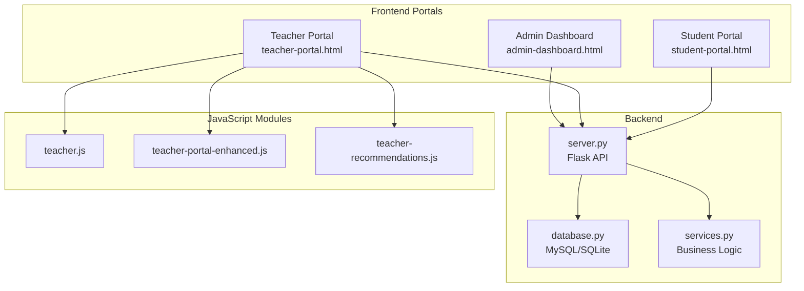
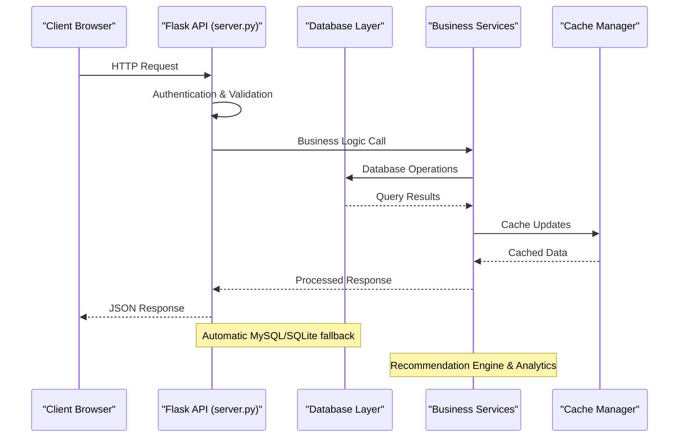
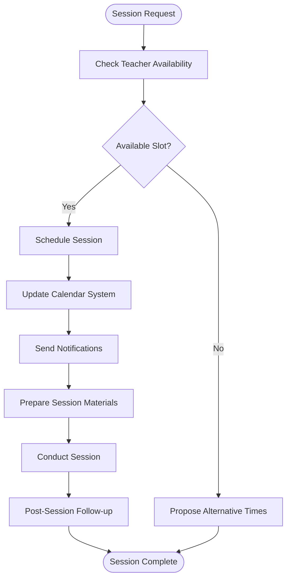
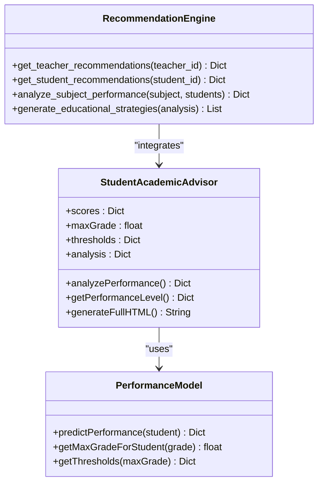
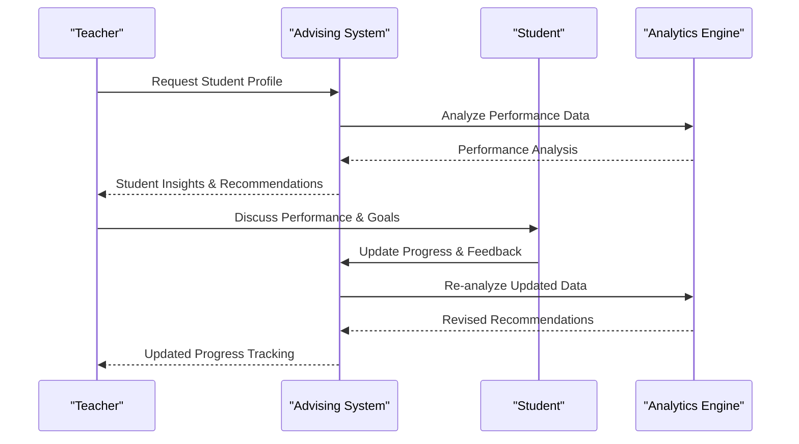
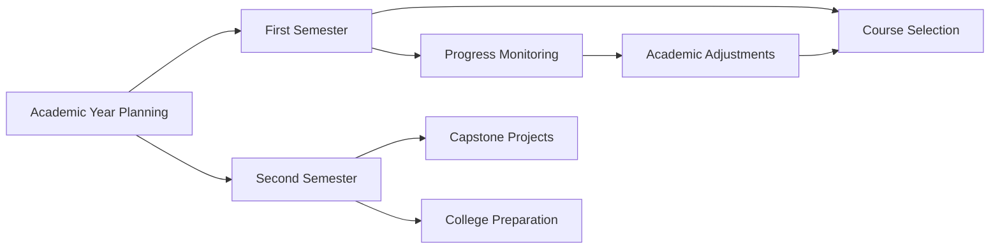
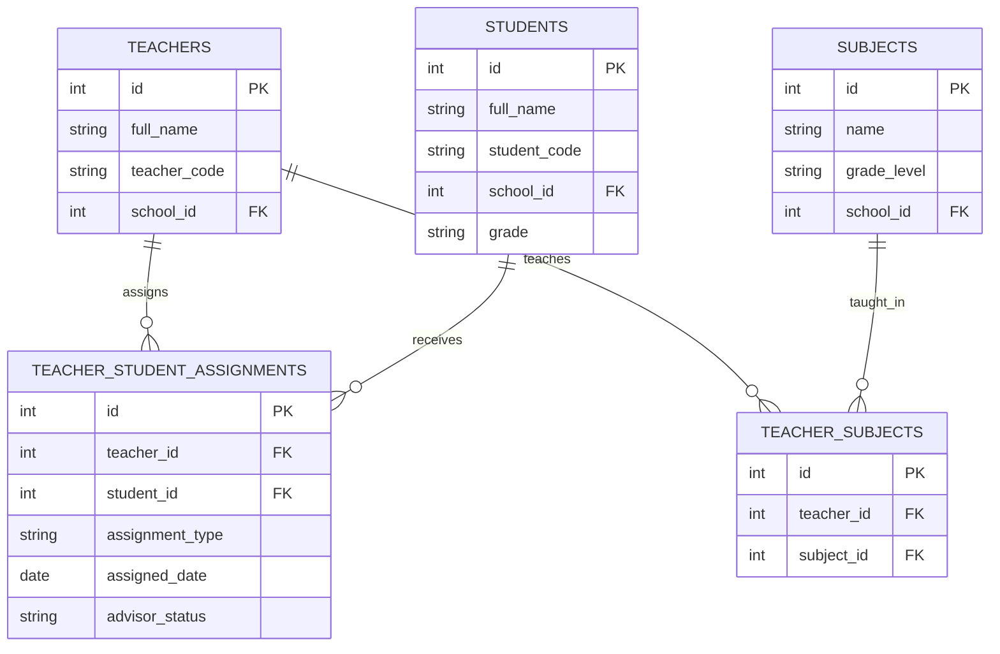
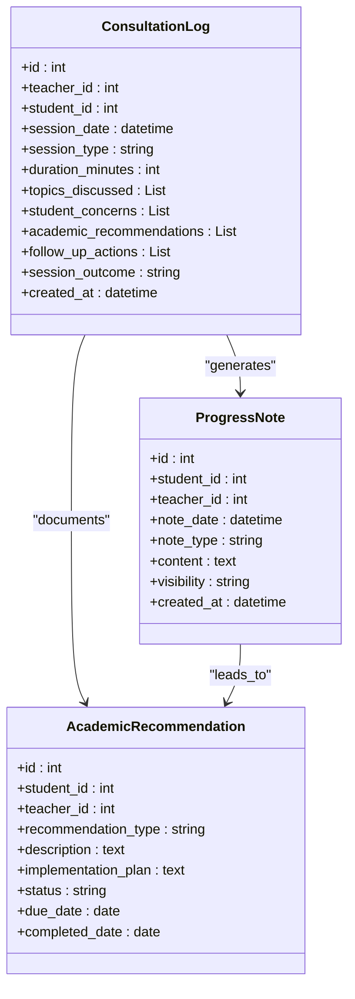
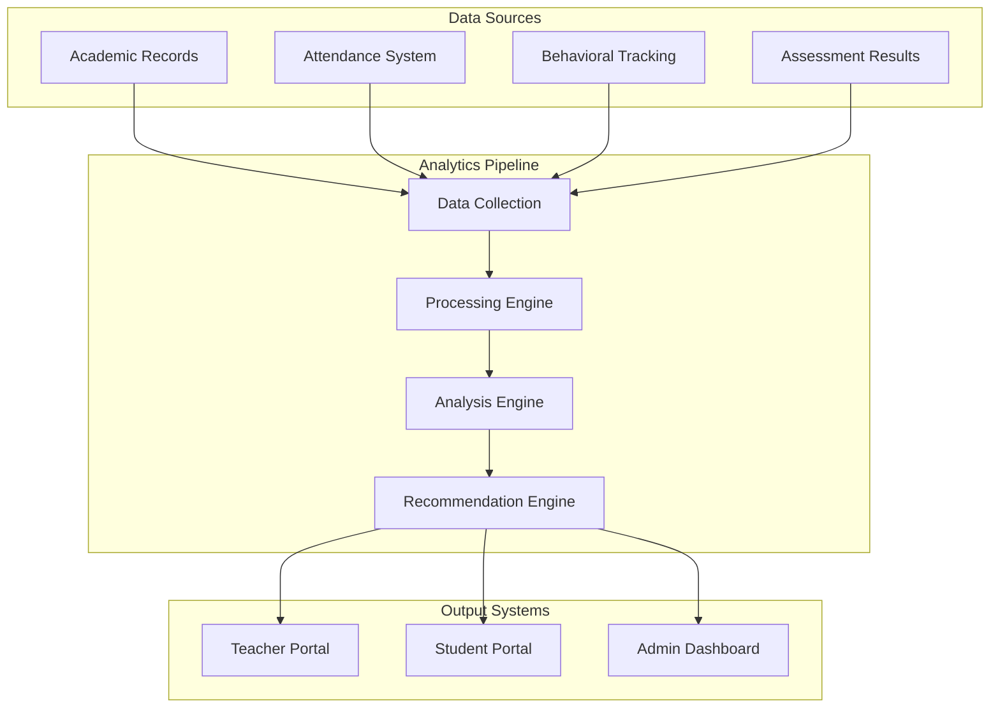

# Academic Advising and Consultation System

<cite>
**Referenced Files in This Document**
- [README.md](file://README.md)
- [server.py](file://server.py)
- [database.py](file://database.py)
- [services.py](file://services.py)
- [teacher-portal.html](file://public/teacher-portal.html)
- [student-portal.html](file://public/student-portal.html)
- [teacher.js](file://public/assets/js/teacher.js)
- [teacher-portal-enhanced.js](file://public/assets/js/teacher-portal-enhanced.js)
- [teacher-recommendations.js](file://public/assets/js/teacher-recommendations.js)
- [admin-dashboard.html](file://public/admin-dashboard.html)
- [requirements.txt](file://requirements.txt)
</cite>

## Table of Contents
1. [Introduction](#introduction)
2. [Project Structure](#project-structure)
3. [Core Components](#core-components)
4. [Architecture Overview](#architecture-overview)
5. [Advising Session Scheduling](#advising-session-scheduling)
6. [Progress Counseling and Tracking](#progress-counseling-and-tracking)
7. [Academic Planning Features](#academic-planning-features)
8. [Teacher-Student Relationship Mapping](#teacher-student-relationship-mapping)
9. [Consultation Logging System](#consultation-logging-system)
10. [Integration with Academic Records](#integration-with-academic-records)
11. [Administrative Oversight](#administrative-overview)
12. [Performance Considerations](#performance-considerations)
13. [Troubleshooting Guide](#troubleshooting-guide)
14. [Conclusion](#conclusion)

## Introduction
This document describes the academic advising system designed to facilitate teacher-student consultation and guidance workflows. The system provides features for advising session scheduling, progress counseling, academic planning, and comprehensive integration with student academic records and administrative oversight. It leverages a Flask backend with MySQL/SQLite connectivity, a unified design system across portals, and intelligent recommendation engines powered by performance analytics.

## Project Structure
The system follows a modular structure with clear separation between backend APIs, database schema, and frontend portals:

**Diagram sources**
- [server.py](file://server.py#L1-L100)
- [database.py](file://database.py#L120-L338)
- [services.py](file://services.py#L1-L120)
- [admin-dashboard.html](file://public/admin-dashboard.html#L1-L174)
- [teacher-portal.html](file://public/teacher-portal.html#L1-L631)
- [student-portal.html](file://public/student-portal.html#L1-L2013)

**Section sources**
- [README.md](file://README.md#L1-L23)
- [requirements.txt](file://requirements.txt#L1-L14)

## Core Components
The system comprises three primary components:

### Backend API Layer
- **Flask Application**: Central API orchestrating authentication, data validation, and route handling
- **Database Abstraction**: Support for both MySQL and SQLite with automatic fallback
- **Security Middleware**: Input sanitization, rate limiting exemptions, and JWT-based authentication
- **Performance Monitoring**: Built-in health checks and performance endpoints

### Business Logic Services
- **Recommendation Engine**: Intelligent academic recommendations for teachers and students
- **Academic Year Management**: Centralized academic year administration
- **Teacher-Student Assignment**: Automated mapping of advisory responsibilities
- **Grade Analytics**: Comprehensive performance analysis and trend detection

### Frontend Portals
- **Admin Dashboard**: System-wide academic year and school management
- **Teacher Portal**: Subject management, student tracking, and recommendation viewing
- **Student Portal**: Personalized academic insights and progress monitoring

**Section sources**
- [server.py](file://server.py#L1-L140)
- [database.py](file://database.py#L88-L122)
- [services.py](file://services.py#L1-L120)

## Architecture Overview
The system employs a layered architecture with clear separation of concerns:

**Diagram sources**
- [server.py](file://server.py#L91-L140)
- [database.py](file://database.py#L88-L122)
- [services.py](file://services.py#L12-L43)

## Advising Session Scheduling
The system provides comprehensive session scheduling capabilities through integrated grade management and attendance tracking:

### Session Types and Workflows
- **Individual Consultations**: One-on-one meetings between teachers and students
- **Group Sessions**: Class-wide advisement and guidance sessions
- **Progress Review Meetings**: Regular academic progress evaluations
- **Parent Conferences**: Collaborative meetings involving parents and educators

### Scheduling Integration

**Diagram sources**
- [teacher.js](file://public/assets/js/teacher.js#L620-L738)
- [teacher-portal.html](file://public/teacher-portal.html#L604-L624)

### Session Materials Management
- **Pre-session Preparation**: Access to student academic records and performance analytics
- **During-session Tools**: Real-time grade entry and progress tracking
- **Post-session Documentation**: Automated session notes and action item generation

**Section sources**
- [teacher.js](file://public/assets/js/teacher.js#L620-L738)
- [teacher-portal.html](file://public/teacher-portal.html#L570-L624)

## Progress Counseling and Tracking
The system implements sophisticated progress counseling through intelligent analytics and trend detection:

### Performance Analytics Engine

**Diagram sources**
- [student-portal.html](file://public/student-portal.html#L280-L554)
- [services.py](file://services.py#L367-L858)

### Counseling Workflow

**Diagram sources**
- [services.py](file://services.py#L367-L474)
- [teacher-recommendations.js](file://public/assets/js/teacher-recommendations.js#L49-L116)

**Section sources**
- [student-portal.html](file://public/student-portal.html#L280-L554)
- [services.py](file://services.py#L367-L474)
- [teacher-recommendations.js](file://public/assets/js/teacher-recommendations.js#L49-L116)

## Academic Planning Features
The system provides comprehensive academic planning capabilities through intelligent recommendation engines and progress tracking:

### Personalized Learning Paths
- **Subject Strength Analysis**: Identification of student strengths and areas for improvement
- **Skill Gap Assessment**: Comprehensive evaluation of academic competencies
- **Learning Style Adaptation**: Tailored recommendations based on individual learning patterns
- **Goal Setting Framework**: Structured academic goal establishment and tracking

### Academic Timeline Planning

**Diagram sources**
- [services.py](file://services.py#L118-L230)
- [student-portal.html](file://public/student-portal.html#L1-L200)

### Integration with Academic Records
The system seamlessly integrates with existing academic record systems through standardized APIs and data models, ensuring comprehensive coverage of student academic journey from enrollment through graduation.

**Section sources**
- [services.py](file://services.py#L118-L230)
- [student-portal.html](file://public/student-portal.html#L1-L200)

## Teacher-Student Relationship Mapping
The system establishes robust teacher-student relationship mapping for advisory responsibilities and mentorship coordination:

### Advisory Assignment System

**Diagram sources**
- [database.py](file://database.py#L220-L260)
- [database.py](file://database.py#L467-L507)

### Mentorship Coordination
- **Primary Advisors**: Dedicated teacher-student advisory relationships
- **Subject Mentors**: Specialized guidance for specific academic subjects
- **Peer Mentoring**: Student-to-student support networks
- **Cross-curricular Connections**: Integration across multiple subject areas

**Section sources**
- [database.py](file://database.py#L220-L260)
- [database.py](file://database.py#L467-L507)

## Consultation Logging System
The system maintains comprehensive consultation logging for tracking advising sessions, student progress discussions, and academic recommendations:

### Session Documentation Framework

**Diagram sources**
- [services.py](file://services.py#L367-L474)
- [teacher.js](file://public/assets/js/teacher.js#L571-L618)

### Logging Features
- **Automated Timestamping**: Precise session timing and duration tracking
- **Structured Documentation**: Standardized forms for session topics and outcomes
- **Progress Tracking**: Continuous monitoring of student development
- **Action Item Management**: Follow-up tasks with deadlines and status tracking
- **Secure Sharing**: Controlled access to consultation records

**Section sources**
- [services.py](file://services.py#L367-L474)
- [teacher.js](file://public/assets/js/teacher.js#L571-L618)

## Integration with Academic Records
The system provides seamless integration with existing academic record systems:

### Data Synchronization
- **Real-time Updates**: Live synchronization of grades, attendance, and behavioral data
- **Historical Tracking**: Comprehensive archive of academic progress and advisory interactions
- **Cross-platform Compatibility**: Integration with various LMS and ERP systems
- **Standardized Formats**: Support for common educational data exchange standards

### Analytics Integration

**Diagram sources**
- [services.py](file://services.py#L367-L858)
- [database.py](file://database.py#L120-L338)

**Section sources**
- [services.py](file://services.py#L367-L858)
- [database.py](file://database.py#L120-L338)

## Administrative Oversight
The system provides comprehensive administrative oversight capabilities:

### System Administration
- **Centralized Academic Year Management**: System-wide academic year administration
- **School Management**: Multi-school system with hierarchical oversight
- **User Role Management**: Granular permission controls across all portals
- **Reporting and Analytics**: Comprehensive dashboards for administrative decision-making

### Quality Assurance
- **Performance Monitoring**: Real-time system health and performance tracking
- **Audit Trails**: Complete logging of all system activities
- **Data Integrity**: Automated validation and consistency checks
- **Compliance Reporting**: Automated generation of regulatory compliance reports

**Section sources**
- [admin-dashboard.html](file://public/admin-dashboard.html#L1-L174)
- [server.py](file://server.py#L110-L139)

## Performance Considerations
The system is optimized for performance and scalability:

### Database Optimization
- **Connection Pooling**: Efficient MySQL connection management with automatic fallback
- **Query Optimization**: Indexed queries and efficient data retrieval patterns
- **Caching Strategy**: Multi-level caching for frequently accessed data
- **Data Archiving**: Automated archiving of historical data to maintain performance

### Frontend Performance
- **Modular JavaScript**: Lazy loading of portal-specific scripts
- **Responsive Design**: Optimized layouts for various device sizes
- **Asset Optimization**: Minimized CSS and JavaScript bundles
- **Progressive Enhancement**: Graceful degradation for older browsers

### Scalability Features
- **Horizontal Scaling**: Stateless API design supporting load balancing
- **Database Sharding**: Configurable sharding for large-scale deployments
- **CDN Integration**: Static asset delivery optimization
- **Microservice Ready**: Modular architecture supporting future microservice decomposition

## Troubleshooting Guide
Common issues and their resolutions:

### Authentication Issues
- **Problem**: Teachers unable to log in to portal
- **Solution**: Verify teacher code format (TCHR-XXXXX-XXXX) and check database connectivity
- **Prevention**: Implement proper input validation and error messaging

### Database Connection Problems
- **Problem**: System fails to connect to MySQL
- **Solution**: Check environment variables and verify MySQL service availability
- **Prevention**: Implement automatic fallback to SQLite for development

### Performance Issues
- **Problem**: Slow response times in teacher portal
- **Solution**: Check cache configuration and optimize database queries
- **Prevention**: Monitor performance metrics and implement query optimization

### Data Synchronization Errors
- **Problem**: Inconsistent data between portals
- **Solution**: Verify API endpoints and check for network connectivity issues
- **Prevention**: Implement retry mechanisms and circuit breaker patterns

**Section sources**
- [server.py](file://server.py#L91-L140)
- [database.py](file://database.py#L88-L122)

## Conclusion
The academic advising system provides a comprehensive solution for teacher-student consultation and guidance workflows. Through intelligent recommendation engines, robust session scheduling, and seamless integration with academic records, the system enhances educational outcomes while maintaining administrative oversight. The modular architecture ensures scalability and maintainability, while the unified design system provides consistent user experiences across all portals. The system's emphasis on data-driven insights and automated analytics positions it as a powerful tool for modern educational institutions seeking to optimize their advising and mentoring programs.