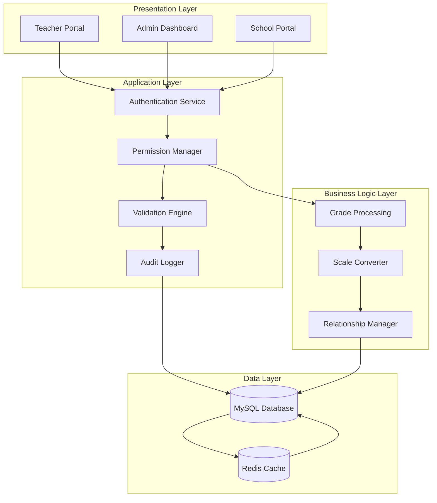
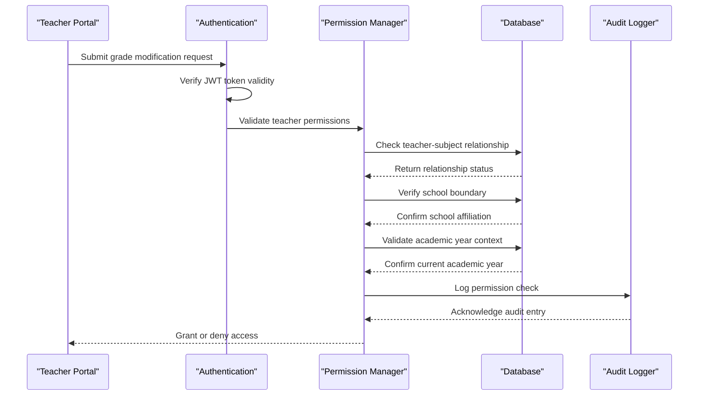
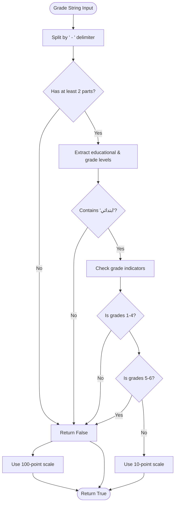
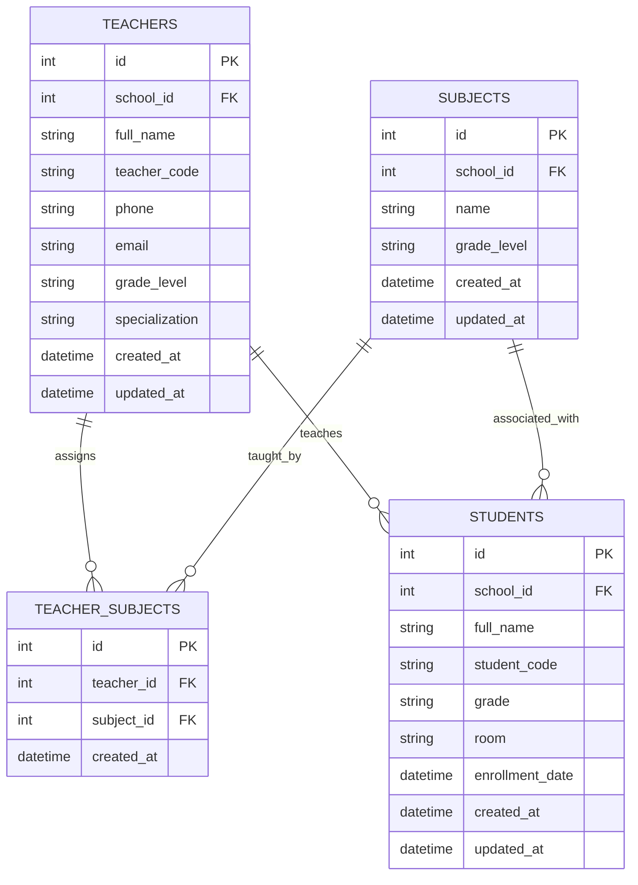
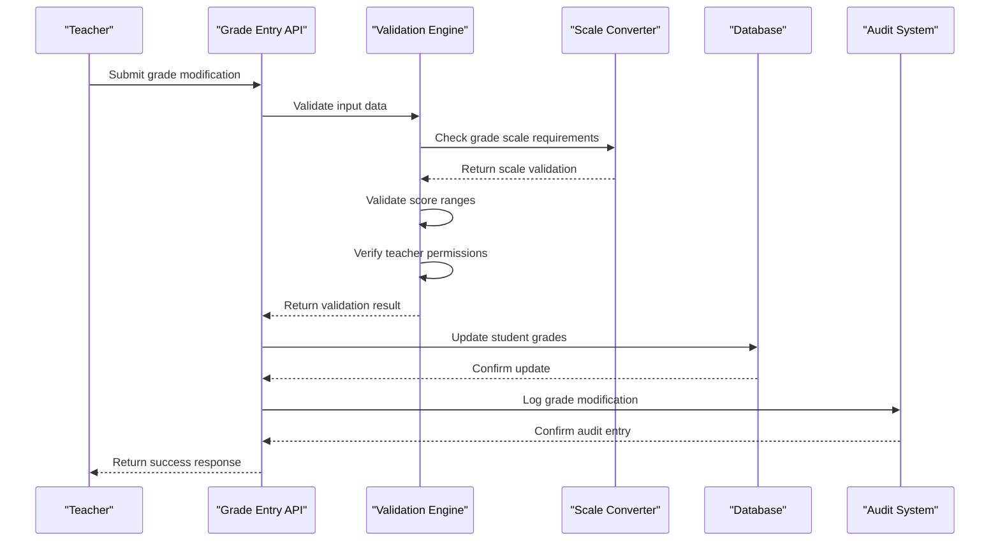
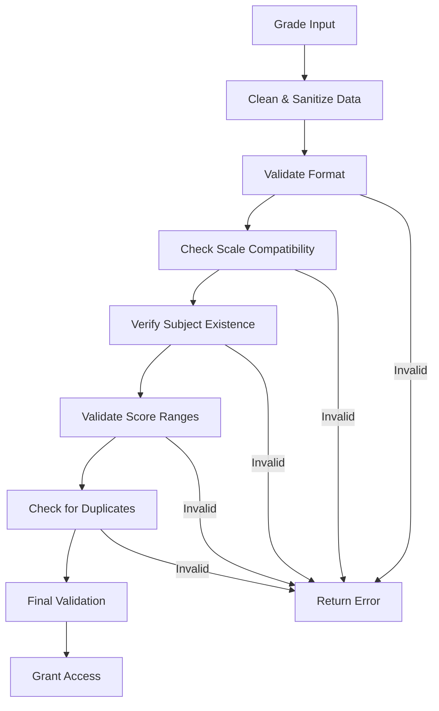
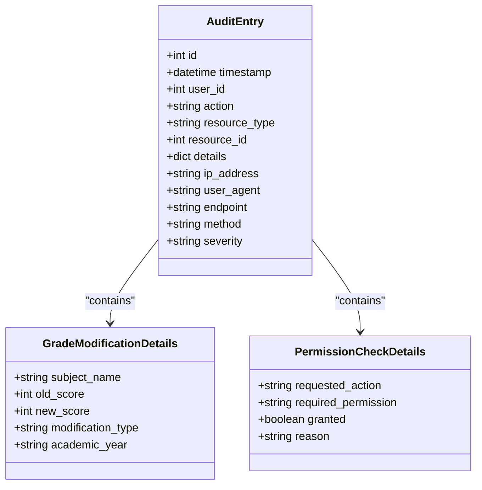

# Grade Entry Permissions System

<cite>
**Referenced Files in This Document**
- [server.py](file://server.py)
- [utils.py](file://utils.py)
- [database.py](file://database.py)
- [validation.py](file://validation.py)
- [validation_helpers.py](file://validation_helpers.py)
- [database_helpers.py](file://database_helpers.py)
- [security.py](file://security.py)
- [auth.py](file://auth.py)
</cite>

## Table of Contents
1. [Introduction](#introduction)
2. [System Architecture](#system-architecture)
3. [Permission Matrix](#permission-matrix)
4. [Grade Scale Conversion Logic](#grade-scale-conversion-logic)
5. [Teacher-Student Relationship Mapping](#teacher-student-relationship-mapping)
6. [Grade Entry Workflows](#grade-entry-workflows)
7. [Grade Validation Rules](#grade-validation-rules)
8. [Audit Trail Requirements](#audit-trail-requirements)
9. [Integration with Subject-Specialization](#integration-with-subject-specialization)
10. [Performance Considerations](#performance-considerations)
11. [Troubleshooting Guide](#troubleshooting-guide)
12. [Conclusion](#conclusion)

## Introduction

The Grade Entry Permissions System is a comprehensive academic record management solution designed to control teacher access to student grade modifications within the EduFlow school management system. This system implements a sophisticated permission matrix that ensures only authorized educators can modify academic records for specific subjects and students, while maintaining strict grade scale compliance and comprehensive audit trails.

The system operates on three fundamental pillars: **authorization control**, **grade scale validation**, and **audit compliance**. It provides granular permissions based on teacher-subject relationships, implements automatic grade scale conversion logic, and maintains detailed transaction logs for all grade modifications.

## System Architecture

The Grade Entry Permissions System is built on a layered architecture that separates concerns between authentication, authorization, data validation, and audit logging.



**Diagram sources**
- [server.py](file://server.py#L1-L800)
- [auth.py](file://auth.py#L1-L376)
- [security.py](file://security.py#L1-L617)

The architecture ensures separation of concerns with clear boundaries between authentication, authorization, validation, and persistence layers. The system leverages JWT tokens for stateless authentication, Redis for caching, and comprehensive audit logging for compliance.

## Permission Matrix

The permission matrix establishes the fundamental rules governing teacher access to student grade modifications. This matrix is enforced through a combination of database relationships and runtime validation logic.

### Core Permission Rules

| Permission Category | Rule Description | Implementation |
|-------------------|-----------------|----------------|
| **Subject Authorization** | Teachers can only modify grades for subjects they are assigned to | `teacher_subjects` table relationship |
| **School Boundary** | Access is restricted to the teacher's school only | School ID validation |
| **Grade Level Alignment** | Teachers can only access students in their assigned grade levels | Grade level matching |
| **Academic Year Context** | Permissions are valid only within current academic year | Academic year filtering |
| **Role-Based Access** | Different roles have different permission scopes | Role hierarchy enforcement |

### Permission Enforcement Flow



**Diagram sources**
- [server.py](file://server.py#L1420-L1433)
- [database_helpers.py](file://database_helpers.py#L12-L44)

### Permission Validation Logic

The permission validation system implements multiple layers of checks to ensure secure grade modifications:

1. **Authentication Verification**: JWT token validation with expiration checking
2. **Authorization Matrix**: Subject-teacher relationship validation
3. **Boundary Enforcement**: School and grade level constraints
4. **Context Validation**: Academic year and term-specific permissions

**Section sources**
- [server.py](file://server.py#L1420-L1433)
- [database_helpers.py](file://database_helpers.py#L12-L44)
- [auth.py](file://auth.py#L216-L290)

## Grade Scale Conversion Logic

The system implements intelligent grade scale conversion to accommodate different educational levels and their respective grading standards. This logic automatically adapts score validation based on the student's grade level.

### Elementary Grades 1-4 (10-Point Scale)

Elementary students in grades 1-4 use a 10-point grading scale, where scores range from 0 to 10. This scale is specifically designed for younger learners and provides more granular feedback.

### Higher Grades (100-Point Scale)

Students in grades 5-12 and beyond use a traditional 100-point grading scale, where scores range from 0 to 100. This scale aligns with standard academic assessment practices.

### Scale Detection Algorithm



**Diagram sources**
- [utils.py](file://utils.py#L122-L161)
- [server.py](file://server.py#L52-L90)

### Implementation Details

The scale conversion logic is implemented through several key functions:

1. **`is_elementary_grades_1_to_4()`**: Core detection algorithm
2. **`validate_score_range()`**: Dynamic score validation based on scale
3. **Automatic scale adaptation**: Seamless switching between 10-point and 100-point scales

**Section sources**
- [utils.py](file://utils.py#L122-L186)
- [server.py](file://server.py#L52-L90)

## Teacher-Student Relationship Mapping

The teacher-student relationship mapping establishes the foundation for grade modification permissions through a sophisticated many-to-many relationship system.

### Database Schema



**Diagram sources**
- [database.py](file://database.py#L219-L245)

### Relationship Validation

The system validates teacher-student relationships through multiple verification points:

1. **Subject Assignment Verification**: Ensures teacher is assigned to the specific subject
2. **School Boundary Checking**: Confirms both teacher and student belong to the same school
3. **Grade Level Matching**: Validates teacher's assigned grade levels match student's grade
4. **Academic Year Context**: Checks permissions are valid for the current academic year

**Section sources**
- [database.py](file://database.py#L219-L245)
- [database_helpers.py](file://database_helpers.py#L12-L44)

## Grade Entry Workflows

The grade entry system implements comprehensive workflows for grade modification, validation, and audit logging.

### Standard Grade Modification Workflow



**Diagram sources**
- [server.py](file://server.py#L564-L766)
- [validation.py](file://validation.py#L306-L318)

### Grade Modification Scenarios

The system handles various grade modification scenarios with specific validation rules:

#### Scenario 1: Elementary Grade Modification (1-4)
- **Scale**: 0-10 points
- **Validation**: Strict 0-10 range checking
- **Permissions**: Subject-specific teacher assignment required

#### Scenario 2: Secondary Grade Modification (5-12)
- **Scale**: 0-100 points
- **Validation**: Standard 0-100 range checking
- **Permissions**: Same subject-based authorization

#### Scenario 3: Multi-Subject Grade Entry
- **Validation**: Individual subject score validation
- **Permissions**: Separate authorization for each subject
- **Audit**: Separate audit entries for each subject

**Section sources**
- [server.py](file://server.py#L564-L766)
- [validation.py](file://validation.py#L306-L318)

## Grade Validation Rules

The validation system implements comprehensive rules to ensure data integrity and educational standards compliance.

### Core Validation Rules

| Validation Type | Rule Description | Implementation |
|----------------|-----------------|----------------|
| **Score Range Validation** | Enforces appropriate score limits based on grade level | Dynamic scale checking |
| **Subject Existence** | Verifies subject names exist in the system | Database lookup validation |
| **Grade Format Validation** | Ensures proper grade string formatting | Regex pattern matching |
| **Duplicate Prevention** | Prevents duplicate grade entries | Unique constraint enforcement |
| **Data Type Validation** | Validates all input data types | Type checking and conversion |

### Validation Pipeline



**Diagram sources**
- [validation.py](file://validation.py#L306-L318)
- [utils.py](file://utils.py#L163-L186)

### Validation Implementation

The validation system uses a layered approach:

1. **Format Validation**: Ensures proper data structure and format
2. **Scale Validation**: Implements dynamic score range checking
3. **Existence Validation**: Verifies all referenced entities exist
4. **Business Rule Validation**: Applies domain-specific business rules

**Section sources**
- [validation.py](file://validation.py#L1-L376)
- [utils.py](file://utils.py#L163-L186)

## Audit Trail Requirements

The audit system maintains comprehensive logs of all grade modification activities for compliance and accountability purposes.

### Audit Event Types

| Event Type | Description | Trigger Conditions |
|------------|-------------|-------------------|
| **GRADE_MODIFICATION** | Student grade updates | Successful grade modifications |
| **GRADE_ACCESS** | Grade view requests | Access to grade data |
| **PERMISSION_CHECK** | Authorization attempts | Permission validation requests |
| **SYSTEM_ERROR** | System failures | Validation or processing errors |

### Audit Data Structure

Each audit entry contains comprehensive metadata:



**Diagram sources**
- [security.py](file://security.py#L177-L423)

### Audit Logging Implementation

The audit system provides multiple logging mechanisms:

1. **Real-time Logging**: Immediate audit entry creation
2. **Batch Processing**: Optimized database writes
3. **Retrieval API**: Comprehensive audit trail querying
4. **Cleanup Management**: Automated log rotation and cleanup

**Section sources**
- [security.py](file://security.py#L177-L423)

## Integration with Subject-Specialization

The grade entry system integrates seamlessly with the subject-specialization framework to ensure proper authorization and validation.

### Subject-Specialization Mapping

```mermaid
graph LR
subgraph "Subject Management"
S1[Mathematics)
S2[Science]
S3[Arabic]
S4[English]
end
subgraph "Teacher Specializations"
T1[Primary Math Specialist]
T2[Secondary Science Specialist]
T3[Language Arts Specialist]
T4[Advanced Mathematics]
end
subgraph "Grade Entry Integration"
G1[Grade Entry Portal]
G2[Validation Engine]
G3[Permission Checker]
end
S1 --> G2
S2 --> G2
S3 --> G2
S4 --> G2
T1 --> G3
T2 --> G3
T3 --> G3
T4 --> G3
G2 --> G1
G3 --> G1
```

**Diagram sources**
- [validation_helpers.py](file://validation_helpers.py#L12-L147)
- [database_helpers.py](file://database_helpers.py#L12-L44)

### Integration Benefits

1. **Enhanced Security**: Specialized subjects require specialized permissions
2. **Improved Accuracy**: Subject-specific validation rules
3. **Better Organization**: Clear separation of subject areas
4. **Scalable Growth**: Easy addition of new subjects and specializations

**Section sources**
- [validation_helpers.py](file://validation_helpers.py#L12-L147)
- [database_helpers.py](file://database_helpers.py#L12-L44)

## Performance Considerations

The Grade Entry Permissions System is optimized for high-performance operation with several key considerations:

### Caching Strategy

1. **Permission Cache**: Frequently accessed permission matrices cached in Redis
2. **Subject Cache**: Subject lists and teacher assignments cached for quick access
3. **Audit Cache**: Recent audit entries cached for reporting
4. **Validation Cache**: Common validation results cached to reduce database load

### Database Optimization

1. **Indexing Strategy**: Proper indexing on frequently queried columns
2. **Connection Pooling**: Efficient database connection management
3. **Query Optimization**: Optimized queries for permission checking
4. **Transaction Management**: Proper transaction handling for concurrent access

### Scalability Features

1. **Horizontal Scaling**: Stateless design enabling easy scaling
2. **Load Balancing**: JWT-based authentication enables load balancing
3. **Database Sharding**: Potential for future database sharding
4. **Microservice Architecture**: Modular design supporting microservice deployment

## Troubleshooting Guide

Common issues and their resolutions in the Grade Entry Permissions System:

### Authentication Issues

**Problem**: Teachers unable to access grade entry portal
**Solution**: Verify JWT token validity and expiration, check role assignments

**Problem**: Permission denied errors despite valid credentials
**Solution**: Review teacher-subject assignments and school boundary configurations

### Grade Validation Errors

**Problem**: Scores rejected for valid values
**Solution**: Check grade level detection logic and scale conversion settings

**Problem**: Subject not found errors
**Solution**: Verify subject exists in the system and is properly linked to school

### Audit Trail Issues

**Problem**: Missing audit entries
**Solution**: Check audit log database connectivity and batch processing status

**Problem**: Audit entries not appearing in reports
**Solution**: Verify audit query parameters and date range filters

### Performance Issues

**Problem**: Slow grade entry operations
**Solution**: Check database query performance and implement appropriate indexing

**Problem**: High memory usage
**Solution**: Review caching strategy and optimize connection pooling

**Section sources**
- [security.py](file://security.py#L177-L423)
- [server.py](file://server.py#L564-L766)

## Conclusion

The Grade Entry Permissions System represents a comprehensive solution for secure and compliant academic record management. Through its sophisticated permission matrix, intelligent grade scale conversion, and robust audit trail capabilities, the system ensures that only authorized educators can modify student grades while maintaining strict adherence to educational standards.

Key strengths of the system include:

- **Granular Permissions**: Subject-specific authorization ensuring appropriate access control
- **Intelligent Scale Management**: Automatic grade scale conversion based on educational level
- **Comprehensive Auditing**: Complete transaction logging for compliance and accountability
- **Performance Optimization**: Caching and database optimization for high-volume operations
- **Scalable Architecture**: Modular design supporting growth and expansion

The system successfully balances security requirements with usability, providing educators with efficient tools for academic record management while maintaining strict oversight and compliance with educational standards.