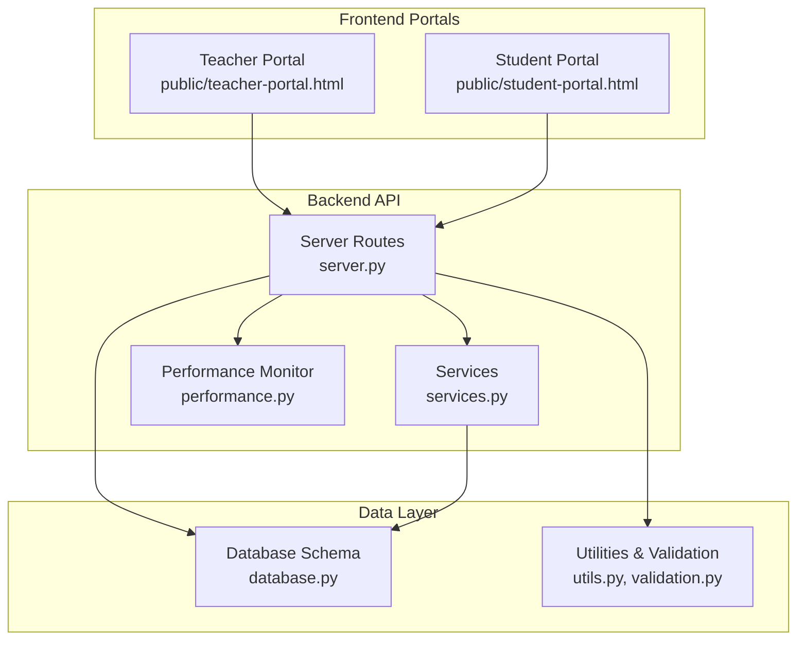
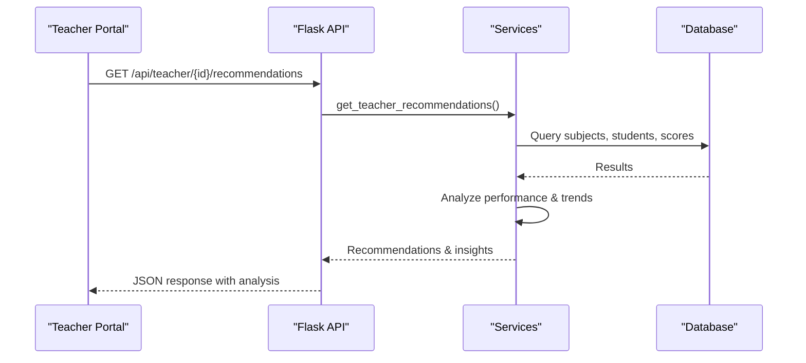
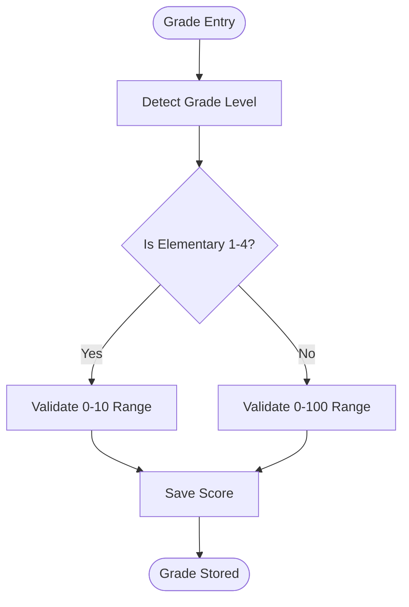
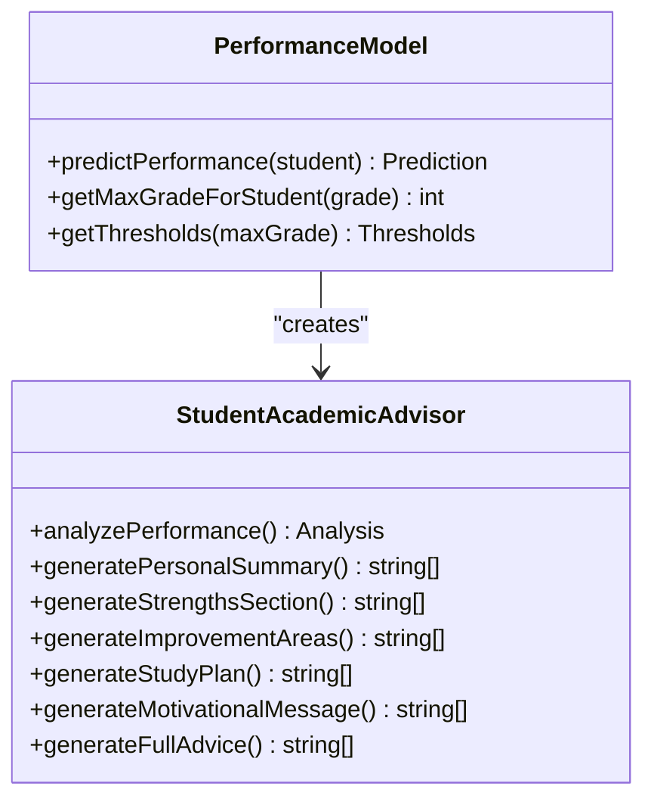
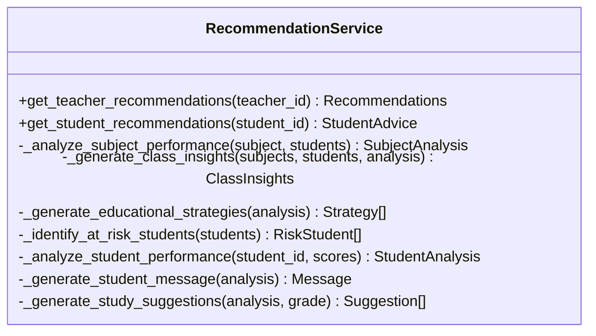
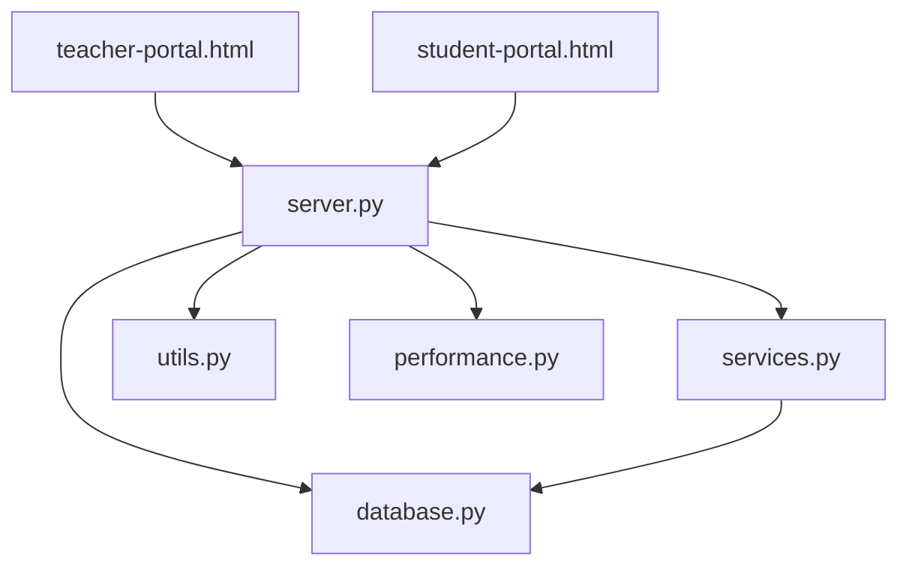

# Academic Evaluation Workflows

<cite>
**Referenced Files in This Document**
- [README.md](file://README.md)
- [server.py](file://server.py)
- [database.py](file://database.py)
- [services.py](file://services.py)
- [utils.py](file://utils.py)
- [validation.py](file://validation.py)
- [performance.py](file://performance.py)
- [public/teacher-portal.html](file://public/teacher-portal.html)
- [public/student-portal.html](file://public/student-portal.html)
</cite>

## Table of Contents
1. [Introduction](#introduction)
2. [Project Structure](#project-structure)
3. [Core Components](#core-components)
4. [Architecture Overview](#architecture-overview)
5. [Detailed Component Analysis](#detailed-component-analysis)
6. [Dependency Analysis](#dependency-analysis)
7. [Performance Considerations](#performance-considerations)
8. [Troubleshooting Guide](#troubleshooting-guide)
9. [Conclusion](#conclusion)

## Introduction
This document describes the academic evaluation workflows implemented in the EduFlow Python school management system. It focuses on grade management, assessment tracking, performance analysis, and report generation. The system integrates subject assignments, teacher-student relationships, and class management to provide automated grade aggregation, performance trend analysis, and academic warning systems for underperforming students.

## Project Structure
The system is a Flask-based backend with a modular design:
- Backend API routes handle authentication, CRUD operations, and evaluation analytics
- Database layer manages relational tables for schools, students, subjects, teachers, and academic records
- Services encapsulate business logic for recommendations and analytics
- Frontend portals provide teacher and student dashboards with real-time evaluation insights
- Utilities and validation enforce data integrity and grade scale conversions

**Diagram sources**
- [server.py](file://server.py#L1-L200)
- [database.py](file://database.py#L120-L338)
- [services.py](file://services.py#L1-L120)
- [utils.py](file://utils.py#L1-L120)
- [validation.py](file://validation.py#L1-L120)
- [performance.py](file://performance.py#L1-L120)
- [public/teacher-portal.html](file://public/teacher-portal.html#L1-L120)
- [public/student-portal.html](file://public/student-portal.html#L1-L120)

**Section sources**
- [README.md](file://README.md#L1-L23)
- [server.py](file://server.py#L1-L200)
- [database.py](file://database.py#L120-L338)

## Core Components
- Grade entry and validation: Supports 10-point and 100-point scales with automatic conversion detection based on grade level
- Assessment tracking: Monthly, midterm, and final grade periods with trend analysis
- Performance analytics: Automated recommendations, at-risk identification, and comprehensive reports
- Class and subject management: Teacher assignments, subject mapping, and class averages
- Academic year management: Centralized academic year tracking for historical analysis

**Section sources**
- [server.py](file://server.py#L52-L90)
- [utils.py](file://utils.py#L123-L186)
- [services.py](file://services.py#L367-L858)
- [database.py](file://database.py#L291-L320)

## Architecture Overview
The system follows a layered architecture:
- Presentation layer: Teacher and student portals with interactive dashboards
- API layer: Flask routes handling authentication, CRUD, and analytics
- Service layer: Business logic for recommendations and performance modeling
- Data layer: MySQL/SQLite abstraction with normalized schema
- Utility layer: Validation, sanitization, and performance monitoring

**Diagram sources**
- [services.py](file://services.py#L367-L430)
- [server.py](file://server.py#L140-L200)

**Section sources**
- [server.py](file://server.py#L140-L200)
- [services.py](file://services.py#L367-L430)

## Detailed Component Analysis

### Grade Management and Scale Conversion
The system automatically detects grade scale based on educational level:
- Elementary grades 1-4 use 10-point scale (0-10)
- All other grades use 100-point scale (0-100)

**Diagram sources**
- [utils.py](file://utils.py#L123-L186)
- [server.py](file://server.py#L52-L90)

Key implementation points:
- Grade format validation ensures "Educational Level - Grade Level" structure
- Score range validation prevents out-of-range entries
- Detailed scores stored as JSON for flexible period tracking

**Section sources**
- [utils.py](file://utils.py#L123-L186)
- [server.py](file://server.py#L52-L90)
- [server.py](file://server.py#L683-L766)

### Assessment Tracking and Trend Analysis
The student portal performs comprehensive trend analysis:
- Period order: month1 → month2 → midterm → month3 → month4 → final
- Consistency measurement using standard deviation ratio
- Improvement detection for zero-to-good transitions
- At-risk threshold identification (50% for 100-point, 5 for 10-point)

**Diagram sources**
- [public/student-portal.html](file://public/student-portal.html#L556-L713)
- [public/student-portal.html](file://public/student-portal.html#L280-L549)

**Section sources**
- [public/student-portal.html](file://public/student-portal.html#L155-L184)
- [public/student-portal.html](file://public/student-portal.html#L556-L713)
- [public/student-portal.html](file://public/student-portal.html#L280-L549)

### Performance Analytics and Recommendations
The recommendation engine provides:
- Subject-wise performance analysis with pass rates and excellence counts
- Class-level insights including overall averages and at-risk students
- Personalized student recommendations with study strategies
- Teacher recommendations for instructional adjustments

**Diagram sources**
- [services.py](file://services.py#L367-L858)

**Section sources**
- [services.py](file://services.py#L367-L858)

### Academic Year and Historical Analysis
The system maintains academic year boundaries and supports historical data retrieval:
- Centralized academic year table with current year flag
- Per-student grade records linked to academic years
- Year-specific data loading for performance comparisons

**Section sources**
- [database.py](file://database.py#L261-L289)
- [database.py](file://database.py#L291-L307)
- [public/student-portal.html](file://public/student-portal.html#L1015-L1141)

### Teacher-Student Relationship Management
The system tracks teacher assignments and student relationships:
- Many-to-many subject-teacher assignments
- Class assignment tracking with academic year context
- Automatic student retrieval based on teacher subjects

**Section sources**
- [database.py](file://database.py#L236-L259)
- [database.py](file://database.py#L467-L550)
- [server.py](file://server.py#L768-L807)

### Automated Grade Aggregation and Reporting
The frontend generates comprehensive reports:
- General evaluation with performance levels and attendance impact
- Class comparison showing above/below average subjects
- Strengths, improvement areas, and stage-appropriate strategies
- Actionable guidance for teachers and parents

**Section sources**
- [public/student-portal.html](file://public/student-portal.html#L1299-L1955)

## Dependency Analysis
The system exhibits clear separation of concerns with minimal coupling between layers.

**Diagram sources**
- [server.py](file://server.py#L1-L50)
- [database.py](file://database.py#L1-L50)
- [services.py](file://services.py#L1-L30)
- [utils.py](file://utils.py#L1-L30)
- [performance.py](file://performance.py#L1-L30)
- [public/teacher-portal.html](file://public/teacher-portal.html#L1-L30)
- [public/student-portal.html](file://public/student-portal.html#L1-L30)

**Section sources**
- [server.py](file://server.py#L1-L50)
- [database.py](file://database.py#L1-L50)
- [services.py](file://services.py#L1-L30)

## Performance Considerations
- Database abstraction supports both MySQL and SQLite with automatic fallback
- Performance monitoring tracks request times, endpoint statistics, and system metrics
- Caching and connection pooling reduce database overhead
- JSON storage for detailed scores enables flexible schema evolution

**Section sources**
- [database.py](file://database.py#L88-L118)
- [performance.py](file://performance.py#L15-L144)

## Troubleshooting Guide
Common issues and resolutions:
- Grade validation failures: Ensure grade format matches "Educational Level - Grade Level" and score within appropriate range
- Academic year mismatch: Verify current academic year is properly set and student data aligned
- Performance prediction errors: Check detailed scores JSON structure and ensure sufficient data points
- Database connectivity: Confirm MySQL availability or verify SQLite fallback mechanism

**Section sources**
- [utils.py](file://utils.py#L123-L186)
- [validation.py](file://validation.py#L265-L318)
- [database.py](file://database.py#L88-L118)

## Conclusion
The EduFlow system provides a comprehensive academic evaluation framework with automated grade management, sophisticated performance analysis, and actionable recommendations. Its modular architecture supports scalability and maintainability while delivering real-time insights for teachers, students, and administrators.