# Attendance Tracking System

<cite>
**Referenced Files in This Document**
- [server.py](file://server.py)
- [database.py](file://database.py)
- [database_helpers.py](file://database_helpers.py)
- [validation.py](file://validation.py)
- [utils.py](file://utils.py)
- [services.py](file://services.py)
</cite>

## Table of Contents
1. [Introduction](#introduction)
2. [System Architecture](#system-architecture)
3. [Core Components](#core-components)
4. [Attendance Recording Mechanisms](#attendance-recording-mechanisms)
5. [Daily Attendance Registers](#daily-attendance-registers)
6. [Automated Absence Tracking](#automated-absence-tracking)
7. [Integration with Class Schedules](#integration-with-class-schedules)
8. [Teacher-Student Relationships](#teacher-student-relationships)
9. [Data Collection Workflows](#data-collection-workflows)
10. [Reporting Mechanisms](#reporting-mechanisms)
11. [Real-time Updates](#real-time-updates)
12. [Data Validation Rules](#data-validation-rules)
13. [Attendance Statistics Calculation](#attendance-statistics-calculation)
14. [Academic Year Integration](#academic-year-integration)
15. [Troubleshooting Guide](#troubleshooting-guide)
16. [Conclusion](#conclusion)

## Introduction

The EduFlow attendance tracking system is a comprehensive solution designed to manage student attendance records within a school management ecosystem. Built with Python and Flask, this system provides robust attendance recording capabilities, automated absence tracking, and seamless integration with class schedules and teacher-student relationships.

The system operates on a centralized academic year model that spans all schools within the educational institution, ensuring consistency and uniformity across the entire educational network. It leverages advanced database design patterns and follows modern security practices to provide reliable attendance management functionality.

## System Architecture

The attendance tracking system follows a layered architecture pattern with clear separation of concerns:

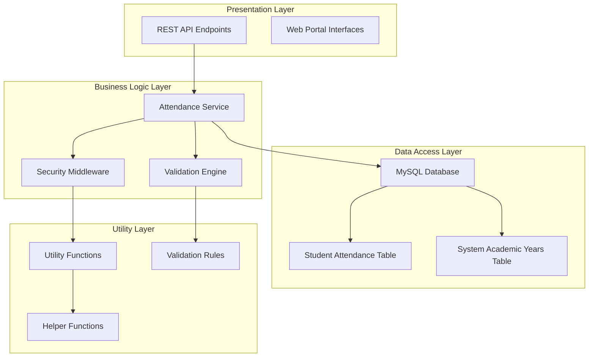

**Diagram sources**
- [server.py](file://server.py#L1783-L1844)
- [database.py](file://database.py#L309-L320)
- [validation.py](file://validation.py#L203-L240)

**Section sources**
- [server.py](file://server.py#L1-L50)
- [database.py](file://database.py#L120-L338)

## Core Components

### Database Schema Design

The system utilizes a sophisticated database design optimized for attendance tracking:

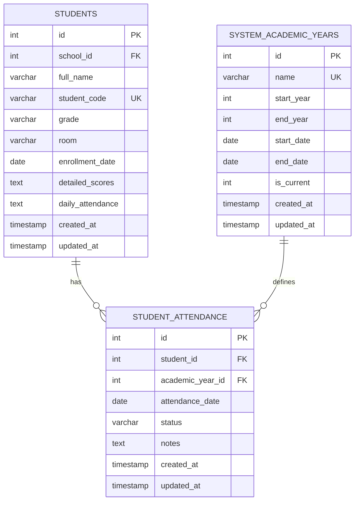

**Diagram sources**
- [database.py](file://database.py#L309-L320)

### Attendance Status Categories

The system supports multiple attendance status categories:

| Status Code | Description | Usage |
|-------------|-------------|-------|
| `present` | Student attended class | Default status |
| `absent` | Student did not attend | Standard absence |
| `late` | Student arrived after start time | Late arrival tracking |
| `excused` | Student had valid excuse | Authorized absence |
| `medical` | Medical appointment | Healthcare-related absence |
| `other` | Other reasons | Miscellaneous categories |

**Section sources**
- [database.py](file://database.py#L309-L320)
- [server.py](file://server.py#L1783-L1844)

## Attendance Recording Mechanisms

### Teacher Authorization System

The attendance recording system implements a strict teacher authorization mechanism:

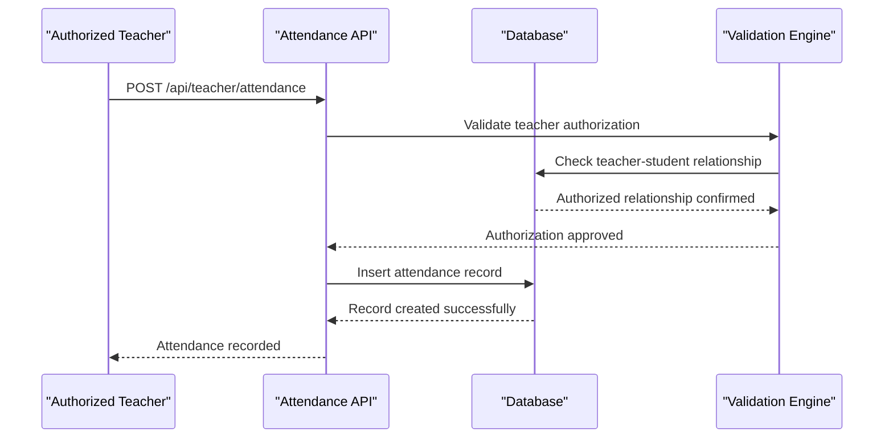

**Diagram sources**
- [server.py](file://server.py#L1783-L1844)

### Real-time Attendance Entry Process

The system processes attendance entries through a multi-stage validation pipeline:

1. **Authentication Verification**: Ensures teacher is properly authenticated
2. **Authorization Check**: Confirms teacher has access to the student's grade level
3. **Data Validation**: Validates all required fields and formats
4. **Duplicate Prevention**: Prevents multiple entries for the same date
5. **Database Persistence**: Stores attendance record with timestamps

**Section sources**
- [server.py](file://server.py#L1783-L1844)

## Daily Attendance Registers

### Register Structure and Organization

Each day's attendance forms a comprehensive register that captures essential information:

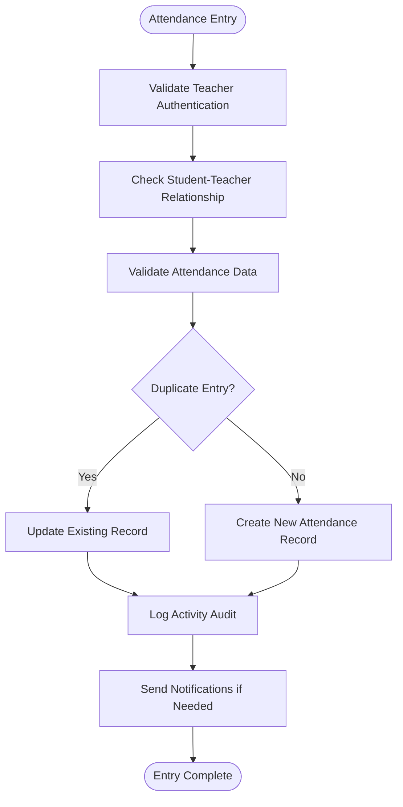

**Diagram sources**
- [server.py](file://server.py#L1783-L1844)

### Register Content Organization

The daily attendance registers maintain detailed information:

- **Student Identification**: Unique student codes and names
- **Date and Time Stamps**: Precise recording of attendance timing
- **Status Tracking**: Current attendance status with historical context
- **Notes and Comments**: Additional information for special circumstances
- **Authorization Trail**: Complete audit trail of who made changes

**Section sources**
- [database.py](file://database.py#L309-L320)

## Automated Absence Tracking

### Absence Categorization System

The system automatically categorizes absences based on predefined criteria:

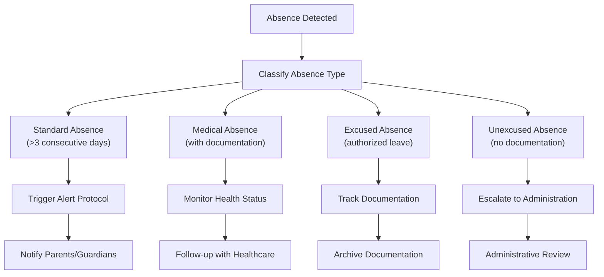

**Diagram sources**
- [server.py](file://server.py#L1783-L1844)

### Excessive Absence Thresholds

The system implements configurable thresholds for automatic notifications:

| Absence Category | Threshold | Action Level |
|------------------|-----------|--------------|
| Minor Absences | 1-2 days | Monitoring |
| Moderate Absences | 3-5 days | Parent Notification |
| Severe Absences | 6+ days | Administrative Review |
| Chronic Absences | Repeated >5 days/month | Intervention Required |

**Section sources**
- [server.py](file://server.py#L1783-L1844)

## Integration with Class Schedules

### Schedule-Based Attendance Alignment

The attendance system integrates seamlessly with class scheduling:

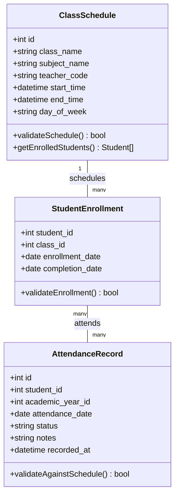

**Diagram sources**
- [database.py](file://database.py#L247-L259)
- [database.py](file://database.py#L309-L320)

### Schedule Validation Process

The system validates attendance entries against class schedules:

1. **Class Membership Verification**: Confirms student enrollment in the class
2. **Time Slot Validation**: Ensures attendance recorded during scheduled hours
3. **Subject Alignment**: Verifies teacher is authorized for the subject
4. **Grade Level Matching**: Confirms student grade matches class requirements

**Section sources**
- [server.py](file://server.py#L1783-L1844)

## Teacher-Student Relationships

### Relationship Validation Architecture

The system maintains strict teacher-student relationship boundaries:

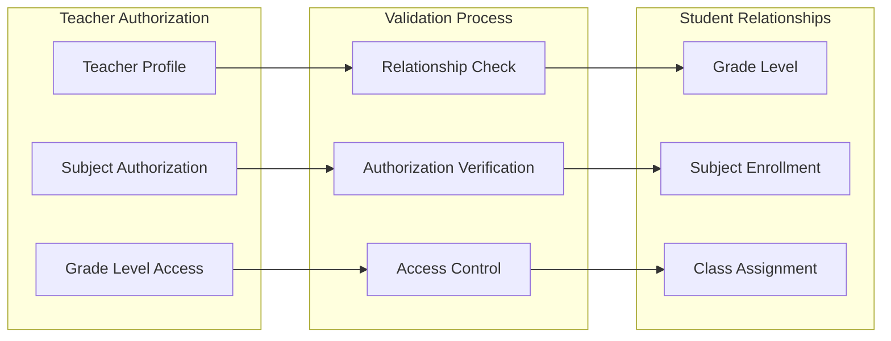

**Diagram sources**
- [server.py](file://server.py#L1783-L1844)

### Access Control Implementation

The system enforces granular access controls:

- **Subject-Based Access**: Teachers can only record attendance for authorized subjects
- **Grade-Level Restrictions**: Prevents cross-grade attendance recording
- **Class Membership Validation**: Ensures student belongs to the teacher's class
- **Temporal Constraints**: Limits attendance recording to appropriate time periods

**Section sources**
- [server.py](file://server.py#L1783-L1844)

## Data Collection Workflows

### Multi-source Data Integration

The attendance system collects data from various sources:

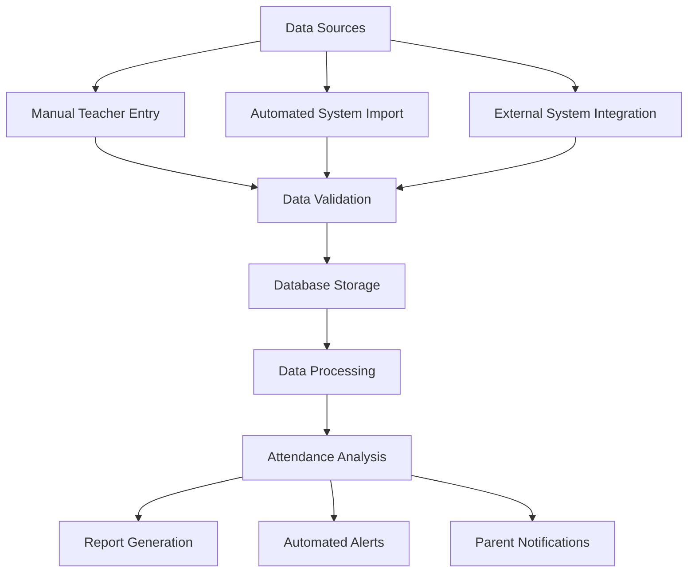

### Data Collection Methods

The system supports multiple data collection methods:

1. **Direct Teacher Input**: Real-time attendance recording through teacher portal
2. **Bulk Upload**: CSV/Excel file imports for batch processing
3. **API Integration**: External system connectivity for automated data exchange
4. **Mobile Applications**: Mobile device-based attendance capture
5. **Biometric Systems**: Integration with fingerprint/RFID attendance systems

**Section sources**
- [server.py](file://server.py#L1783-L1844)

## Reporting Mechanisms

### Comprehensive Reporting Dashboard

The system generates detailed attendance reports:

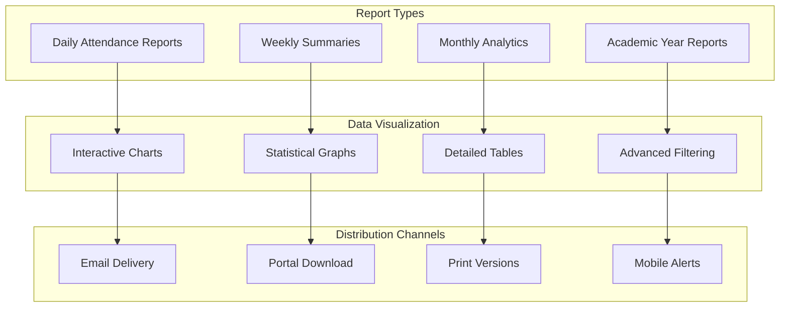

### Report Content and Structure

Reports include comprehensive attendance analytics:

- **Individual Student Reports**: Personal attendance history and trends
- **Class Performance Metrics**: Attendance patterns and averages
- **Subject-wise Analysis**: Attendance by subject and teacher
- **Grade Level Comparisons**: Comparative analysis across grade levels
- **Historical Trends**: Long-term attendance pattern analysis

**Section sources**
- [server.py](file://server.py#L1783-L1844)

## Real-time Updates

### Live Data Synchronization

The system provides real-time attendance updates:

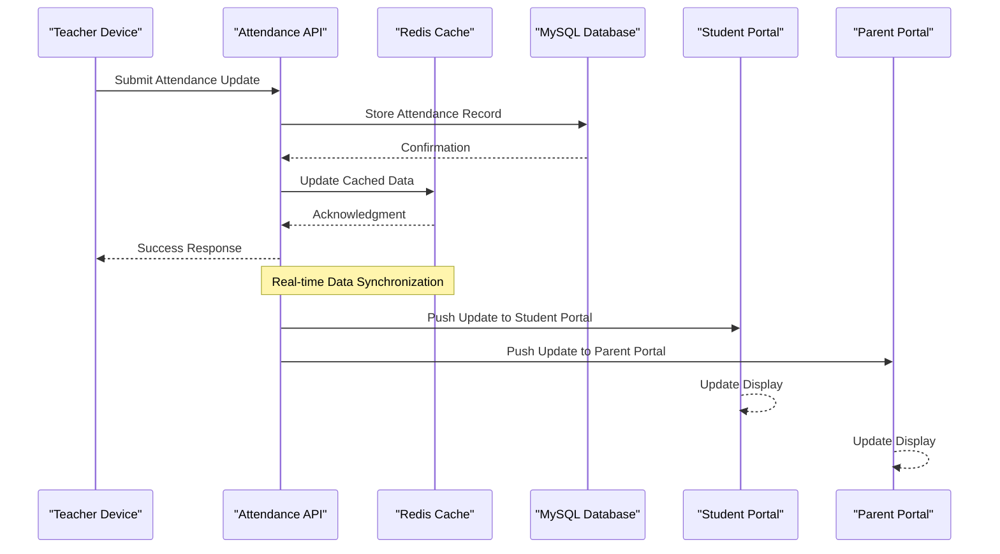

**Diagram sources**
- [server.py](file://server.py#L1783-L1844)

### Update Propagation Mechanism

Real-time updates propagate through multiple channels:

1. **Immediate Database Update**: Primary storage with transaction guarantees
2. **Cache Synchronization**: Redis cache updates for fast retrieval
3. **Portal Notifications**: Live updates to student and parent portals
4. **Mobile Synchronization**: Real-time mobile app updates
5. **Audit Trail Logging**: Complete activity tracking

**Section sources**
- [server.py](file://server.py#L1783-L1844)

## Data Validation Rules

### Comprehensive Validation Framework

The system implements multi-layered validation:

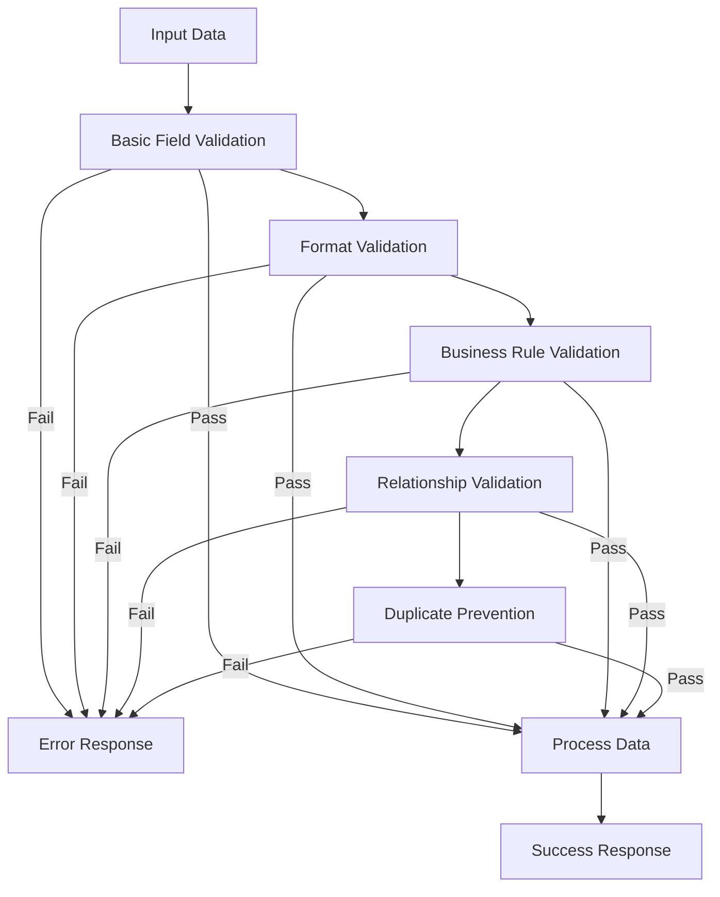

### Validation Rule Categories

The system employs comprehensive validation rules:

| Validation Type | Rules Applied | Purpose |
|----------------|---------------|---------|
| **Required Fields** | Student ID, Academic Year, Date | Essential data completeness |
| **Format Validation** | Date formats, Status codes | Data consistency |
| **Business Rules** | Authorized relationships, Grade matching | Logical correctness |
| **Duplicate Prevention** | Same date, same student, same status | Data integrity |
| **Range Validation** | Status categories, Numeric ranges | Valid value limits |

**Section sources**
- [validation.py](file://validation.py#L203-L240)
- [utils.py](file://utils.py#L162-L186)

## Attendance Statistics Calculation

### Advanced Analytics Engine

The system calculates comprehensive attendance statistics:

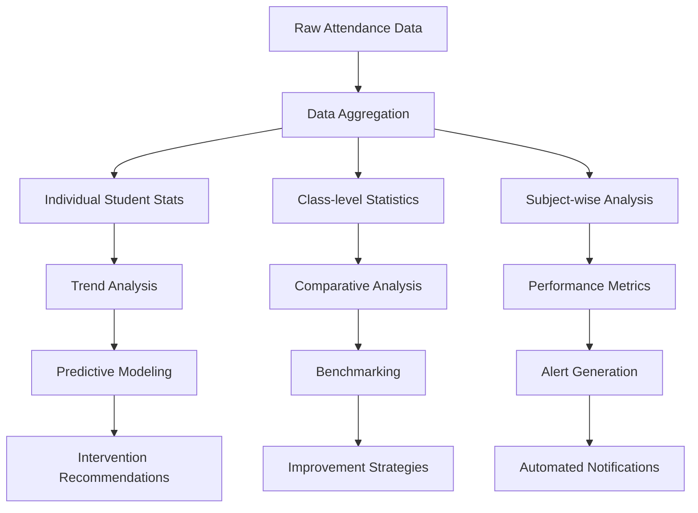

### Statistical Metrics Generated

The system produces various statistical metrics:

- **Attendance Rates**: Percentage of classes attended
- **Absence Patterns**: Frequency and duration of absences
- **Trend Analysis**: Seasonal and temporal patterns
- **Comparison Metrics**: Benchmarks against grade-level averages
- **Risk Assessment**: Identification of at-risk students

**Section sources**
- [server.py](file://server.py#L1783-L1844)

## Academic Year Integration

### Centralized Academic Year Management

The system operates on a centralized academic year model:

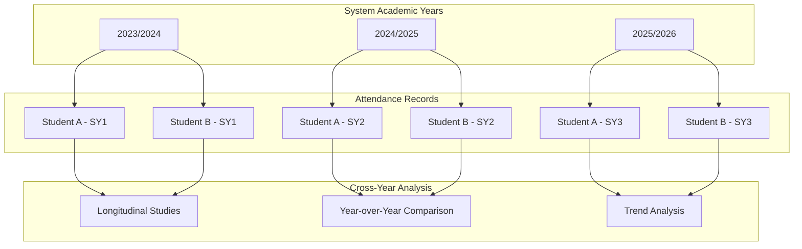

**Diagram sources**
- [database.py](file://database.py#L261-L273)
- [server.py](file://server.py#L1845-L1925)

### Academic Year Progression Handling

The system manages academic year transitions:

1. **Automatic Year Detection**: System calculates current academic year based on date
2. **Seamless Transition**: Smooth migration of attendance records between years
3. **Historical Preservation**: Complete retention of past academic year data
4. **Progression Tracking**: Monitoring of student advancement across years

**Section sources**
- [server.py](file://server.py#L1845-L1925)
- [database.py](file://database.py#L261-L273)

## Troubleshooting Guide

### Common Issues and Solutions

| Issue | Symptoms | Solution |
|-------|----------|----------|
| **Authentication Failures** | 401 Unauthorized responses | Verify JWT token validity and expiration |
| **Authorization Errors** | 403 Forbidden responses | Check teacher-student relationship validation |
| **Duplicate Entry Errors** | 400 Bad Request for duplicates | Ensure unique date-per-student constraint |
| **Database Connection Issues** | 500 Internal Server Error | Verify MySQL connection pool configuration |
| **Validation Failures** | Detailed validation error messages | Review input format and required fields |

### Debugging Tools and Techniques

The system provides comprehensive debugging capabilities:

- **Audit Trail Analysis**: Complete activity logging for troubleshooting
- **Real-time Monitoring**: Live system performance metrics
- **Error Logging**: Structured error reporting with context
- **Validation Feedback**: Detailed validation error messages
- **Performance Profiling**: Database query optimization insights

**Section sources**
- [server.py](file://server.py#L2220-L2235)
- [utils.py](file://utils.py#L313-L334)

## Conclusion

The EduFlow attendance tracking system represents a comprehensive solution for modern educational institutions seeking robust attendance management capabilities. Through its centralized academic year model, strict teacher-student relationship validation, and automated absence tracking, the system ensures accurate and reliable attendance data collection.

Key strengths of the system include:

- **Scalability**: Designed to handle multiple schools and thousands of students
- **Security**: Multi-layered authentication and authorization mechanisms
- **Flexibility**: Support for various attendance status categories and configurations
- **Integration**: Seamless integration with existing school management systems
- **Analytics**: Advanced reporting and statistical analysis capabilities

The system's architecture ensures reliability, maintainability, and extensibility, making it suitable for long-term educational institution needs. Its real-time update capabilities and comprehensive reporting features provide valuable insights into student attendance patterns and institutional performance.

Future enhancements could include biometric integration, mobile application expansion, and advanced predictive analytics for early intervention in student attendance issues.