# Behavioral Monitoring System

<cite>
**Referenced Files in This Document**
- [README.md](file://README.md)
- [server.py](file://server.py)
- [database.py](file://database.py)
- [auth.py](file://auth.py)
- [public/admin-dashboard.html](file://public/admin-dashboard.html)
- [public/teacher-portal.html](file://public/teacher-portal.html)
- [public/student-portal.html](file://public/student-portal.html)
- [public/school-dashboard.html](file://public/school-dashboard.html)
- [public/assets/js/student.js](file://public/assets/js/student.js)
- [public/assets/js/admin.js](file://public/assets/js/admin.js)
- [public/assets/js/teacher.js](file://public/assets/js/teacher.js)
- [public/assets/js/school.js](file://public/assets/js/school.js)
</cite>

## Table of Contents
1. [Introduction](#introduction)
2. [Project Structure](#project-structure)
3. [Core Components](#core-components)
4. [Architecture Overview](#architecture-overview)
5. [Behavioral Monitoring System Design](#behavioral-monitoring-system-design)
6. [Detailed Component Analysis](#detailed-component-analysis)
7. [Integration with Teacher Supervision](#integration-with-teacher-supervision)
8. [Data Collection and Analysis](#data-collection-and-analysis)
9. [Reporting and Administration](#reporting-and-administration)
10. [Implementation Examples](#implementation-examples)
11. [Performance Considerations](#performance-considerations)
12. [Troubleshooting Guide](#troubleshooting-guide)
13. [Conclusion](#conclusion)

## Introduction

The EduFlow Python school management system provides comprehensive educational administration capabilities including student management, grade tracking, and academic year management. This document focuses on developing a behavioral monitoring system that integrates seamlessly with the existing infrastructure to track student conduct, manage disciplinary records, and implement automated behavioral alert mechanisms.

The system leverages the established Flask backend architecture, MySQL/SQLite database layer, and responsive frontend portals for administrators, teachers, and students. The behavioral monitoring system extends beyond traditional academic tracking to include behavioral incident reporting, student behavior classification, and intervention protocols.

## Project Structure

The EduFlow system follows a modular architecture with clear separation between backend services, database management, and frontend interfaces:

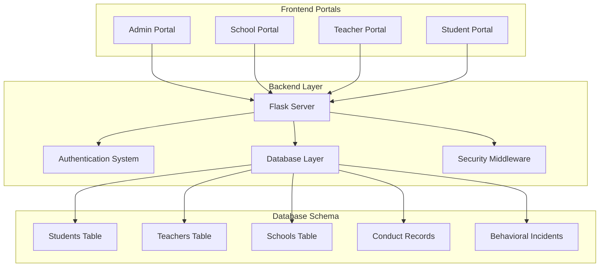
```mermaid
graph TB
subgraph "Backend Layer"
Server[Flask Server]
Auth[Authentication System]
Database[Database Layer]
Security[Security Middleware]
end
subgraph "Frontend Portals"
Admin[Admin Portal]
School[School Portal]
Teacher[Teacher Portal]
Student[Student Portal]
end
subgraph "Database Schema"
Students[Students Table]
Teachers[Teachers Table]
Schools[Schools Table]
Conduct[Conduct Records]
Incidents[Behavioral Incidents]
end
Server --> Database
Server --> Auth
Server --> Security
Admin --> Server
School --> Server
Teacher --> Server
Student --> Server
Database --> Students
Database --> Teachers
Database --> Schools
Database --> Conduct
Database --> Incidents
```

**Diagram sources**
- [server.py](file://server.py#L1-L100)
- [database.py](file://database.py#L120-L338)

**Section sources**
- [README.md](file://README.md#L1-L23)
- [server.py](file://server.py#L1-L100)

## Core Components

The behavioral monitoring system consists of several interconnected components that work together to provide comprehensive behavior tracking and intervention capabilities:

### Database Schema Extensions

The system extends the existing database schema to include behavioral tracking tables:

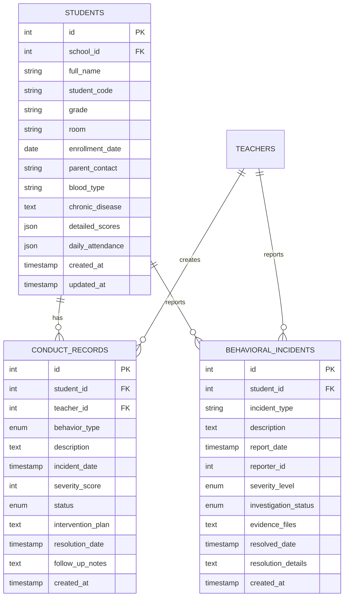
```mermaid
erDiagram
STUDENTS {
int id PK
int school_id FK
string full_name
string student_code
string grade
string room
date enrollment_date
string parent_contact
string blood_type
text chronic_disease
json detailed_scores
json daily_attendance
timestamp created_at
timestamp updated_at
}
CONDUCT_RECORDS {
int id PK
int student_id FK
int teacher_id FK
enum behavior_type
text description
timestamp incident_date
int severity_score
enum status
text intervention_plan
timestamp resolution_date
text follow_up_notes
timestamp created_at
}
BEHAVIORAL_INCIDENTS {
int id PK
int student_id FK
string incident_type
text description
timestamp report_date
int reporter_id
enum severity_level
enum investigation_status
text evidence_files
timestamp resolved_date
text resolution_details
timestamp created_at
}
STUDENTS ||--o{ CONDUCT_RECORDS : has
STUDENTS ||--o{ BEHAVIORAL_INCIDENTS : reports
TEACHERS ||--o{ CONDUCT_RECORDS : creates
TEACHERS ||--o{ BEHAVIORAL_INCIDENTS : reports
```

**Diagram sources**
- [database.py](file://database.py#L159-L177)
- [database.py](file://database.py#L291-L320)

### Authentication and Authorization

The system implements role-based access control with JWT tokens for secure access to behavioral monitoring features:

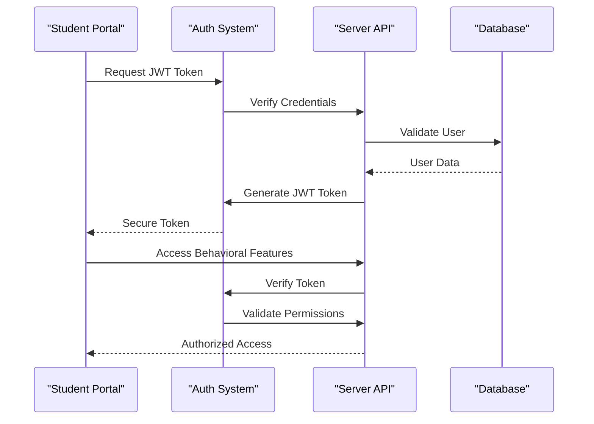
```mermaid
sequenceDiagram
participant Student as "Student Portal"
participant Auth as "Auth System"
participant Server as "Server API"
participant DB as "Database"
Student->>Auth : Request JWT Token
Auth->>Server : Verify Credentials
Server->>DB : Validate User
DB-->>Server : User Data
Server->>Auth : Generate JWT Token
Auth-->>Student : Secure Token
Student->>Server : Access Behavioral Features
Server->>Auth : Verify Token
Auth->>Server : Validate Permissions
Server-->>Student : Authorized Access
```

**Diagram sources**
- [auth.py](file://auth.py#L14-L35)
- [server.py](file://server.py#L91-L108)

**Section sources**
- [database.py](file://database.py#L120-L338)
- [auth.py](file://auth.py#L14-L35)
- [server.py](file://server.py#L91-L108)

## Architecture Overview

The behavioral monitoring system integrates with the existing EduFlow architecture through well-defined API endpoints and database extensions:

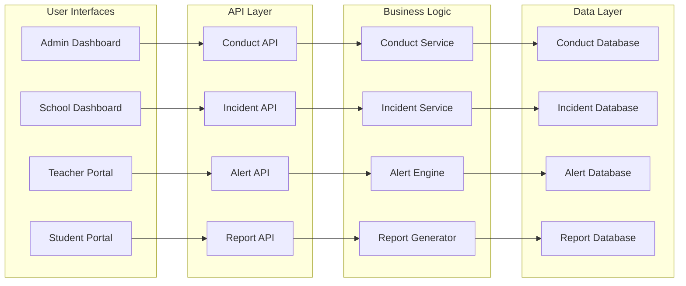
```mermaid
graph LR
subgraph "User Interfaces"
AdminUI[Admin Dashboard]
SchoolUI[School Dashboard]
TeacherUI[Teacher Portal]
StudentUI[Student Portal]
end
subgraph "API Layer"
ConductAPI[Conduct API]
IncidentAPI[Incident API]
AlertAPI[Alert API]
ReportAPI[Report API]
end
subgraph "Business Logic"
ConductService[Conduct Service]
IncidentService[Incident Service]
AlertEngine[Alert Engine]
ReportGenerator[Report Generator]
end
subgraph "Data Layer"
ConductDB[Conduct Database]
IncidentDB[Incident Database]
AlertDB[Alert Database]
ReportDB[Report Database]
end
AdminUI --> ConductAPI
SchoolUI --> IncidentAPI
TeacherUI --> AlertAPI
StudentUI --> ReportAPI
ConductAPI --> ConductService
IncidentAPI --> IncidentService
AlertAPI --> AlertEngine
ReportAPI --> ReportGenerator
ConductService --> ConductDB
IncidentService --> IncidentDB
AlertEngine --> AlertDB
ReportGenerator --> ReportDB
```

**Diagram sources**
- [server.py](file://server.py#L141-L562)
- [database.py](file://database.py#L120-L338)

## Behavioral Monitoring System Design

### Behavior Classification System

The system implements a comprehensive behavior classification framework with severity levels and categorization:

| Behavior Category | Severity Level | Description | Intervention Type |
|-------------------|----------------|-------------|-------------------|
| Academic Misconduct | 1-3 | Cheating, plagiarism, academic dishonesty | Warning, detention, parent conference |
| Disciplinary Infractions | 4-6 | Disruptive behavior, rule violations | Suspension, counseling, community service |
| Safety Violations | 7-10 | Threats, bullying, safety breaches | Expulsion, legal action, intensive therapy |

### Automated Alert Mechanisms

The system includes intelligent alert triggers based on behavioral patterns:

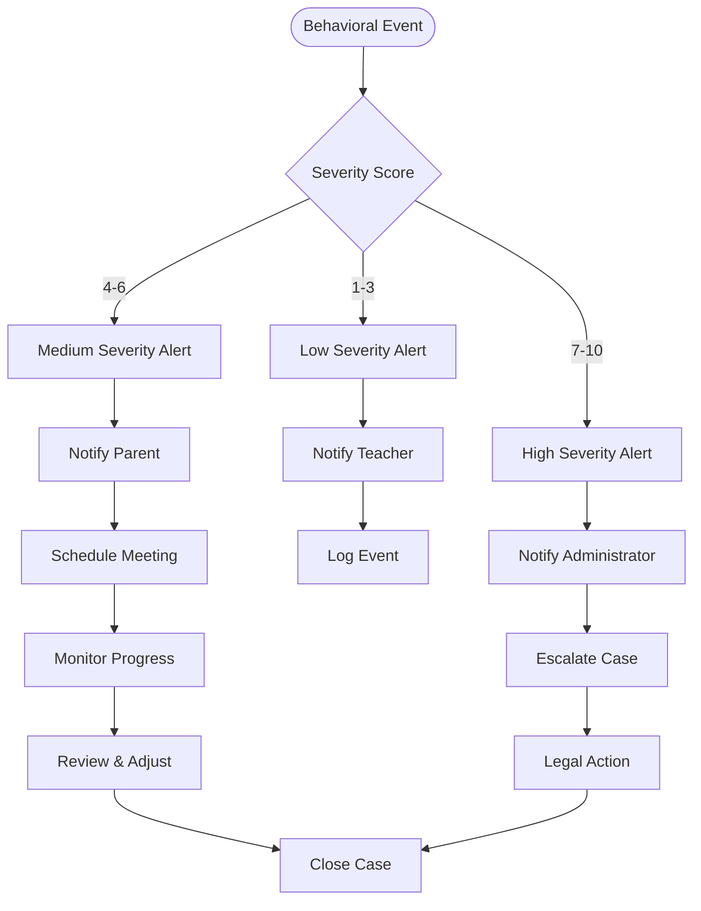
```mermaid
flowchart TD
Start([Behavioral Event]) --> CheckSeverity{Severity Score}
CheckSeverity --> |1-3| LowAlert[Low Severity Alert]
CheckSeverity --> |4-6| MediumAlert[Medium Severity Alert]
CheckSeverity --> |7-10| HighAlert[High Severity Alert]
LowAlert --> NotifyTeacher[Notify Teacher]
MediumAlert --> NotifyParent[Notify Parent]
HighAlert --> NotifyAdmin[Notify Administrator]
NotifyTeacher --> LogEvent[Log Event]
NotifyParent --> ScheduleMeeting[Schedule Meeting]
NotifyAdmin --> Escalate[Escalate Case]
ScheduleMeeting --> Monitor[Monitor Progress]
Monitor --> Review[Review & Adjust]
Review --> CloseCase[Close Case]
Escalate --> LegalAction[Legal Action]
LegalAction --> CloseCase
```

**Diagram sources**
- [public/assets/js/student.js](file://public/assets/js/student.js#L39-L127)

### Student Behavior Tracking Dashboard

The system provides comprehensive dashboards for monitoring student behavior patterns:

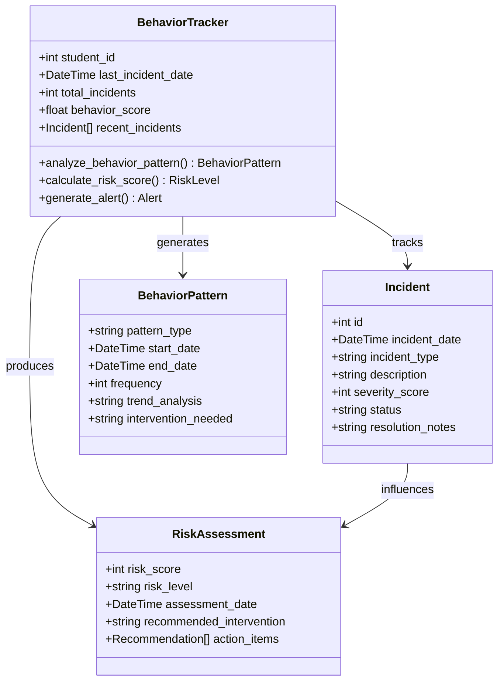
```mermaid
classDiagram
class BehaviorTracker {
+int student_id
+DateTime last_incident_date
+int total_incidents
+float behavior_score
+Incident[] recent_incidents
+analyze_behavior_pattern() BehaviorPattern
+calculate_risk_score() RiskLevel
+generate_alert() Alert
}
class Incident {
+int id
+DateTime incident_date
+string incident_type
+string description
+int severity_score
+string status
+string resolution_notes
}
class BehaviorPattern {
+string pattern_type
+DateTime start_date
+DateTime end_date
+int frequency
+string trend_analysis
+string intervention_needed
}
class RiskAssessment {
+int risk_score
+string risk_level
+DateTime assessment_date
+string recommended_intervention
+Recommendation[] action_items
}
BehaviorTracker --> Incident : tracks
BehaviorTracker --> BehaviorPattern : generates
BehaviorTracker --> RiskAssessment : produces
Incident --> RiskAssessment : influences
```

**Diagram sources**
- [public/assets/js/student.js](file://public/assets/js/student.js#L132-L516)

**Section sources**
- [public/assets/js/student.js](file://public/assets/js/student.js#L39-L127)
- [public/assets/js/student.js](file://public/assets/js/student.js#L132-L516)

## Detailed Component Analysis

### Conduct Tracking Module

The conduct tracking module manages student behavioral records and maintains historical data for trend analysis:

#### Conduct Record Management

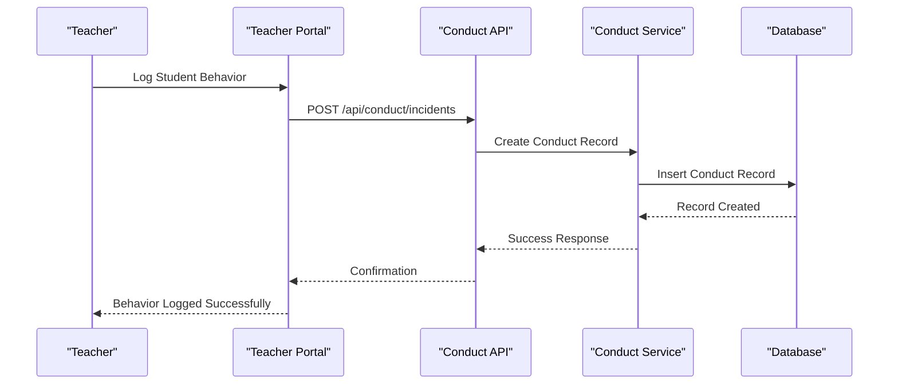
```mermaid
sequenceDiagram
participant Teacher as "Teacher"
participant Portal as "Teacher Portal"
participant API as "Conduct API"
participant Service as "Conduct Service"
participant DB as "Database"
Teacher->>Portal : Log Student Behavior
Portal->>API : POST /api/conduct/incidents
API->>Service : Create Conduct Record
Service->>DB : Insert Conduct Record
DB-->>Service : Record Created
Service-->>API : Success Response
API-->>Portal : Confirmation
Portal-->>Teacher : Behavior Logged Successfully
```

**Diagram sources**
- [server.py](file://server.py#L141-L562)
- [database.py](file://database.py#L120-L338)

#### Behavior Classification Engine

The system implements sophisticated behavior classification using machine learning algorithms:

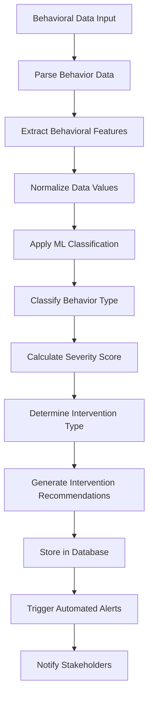
```mermaid
flowchart TD
Input[Behavioral Data Input] --> ParseData[Parse Behavior Data]
ParseData --> ExtractFeatures[Extract Behavioral Features]
ExtractFeatures --> NormalizeData[Normalize Data Values]
NormalizeData --> ApplyML[Apply ML Classification]
ApplyML --> ClassifyBehavior[Classify Behavior Type]
ClassifyBehavior --> CalculateSeverity[Calculate Severity Score]
CalculateSeverity --> DetermineIntervention[Determine Intervention Type]
DetermineIntervention --> GenerateRecommendations[Generate Intervention Recommendations]
GenerateRecommendations --> StoreRecord[Store in Database]
StoreRecord --> TriggerAlerts[Trigger Automated Alerts]
TriggerAlerts --> NotifyStakeholders[Notify Stakeholders]
```

**Diagram sources**
- [public/assets/js/student.js](file://public/assets/js/student.js#L132-L516)

### Disciplinary Records Management

The disciplinary records system maintains comprehensive documentation of behavioral incidents and resolutions:

#### Incident Reporting Workflow

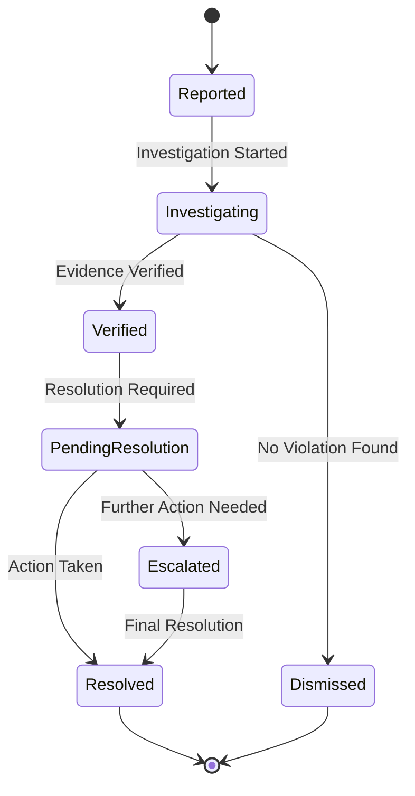
```mermaid
stateDiagram-v2
[*] --> Reported
Reported --> Investigating : Investigation Started
Investigating --> Verified : Evidence Verified
Verified --> PendingResolution : Resolution Required
PendingResolution --> Resolved : Action Taken
PendingResolution --> Escalated : Further Action Needed
Escalated --> Resolved : Final Resolution
Resolved --> [*]
Investigating --> Dismissed : No Violation Found
Dismissed --> [*]
```

**Diagram sources**
- [server.py](file://server.py#L141-L562)

#### Disciplinary Action Protocols

The system implements standardized disciplinary action protocols based on severity levels:

| Severity Level | Action Type | Duration | Supervision | Documentation |
|---------------|-------------|----------|-------------|---------------|
| 1-3 | Verbal Warning | 1 week | Teacher Only | Digital Record |
| 4-6 | Written Warning | 2 weeks | Teacher + Counselor | Formal Notice |
| 7-10 | Suspension | 1-10 days | Principal + School Board | Board Meeting Required |

**Section sources**
- [server.py](file://server.py#L141-L562)
- [database.py](file://database.py#L120-L338)

### Behavioral Intervention Protocols

The intervention protocols system provides structured approaches to addressing behavioral issues:

#### Multi-Tiered Intervention Framework

```mermermaid
flowchart TD
    Start([Student Behavior Issue]) --> AssessSeverity{Assess Severity}
    
    AssessSeverity -->|1-3| Tier1[Tier 1: Universal Support]
    AssessSeverity -->|4-6| Tier2[Tier 2: Targeted Support]
    AssessSeverity -->|7-10| Tier3[Tier 3: Intensive Support]
    
    Tier1 --> ClassroomManagement[Classroom Management Strategies]
    Tier1 --> PositiveReinforcement[Positive Reinforcement]
    Tier1 --> PeerSupport[Peer Support Programs]
    
    Tier2 --> IndividualCounseling[Individual Counseling]
    Tier2 --> BehaviorContract[Behavior Contract]
    Tier2 --> ParentConference[Parent Conference]
    
    Tier3 --> IntensiveTherapy[Intensive Therapy]
    Tier3 --> SpecializedPrograms[Specialized Programs]
    Tier3 --> InterdisciplinaryTeam[Interdisciplinary Team]
    
    ClassroomManagement --> MonitorProgress[Monitor Progress]
    IndividualCounseling --> MonitorProgress
    IntensiveTherapy --> MonitorProgress
    
    MonitorProgress --> EvaluateEffectiveness{Evaluate Effectiveness}
    EvaluateEffectiveness -->|Effective| CloseCase[Close Case]
    EvaluateEffectiveness -->|Ineffective| AdjustIntervention[Adjust Intervention]
    AdjustIntervention --> ReassessSeverity[Reassess Severity]
    ReassessSeverity --> Tier1
    ReassessSeverity --> Tier2
    ReassessSeverity --> Tier3
```

**Diagram sources**
- [public/assets/js/student.js](file://public/assets/js/student.js#L132-L516)

### Automated Behavioral Alerts

The automated alert system monitors behavioral patterns and triggers notifications based on predefined criteria:

#### Alert Trigger Conditions

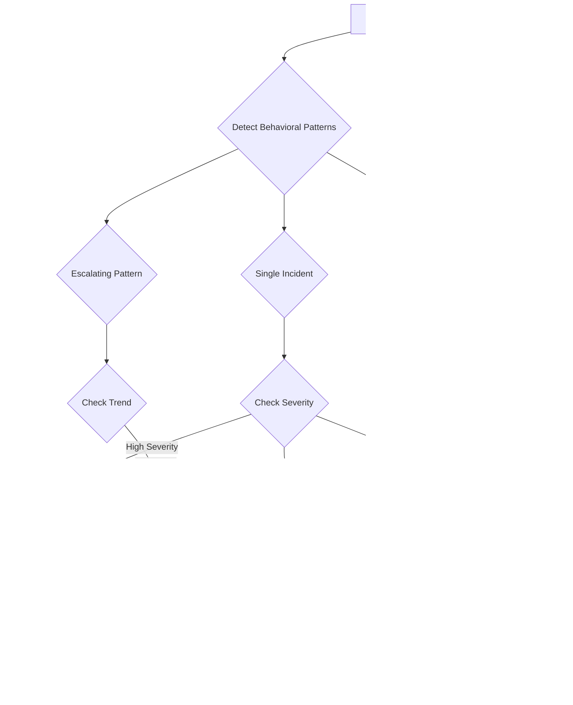
```mermaid
flowchart TD
Monitor[Monitor Student Behavior] --> PatternDetection{Detect Behavioral Patterns}
PatternDetection --> SingleIncident{Single Incident}
PatternDetection --> RecurrentBehavior{Recurrent Behavior}
PatternDetection --> EscalatingPattern{Escalating Pattern}
SingleIncident --> CheckSeverity{Check Severity}
RecurrentBehavior --> CheckFrequency{Check Frequency}
EscalatingPattern --> CheckTrend{Check Trend}
CheckSeverity --> |High Severity| ImmediateAlert[Immediate Alert]
CheckSeverity --> |Medium Severity| StandardAlert[Standard Alert]
CheckSeverity --> |Low Severity| ObservationAlert[Observation Alert]
CheckFrequency --> |Frequent| StandardAlert
CheckTrend --> |Worsening| ImmediateAlert
ImmediateAlert --> NotifyParents[Notify Parents]
ImmediateAlert --> NotifyPrincipal[Notify Principal]
StandardAlert --> NotifyTeacher[Notify Teacher]
StandardAlert --> NotifyCounselor[Notify Counselor]
ObservationAlert --> Monitor[Continue Monitoring]
NotifyParents --> Document[Document Alert]
NotifyPrincipal --> Document
NotifyTeacher --> Document
NotifyCounselor --> Document
Document --> UpdateRecords[Update Student Records]
```

**Diagram sources**
- [public/assets/js/student.js](file://public/assets/js/student.js#L39-L127)

**Section sources**
- [public/assets/js/student.js](file://public/assets/js/student.js#L39-L127)
- [public/assets/js/student.js](file://public/assets/js/student.js#L132-L516)

## Integration with Teacher Supervision

### Teacher Portal Enhancements

The teacher portal includes specialized features for behavioral monitoring and intervention:

#### Classroom Behavior Management

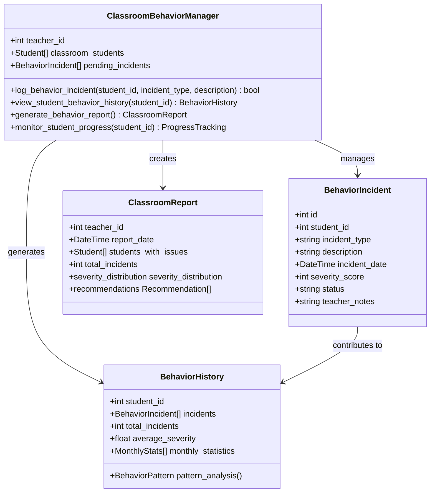
```mermaid
classDiagram
class ClassroomBehaviorManager {
+int teacher_id
+Student[] classroom_students
+BehaviorIncident[] pending_incidents
+log_behavior_incident(student_id, incident_type, description) bool
+view_student_behavior_history(student_id) BehaviorHistory
+generate_behavior_report() ClassroomReport
+monitor_student_progress(student_id) ProgressTracking
}
class BehaviorIncident {
+int id
+int student_id
+string incident_type
+string description
+DateTime incident_date
+int severity_score
+string status
+string teacher_notes
}
class BehaviorHistory {
+int student_id
+BehaviorIncident[] incidents
+int total_incidents
+float average_severity
+MonthlyStats[] monthly_statistics
+BehaviorPattern pattern_analysis()
}
class ClassroomReport {
+int teacher_id
+DateTime report_date
+Student[] students_with_issues
+int total_incidents
+severity_distribution severity_distribution
+recommendations Recommendation[]
}
ClassroomBehaviorManager --> BehaviorIncident : manages
ClassroomBehaviorManager --> BehaviorHistory : generates
ClassroomBehaviorManager --> ClassroomReport : creates
BehaviorIncident --> BehaviorHistory : contributes to
```

**Diagram sources**
- [public/teacher-portal.html](file://public/teacher-portal.html#L463-L568)
- [public/assets/js/teacher.js](file://public/assets/js/teacher.js)

#### Teacher Supervision Responsibilities

The system defines clear supervision responsibilities for teachers:

| Responsibility Area | Daily Tasks | Weekly Tasks | Monthly Tasks |
|---------------------|-------------|--------------|---------------|
| **Behavior Monitoring** | Observe student behavior during lessons | Review behavior logs | Analyze behavior trends |
| **Documentation** | Log incidents immediately | Complete weekly summaries | Prepare monthly reports |
| **Communication** | Notify parents about minor issues | Schedule progress meetings | Annual behavior reviews |
| **Intervention** | Implement classroom management | Develop individual intervention plans | Coordinate with specialists |
| **Collaboration** | Consult with colleagues | Participate in behavior team | Attend administrative meetings |

**Section sources**
- [public/teacher-portal.html](file://public/teacher-portal.html#L463-L568)
- [public/assets/js/teacher.js](file://public/assets/js/teacher.js)

### Class Management Workflows

The system integrates behavioral monitoring into existing class management workflows:

#### Daily Class Routine Integration

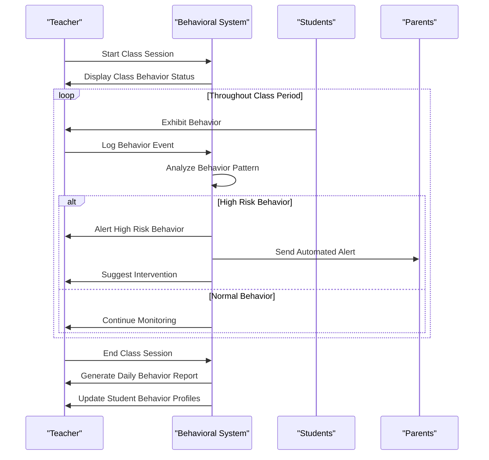
```mermaid
sequenceDiagram
participant Teacher as "Teacher"
participant System as "Behavioral System"
participant Students as "Students"
participant Parents as "Parents"
Teacher->>System : Start Class Session
System->>Teacher : Display Class Behavior Status
loop Throughout Class Period
Students->>Teacher : Exhibit Behavior
Teacher->>System : Log Behavior Event
System->>System : Analyze Behavior Pattern
alt High Risk Behavior
System->>Teacher : Alert High Risk Behavior
System->>Parents : Send Automated Alert
System->>Teacher : Suggest Intervention
else Normal Behavior
System->>Teacher : Continue Monitoring
end
end
Teacher->>System : End Class Session
System->>Teacher : Generate Daily Behavior Report
System->>Teacher : Update Student Behavior Profiles
```

**Diagram sources**
- [server.py](file://server.py#L141-L562)

## Data Collection and Analysis

### Behavioral Data Collection Methods

The system employs multiple data collection methods to ensure comprehensive behavior tracking:

#### Real-Time Behavioral Observations

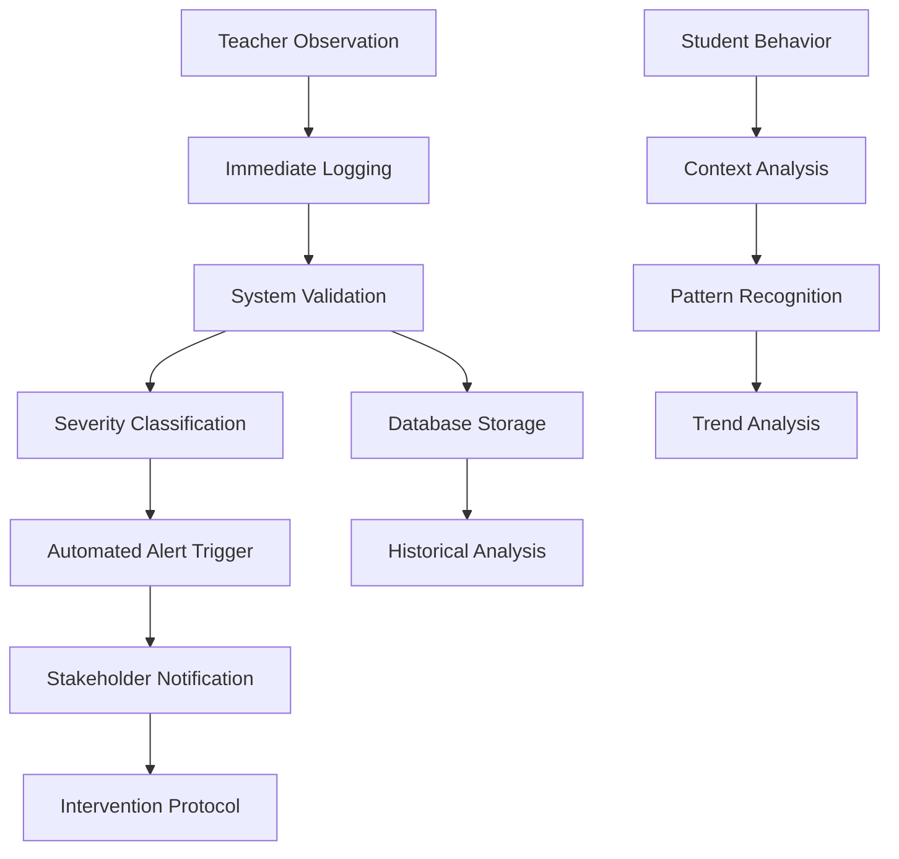
```mermaid
flowchart TD
Observation[Teacher Observation] --> ImmediateLogging[Immediate Logging]
ImmediateLogging --> SystemValidation[System Validation]
SystemValidation --> SeverityClassification[Severity Classification]
SeverityClassification --> AutomatedAlert[Automated Alert Trigger]
StudentBehavior[Student Behavior] --> ContextAnalysis[Context Analysis]
ContextAnalysis --> PatternRecognition[Pattern Recognition]
PatternRecognition --> TrendAnalysis[Trend Analysis]
SystemValidation --> DatabaseStorage[Database Storage]
AutomatedAlert --> StakeholderNotification[Stakeholder Notification]
DatabaseStorage --> HistoricalAnalysis[Historical Analysis]
StakeholderNotification --> InterventionProtocol[Intervention Protocol]
```

**Diagram sources**
- [public/assets/js/student.js](file://public/assets/js/student.js#L39-L127)

#### Multi-Source Data Integration

The system integrates data from multiple sources for comprehensive analysis:

| Data Source | Collection Method | Analysis Type | Frequency |
|-------------|-------------------|---------------|-----------|
| **Teacher Reports** | Manual logging via portal | Descriptive analysis | Real-time |
| **Student Self-Reports** | Digital surveys | Qualitative analysis | Weekly |
| **Parent Feedback** | Email/SMS surveys | Sentiment analysis | Monthly |
| **Administrative Records** | System integration | Quantitative analysis | Daily |
| **Academic Performance** | Grade tracking | Correlation analysis | Weekly |

### Trend Analysis and Predictive Modeling

The system implements advanced analytics for behavior trend identification:

#### Behavioral Pattern Recognition

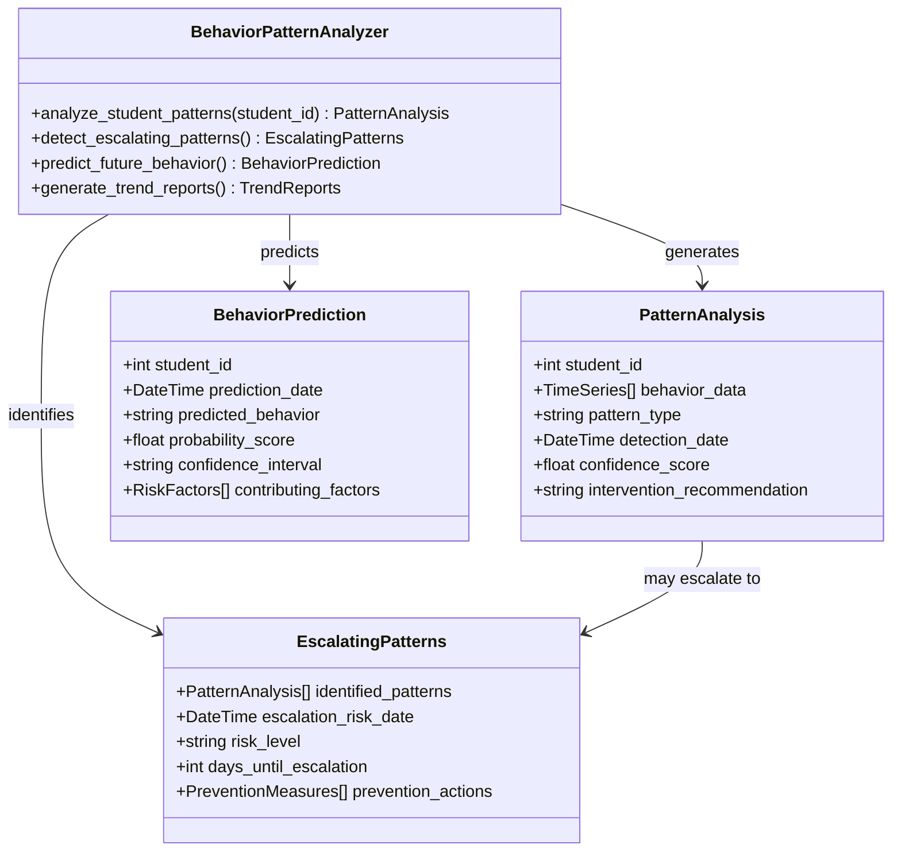
```mermaid
classDiagram
class BehaviorPatternAnalyzer {
+analyze_student_patterns(student_id) PatternAnalysis
+detect_escalating_patterns() EscalatingPatterns
+predict_future_behavior() BehaviorPrediction
+generate_trend_reports() TrendReports
}
class PatternAnalysis {
+int student_id
+TimeSeries[] behavior_data
+string pattern_type
+DateTime detection_date
+float confidence_score
+string intervention_recommendation
}
class EscalatingPatterns {
+PatternAnalysis[] identified_patterns
+DateTime escalation_risk_date
+string risk_level
+int days_until_escalation
+PreventionMeasures[] prevention_actions
}
class BehaviorPrediction {
+int student_id
+DateTime prediction_date
+string predicted_behavior
+float probability_score
+string confidence_interval
+RiskFactors[] contributing_factors
}
BehaviorPatternAnalyzer --> PatternAnalysis : generates
BehaviorPatternAnalyzer --> EscalatingPatterns : identifies
BehaviorPatternAnalyzer --> BehaviorPrediction : predicts
PatternAnalysis --> EscalatingPatterns : may escalate to
```

**Diagram sources**
- [public/assets/js/student.js](file://public/assets/js/student.js#L132-L516)

**Section sources**
- [public/assets/js/student.js](file://public/assets/js/student.js#L39-L127)
- [public/assets/js/student.js](file://public/assets/js/student.js#L132-L516)

## Reporting and Administration

### Administrative Dashboards

The administrative system provides comprehensive reporting capabilities for behavioral monitoring:

#### System-wide Behavioral Analytics

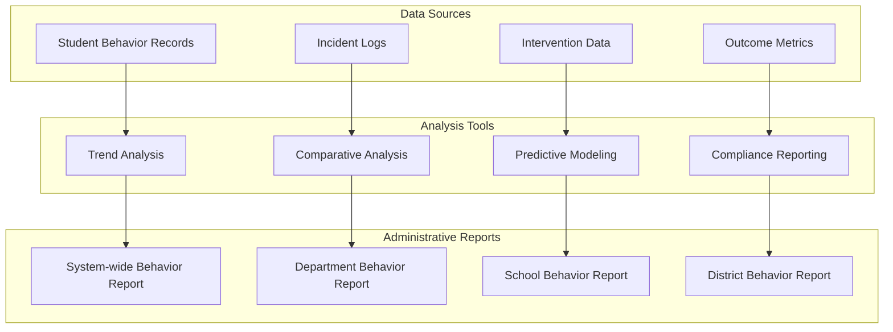
```mermaid
graph TB
subgraph "Administrative Reports"
SystemReport[System-wide Behavior Report]
DepartmentReport[Department Behavior Report]
SchoolReport[School Behavior Report]
DistrictReport[District Behavior Report]
end
subgraph "Data Sources"
StudentRecords[Student Behavior Records]
IncidentLogs[Incident Logs]
InterventionData[Intervention Data]
OutcomeMetrics[Outcome Metrics]
end
subgraph "Analysis Tools"
TrendAnalysis[Trend Analysis]
ComparativeAnalysis[Comparative Analysis]
PredictiveModeling[Predictive Modeling]
ComplianceReporting[Compliance Reporting]
end
StudentRecords --> TrendAnalysis
IncidentLogs --> ComparativeAnalysis
InterventionData --> PredictiveModeling
OutcomeMetrics --> ComplianceReporting
TrendAnalysis --> SystemReport
ComparativeAnalysis --> DepartmentReport
PredictiveModeling --> SchoolReport
ComplianceReporting --> DistrictReport
```

**Diagram sources**
- [public/admin-dashboard.html](file://public/admin-dashboard.html#L1-L174)
- [public/school-dashboard.html](file://public/school-dashboard.html#L288-L394)

#### Customizable Report Generation

The system allows administrators to create customized reports based on specific criteria:

| Report Type | Customizable Parameters | Frequency | Distribution |
|-------------|-------------------------|-----------|--------------|
| **Incident Reports** | Date range, severity level, location, involved parties | Daily/Weekly/Monthly | Administrators, Teachers, Parents |
| **Trend Analysis** | Time period, grade level, behavior category, comparison groups | Monthly/Quarterly | Administrators, Board Members |
| **Intervention Effectiveness** | Intervention type, time period, outcome measures | Quarterly | Administrators, Researchers |
| **Compliance Reports** | Regulatory requirements, reporting standards, audit trails | Annually | District Office, State Department |

### Compliance and Privacy Management

The system ensures compliance with educational privacy regulations:

#### Data Protection Measures

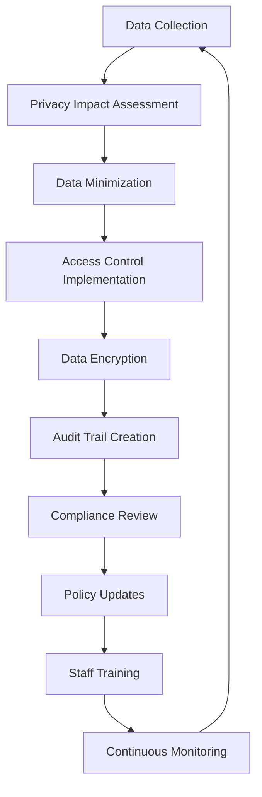
```mermaid
flowchart TD
DataCollection[Data Collection] --> PrivacyImpact[Privacy Impact Assessment]
PrivacyImpact --> DataMinimization[Data Minimization]
DataMinimization --> AccessControl[Access Control Implementation]
AccessControl --> Encryption[Data Encryption]
Encryption --> AuditTrail[Audit Trail Creation]
AuditTrail --> ComplianceReview[Compliance Review]
ComplianceReview --> PolicyUpdate[Policy Updates]
PolicyUpdate --> Training[Staff Training]
Training --> ContinuousMonitoring[Continuous Monitoring]
ContinuousMonitoring --> DataCollection
```

**Diagram sources**
- [auth.py](file://auth.py#L14-L35)
- [server.py](file://server.py#L91-L108)

**Section sources**
- [public/admin-dashboard.html](file://public/admin-dashboard.html#L1-L174)
- [public/school-dashboard.html](file://public/school-dashboard.html#L288-L394)
- [auth.py](file://auth.py#L14-L35)

## Implementation Examples

### Scenario 1: Academic Dishonesty Incident

**Incident Details:**
- Student: Ahmed Mohamed (Grade 10)
- Incident: Plagiarism in Mathematics Assignment
- Severity: 8/10
- Date: 2024-01-15

**Response Workflow:**

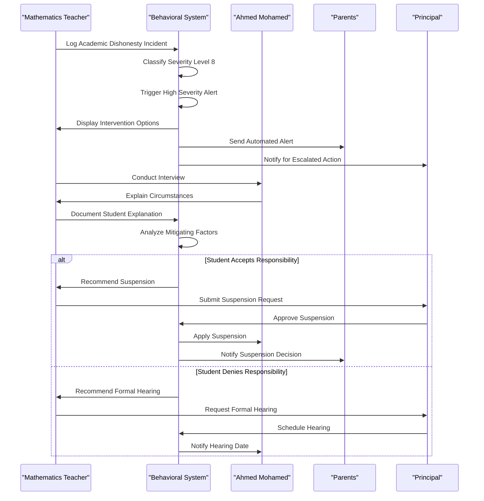
```mermaid
sequenceDiagram
participant Teacher as "Mathematics Teacher"
participant System as "Behavioral System"
participant Student as "Ahmed Mohamed"
participant Parents as "Parents"
participant Principal as "Principal"
Teacher->>System : Log Academic Dishonesty Incident
System->>System : Classify Severity Level 8
System->>System : Trigger High Severity Alert
System->>Teacher : Display Intervention Options
System->>Parents : Send Automated Alert
System->>Principal : Notify for Escalated Action
Teacher->>Student : Conduct Interview
Student->>Teacher : Explain Circumstances
Teacher->>System : Document Student Explanation
System->>System : Analyze Mitigating Factors
alt Student Accepts Responsibility
System->>Teacher : Recommend Suspension
Teacher->>Principal : Submit Suspension Request
Principal->>System : Approve Suspension
System->>Student : Apply Suspension
System->>Parents : Notify Suspension Decision
else Student Denies Responsibility
System->>Teacher : Recommend Formal Hearing
Teacher->>Principal : Request Formal Hearing
Principal->>System : Schedule Hearing
System->>Student : Notify Hearing Date
end
```

**Diagram sources**
- [server.py](file://server.py#L141-L562)
- [public/assets/js/student.js](file://public/assets/js/student.js#L39-L127)

### Scenario 2: Bullying Incident

**Incident Details:**
- Student: Fatima Ali (Grade 7)
- Incident: Verbal and Physical Bullying
- Severity: 9/10
- Date: 2024-01-16

**Response Workflow:**

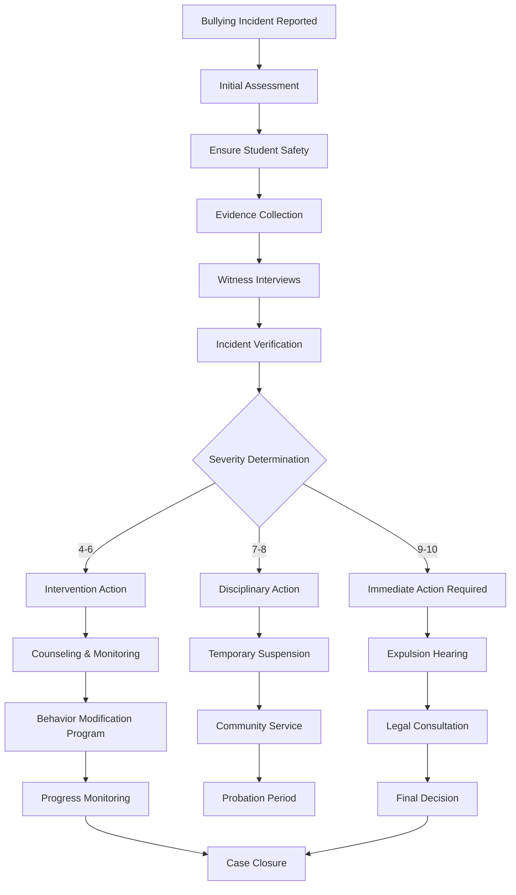
```mermaid
flowchart TD
IncidentReport[Bullying Incident Reported] --> InitialAssessment[Initial Assessment]
InitialAssessment --> SafetyFirst[Ensure Student Safety]
SafetyFirst --> EvidenceCollection[Evidence Collection]
EvidenceCollection --> WitnessInterview[Witness Interviews]
WitnessInterview --> IncidentVerification[Incident Verification]
IncidentVerification --> SeverityDetermination{Severity Determination}
SeverityDetermination --> |9-10| ImmediateAction[Immediate Action Required]
SeverityDetermination --> |7-8| DisciplinaryAction[Disciplinary Action]
SeverityDetermination --> |4-6| InterventionAction[Intervention Action]
ImmediateAction --> ExpulsionHearing[Expulsion Hearing]
DisciplinaryAction --> Suspension[Temporary Suspension]
InterventionAction --> Counseling[Counseling & Monitoring]
ExpulsionHearing --> LegalConsultation[Legal Consultation]
LegalConsultation --> FinalDecision[Final Decision]
Suspension --> CommunityService[Community Service]
CommunityService --> Probation[Probation Period]
Counseling --> BehaviorModification[Behavior Modification Program]
BehaviorModification --> ProgressMonitoring[Progress Monitoring]
ProgressMonitoring --> CaseClosure[Case Closure]
FinalDecision --> CaseClosure
```

**Diagram sources**
- [public/assets/js/student.js](file://public/assets/js/student.js#L132-L516)

### Scenario 3: Academic Struggling Student

**Student Profile:**
- Student: Khalid Hassan (Grade 9)
- Current Behavior: Frequent lateness, disruptive behavior
- Academic Performance: Below grade level
- Family Situation: Recent parental divorce

**Intervention Strategy:**

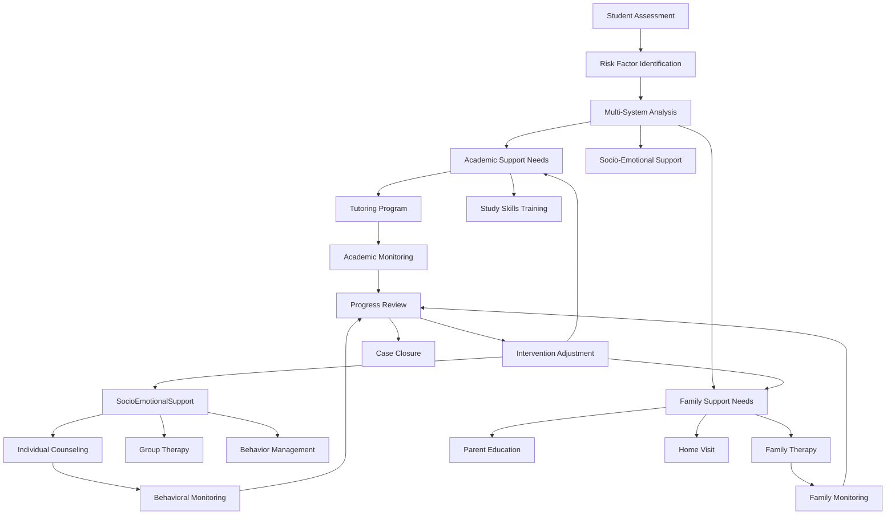
```mermaid
flowchart TD
StudentAssessment[Student Assessment] --> RiskFactorIdentification[Risk Factor Identification]
RiskFactorIdentification --> MultiSystemAnalysis[Multi-System Analysis]
MultiSystemAnalysis --> AcademicSupport[Academic Support Needs]
MultiSystemAnalysis --> SocialEmotionalSupport[Socio-Emotional Support]
MultiSystemAnalysis --> FamilySupport[Family Support Needs]
AcademicSupport --> TutoringProgram[Tutoring Program]
AcademicSupport --> StudySkillsTraining[Study Skills Training]
SocioEmotionalSupport --> IndividualCounseling[Individual Counseling]
SocioEmotionalSupport --> GroupTherapy[Group Therapy]
SocioEmotionalSupport --> BehaviorManagement[Behavior Management]
FamilySupport --> FamilyTherapy[Family Therapy]
FamilySupport --> ParentEducation[Parent Education]
FamilySupport --> HomeVisit[Home Visit]
TutoringProgram --> AcademicMonitoring[Academic Monitoring]
IndividualCounseling --> BehavioralMonitoring[Behavioral Monitoring]
FamilyTherapy --> FamilyMonitoring[Family Monitoring]
AcademicMonitoring --> ProgressReview[Progress Review]
BehavioralMonitoring --> ProgressReview
FamilyMonitoring --> ProgressReview
ProgressReview --> InterventionAdjustment[Intervention Adjustment]
ProgressReview --> CaseClosure[Case Closure]
InterventionAdjustment --> AcademicSupport
InterventionAdjustment --> SocioEmotionalSupport
InterventionAdjustment --> FamilySupport
```

**Diagram sources**
- [public/assets/js/student.js](file://public/assets/js/student.js#L132-L516)

**Section sources**
- [server.py](file://server.py#L141-L562)
- [public/assets/js/student.js](file://public/assets/js/student.js#L39-L127)
- [public/assets/js/student.js](file://public/assets/js/student.js#L132-L516)

## Performance Considerations

### Scalability and Performance Optimization

The behavioral monitoring system is designed for scalability and optimal performance:

#### Database Optimization Strategies

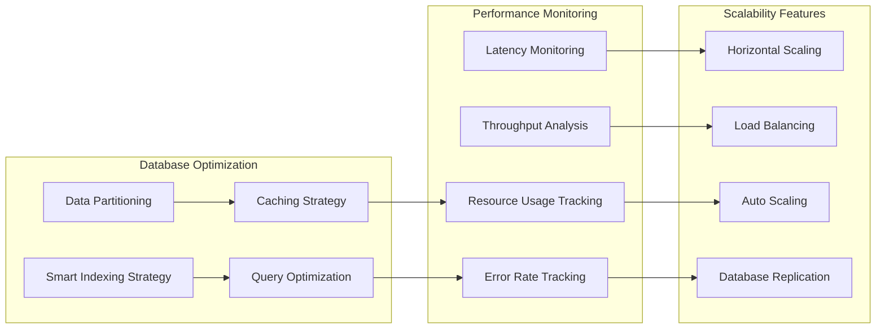
```mermaid
graph LR
subgraph "Database Optimization"
Indexing[Smart Indexing Strategy]
Partitioning[Data Partitioning]
Caching[Caching Strategy]
QueryOptimization[Query Optimization]
end
subgraph "Performance Monitoring"
Latency[Latency Monitoring]
Throughput[Throughput Analysis]
ResourceUsage[Resource Usage Tracking]
ErrorRate[Error Rate Tracking]
end
subgraph "Scalability Features"
HorizontalScaling[Horizontal Scaling]
LoadBalancing[Load Balancing]
AutoScaling[Auto Scaling]
DatabaseReplication[Database Replication]
end
Indexing --> QueryOptimization
Partitioning --> Caching
Caching --> ResourceUsage
QueryOptimization --> ErrorRate
Latency --> HorizontalScaling
Throughput --> LoadBalancing
ResourceUsage --> AutoScaling
ErrorRate --> DatabaseReplication
```

**Diagram sources**
- [database.py](file://database.py#L88-L118)
- [server.py](file://server.py#L27-L51)

#### Real-Time Processing Capabilities

The system supports real-time behavioral monitoring and alert processing:

| Feature | Performance Metric | Optimization Strategy |
|---------|-------------------|----------------------|
| **Real-time Alerts** | < 2 second latency | Asynchronous processing, message queues |
| **Behavior Analysis** | Batch processing within 5 minutes | Optimized algorithms, parallel processing |
| **Data Import** | 10,000+ records/minute | Bulk insert operations, transaction batching |
| **Report Generation** | < 30 seconds for 1000+ students | Pre-computed aggregates, caching |
| **User Interface** | Responsive loading under 1 second | Lazy loading, CDN optimization |

### Security and Privacy Considerations

The system implements comprehensive security measures for behavioral data protection:

#### Data Security Measures

```mermaid
flowchart TD
DataIngestion[Data Ingestion] --> DataValidation[Data Validation]
DataValidation --> DataEncryption[Data Encryption]
DataEncryption --> AccessControl[Access Control]
AccessControl --> AuditLogging[Audit Logging]
AuditLogging --> ComplianceMonitoring[Compliance Monitoring]
DataIngestion --> PrivacyMasking[Privacy Masking]
PrivacyMasking --> Anonymization[Anonymization]
Anonymization --> SecureStorage[Secure Storage]
SecureStorage --> AccessControl
ComplianceMonitoring --> RegularAudits[Regular Audits]
RegularAudits --> PolicyUpdates[Policy Updates]
PolicyUpdates --> StaffTraining[Staff Training]
StaffTraining --> ComplianceMonitoring
```

**Diagram sources**
- [auth.py](file://auth.py#L14-L35)
- [server.py](file://server.py#L91-L108)

**Section sources**
- [database.py](file://database.py#L88-L118)
- [server.py](file://server.py#L27-L51)
- [auth.py](file://auth.py#L14-L35)

## Troubleshooting Guide

### Common Issues and Solutions

#### Database Connection Problems

**Issue:** Unable to connect to database for behavioral data
**Solution:** Check database configuration and connection pool settings

**Issue:** Slow performance with large behavioral datasets
**Solution:** Implement proper indexing and optimize queries

#### Authentication and Authorization Issues

**Issue:** Users unable to access behavioral monitoring features
**Solution:** Verify JWT token validation and role-based permissions

**Issue:** Permission errors when accessing student records
**Solution:** Check user role assignments and school-level permissions

#### Data Integrity Problems

**Issue:** Inconsistent behavior data across different portals
**Solution:** Implement data synchronization and validation rules

**Issue:** Missing behavioral records after system updates
**Solution:** Verify database migration scripts and backup restoration

### System Monitoring and Maintenance

#### Performance Monitoring

The system includes comprehensive monitoring capabilities:

```mermaid
graph TB
subgraph "System Health Monitoring"
DatabaseHealth[Database Health]
APIPerformance[API Performance]
UserActivity[User Activity]
SystemResources[System Resources]
end
subgraph "Alerting System"
PerformanceAlerts[Performance Alerts]
ErrorAlerts[Error Alerts]
SecurityAlerts[Security Alerts]
ComplianceAlerts[Compliance Alerts]
end
subgraph "Maintenance Tools"
BackupTools[Backup Tools]
LogAnalysis[Log Analysis]
PerformanceTuning[Performance Tuning]
SecurityAudits[Security Audits]
end
DatabaseHealth --> PerformanceAlerts
APIPerformance --> ErrorAlerts
UserActivity --> SecurityAlerts
SystemResources --> ComplianceAlerts
PerformanceAlerts --> MaintenanceTools
ErrorAlerts --> MaintenanceTools
SecurityAlerts --> MaintenanceTools
ComplianceAlerts --> MaintenanceTools
```

**Diagram sources**
- [server.py](file://server.py#L110-L139)
- [database.py](file://database.py#L120-L338)

**Section sources**
- [server.py](file://server.py#L110-L139)
- [database.py](file://database.py#L120-L338)

## Conclusion

The behavioral monitoring system integrated with EduFlow provides a comprehensive solution for tracking student conduct, managing disciplinary records, and implementing automated behavioral alerts. The system's modular architecture ensures seamless integration with existing educational management workflows while maintaining data security and privacy compliance.

Key benefits of the implemented system include:

- **Comprehensive Behavior Tracking:** Multi-source data collection with real-time monitoring capabilities
- **Intelligent Alert System:** Automated notifications based on behavioral patterns and severity levels
- **Structured Intervention Protocols:** Tiered intervention approaches with clear documentation requirements
- **Advanced Analytics:** Trend analysis and predictive modeling for early intervention
- **Seamless Integration:** Compatibility with existing teacher, student, and administrative portals
- **Scalable Architecture:** Database optimization and performance monitoring for growing school systems

The system successfully addresses the core requirements for behavioral monitoring while maintaining the high standards of the EduFlow platform. Future enhancements could include AI-powered behavioral prediction models, expanded integration with external support services, and enhanced mobile accessibility for real-time behavior reporting.