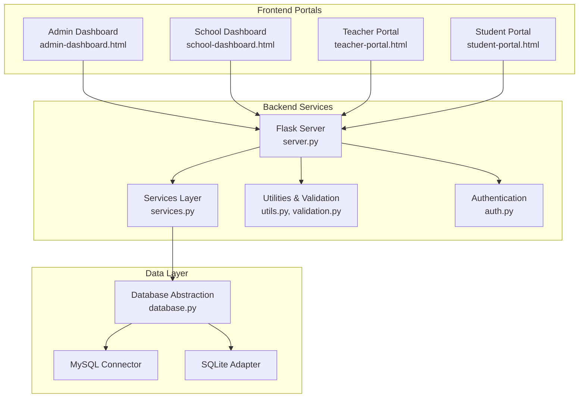
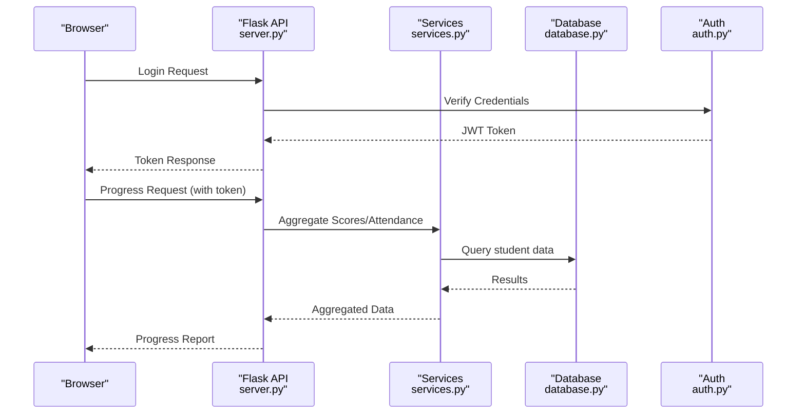
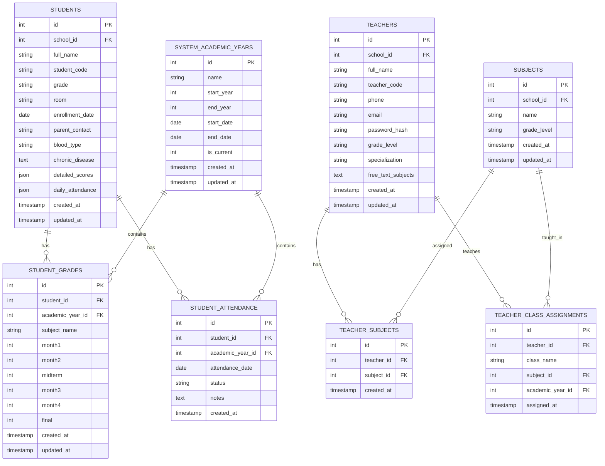
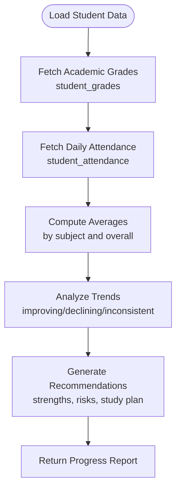
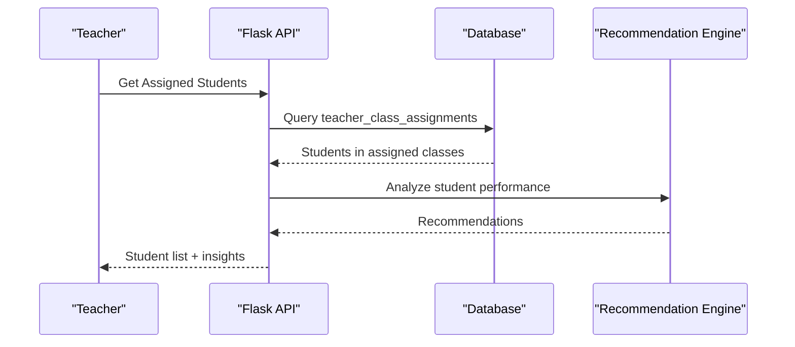
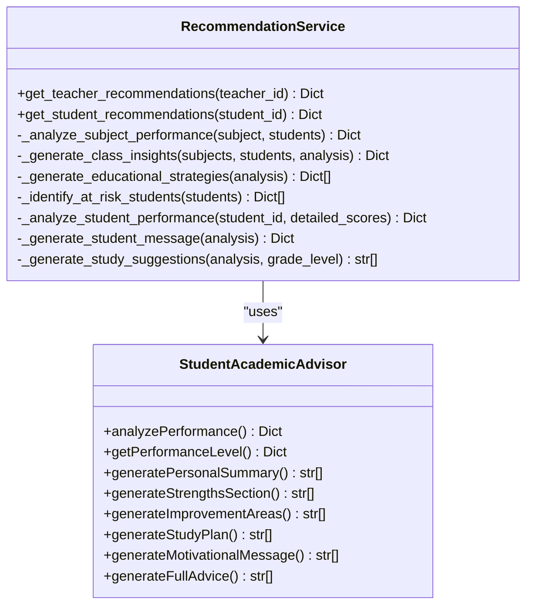
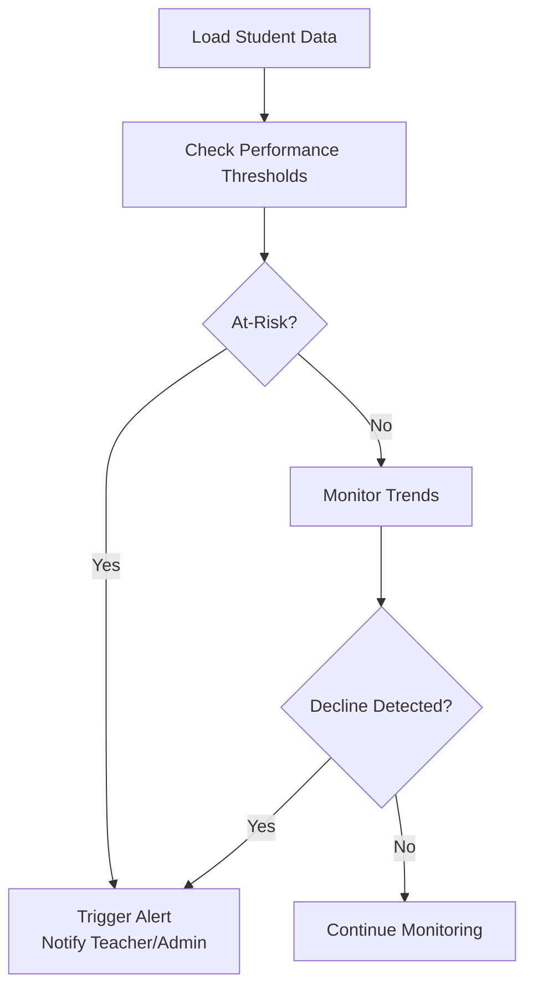
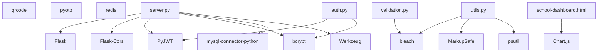

# Student Progress Monitoring Workflows

<cite>
**Referenced Files in This Document**
- [README.md](file://README.md)
- [server.py](file://server.py)
- [database.py](file://database.py)
- [services.py](file://services.py)
- [utils.py](file://utils.py)
- [validation.py](file://validation.py)
- [auth.py](file://auth.py)
- [public/teacher-portal.html](file://public/teacher-portal.html)
- [public/school-dashboard.html](file://public/school-dashboard.html)
- [public/student-portal.html](file://public/student-portal.html)
- [public/admin-dashboard.html](file://public/admin-dashboard.html)
- [requirements.txt](file://requirements.txt)
</cite>

## Table of Contents
1. [Introduction](#introduction)
2. [Project Structure](#project-structure)
3. [Core Components](#core-components)
4. [Architecture Overview](#architecture-overview)
5. [Detailed Component Analysis](#detailed-component-analysis)
6. [Dependency Analysis](#dependency-analysis)
7. [Performance Considerations](#performance-considerations)
8. [Troubleshooting Guide](#troubleshooting-guide)
9. [Conclusion](#conclusion)

## Introduction
This document describes the student progress monitoring workflows implemented in the EduFlow Python school management system. It covers attendance tracking, behavioral monitoring, academic performance evaluation, teacher-student supervision responsibilities, class management integration, progress reporting mechanisms, automated alerts, and real-time updates. The system integrates grading systems, attendance tracking, and provides performance analytics dashboards for administrators, schools, teachers, and students.

## Project Structure
The project follows a layered architecture:
- Backend API built with Flask
- Database abstraction supporting both MySQL and SQLite
- Service layer encapsulating business logic
- Frontend dashboards for admin, school, teacher, and student portals
- Utility and validation modules for data integrity and security

**Diagram sources**
- [server.py](file://server.py#L1-L120)
- [database.py](file://database.py#L88-L120)
- [services.py](file://services.py#L1-L40)
- [utils.py](file://utils.py#L1-L40)
- [validation.py](file://validation.py#L1-L40)
- [auth.py](file://auth.py#L1-L40)
- [public/admin-dashboard.html](file://public/admin-dashboard.html#L1-L40)
- [public/school-dashboard.html](file://public/school-dashboard.html#L1-L40)
- [public/teacher-portal.html](file://public/teacher-portal.html#L1-L40)
- [public/student-portal.html](file://public/student-portal.html#L1-L40)

**Section sources**
- [README.md](file://README.md#L1-L23)
- [requirements.txt](file://requirements.txt#L1-L14)

## Core Components
- Flask server with CORS and JWT-based authentication
- Database abstraction with MySQL connector and SQLite fallback
- Service layer for business logic (recommendations, student/teacher operations)
- Utilities for validation, sanitization, and response formatting
- Validation framework for robust input checks
- Authentication middleware with token management
- Frontend dashboards for admin, school, teacher, and student with integrated analytics

Key capabilities:
- Student profile management with detailed scores and daily attendance JSON fields
- Academic year management and centralized academic year table
- Teacher subject and class assignment tracking
- Performance analytics and recommendations engine
- Real-time progress reporting and trend analysis

**Section sources**
- [server.py](file://server.py#L1-L120)
- [database.py](file://database.py#L120-L338)
- [services.py](file://services.py#L367-L474)
- [utils.py](file://utils.py#L27-L120)
- [validation.py](file://validation.py#L203-L262)
- [auth.py](file://auth.py#L14-L68)

## Architecture Overview
The system separates concerns across layers:
- Presentation: HTML/CSS/JS dashboards
- API: Flask routes handling CRUD operations and analytics
- Business Logic: Services encapsulate recommendation and aggregation logic
- Data Access: Database abstraction with connection pooling/fallback
- Security: JWT tokens, rate limiting, input sanitization

**Diagram sources**
- [server.py](file://server.py#L142-L200)
- [auth.py](file://auth.py#L36-L128)
- [services.py](file://services.py#L367-L474)
- [database.py](file://database.py#L120-L177)

## Detailed Component Analysis

### Database Schema and Data Models
The system maintains normalized tables with JSON fields for flexible data storage:
- Students: detailed_scores JSON, daily_attendance JSON
- Academic years: centralized system_academic_years
- Teacher assignments: teacher_subjects and teacher_class_assignments
- Subjects and grade levels for school-specific organization

**Diagram sources**
- [database.py](file://database.py#L159-L320)

**Section sources**
- [database.py](file://database.py#L159-L320)

### Student Progress Data Aggregation
The system aggregates progress data from multiple sources:
- Academic grades across periods (monthly, midterm, final)
- Daily attendance records
- Behavioral indicators via attendance statuses and notes
- Performance trends and recommendations

**Diagram sources**
- [services.py](file://services.py#L476-L546)
- [services.py](file://services.py#L701-L765)
- [public/student-portal.html](file://public/student-portal.html#L280-L550)

**Section sources**
- [services.py](file://services.py#L476-L546)
- [services.py](file://services.py#L701-L765)
- [public/student-portal.html](file://public/student-portal.html#L280-L550)

### Teacher-Student Supervision and Class Management
Teachers supervise students within their assigned subjects and classes:
- Subject assignment via teacher_subjects
- Class assignment via teacher_class_assignments
- Access to student profiles, grades, and attendance
- Recommendations for at-risk students

**Diagram sources**
- [database.py](file://database.py#L509-L550)
- [services.py](file://services.py#L367-L430)

**Section sources**
- [database.py](file://database.py#L509-L550)
- [services.py](file://services.py#L367-L430)

### Progress Reporting Mechanisms
Progress reports aggregate grade data, attendance records, and behavioral indicators:
- Subject-wise averages and pass rates
- Overall class performance metrics
- Individual student performance insights
- Automated recommendations for improvement

**Diagram sources**
- [services.py](file://services.py#L367-L858)
- [public/student-portal.html](file://public/student-portal.html#L280-L550)

**Section sources**
- [services.py](file://services.py#L367-L858)
- [public/student-portal.html](file://public/student-portal.html#L280-L550)

### Automated Alerts and Notifications
The system provides mechanisms for automated progress alerts:
- Threshold-based warnings for at-risk students
- Trend-based alerts for declining performance
- Recommendations for intervention strategies
- Export capabilities for administrative oversight

**Diagram sources**
- [services.py](file://services.py#L657-L699)
- [public/student-portal.html](file://public/student-portal.html#L556-L713)

**Section sources**
- [services.py](file://services.py#L657-L699)
- [public/student-portal.html](file://public/student-portal.html#L556-L713)

### Typical Monitoring Scenarios
Common workflows:
- Daily attendance entry and automatic aggregation
- Periodic grade updates with trend analysis
- Behavioral monitoring via attendance statuses
- Teacher recommendations for at-risk students
- School-level analytics dashboards
- Student self-monitoring and personalized recommendations

**Section sources**
- [server.py](file://server.py#L683-L766)
- [public/teacher-portal.html](file://public/teacher-portal.html#L520-L533)
- [public/school-dashboard.html](file://public/school-dashboard.html#L310-L377)
- [public/student-portal.html](file://public/student-portal.html#L48-L125)

## Dependency Analysis
External dependencies include Flask, MySQL connector, bcrypt, PyJWT, and Chart.js for frontend analytics.

**Diagram sources**
- [requirements.txt](file://requirements.txt#L1-L14)

**Section sources**
- [requirements.txt](file://requirements.txt#L1-L14)

## Performance Considerations
- Database connection pooling for MySQL with SQLite fallback
- JSON field handling for flexible student data storage
- Caching layer integration points
- Efficient aggregation queries for performance analytics
- Frontend chart rendering with Chart.js for real-time dashboards

## Troubleshooting Guide
Common issues and resolutions:
- Database connectivity: Verify MySQL host/port/user/password environment variables
- Authentication failures: Check JWT secret and token validity
- Input validation errors: Review validation rules and error messages
- Performance bottlenecks: Monitor query execution and consider indexing strategies

**Section sources**
- [server.py](file://server.py#L110-L139)
- [utils.py](file://utils.py#L19-L78)
- [validation.py](file://validation.py#L174-L202)

## Conclusion
EduFlow provides a comprehensive student progress monitoring solution with integrated attendance tracking, behavioral monitoring, and academic performance evaluation. The system supports teacher-student supervision, class management, real-time progress reporting, automated alerts, and performance analytics dashboards. Its modular architecture enables scalability and maintainability while ensuring data integrity and security.