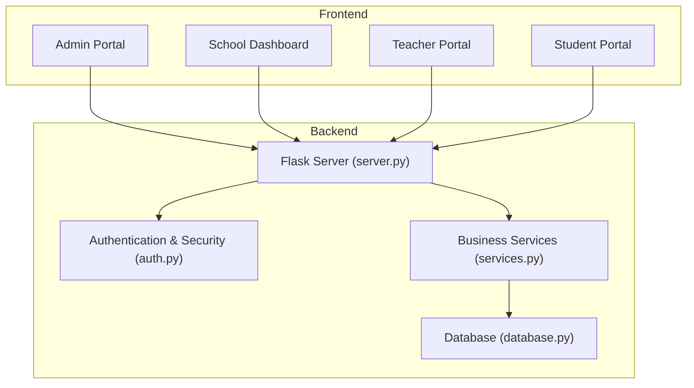
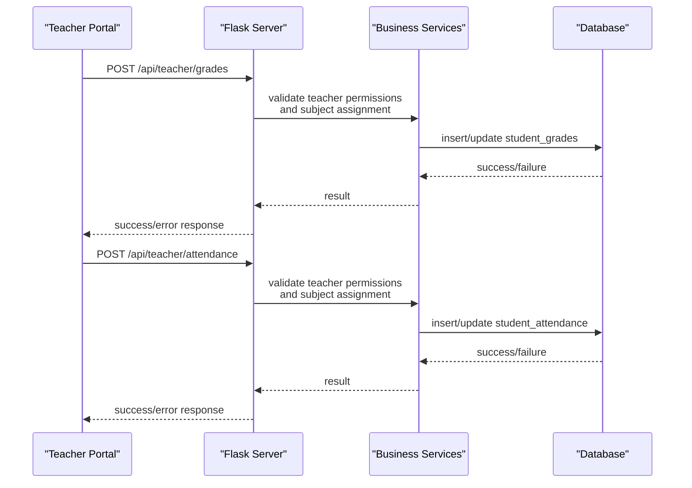
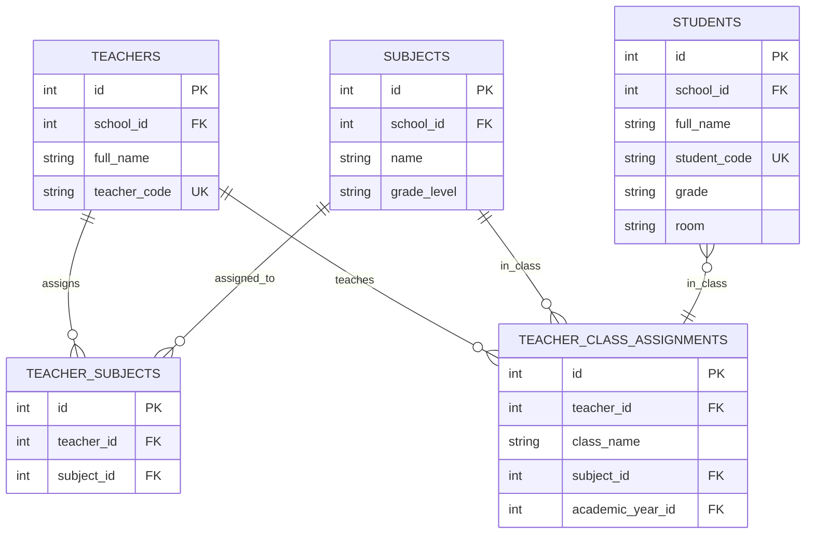
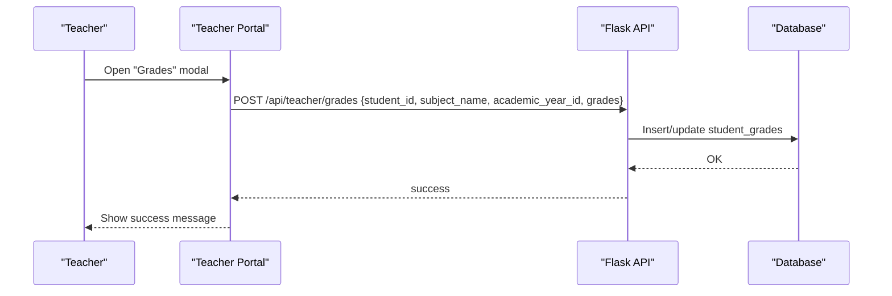
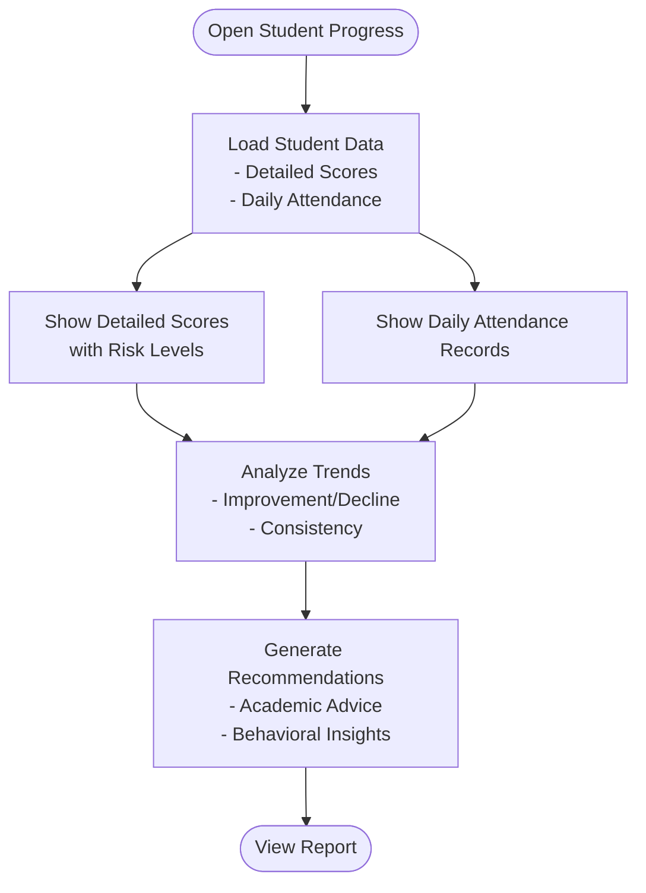
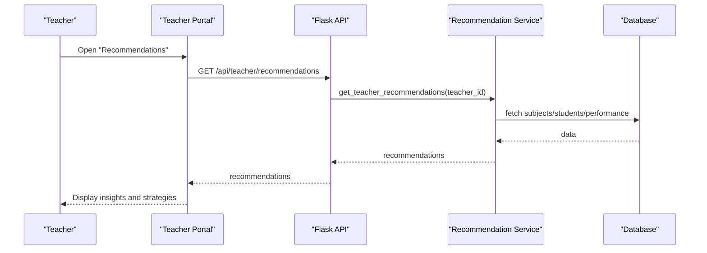
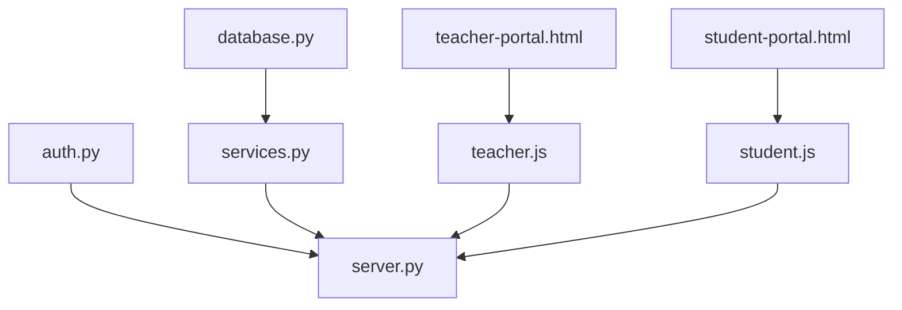

# Student-Teacher Interaction Workflows

<cite>
**Referenced Files in This Document**
- [server.py](file://server.py)
- [database.py](file://database.py)
- [services.py](file://services.py)
- [auth.py](file://auth.py)
- [teacher.js](file://public/assets/js/teacher.js)
- [teacher-portal-enhanced.js](file://public/assets/js/teacher-portal-enhanced.js)
- [student.js](file://public/assets/js/student.js)
- [teacher-recommendations.js](file://public/assets/js/teacher-recommendations.js)
- [student-portal.html](file://public/student-portal.html)
- [school.js](file://public/assets/js/school.js)
- [teacher-portal.html](file://public/teacher-portal.html)
- [school-dashboard.html](file://public/school-dashboard.html)
</cite>

## Table of Contents
1. [Introduction](#introduction)
2. [Project Structure](#project-structure)
3. [Core Components](#core-components)
4. [Architecture Overview](#architecture-overview)
5. [Detailed Component Analysis](#detailed-component-analysis)
6. [Dependency Analysis](#dependency-analysis)
7. [Performance Considerations](#performance-considerations)
8. [Troubleshooting Guide](#troubleshooting-guide)
9. [Conclusion](#conclusion)

## Introduction
This document describes the student-teacher interaction workflows in the EduFlow school management system, focusing on grade entry permissions, student progress monitoring, and academic advising. It explains how teacher-student relationships are mapped through class and subject assignments, documents the grade entry permission model, and outlines progress monitoring workflows for attendance tracking, behavioral monitoring, and academic performance evaluation. It also covers the academic advising system for teacher-student consultation and guidance, with practical examples and integration points with grading systems, attendance tracking, and performance analytics.

## Project Structure
The system is a Python/Flask backend with a MySQL/SQLite database and a frontend composed of HTML pages and JavaScript modules. The backend exposes REST endpoints for authentication, student and teacher management, grade and attendance updates, and recommendation generation. The frontend provides portals for administrators, schools, teachers, and students, each with role-specific views and workflows.

**Diagram sources**
- [server.py](file://server.py#L1-L120)
- [auth.py](file://auth.py#L1-L120)
- [services.py](file://services.py#L1-L120)
- [database.py](file://database.py#L120-L200)

**Section sources**
- [server.py](file://server.py#L1-L120)
- [database.py](file://database.py#L120-L200)

## Core Components
- Authentication and Authorization: JWT-based tokens with role checks and optional authentication support.
- Database Schema: Students, teachers, subjects, teacher-class assignments, academic years, and grade/attendance persistence.
- Business Services: Recommendation engine, academic year management, and CRUD operations.
- Frontend Portals: Teacher portal for grade entry and attendance, student portal for progress viewing, and administrative dashboards.

Key implementation references:
- Authentication and role enforcement: [server.py](file://server.py#L91-L108)
- Database schema for teacher-class assignments and student data: [database.py](file://database.py#L247-L320)
- Recommendation service for teacher insights: [services.py](file://services.py#L367-L474)
- Teacher portal grade entry and attendance workflows: [teacher.js](file://public/assets/js/teacher.js#L571-L738)

**Section sources**
- [server.py](file://server.py#L91-L108)
- [database.py](file://database.py#L247-L320)
- [services.py](file://services.py#L367-L474)
- [teacher.js](file://public/assets/js/teacher.js#L571-L738)

## Architecture Overview
The system enforces teacher-student relationships through subject and class assignments. Teachers can only manage students within their assigned subjects and classes. Grade and attendance entries are persisted to dedicated tables and integrated with recommendation engines for performance analytics.

**Diagram sources**
- [server.py](file://server.py#L1420-L1463)
- [services.py](file://services.py#L367-L474)
- [database.py](file://database.py#L291-L320)

## Detailed Component Analysis

### Teacher-Student Relationship Mapping
Teachers are linked to students through subject and class assignments. The system ensures that:
- Teachers can only view and update students within their assigned subjects.
- Class assignments define which teachers supervise which classes for specific academic years.
- Free-text subjects are supported alongside predefined subjects.

**Diagram sources**
- [database.py](file://database.py#L220-L260)
- [database.py](file://database.py#L467-L507)
- [database.py](file://database.py#L552-L622)

**Section sources**
- [database.py](file://database.py#L220-L260)
- [database.py](file://database.py#L467-L507)
- [database.py](file://database.py#L552-L622)

### Grade Entry Permissions System
Grade entry is controlled by teacher-student relationship mapping:
- Teachers can enter grades for students in their assigned subjects and classes.
- The system validates grade scales based on grade levels (elementary vs. others).
- Grade entry endpoints accept academic year context to ensure proper data attribution.

**Diagram sources**
- [teacher.js](file://public/assets/js/teacher.js#L571-L604)
- [server.py](file://server.py#L1420-L1463)
- [database.py](file://database.py#L291-L307)

**Section sources**
- [teacher.js](file://public/assets/js/teacher.js#L571-L604)
- [server.py](file://server.py#L1420-L1463)
- [database.py](file://database.py#L291-L307)

### Student Progress Monitoring Workflows
Progress monitoring integrates attendance, behavioral indicators, and academic performance:
- Attendance tracking per academic year with daily records.
- Behavioral monitoring through attendance statuses (present, absent, late, excused).
- Academic performance evaluation using detailed scores per subject and periods.

**Diagram sources**
- [student-portal.html](file://public/student-portal.html#L848-L928)
- [student.js](file://public/assets/js/student.js#L132-L1349)
- [database.py](file://database.py#L309-L320)

**Section sources**
- [student-portal.html](file://public/student-portal.html#L848-L928)
- [student.js](file://public/assets/js/student.js#L132-L1349)
- [database.py](file://database.py#L309-L320)

### Academic Advising System
The academic advising system provides:
- Teacher recommendations: subject performance analysis, class insights, strategies, and at-risk students.
- Student academic advisor: personalized performance analysis, trends, and study suggestions.
- Integration with frontend portals for real-time advice presentation.

**Diagram sources**
- [teacher-recommendations.js](file://public/assets/js/teacher-recommendations.js#L1-L42)
- [services.py](file://services.py#L367-L474)
- [server.py](file://server.py#L1455-L1463)

**Section sources**
- [teacher-recommendations.js](file://public/assets/js/teacher-recommendations.js#L1-L42)
- [services.py](file://services.py#L367-L474)
- [server.py](file://server.py#L1455-L1463)

### Typical Interaction Scenarios
- Teacher enters quarterly grades for assigned students:
  - Open subject modal → fill grade inputs → save per student.
  - Validation ensures grade scale compliance by grade level.
- Monitor student attendance and behavioral patterns:
  - Select date → mark presence/absence → record notes.
  - Review trends and risk levels in student portal.
- Receive academic recommendations:
  - Teacher reviews subject performance and suggested strategies.
  - Student receives personalized guidance and study tips.

**Section sources**
- [teacher.js](file://public/assets/js/teacher.js#L466-L738)
- [student-portal.html](file://public/student-portal.html#L848-L928)
- [services.py](file://services.py#L367-L474)

## Dependency Analysis
The backend depends on:
- Authentication middleware for role-based access control.
- Database abstraction supporting both MySQL and SQLite.
- Service layer for business logic and recommendation generation.
- Frontend modules for teacher and student interactions.

**Diagram sources**
- [auth.py](file://auth.py#L216-L290)
- [server.py](file://server.py#L1-L120)
- [services.py](file://services.py#L12-L43)
- [database.py](file://database.py#L88-L118)
- [teacher.js](file://public/assets/js/teacher.js#L1-L17)
- [student.js](file://public/assets/js/student.js#L1-L10)
- [teacher-portal.html](file://public/teacher-portal.html#L1-L50)
- [student-portal.html](file://public/student-portal.html#L1-L50)

**Section sources**
- [auth.py](file://auth.py#L216-L290)
- [server.py](file://server.py#L1-L120)
- [services.py](file://services.py#L12-L43)
- [database.py](file://database.py#L88-L118)
- [teacher.js](file://public/assets/js/teacher.js#L1-L17)
- [student.js](file://public/assets/js/student.js#L1-L10)
- [teacher-portal.html](file://public/teacher-portal.html#L1-L50)
- [student-portal.html](file://public/student-portal.html#L1-L50)

## Performance Considerations
- Caching: The system includes a cache manager setup for potential caching strategies.
- Connection pooling: MySQL connection pooling is configured for efficient database access.
- Pagination and field selection: API optimization utilities are available for reducing payload sizes.
- Recommendation computation: Recommendation service aggregates data and performs analysis client-side and server-side; consider caching computed insights for repeated queries.

[No sources needed since this section provides general guidance]

## Troubleshooting Guide
Common issues and resolutions:
- Authentication failures: Ensure JWT token is present and valid; verify role requirements.
- Grade validation errors: Confirm grade scale matches the student's grade level (0–10 for elementary 1–4, 0–100 otherwise).
- Attendance recording problems: Verify date selection and status values; confirm academic year context.
- Recommendation retrieval: Check teacher subject assignments and student enrollment in matching grade levels.

**Section sources**
- [auth.py](file://auth.py#L70-L104)
- [server.py](file://server.py#L52-L89)
- [teacher.js](file://public/assets/js/teacher.js#L571-L738)
- [services.py](file://services.py#L367-L474)

## Conclusion
The EduFlow system establishes clear teacher-student relationships through subject and class assignments, ensuring secure and accurate grade and attendance management. The integrated recommendation system enhances academic advising, while the student portal provides transparent progress monitoring. The architecture supports scalability via database abstraction and service layer separation, enabling future enhancements to permissions, analytics, and user experiences.