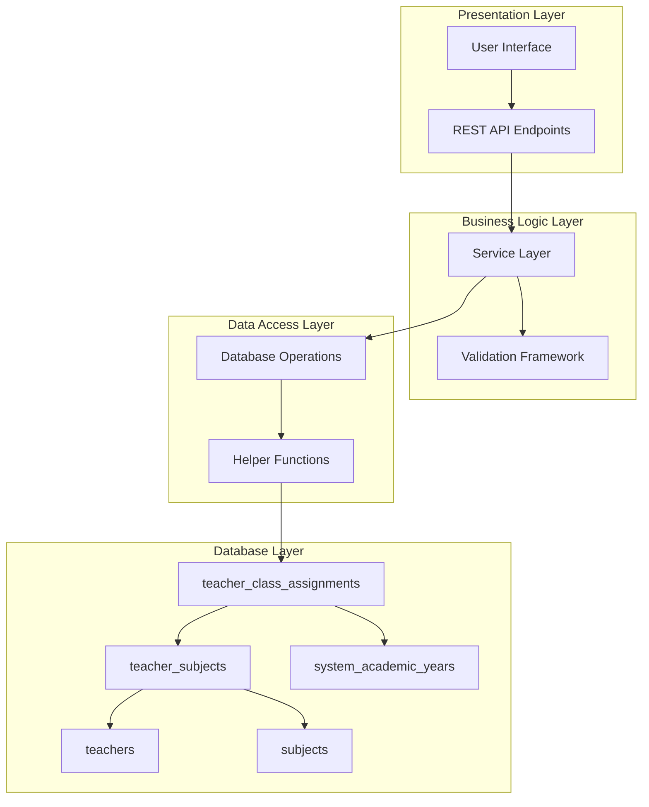
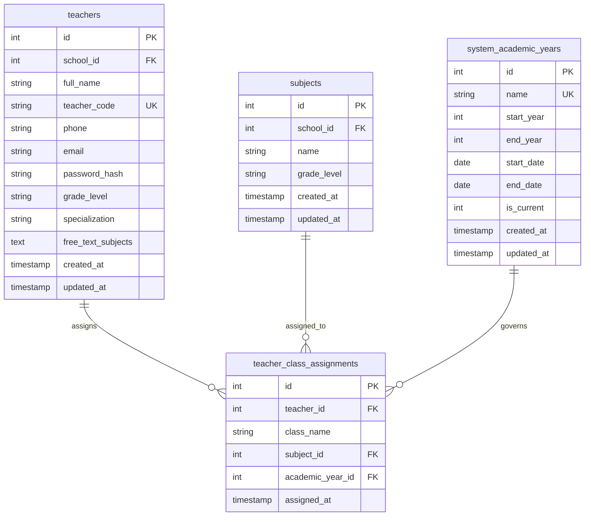
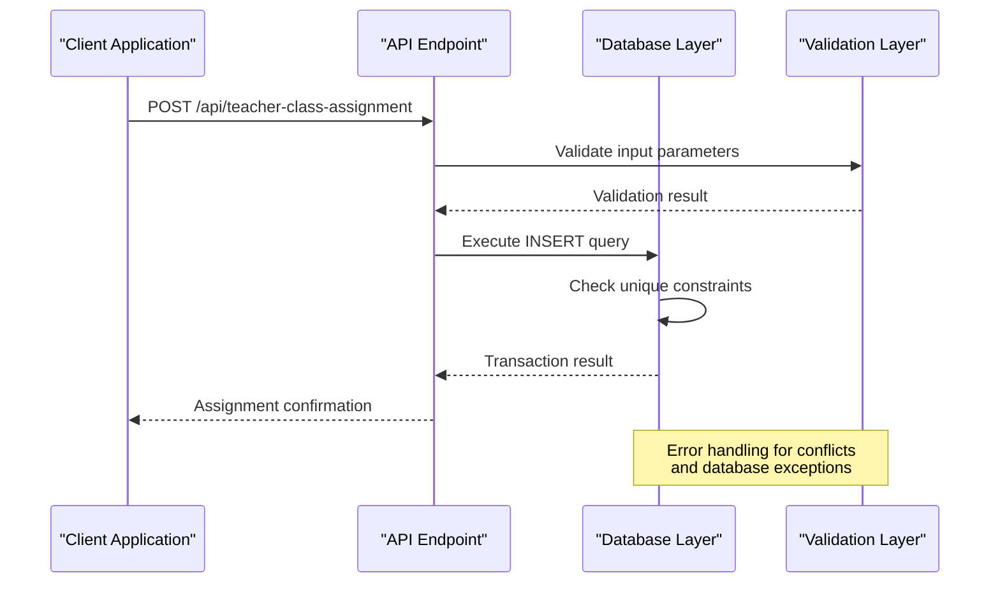
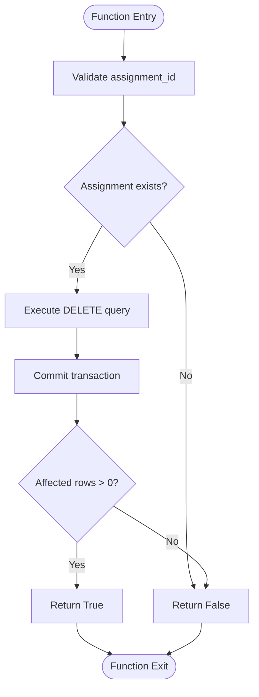
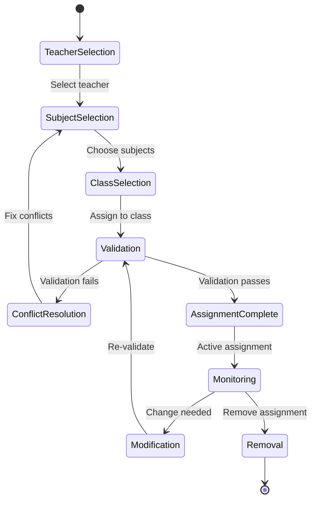
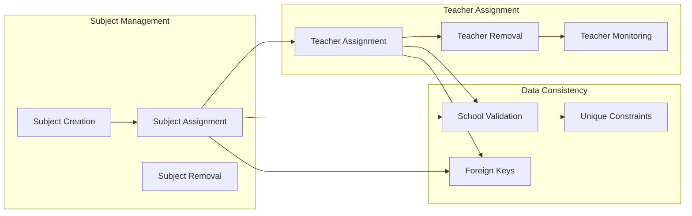
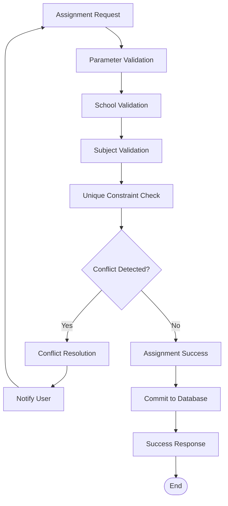

# Teacher Assignment System

<cite>
**Referenced Files in This Document**
- [database.py](file://database.py)
- [server.py](file://server.py)
- [validation.py](file://validation.py)
- [validation_helpers.py](file://validation_helpers.py)
- [database_helpers.py](file://database_helpers.py)
- [TEACHER_CLASS_ASSIGNMENT_IMPLEMENTATION.md](file://TEACHER_CLASS_ASSIGNMENT_IMPLEMENTATION.md)
- [teacher-subject-assignment.js](file://public/assets/js/teacher-subject-assignment.js)
</cite>

## Table of Contents
1. [Introduction](#introduction)
2. [System Architecture](#system-architecture)
3. [Core Components](#core-components)
4. [Teacher-Class Assignment Functions](#teacher-class-assignment-functions)
5. [Database Schema and Relationships](#database-schema-and-relationships)
6. [Workflow Analysis](#workflow-analysis)
7. [Integration with Subject Management](#integration-with-subject-management)
8. [Grade Tracking Integration](#grade-tracking-integration)
9. [Conflict Detection and Resolution](#conflict-detection-and-resolution)
10. [API Endpoints](#api-endpoints)
11. [Performance Considerations](#performance-considerations)
12. [Troubleshooting Guide](#troubleshooting-guide)
13. [Conclusion](#conclusion)

## Introduction

The Teacher Assignment System is a comprehensive solution for managing classroom assignments and subject specializations within an educational institution. This system enables administrators and school staff to efficiently assign teachers to specific classes and subjects, track teacher-student relationships, and maintain accurate academic records.

The system provides robust functionality for:
- Managing teacher-class assignments with academic year tracking
- Maintaining teacher subject specializations
- Tracking teacher-student relationships for grade supervision
- Enforcing data integrity through database constraints
- Providing real-time validation and conflict detection

## System Architecture

The Teacher Assignment System follows a layered architecture pattern with clear separation of concerns:

**Diagram sources**
- [server.py](file://server.py#L1-L800)
- [database.py](file://database.py#L247-L290)

The architecture consists of four main layers:
- **Presentation Layer**: Handles user interface interactions and API requests
- **Business Logic Layer**: Contains service operations and validation logic
- **Data Access Layer**: Manages database operations and helper functions
- **Database Layer**: Stores all assignment data with referential integrity

## Core Components

### Database Layer Components

The system utilizes a relational database design with carefully defined relationships:

**Diagram sources**
- [database.py](file://database.py#L219-L290)

**Section sources**
- [database.py](file://database.py#L219-L290)

### Service Layer Components

The service layer provides business logic operations with proper error handling and transaction management.

**Section sources**
- [server.py](file://server.py#L1-L800)

## Teacher-Class Assignment Functions

### assign_teacher_to_class Function

The `assign_teacher_to_class` function handles the core assignment operation with comprehensive error handling and validation:

**Diagram sources**
- [database.py](file://database.py#L552-L572)
- [server.py](file://server.py#L1-L800)

**Function Implementation Details:**
- **Parameters**: teacher_id, class_name, subject_id, academic_year_id
- **Validation**: Automatic parameter validation through database constraints
- **Persistence**: Atomic transaction with rollback on failure
- **Conflict Detection**: Unique constraint prevents duplicate assignments

**Section sources**
- [database.py](file://database.py#L552-L572)

### remove_teacher_from_class Function

The `remove_teacher_from_class` function provides controlled removal of assignments:

**Diagram sources**
- [database.py](file://database.py#L573-L589)

**Section sources**
- [database.py](file://database.py#L573-L589)

## Database Schema and Relationships

### Core Tables Structure

The system defines several interconnected tables to manage the assignment ecosystem:

**teacher_class_assignments Table:**
- Primary key: auto-incremented ID
- Composite unique constraint: (teacher_id, class_name, subject_id, academic_year_id)
- Foreign key relationships: references teachers, subjects, and system_academic_years
- Timestamp tracking: automatic assignment timestamps

**teachers Table:**
- Teacher identification and personal information
- School association through foreign key
- Specialization tracking for subject areas

**subjects Table:**
- Subject definitions linked to specific schools
- Grade level associations for curriculum alignment

**system_academic_years Table:**
- Centralized academic year management
- Support for multiple schools under unified system
- Current year tracking for active assignments

**Section sources**
- [database.py](file://database.py#L247-L290)

## Workflow Analysis

### Teacher Assignment Workflow

The complete assignment workflow encompasses multiple stages from initial setup to ongoing management:

**Diagram sources**
- [TEACHER_CLASS_ASSIGNMENT_IMPLEMENTATION.md](file://TEACHER_CLASS_ASSIGNMENT_IMPLEMENTATION.md#L47-L78)

### Assignment Persistence Process

The assignment persistence mechanism ensures data integrity through multiple validation layers:

1. **Input Validation**: Parameter validation at API boundary
2. **Business Logic Validation**: Assignment conflict detection
3. **Database Constraints**: Unique constraint enforcement
4. **Transaction Management**: Atomic operation execution
5. **Error Handling**: Comprehensive error reporting and rollback

**Section sources**
- [TEACHER_CLASS_ASSIGNMENT_IMPLEMENTATION.md](file://TEACHER_CLASS_ASSIGNMENT_IMPLEMENTATION.md#L47-L78)

## Integration with Subject Management

### Subject Assignment System

The teacher assignment system integrates seamlessly with the existing subject management infrastructure:

**Diagram sources**
- [database_helpers.py](file://database_helpers.py#L87-L169)
- [validation_helpers.py](file://validation_helpers.py#L12-L147)

**Section sources**
- [database_helpers.py](file://database_helpers.py#L87-L169)
- [validation_helpers.py](file://validation_helpers.py#L12-L147)

## Grade Tracking Integration

### Academic Year Management

The system integrates with the centralized academic year management system:

**Centralized Academic Year Table:**
- Single source of truth for academic years across all schools
- Automatic current year determination based on system date
- Support for historical year tracking

**Grade Level Integration:**
- Subject assignments linked to specific grade levels
- Student enrollment tracking by grade level
- Performance analysis across grade levels

**Section sources**
- [server.py](file://server.py#L2000-L2058)
- [database.py](file://database.py#L261-L273)

## Conflict Detection and Resolution

### Multi-Layered Conflict Prevention

The system implements comprehensive conflict detection at multiple levels:

**Diagram sources**
- [validation_helpers.py](file://validation_helpers.py#L12-L147)
- [database.py](file://database.py#L552-L572)

### Conflict Resolution Strategies

**Automatic Resolution:**
- Duplicate assignment prevention through unique constraints
- Cross-school assignment validation
- Subject availability verification

**Manual Resolution:**
- User notification of conflicts
- Detailed error messaging
- Suggested resolution steps

**Section sources**
- [validation_helpers.py](file://validation_helpers.py#L12-L147)

## API Endpoints

### REST API Endpoints

The system provides comprehensive REST API endpoints for teacher-class assignment management:

**GET /api/school/{school_id}/teachers-with-assignments**
- Retrieves all teachers in a school with their current class assignments
- Supports academic year filtering
- Returns aggregated assignment information

**GET /api/class/{class_name}/teachers**
- Lists all teachers currently assigned to a specific class
- Includes subject assignments and academic year context
- Supports filtering by academic year

**GET /api/teacher/{teacher_id}/class-assignments**
- Retrieves all class assignments for a specific teacher
- Includes subject details and academic year information
- Supports historical assignment viewing

**POST /api/teacher-class-assignment**
- Creates new teacher-class assignments
- Validates input parameters and constraints
- Supports batch assignment operations

**DELETE /api/teacher-class-assignment/{assignment_id}**
- Removes specific teacher-class assignments
- Provides confirmation and error handling
- Maintains referential integrity

**Section sources**
- [TEACHER_CLASS_ASSIGNMENT_IMPLEMENTATION.md](file://TEACHER_CLASS_ASSIGNMENT_IMPLEMENTATION.md#L97-L127)

## Performance Considerations

### Database Optimization

The system implements several performance optimization strategies:

**Indexing Strategy:**
- Composite indexes on teacher_class_assignments for common query patterns
- Foreign key indexes for efficient joins
- Unique constraint indexes for conflict detection

**Query Optimization:**
- Parameterized queries to prevent SQL injection
- Batch operations for multiple assignment management
- Efficient join strategies for complex queries

**Caching Strategy:**
- Query result caching for frequently accessed data
- Session-based caching for user-specific data
- Cache invalidation strategies for data consistency

### Scalability Considerations

**Horizontal Scaling:**
- Database connection pooling for concurrent operations
- Asynchronous processing for large-scale operations
- Load balancing for high-traffic scenarios

**Data Partitioning:**
- Separate tables for historical and current assignments
- Archive strategies for old academic year data
- Index partitioning for large datasets

## Troubleshooting Guide

### Common Issues and Solutions

**Assignment Conflicts:**
- **Issue**: Duplicate assignment attempts
- **Solution**: Check unique constraint violations and provide specific error messages
- **Prevention**: Implement pre-assignment validation

**Database Connection Issues:**
- **Issue**: Connection failures or timeouts
- **Solution**: Implement retry logic and connection pooling
- **Monitoring**: Track connection statistics and health

**Data Integrity Problems:**
- **Issue**: Referential integrity violations
- **Solution**: Validate foreign key relationships before operations
- **Recovery**: Implement rollback mechanisms and transaction safety

**Performance Degradation:**
- **Issue**: Slow query performance
- **Solution**: Optimize database indexes and query patterns
- **Monitoring**: Track query execution times and optimize bottlenecks

### Debugging Tools

**Logging Strategy:**
- Comprehensive error logging with stack traces
- Performance metrics collection
- Audit trail for all assignment operations

**Monitoring Capabilities:**
- Real-time system health monitoring
- Database performance metrics
- User activity tracking

**Section sources**
- [database.py](file://database.py#L552-L589)

## Conclusion

The Teacher Assignment System provides a robust, scalable solution for managing classroom assignments and teacher specializations. The system's multi-layered architecture ensures data integrity, provides comprehensive validation, and offers flexible assignment management capabilities.

Key strengths of the system include:

**Data Integrity**: Comprehensive constraint enforcement prevents assignment conflicts and maintains referential integrity

**Scalability**: Optimized database design and connection pooling support growing institutional needs

**Flexibility**: Support for academic year tracking, grade-level specialization, and cross-school assignments

**User Experience**: Intuitive interface design with real-time validation and clear error messaging

**Integration**: Seamless integration with existing subject management and grade tracking systems

The system successfully addresses the core requirements for teacher assignment management while providing extensibility for future enhancements and institutional growth.