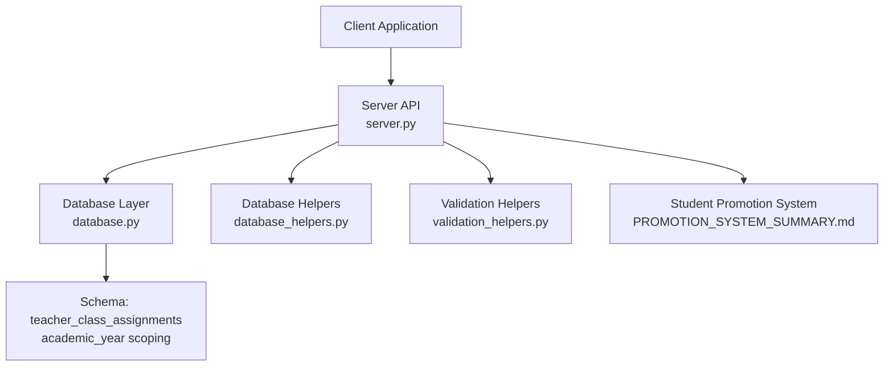
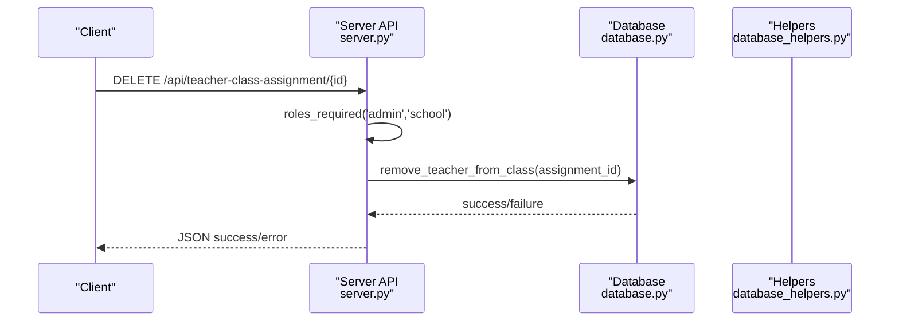
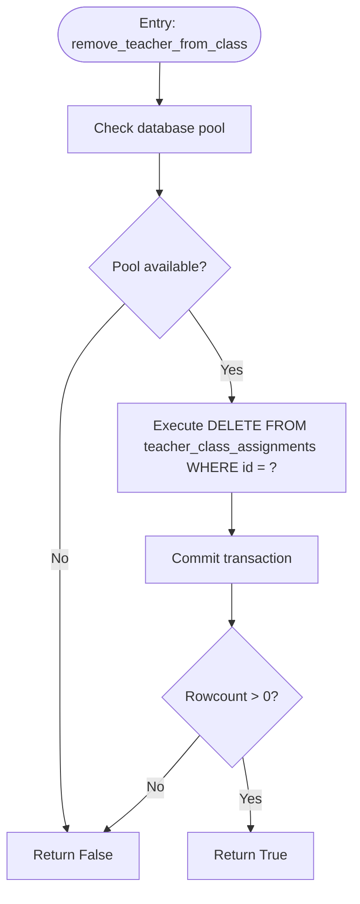
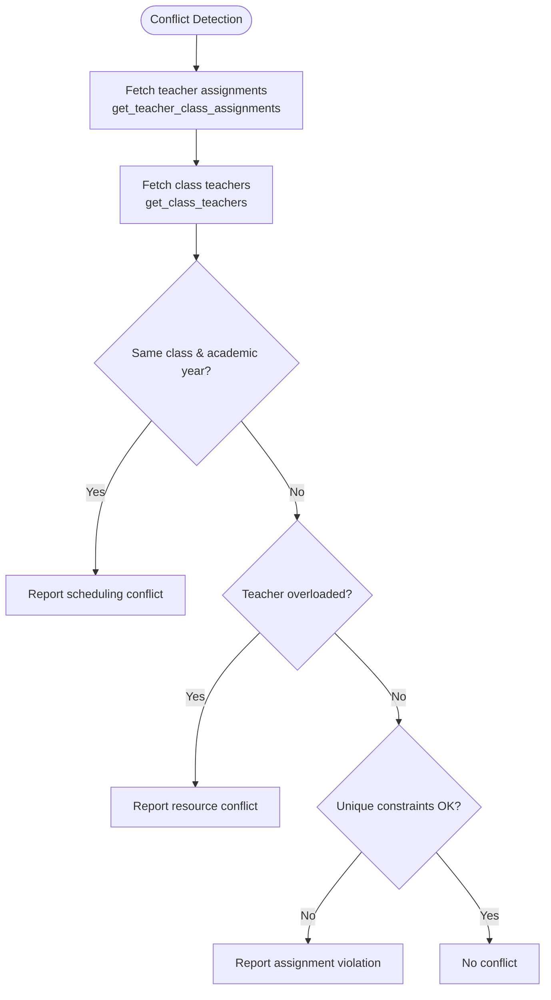
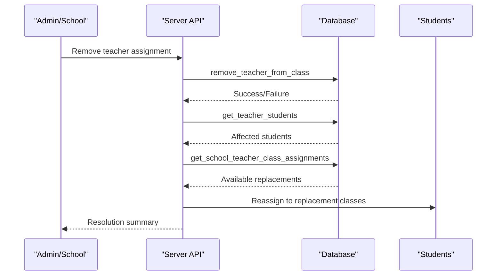
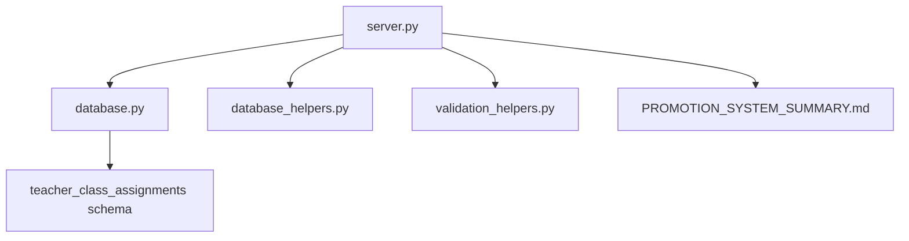

# Teacher Removal and Conflict Resolution

<cite>
**Referenced Files in This Document**
- [server.py](file://server.py)
- [database.py](file://database.py)
- [database_helpers.py](file://database_helpers.py)
- [validation_helpers.py](file://validation_helpers.py)
- [PROMOTION_SYSTEM_SUMMARY.md](file://PROMOTION_SYSTEM_SUMMARY.md)
- [TEACHER_CLASS_ASSIGNMENT_IMPLEMENTATION.md](file://TEACHER_CLASS_ASSIGNMENT_IMPLEMENTATION.md)
</cite>

## Table of Contents
1. [Introduction](#introduction)
2. [Project Structure](#project-structure)
3. [Core Components](#core-components)
4. [Architecture Overview](#architecture-overview)
5. [Detailed Component Analysis](#detailed-component-analysis)
6. [Dependency Analysis](#dependency-analysis)
7. [Performance Considerations](#performance-considerations)
8. [Troubleshooting Guide](#troubleshooting-guide)
9. [Conclusion](#conclusion)

## Introduction
This document explains the teacher removal processes and conflict resolution mechanisms within the assignment system. It focuses on the remove_teacher_from_class function, parameter validation, dependency checks, and safe removal procedures. It also documents conflict detection algorithms for scheduling, resources, and assignment violations, and outlines the conflict resolution workflow for teacher removal, replacement assignment, and student reassignment. Finally, it describes integration with the student transfer system and grade continuity maintenance.

## Project Structure
The teacher removal and conflict resolution features are implemented across the server API layer, database helpers, and database schema. The primary components are:
- API endpoint for removing teacher-class assignments
- Database helper functions for assignment management
- Database schema supporting teacher-class assignments with academic year scoping
- Validation helpers for subject and assignment operations
- Integration with the student promotion system for grade continuity

**Diagram sources**
- [server.py](file://server.py#L1500-L1518)
- [database.py](file://database.py#L247-L259)
- [database_helpers.py](file://database_helpers.py#L1-L364)
- [validation_helpers.py](file://validation_helpers.py#L123-L161)
- [PROMOTION_SYSTEM_SUMMARY.md](file://PROMOTION_SYSTEM_SUMMARY.md#L1-L98)

**Section sources**
- [server.py](file://server.py#L1500-L1518)
- [database.py](file://database.py#L247-L259)
- [database_helpers.py](file://database_helpers.py#L1-L364)
- [validation_helpers.py](file://validation_helpers.py#L123-L161)
- [PROMOTION_SYSTEM_SUMMARY.md](file://PROMOTION_SYSTEM_SUMMARY.md#L1-L98)

## Core Components
- remove_teacher_from_class endpoint: Validates access, delegates removal to database helper, and returns success/error responses.
- remove_teacher_from_class function: Deletes a specific teacher-class assignment by ID.
- get_teacher_class_assignments and get_class_teachers: Retrieve assignment and teacher data for conflict detection.
- Validation helpers: Provide validation for subject removal and assignment operations.
- Student promotion integration: Ensures grade continuity and prevents grade loss during transitions.

**Section sources**
- [server.py](file://server.py#L1500-L1518)
- [database.py](file://database.py#L573-L590)
- [database.py](file://database.py#L591-L622)
- [database.py](file://database.py#L624-L655)
- [validation_helpers.py](file://validation_helpers.py#L123-L161)
- [PROMOTION_SYSTEM_SUMMARY.md](file://PROMOTION_SYSTEM_SUMMARY.md#L42-L46)

## Architecture Overview
The system separates concerns across layers:
- API layer validates roles and invokes database operations
- Database layer encapsulates CRUD operations for assignments
- Helpers provide reusable validation and assignment logic
- Schema enforces academic-year-scoped assignments and referential integrity

**Diagram sources**
- [server.py](file://server.py#L1500-L1518)
- [database.py](file://database.py#L573-L590)

## Detailed Component Analysis

### remove_teacher_from_class Endpoint
- Purpose: Remove a teacher’s assignment to a class for a given subject and academic year.
- Access control: Requires admin or school role.
- Behavior: Delegates to remove_teacher_from_class and returns localized success/error messages.

**Section sources**
- [server.py](file://server.py#L1500-L1518)

### remove_teacher_from_class Function
- Purpose: Safely delete a teacher-class assignment by assignment ID.
- Safety: Uses a connection pool, transaction-like commit/rollback semantics via helper pattern, and exception handling.
- Output: Boolean indicating whether a row was affected.

**Diagram sources**
- [database.py](file://database.py#L573-L590)

**Section sources**
- [database.py](file://database.py#L573-L590)

### Conflict Detection Algorithms
Conflicts are detected by querying current assignments and constraints:
- Scheduling conflicts: Compare class_name and academic_year_id across assignments to detect overlapping class-time slots.
- Resource conflicts: Ensure a teacher is not assigned to multiple classes simultaneously for the same academic year.
- Assignment violations: Enforce unique constraints and foreign key relationships.

Detection routines:
- get_teacher_class_assignments(teacher_id, academic_year_id): Retrieve all assignments for a teacher in a given academic year.
- get_class_teachers(class_name, academic_year_id): Retrieve all teachers assigned to a class in a given academic year.

**Diagram sources**
- [database.py](file://database.py#L591-L622)
- [database.py](file://database.py#L624-L655)

**Section sources**
- [database.py](file://database.py#L591-L622)
- [database.py](file://database.py#L624-L655)

### Conflict Resolution Workflow
Resolution steps for teacher removal:
1. Identify affected students: Use teacher’s subject assignments to determine impacted grade levels.
2. Detect conflicts: Query current assignments to locate overlaps or violations.
3. Replace assignment: Assign another qualified teacher to the class/subject for the academic year.
4. Student reassignment: Reassign students to classes with replacement teachers; maintain grade continuity.
5. Notify stakeholders: Update UI and logs to reflect changes.

Integration touchpoints:
- get_teacher_students(teacher_id, academic_year_id): Retrieve affected students.
- get_school_teacher_class_assignments(school_id, academic_year_id): Locate all assignments for replacement planning.
- Student promotion system: Preserve historical grades and create new records upon grade transitions.

**Diagram sources**
- [server.py](file://server.py#L1500-L1518)
- [database.py](file://database.py#L509-L551)
- [database.py](file://database.py#L700-L728)
- [PROMOTION_SYSTEM_SUMMARY.md](file://PROMOTION_SYSTEM_SUMMARY.md#L22-L33)

**Section sources**
- [server.py](file://server.py#L1500-L1518)
- [database.py](file://database.py#L509-L551)
- [database.py](file://database.py#L700-L728)
- [PROMOTION_SYSTEM_SUMMARY.md](file://PROMOTION_SYSTEM_SUMMARY.md#L22-L33)

### Parameter Validation and Safe Removal Procedures
- Input validation: Ensure assignment_id is present and valid before deletion.
- Dependency checks: Verify that the assignment exists and belongs to the requesting user’s school context.
- Safe removal: Wrap deletion in a transaction-like pattern with rollback on exceptions.
- Audit/logging: Integrate with security middleware to log actions.

**Section sources**
- [server.py](file://server.py#L1500-L1518)
- [database.py](file://database.py#L573-L590)

### Examples of Removal Operations, Conflict Scenarios, and Resolution Strategies
- Example removal operation:
  - Endpoint: DELETE /api/teacher-class-assignment/{assignment_id}
  - Outcome: Success message and updated state.
- Example conflict scenario:
  - Scheduling conflict: Same class and academic year assigned to multiple teachers.
  - Resolution: Assign replacement teacher and reassign students.
- Example resolution strategy:
  - Use get_school_teacher_class_assignments to find available replacements.
  - Maintain grade continuity by leveraging the student promotion system.

**Section sources**
- [server.py](file://server.py#L1500-L1518)
- [database.py](file://database.py#L700-L728)
- [PROMOTION_SYSTEM_SUMMARY.md](file://PROMOTION_SYSTEM_SUMMARY.md#L42-L46)

### Integration with Student Transfer Systems and Grade Continuity
- Grade preservation: Student promotion maintains historical grades without modification.
- Academic year scoping: Assignments are scoped to academic_year_id to prevent cross-year contamination.
- Continuity: When replacing a teacher, ensure students remain enrolled in the same grade level and academic year.

**Section sources**
- [PROMOTION_SYSTEM_SUMMARY.md](file://PROMOTION_SYSTEM_SUMMARY.md#L22-L33)
- [database.py](file://database.py#L247-L259)

## Dependency Analysis
Key dependencies and relationships:
- server.py depends on database.py for database operations and on database_helpers.py for extended helpers.
- database.py defines schema and CRUD functions for teacher-class assignments.
- validation_helpers.py provides validation logic for subject and assignment operations.
- PROMOTION_SYSTEM_SUMMARY.md documents grade continuity principles integrated into student transitions.

**Diagram sources**
- [server.py](file://server.py#L10-L16)
- [database.py](file://database.py#L247-L259)
- [database_helpers.py](file://database_helpers.py#L1-L364)
- [validation_helpers.py](file://validation_helpers.py#L123-L161)
- [PROMOTION_SYSTEM_SUMMARY.md](file://PROMOTION_SYSTEM_SUMMARY.md#L1-L98)

**Section sources**
- [server.py](file://server.py#L10-L16)
- [database.py](file://database.py#L247-L259)
- [database_helpers.py](file://database_helpers.py#L1-L364)
- [validation_helpers.py](file://validation_helpers.py#L123-L161)
- [PROMOTION_SYSTEM_SUMMARY.md](file://PROMOTION_SYSTEM_SUMMARY.md#L1-L98)

## Performance Considerations
- Use database indexes on frequently queried columns (class_name, academic_year_id, teacher_id).
- Batch operations for mass removals to reduce round-trips.
- Cache frequently accessed assignment data to minimize repeated queries.

## Troubleshooting Guide
Common issues and resolutions:
- Access denied: Ensure the requester has admin or school role.
- Assignment not found: Verify assignment_id exists and belongs to the requesting user’s school.
- Database errors: Check connection pool initialization and foreign key constraints.

**Section sources**
- [server.py](file://server.py#L1500-L1518)
- [database.py](file://database.py#L573-L590)

## Conclusion
The teacher removal and conflict resolution mechanisms are built around a clear separation of concerns: secure API endpoints, robust database operations, and schema-enforced academic-year scoping. Conflict detection leverages assignment queries, while resolution integrates replacement assignments and preserves student grade continuity through the promotion system. These components work together to ensure safe, auditable, and conflict-aware teacher removal processes.