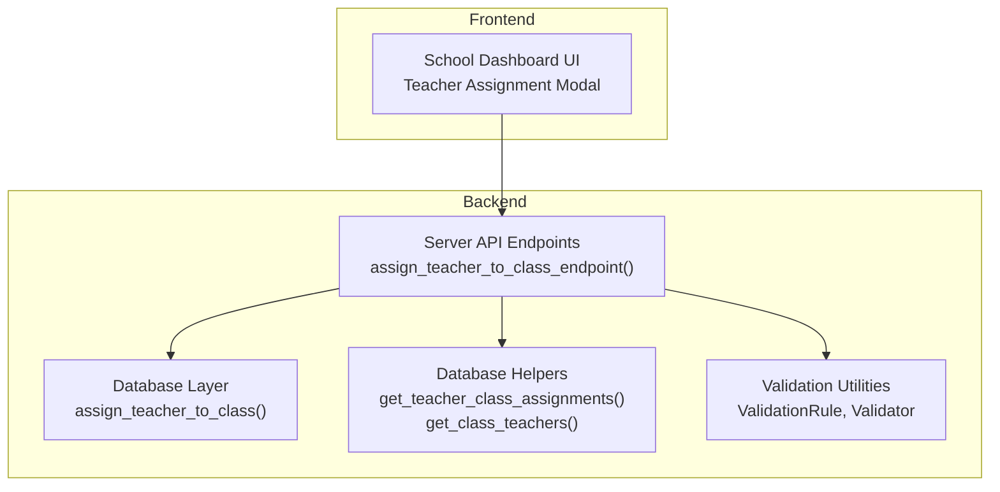
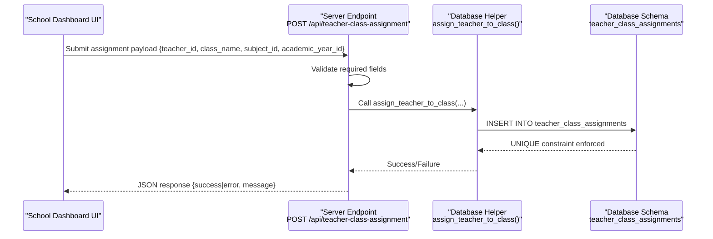
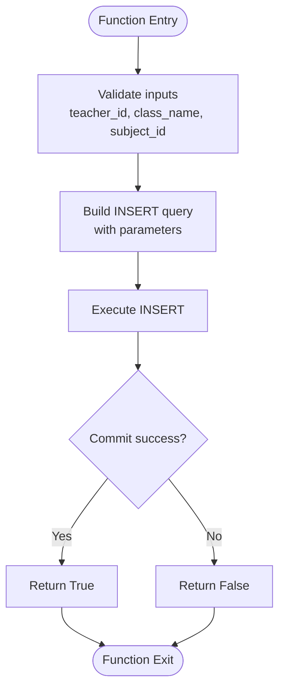
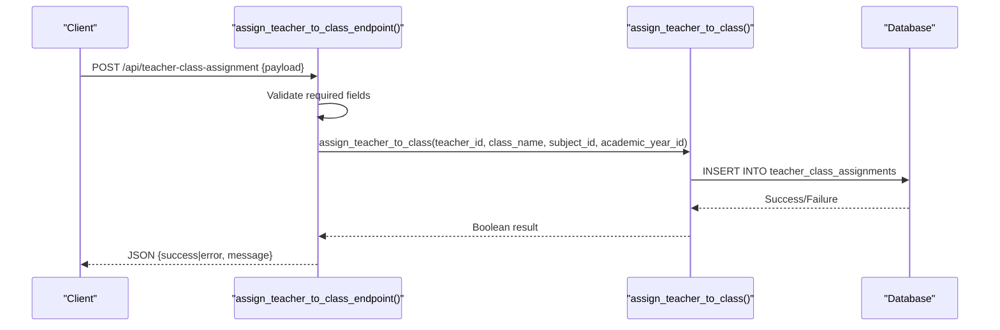
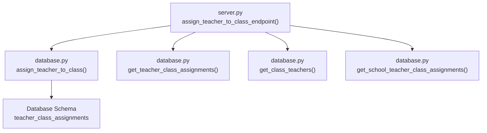

# Teacher-Class Assignment Workflow

<cite>
**Referenced Files in This Document**
- [TEACHER_CLASS_ASSIGNMENT_IMPLEMENTATION.md](file://TEACHER_CLASS_ASSIGNMENT_IMPLEMENTATION.md)
- [database.py](file://database.py)
- [server.py](file://server.py)
- [database_helpers.py](file://database_helpers.py)
- [validation.py](file://validation.py)
- [school-dashboard.html](file://public/school-dashboard.html)
</cite>

## Table of Contents
1. [Introduction](#introduction)
2. [Project Structure](#project-structure)
3. [Core Components](#core-components)
4. [Architecture Overview](#architecture-overview)
5. [Detailed Component Analysis](#detailed-component-analysis)
6. [Dependency Analysis](#dependency-analysis)
7. [Performance Considerations](#performance-considerations)
8. [Troubleshooting Guide](#troubleshooting-guide)
9. [Conclusion](#conclusion)

## Introduction
This document explains the teacher-class assignment workflow that connects teachers to classrooms and subjects within the EduFlow system. It focuses on the `assign_teacher_to_class` function, detailing parameter validation, conflict detection, and persistence. The workflow spans from initial teacher assignment through classroom enrollment, integrating with student enrollment and grade tracking systems. The documentation also covers database transactions, constraint enforcement, and error handling for invalid assignments.

## Project Structure
The teacher-class assignment system is implemented across backend database helpers, API endpoints, and frontend integration points:

- Backend database layer defines the `teacher_class_assignments` table and CRUD helpers.
- API endpoints expose assignment management operations with role-based access control.
- Frontend dashboard integrates teacher-class assignment into the school dashboard UI.
- Validation utilities provide reusable validation rules for request payloads.

**Diagram sources**
- [server.py](file://server.py#L1471-L1500)
- [database.py](file://database.py#L552-L572)
- [database_helpers.py](file://database_helpers.py#L12-L44)

**Section sources**
- [TEACHER_CLASS_ASSIGNMENT_IMPLEMENTATION.md](file://TEACHER_CLASS_ASSIGNMENT_IMPLEMENTATION.md#L1-L180)
- [server.py](file://server.py#L1471-L1500)
- [database.py](file://database.py#L247-L259)

## Core Components
This section documents the primary components involved in the teacher-class assignment workflow:

- Database schema: The `teacher_class_assignments` table enforces uniqueness across teacher, class, subject, and academic year.
- Database helper: The `assign_teacher_to_class` function encapsulates insertion with transaction semantics.
- API endpoint: The `/api/teacher-class-assignment` endpoint validates inputs and delegates to the database helper.
- Helper functions: Additional helpers support retrieval of assignments and class teachers.
- Frontend integration: The school dashboard UI triggers assignment operations and displays results.

Key implementation references:
- Database schema definition and helper functions: [database.py](file://database.py#L247-L259), [database.py](file://database.py#L552-L572)
- API endpoint: [server.py](file://server.py#L1471-L1500)
- Supporting helpers: [database.py](file://database.py#L591-L655)

**Section sources**
- [database.py](file://database.py#L247-L259)
- [database.py](file://database.py#L552-L572)
- [server.py](file://server.py#L1471-L1500)
- [database.py](file://database.py#L591-L655)

## Architecture Overview
The teacher-class assignment workflow follows a layered architecture:

- Presentation layer: The school dashboard UI provides controls to assign teachers to classes.
- API layer: Flask endpoints validate requests and orchestrate database operations.
- Data access layer: Database helpers manage transactions and enforce constraints.
- Persistence layer: The `teacher_class_assignments` table stores assignment records.

**Diagram sources**
- [server.py](file://server.py#L1471-L1500)
- [database.py](file://database.py#L552-L572)
- [database.py](file://database.py#L247-L259)

## Detailed Component Analysis

### assign_teacher_to_class Function
The `assign_teacher_to_class` function performs the core assignment operation:

- Purpose: Insert a new teacher-class-subject-academic-year assignment.
- Parameters: teacher_id, class_name, subject_id, academic_year_id (optional).
- Transaction behavior: Uses a single INSERT statement wrapped in a connection lifecycle; commits on success, logs exceptions, and closes connections.
- Constraint enforcement: Relies on the database-level UNIQUE constraint to prevent duplicates.

Implementation highlights:
- Parameter binding and INSERT execution: [database.py](file://database.py#L561-L564)
- Commit and return logic: [database.py](file://database.py#L565-L566)
- Exception handling and return False on failure: [database.py](file://database.py#L567-L569)
- Connection cleanup: [database.py](file://database.py#L570-L571)

**Diagram sources**
- [database.py](file://database.py#L552-L572)

**Section sources**
- [database.py](file://database.py#L552-L572)

### API Endpoint: POST /api/teacher-class-assignment
The endpoint validates required fields and delegates assignment to the database helper:

- Required fields: teacher_id, class_name, subject_id.
- Optional field: academic_year_id.
- Access control: Requires admin or school role.
- Response: Success with 201 status or error with 400/500 status.

Endpoint behavior:
- Field validation: [server.py](file://server.py#L1481-L1485)
- Delegation to helper: [server.py](file://server.py#L1487)
- Success response: [server.py](file://server.py#L1489-L1494)
- Error response: [server.py](file://server.py#L1495-L1499)

**Diagram sources**
- [server.py](file://server.py#L1471-L1500)
- [database.py](file://database.py#L552-L572)

**Section sources**
- [server.py](file://server.py#L1471-L1500)

### Conflict Detection and Prevention
Conflict detection relies on the database-level UNIQUE constraint:

- Constraint definition: UNIQUE(teacher_id, class_name, subject_id, academic_year_id).
- Behavior: Attempting to insert a duplicate combination raises an exception handled by the helper, which returns False.

Constraint enforcement:
- Schema-level uniqueness: [database.py](file://database.py#L258)
- Helper function returns False on exception: [database.py](file://database.py#L567-L569)

**Section sources**
- [database.py](file://database.py#L258)
- [database.py](file://database.py#L567-L569)

### Assignment Retrieval and Enrollment Integration
The system provides helper functions to retrieve assignments and integrate with student enrollment and grade tracking:

- Retrieve teacher assignments: [database.py](file://database.py#L591-L622)
- Retrieve class teachers: [database.py](file://database.py#L624-L655)
- Retrieve school assignments: [database.py](file://database.py#L700-L728)
- Student enrollment and grade tracking integration: [database.py](file://database.py#L292-L320)

Integration points:
- Academic year-aware queries: Many helpers accept academic_year_id to scope results.
- Foreign key relationships: Assignments link to teachers, subjects, and academic years.

**Section sources**
- [database.py](file://database.py#L591-L655)
- [database.py](file://database.py#L700-L728)
- [database.py](file://database.py#L292-L320)

### Frontend Integration
The school dashboard UI supports teacher-class assignment:

- Modal interface for class assignment operations.
- Buttons and controls to trigger assignment workflows.
- Responsive design and search/filter capabilities.

UI integration:
- Dashboard page with grade-level cards and assignment controls: [school-dashboard.html](file://public/school-dashboard.html#L288-L309)

Note: The specific JavaScript implementation for the assignment modal is referenced in the implementation summary but not present in the current workspace snapshot.

**Section sources**
- [school-dashboard.html](file://public/school-dashboard.html#L288-L309)
- [TEACHER_CLASS_ASSIGNMENT_IMPLEMENTATION.md](file://TEACHER_CLASS_ASSIGNMENT_IMPLEMENTATION.md#L29-L46)

### Validation and Error Handling
While the assignment endpoint performs basic field checks, broader validation patterns are available:

- Validation framework: Rule-based validators for required fields, strings, numbers, enums, and custom rules.
- Usage pattern: Decorators apply validators to request payloads and return structured error responses.

Validation references:
- ValidationRule base class and subclasses: [validation.py](file://validation.py#L10-L173)
- Validator and ValidationResult: [validation.py](file://validation.py#L174-L202)
- validate_request decorator: [validation.py](file://validation.py#L333-L367)

Note: The assignment endpoint currently uses manual validation; the validation framework can be applied consistently across endpoints.

**Section sources**
- [validation.py](file://validation.py#L10-L173)
- [validation.py](file://validation.py#L174-L202)
- [validation.py](file://validation.py#L333-L367)

## Dependency Analysis
The teacher-class assignment workflow involves several interdependent components:

**Diagram sources**
- [server.py](file://server.py#L1471-L1500)
- [database.py](file://database.py#L552-L572)
- [database.py](file://database.py#L591-L655)
- [database.py](file://database.py#L700-L728)

**Section sources**
- [server.py](file://server.py#L1471-L1500)
- [database.py](file://database.py#L552-L572)
- [database.py](file://database.py#L591-L655)
- [database.py](file://database.py#L700-L728)

## Performance Considerations
- Connection lifecycle: Each operation opens and closes a database connection; consider connection pooling for high-throughput scenarios.
- Transaction scope: Single INSERT statements minimize transaction overhead; ensure proper rollback on failures.
- Indexing: The UNIQUE constraint on teacher_class_assignments optimizes duplicate detection; maintain statistics for optimal query plans.
- Caching: Retrieve helpers aggregate data using JOINs; consider caching frequently accessed assignment lists.

## Troubleshooting Guide
Common issues and resolutions:

- Duplicate assignment error:
  - Cause: UNIQUE constraint violation when inserting identical combinations.
  - Resolution: Ensure teacher, class, subject, and academic year combination is unique before attempting assignment.
  - Reference: [database.py](file://database.py#L567-L569), [database.py](file://database.py#L258)

- Missing required fields:
  - Cause: Missing teacher_id, class_name, or subject_id in the request payload.
  - Resolution: Validate payload before calling the endpoint.
  - Reference: [server.py](file://server.py#L1481-L1485)

- Database connectivity failure:
  - Cause: Connection pool unavailable or database unreachable.
  - Resolution: Retry with exponential backoff and log detailed error messages.
  - Reference: [database.py](file://database.py#L554-L556)

- Access control errors:
  - Cause: Missing or insufficient role (admin or school).
  - Resolution: Authenticate with proper credentials and verify role permissions.
  - Reference: [server.py](file://server.py#L1472)

- Academic year scoping:
  - Cause: Assignments not aligned with current academic year.
  - Resolution: Pass academic_year_id to ensure correct scoping.
  - Reference: [server.py](file://server.py#L1479), [database.py](file://database.py#L591-L622)

**Section sources**
- [database.py](file://database.py#L554-L572)
- [server.py](file://server.py#L1481-L1485)
- [server.py](file://server.py#L1472)
- [database.py](file://database.py#L591-L622)

## Conclusion
The teacher-class assignment workflow integrates cleanly across the frontend, API, and database layers. The `assign_teacher_to_class` function provides a focused mechanism for creating assignments, while the database-level UNIQUE constraint ensures data integrity. The API endpoint enforces minimal validation and delegates persistence to the database helper. Supporting helpers enable retrieval of assignments and integration with student enrollment and grade tracking systems. Applying the validation framework consistently would further strengthen the system’s robustness.