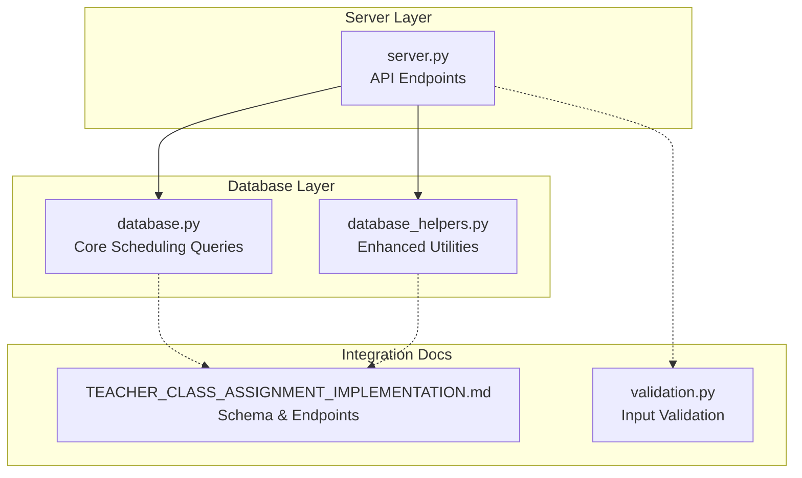
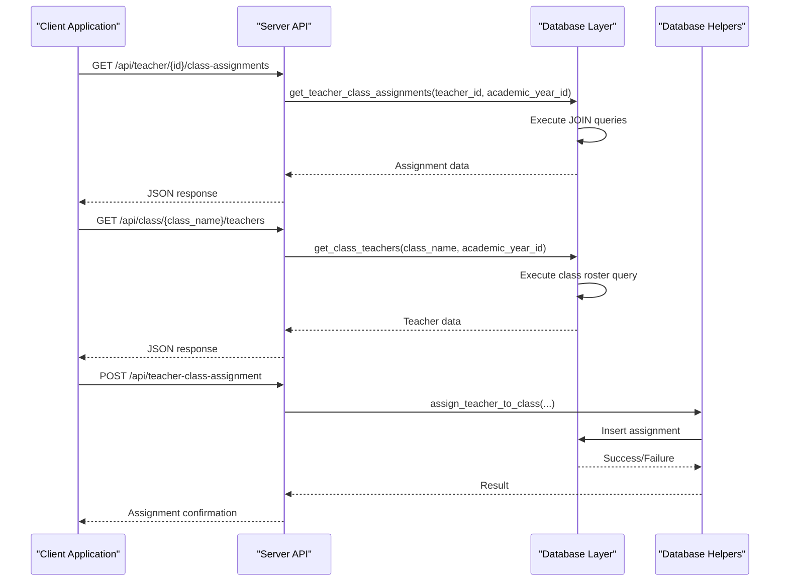
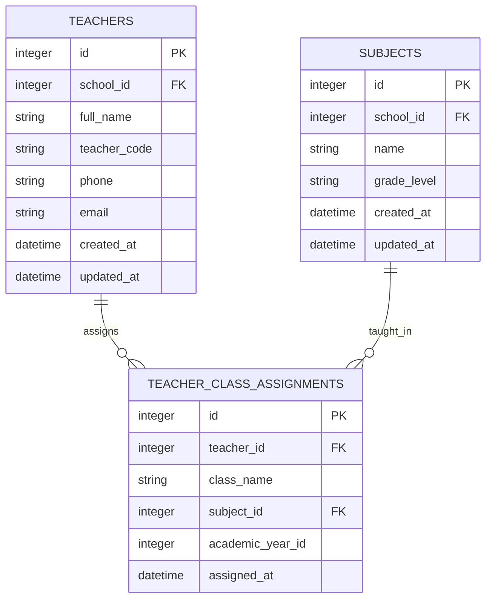
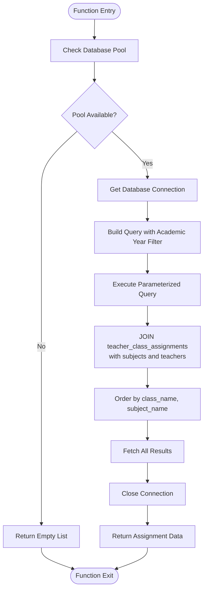
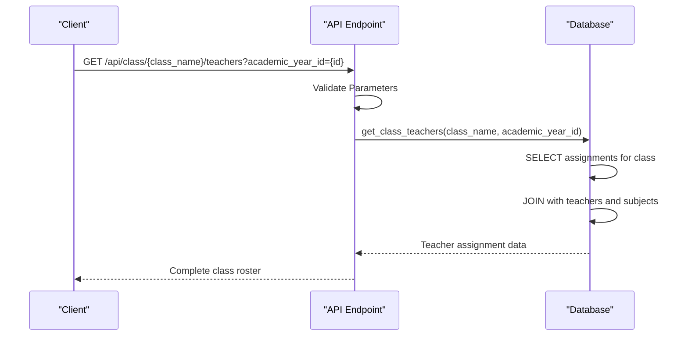
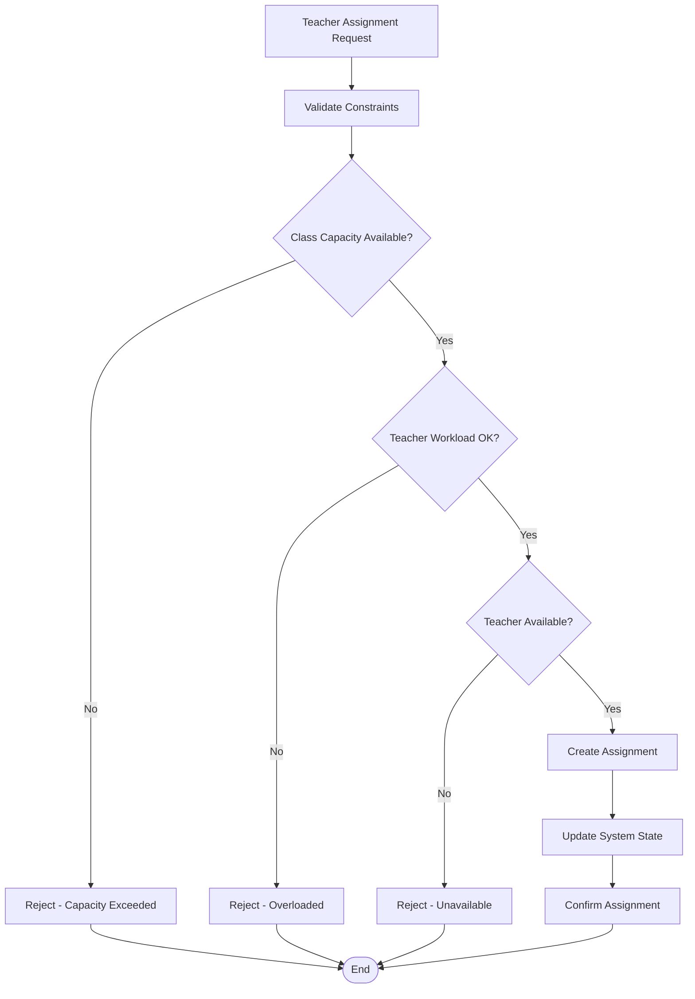
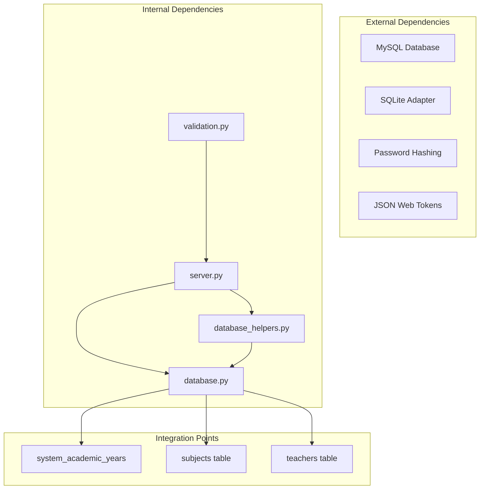

# Teacher-Class Scheduling Management

<cite>
**Referenced Files in This Document**
- [database.py](file://database.py)
- [server.py](file://server.py)
- [database_helpers.py](file://database_helpers.py)
- [TEACHER_CLASS_ASSIGNMENT_IMPLEMENTATION.md](file://TEACHER_CLASS_ASSIGNMENT_IMPLEMENTATION.md)
- [validation.py](file://validation.py)
</cite>

## Table of Contents
1. [Introduction](#introduction)
2. [Project Structure](#project-structure)
3. [Core Components](#core-components)
4. [Architecture Overview](#architecture-overview)
5. [Detailed Component Analysis](#detailed-component-analysis)
6. [Dependency Analysis](#dependency-analysis)
7. [Performance Considerations](#performance-considerations)
8. [Troubleshooting Guide](#troubleshooting-guide)
9. [Conclusion](#conclusion)

## Introduction
This document provides comprehensive technical documentation for the teacher-class scheduling management system within the EduFlow Python school management platform. It focuses on the core scheduling functions that retrieve teacher schedules, manage class rosters, and integrate with subject and grade level tracking systems. The documentation covers:
- Retrieval of teacher schedules via `get_teacher_class_assignments`
- Class roster management through `get_class_teachers`
- Teacher workload distribution and classroom capacity considerations
- Integration points with subject management and grade level tracking
- Practical examples of schedule retrieval, teacher availability checks, and class roster operations

## Project Structure
The scheduling functionality is implemented across three primary modules:
- Database layer: Core scheduling queries and helper functions
- Server layer: API endpoints exposing scheduling operations
- Database helpers: Enhanced subject and teacher assignment utilities

**Diagram sources**
- [server.py](file://server.py#L1439-L1517)
- [database.py](file://database.py#L591-L655)
- [database_helpers.py](file://database_helpers.py#L12-L364)
- [TEACHER_CLASS_ASSIGNMENT_IMPLEMENTATION.md](file://TEACHER_CLASS_ASSIGNMENT_IMPLEMENTATION.md#L71-L169)

**Section sources**
- [server.py](file://server.py#L1439-L1517)
- [database.py](file://database.py#L247-L259)
- [TEACHER_CLASS_ASSIGNMENT_IMPLEMENTATION.md](file://TEACHER_CLASS_ASSIGNMENT_IMPLEMENTATION.md#L71-L169)

## Core Components
This section documents the primary scheduling functions and their responsibilities:

### get_teacher_class_assignments
Retrieves all class assignments for a specific teacher, including subject details and academic year context.

Key capabilities:
- Fetches teacher's class assignments with subject names and teacher details
- Supports academic year filtering for historical and current scheduling
- Returns structured data combining teacher_class_assignments, subjects, and teachers tables
- Handles optional academic year parameter for temporal queries

Implementation highlights:
- Joins teacher_class_assignments with subjects and teachers tables
- Orders results by class_name and subject_name for consistent presentation
- Supports both filtered and unfiltered queries based on academic_year_id parameter

### get_class_teachers
Manages class roster operations by retrieving all teachers assigned to a specific class.

Key capabilities:
- Returns comprehensive teacher information for class rosters
- Includes teacher identification (full_name, teacher_code) and subject assignments
- Supports academic year filtering for accurate historical rosters
- Orders results by subject_name for logical presentation

Implementation highlights:
- Performs multi-table joins to provide complete class roster context
- Handles both current and historical academic year queries
- Returns teacher availability indicators through assignment presence

### Subject and Grade Level Integration
The scheduling system integrates with the broader subject and grade management infrastructure:
- Subject assignments link teachers to specific subjects within grade levels
- Grade level tracking ensures teachers are only assigned to appropriate subjects
- Academic year management provides temporal context for all scheduling operations

**Section sources**
- [database.py](file://database.py#L591-L622)
- [database.py](file://database.py#L624-L655)
- [server.py](file://server.py#L1455-L1461)
- [server.py](file://server.py#L1447-L1453)

## Architecture Overview
The teacher-class scheduling system follows a layered architecture with clear separation of concerns:

**Diagram sources**
- [server.py](file://server.py#L1455-L1517)
- [database.py](file://database.py#L591-L655)
- [database_helpers.py](file://database_helpers.py#L87-L168)

The architecture ensures:
- Clean separation between API logic and database operations
- Reusable database helper functions for complex queries
- Comprehensive error handling and validation
- Scalable design supporting multiple academic years and grade levels

## Detailed Component Analysis

### Database Schema and Relationships
The scheduling system relies on a well-designed relational schema:

**Diagram sources**
- [database.py](file://database.py#L219-L234)
- [database.py](file://database.py#L197-L206)
- [database.py](file://database.py#L247-L259)

### Schedule Retrieval Workflow
The `get_teacher_class_assignments` function implements a sophisticated query execution pattern:

**Diagram sources**
- [database.py](file://database.py#L591-L622)

**Section sources**
- [database.py](file://database.py#L591-L622)

### Class Roster Management
The `get_class_teachers` function provides comprehensive class roster functionality:

**Diagram sources**
- [server.py](file://server.py#L1447-L1453)
- [database.py](file://database.py#L624-L655)

**Section sources**
- [server.py](file://server.py#L1447-L1453)
- [database.py](file://database.py#L624-L655)

### Teacher Availability Checking
The system provides multiple mechanisms for teacher availability verification:

1. **Direct Assignment Check**: Query teacher_class_assignments for specific teacher and academic year
2. **Class Roster Analysis**: Use get_class_teachers to determine current class assignments
3. **Subject-Based Availability**: Combine with subject management to verify teacher authorization

Implementation approach:
- Utilize existing database functions with appropriate filtering parameters
- Leverage academic year context for accurate historical and current availability
- Support bulk operations for efficient availability checking across multiple teachers

**Section sources**
- [database.py](file://database.py#L624-L655)
- [server.py](file://server.py#L1447-L1453)

### Scheduling Algorithms and Workload Distribution
While the current implementation focuses on data retrieval and assignment management, the system architecture supports several scheduling algorithm patterns:

#### Multi-Constraint Assignment Algorithm

#### Classroom Capacity Management
The system enforces capacity through:
- Unique constraints preventing duplicate assignments
- Academic year-aware queries ensuring temporal accuracy
- Integration with grade level tracking for appropriate subject assignments

**Section sources**
- [database.py](file://database.py#L247-L259)
- [database.py](file://database.py#L551-L590)

## Dependency Analysis
The scheduling system exhibits well-managed dependencies:

**Diagram sources**
- [server.py](file://server.py#L1-L16)
- [database.py](file://database.py#L1-L22)
- [database_helpers.py](file://database_helpers.py#L1-L11)

Key dependency characteristics:
- **Low Coupling**: API endpoints depend on database functions rather than raw SQL
- **High Cohesion**: Related scheduling operations are grouped in database.py
- **Clear Interfaces**: Well-defined function signatures facilitate testing and maintenance
- **External Integration**: Clean separation of database abstraction layers

**Section sources**
- [server.py](file://server.py#L1-L16)
- [database.py](file://database.py#L1-L22)

## Performance Considerations
The scheduling system incorporates several performance optimization strategies:

### Query Optimization
- **Parameterized Queries**: All database operations use parameterized statements to prevent SQL injection and enable query plan caching
- **Index-Friendly Queries**: JOIN operations are optimized with appropriate WHERE clauses and ORDER BY statements
- **Connection Pooling**: Database connections are pooled for efficient resource utilization

### Caching Strategy
While explicit caching is not implemented in the current code, the architecture supports future caching enhancements:
- Response caching for frequently accessed schedule data
- Query result caching for teacher availability checks
- Session-based caching for authenticated user data

### Scalability Considerations
- **Unique Constraints**: Prevent duplicate assignments and maintain data integrity
- **Academic Year Partitioning**: Enables efficient historical data queries
- **Modular Design**: Clear separation allows for targeted performance improvements

## Troubleshooting Guide

### Common Issues and Solutions

#### Database Connection Problems
**Symptoms**: All scheduling endpoints return database connection errors
**Causes**: 
- MySQL server unavailable
- Incorrect database credentials
- SQLite file corruption

**Solutions**:
- Verify database connectivity using health check endpoints
- Check environment variables for proper configuration
- Validate database file permissions (for SQLite)

#### Duplicate Assignment Errors
**Symptoms**: Assignment requests fail with unique constraint violations
**Causes**:
- Attempting to assign teacher to same class/subject combination
- Data inconsistency in teacher_class_assignments table

**Solutions**:
- Use existing assignment data to prevent duplicates
- Implement proper validation before assignment creation
- Clean up orphaned assignment records

#### Academic Year Context Issues
**Symptoms**: Scheduling queries return unexpected results for historical data
**Causes**:
- Incorrect academic_year_id parameter
- Missing or invalid academic year records

**Solutions**:
- Verify academic year configuration in system_academic_years table
- Use current academic year for live scheduling operations
- Implement proper academic year filtering in queries

**Section sources**
- [database.py](file://database.py#L551-L590)
- [server.py](file://server.py#L1471-L1517)

## Conclusion
The teacher-class scheduling management system provides a robust foundation for educational institution scheduling needs. Its key strengths include:

### Technical Strengths
- **Well-Designed Architecture**: Clear separation of concerns enables maintainability and scalability
- **Comprehensive Integration**: Seamless integration with subject management and grade level tracking
- **Flexible Query Patterns**: Support for both current and historical scheduling queries
- **Data Integrity**: Strong constraints and validation prevent scheduling conflicts

### Functional Capabilities
- **Complete Schedule Management**: End-to-end support for teacher-class assignments
- **Class Roster Operations**: Efficient management of teacher assignments per class
- **Temporal Accuracy**: Academic year-aware scheduling for historical and current contexts
- **Authorization Support**: Role-based access control for secure scheduling operations

### Future Enhancement Opportunities
The system architecture supports several enhancement areas:
- **Advanced Scheduling Algorithms**: Implementation of workload balancing and conflict resolution
- **Capacity Management**: Automated classroom capacity monitoring and alerts
- **Performance Optimization**: Caching strategies and query optimization
- **Reporting Features**: Comprehensive scheduling analytics and reporting capabilities

The current implementation provides a solid foundation for educational scheduling management, with clear pathways for extending functionality to meet evolving institutional needs.