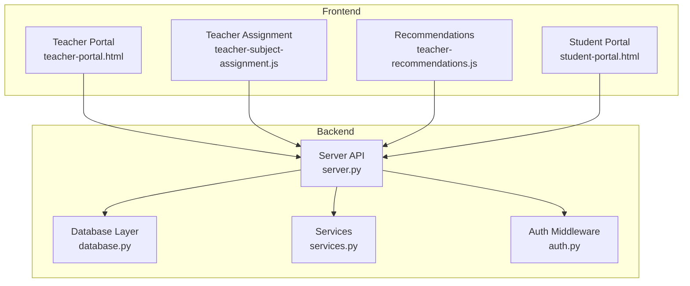
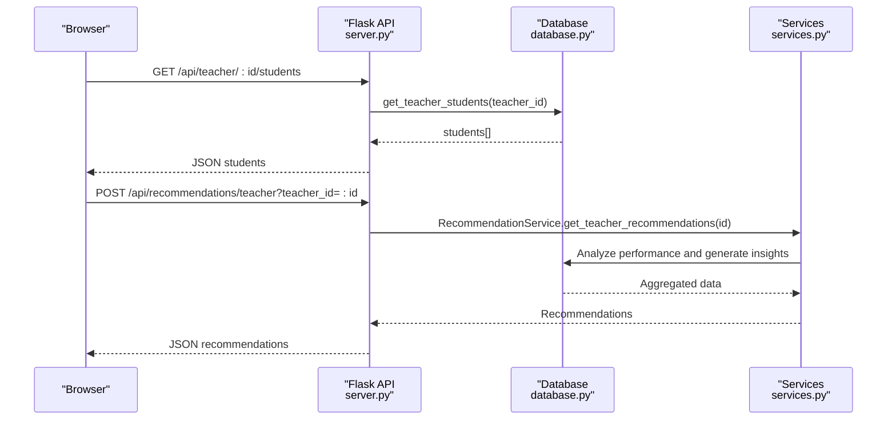
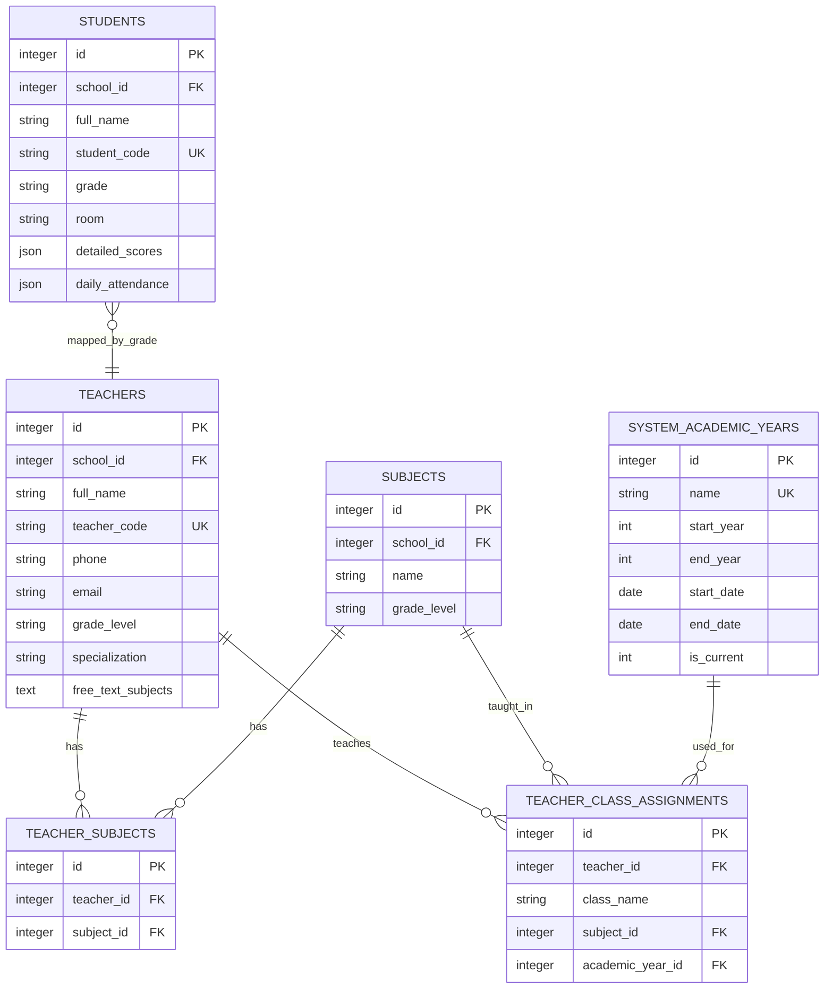
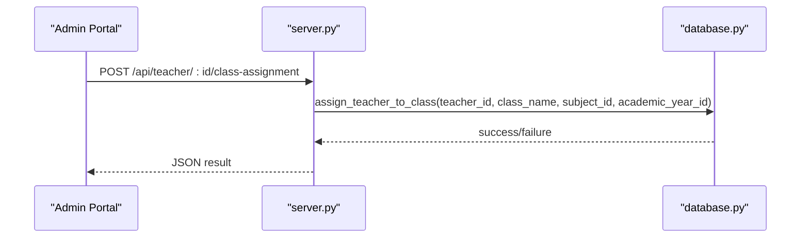
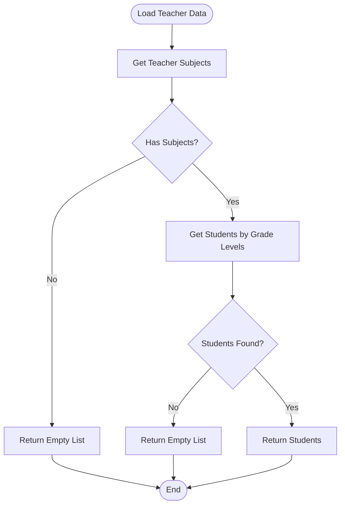
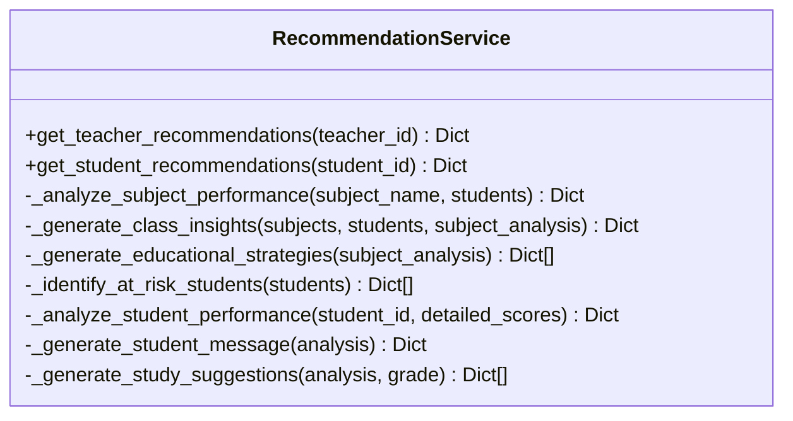
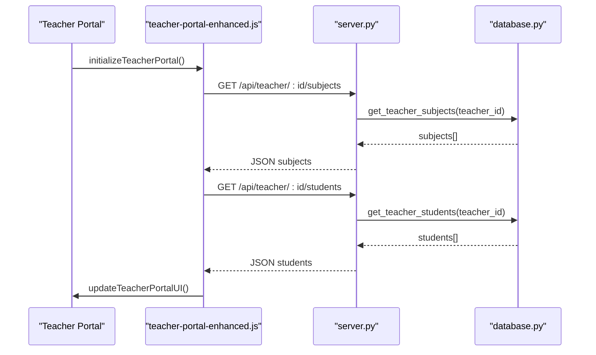
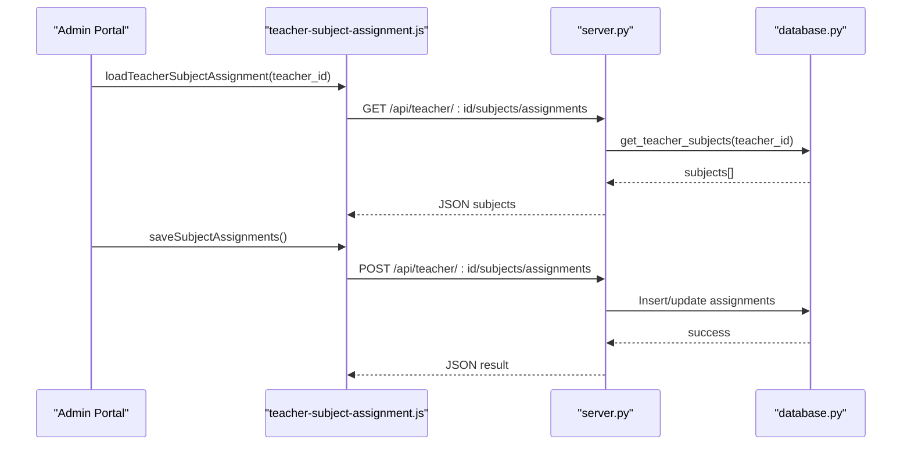
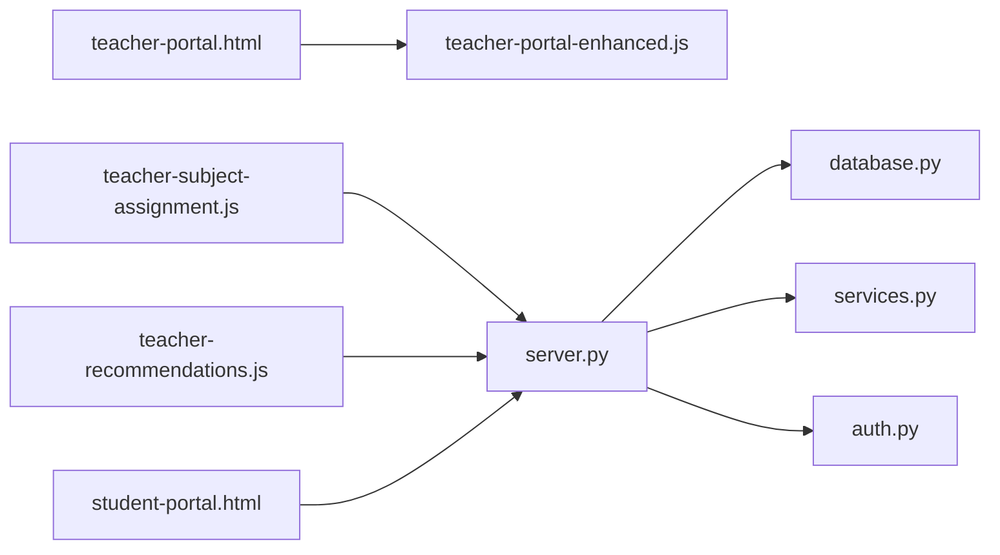

# Teacher-Student Relationship Management

<cite>
**Referenced Files in This Document**
- [server.py](file://server.py)
- [database.py](file://database.py)
- [services.py](file://services.py)
- [auth.py](file://auth.py)
- [teacher-portal.html](file://public/teacher-portal.html)
- [teacher-portal-enhanced.js](file://public/assets/js/teacher-portal-enhanced.js)
- [teacher-subject-assignment.js](file://public/assets/js/teacher-subject-assignment.js)
- [teacher-recommendations.js](file://public/assets/js/teacher-recommendations.js)
- [student-portal.html](file://public/student-portal.html)
</cite>

## Table of Contents
1. [Introduction](#introduction)
2. [Project Structure](#project-structure)
3. [Core Components](#core-components)
4. [Architecture Overview](#architecture-overview)
5. [Detailed Component Analysis](#detailed-component-analysis)
6. [Dependency Analysis](#dependency-analysis)
7. [Performance Considerations](#performance-considerations)
8. [Troubleshooting Guide](#troubleshooting-guide)
9. [Conclusion](#conclusion)

## Introduction
This document describes the teacher-student relationship management system within the EduFlow Python school management platform. It focuses on how teachers are assigned to classrooms, how subject specializations are tracked, and how teaching loads are managed. It also documents how student-teacher relationships are mapped for class management, grade supervision, and academic support, along with the teacher recommendation system for optimal student placement and subject assignment. The document covers teacher-student interaction workflows including grade entry permissions, student progress monitoring, and academic advising, as well as the class insights system for teacher performance analytics and student achievement tracking.

## Project Structure
The system is composed of:
- Backend API implemented in Python with Flask
- Database layer supporting both MySQL and SQLite
- Authentication and authorization middleware
- Frontend portals for teachers and students with interactive dashboards
- Services layer encapsulating business logic

**Diagram sources**
- [server.py](file://server.py#L1-L200)
- [database.py](file://database.py#L120-L338)
- [services.py](file://services.py#L1-L120)
- [auth.py](file://auth.py#L14-L376)
- [teacher-portal.html](file://public/teacher-portal.html#L1-L200)
- [teacher-portal-enhanced.js](file://public/assets/js/teacher-portal-enhanced.js#L1-L120)
- [teacher-subject-assignment.js](file://public/assets/js/teacher-subject-assignment.js#L1-L120)
- [teacher-recommendations.js](file://public/assets/js/teacher-recommendations.js#L1-L120)
- [student-portal.html](file://public/student-portal.html#L1-L120)

**Section sources**
- [server.py](file://server.py#L1-L200)
- [database.py](file://database.py#L120-L338)
- [services.py](file://services.py#L1-L120)
- [auth.py](file://auth.py#L14-L120)
- [teacher-portal.html](file://public/teacher-portal.html#L1-L120)

## Core Components
- Database schema supporting teachers, subjects, teacher-class assignments, academic years, student grades, and attendance
- API endpoints for teacher assignment, class management, subject tracking, and recommendations
- Services layer for recommendation generation and academic year management
- Authentication middleware enabling token-based access control
- Frontend dashboards for teacher and student insights

Key capabilities:
- Classroom assignment tracking and retrieval
- Subject specialization mapping for teachers
- Teaching load management via assignment counts
- Student-teacher relationship mapping for class and grade supervision
- Recommendations engine for class insights and at-risk students
- Performance analytics for teacher and student outcomes

**Section sources**
- [database.py](file://database.py#L197-L321)
- [server.py](file://server.py#L550-L800)
- [services.py](file://services.py#L367-L766)
- [auth.py](file://auth.py#L14-L120)

## Architecture Overview
The system follows a layered architecture:
- Presentation layer: HTML/CSS/JavaScript dashboards
- API layer: Flask routes handling teacher, student, and administrative operations
- Service layer: Business logic for recommendations and academic year management
- Data access layer: Database abstraction supporting MySQL and SQLite
- Security layer: JWT-based authentication and authorization

**Diagram sources**
- [server.py](file://server.py#L550-L800)
- [database.py](file://database.py#L509-L551)
- [services.py](file://services.py#L367-L474)

**Section sources**
- [server.py](file://server.py#L1-L200)
- [database.py](file://database.py#L120-L338)
- [services.py](file://services.py#L1-L120)

## Detailed Component Analysis

### Database Schema and Relationships
The schema defines core entities and their relationships:
- Teachers: assigned to schools, track grade level and specializations
- Subjects: linked to schools and grade levels
- Teacher-Subject relationships: many-to-many via teacher_subjects
- Teacher-Class Assignments: tracks which teachers teach which classes for subjects and academic years
- Students: linked to schools, grades, rooms, and detailed scores/attendance
- Academic Years: system-wide academic year management

**Diagram sources**
- [database.py](file://database.py#L197-L321)

**Section sources**
- [database.py](file://database.py#L197-L321)

### Teacher Assignment System
Teacher assignments are managed through:
- Assigning teachers to specific classes for specific subjects and academic years
- Retrieving teacher class assignments and class teachers
- Managing school-wide teacher assignments with subject and class aggregations

Key operations:
- Assign teacher to class: [assign_teacher_to_class](file://database.py#L552-L571)
- Remove teacher from class: [remove_teacher_from_class](file://database.py#L573-L589)
- Get teacher assignments: [get_teacher_class_assignments](file://database.py#L591-L622)
- Get class teachers: [get_class_teachers](file://database.py#L624-L655)
- Get school teachers with assignments: [get_school_teachers_with_assignments](file://database.py#L657-L698)

**Diagram sources**
- [server.py](file://server.py#L550-L800)
- [database.py](file://database.py#L552-L571)

**Section sources**
- [database.py](file://database.py#L552-L622)
- [server.py](file://server.py#L550-L800)

### Subject Specialization Tracking
Teachers can be associated with predefined subjects and free-text subjects. The system retrieves:
- All subjects assigned to a teacher (predefined and free-text)
- Students taught by a teacher based on their subject specializations

Key operations:
- Get teacher subjects: [get_teacher_subjects](file://database.py#L467-L507)
- Get teacher students: [get_teacher_students](file://database.py#L509-L551)

**Diagram sources**
- [database.py](file://database.py#L467-L551)

**Section sources**
- [database.py](file://database.py#L467-L551)

### Teaching Load Management
Teaching load is inferred from:
- Number of class assignments per teacher
- Aggregation of assignments by academic year
- School-wide overview of teacher assignments

Key operations:
- Get teacher assignment count: [get_teacher_class_assignments](file://database.py#L591-L622)
- Get school teachers with assignment counts: [get_school_teachers_with_assignments](file://database.py#L657-L698)

**Section sources**
- [database.py](file://database.py#L591-L698)

### Student-Teacher Relationship Mapping
The system maps students to teachers through:
- Grade-level alignment (students in the same grade as a teacher’s subjects)
- Class-level associations via teacher-class assignments
- Academic year scoping for accurate mapping

Key operations:
- Get students by teacher subjects: [get_teacher_students](file://database.py#L509-L551)
- Get class teachers: [get_class_teachers](file://database.py#L624-L655)

**Section sources**
- [database.py](file://database.py#L509-L655)

### Teacher Recommendation System
The recommendation engine provides:
- Subject performance analysis per teacher
- Class-wide insights (pass rates, averages)
- At-risk student identification
- Actionable educational strategies

Key operations:
- Generate teacher recommendations: [get_teacher_recommendations](file://services.py#L370-L430)
- Analyze subject performance: [RecommendationService._analyze_subject_performance](file://services.py#L476-L546)
- Generate class insights: [RecommendationService._generate_class_insights](file://services.py#L548-L620)
- Identify at-risk students: [RecommendationService._identify_at_risk_students](file://services.py#L657-L699)

**Diagram sources**
- [services.py](file://services.py#L367-L766)

**Section sources**
- [services.py](file://services.py#L367-L766)

### Teacher-Student Interaction Workflows
Teacher portal workflows include:
- Loading teacher subjects and students
- Rendering subject and student overviews
- Updating UI with summary statistics
- Refreshing data periodically

Key frontend functions:
- Initialize portal: [initializeTeacherPortal](file://public/assets/js/teacher-portal-enhanced.js#L13-L41)
- Load subjects: [loadTeacherSubjects](file://public/assets/js/teacher-portal-enhanced.js#L46-L68)
- Load students: [loadTeacherStudents](file://public/assets/js/teacher-portal-enhanced.js#L73-L95)
- Render UI: [updateTeacherPortalUI](file://public/assets/js/teacher-portal-enhanced.js#L100-L112)

**Diagram sources**
- [teacher-portal-enhanced.js](file://public/assets/js/teacher-portal-enhanced.js#L13-L112)
- [server.py](file://server.py#L550-L800)
- [database.py](file://database.py#L467-L551)

**Section sources**
- [teacher-portal-enhanced.js](file://public/assets/js/teacher-portal-enhanced.js#L13-L112)

### Teacher-Subject Assignment Management
The assignment interface enables:
- Loading current and available subjects for a teacher
- Filtering and selecting subjects
- Saving assignments with predefined and free-text subjects
- Removing existing assignments

Key frontend functions:
- Load assignment interface: [loadTeacherSubjectAssignment](file://public/assets/js/teacher-subject-assignment.js#L17-L123)
- Save assignments: [saveSubjectAssignments](file://public/assets/js/teacher-subject-assignment.js#L433-L495)
- Remove assignment: [removeSubjectAssignment](file://public/assets/js/teacher-subject-assignment.js#L500-L536)

**Diagram sources**
- [teacher-subject-assignment.js](file://public/assets/js/teacher-subject-assignment.js#L17-L123)
- [teacher-subject-assignment.js](file://public/assets/js/teacher-subject-assignment.js#L433-L495)
- [server.py](file://server.py#L550-L800)
- [database.py](file://database.py#L467-L507)

**Section sources**
- [teacher-subject-assignment.js](file://public/assets/js/teacher-subject-assignment.js#L17-L123)
- [teacher-subject-assignment.js](file://public/assets/js/teacher-subject-assignment.js#L433-L495)

### Class Insights System
Class insights provide:
- Total students, overall average, pass rate
- Subjects needing focus
- Top performers and students needing attention

Key functions:
- Generate class insights: [RecommendationService._generate_class_insights](file://services.py#L548-L620)
- Render insights in portal: [TeacherRecommendationsManager.renderClassInsights](file://public/assets/js/teacher-recommendations.js#L121-L166)

**Section sources**
- [services.py](file://services.py#L548-L620)
- [teacher-recommendations.js](file://public/assets/js/teacher-recommendations.js#L121-L166)

### Examples and Scenarios
- Teacher assignment scenario: Assign a teacher to teach Mathematics to class "A" for academic year 2023-2024 using the assignment endpoint and verify via class teachers retrieval.
- Classroom management workflow: Load teacher subjects and students, group by grade level, and display summaries in the portal.
- Student progress reporting: Use the student portal to analyze detailed scores, compute trends, and generate personalized recommendations.

**Section sources**
- [server.py](file://server.py#L550-L800)
- [teacher-portal-enhanced.js](file://public/assets/js/teacher-portal-enhanced.js#L13-L112)
- [student-portal.html](file://public/student-portal.html#L277-L554)

## Dependency Analysis
The system exhibits clear separation of concerns:
- Frontend depends on backend APIs for data
- API routes depend on database functions
- Services encapsulate recommendation logic
- Authentication middleware secures endpoints

**Diagram sources**
- [teacher-portal.html](file://public/teacher-portal.html#L1-L120)
- [teacher-portal-enhanced.js](file://public/assets/js/teacher-portal-enhanced.js#L1-L120)
- [teacher-subject-assignment.js](file://public/assets/js/teacher-subject-assignment.js#L1-L120)
- [teacher-recommendations.js](file://public/assets/js/teacher-recommendations.js#L1-L120)
- [student-portal.html](file://public/student-portal.html#L1-L120)
- [server.py](file://server.py#L1-L200)
- [database.py](file://database.py#L120-L338)
- [services.py](file://services.py#L1-L120)
- [auth.py](file://auth.py#L14-L120)

**Section sources**
- [server.py](file://server.py#L1-L200)
- [database.py](file://database.py#L120-L338)
- [services.py](file://services.py#L1-L120)
- [auth.py](file://auth.py#L14-L120)

## Performance Considerations
- Database pooling and connection reuse reduce overhead
- Caching mechanisms can be leveraged for frequently accessed data
- Pagination and field selection utilities help optimize API responses
- Recommendations computation aggregates data efficiently using SQL grouping and joins

[No sources needed since this section provides general guidance]

## Troubleshooting Guide
Common issues and resolutions:
- Authentication bypass: The authentication decorator currently allows all access; ensure proper role enforcement is enabled for production deployments.
- Database connectivity: The system falls back from MySQL to SQLite if MySQL is unavailable; verify environment variables and connection parameters.
- Token validation: Use the authentication middleware to verify tokens and enforce role-based access control.
- Recommendation errors: Ensure teacher and student data are present and formatted correctly for recommendation generation.

**Section sources**
- [server.py](file://server.py#L91-L108)
- [database.py](file://database.py#L88-L118)
- [auth.py](file://auth.py#L216-L290)
- [services.py](file://services.py#L367-L474)

## Conclusion
The teacher-student relationship management system integrates robust database modeling, a flexible API layer, and intelligent recommendation services to support effective classroom management, subject specialization tracking, and academic advising. The frontend dashboards provide intuitive interfaces for teachers and students to monitor progress and receive actionable insights. With proper authentication enforcement and performance optimizations, the system can scale to support comprehensive school management workflows.