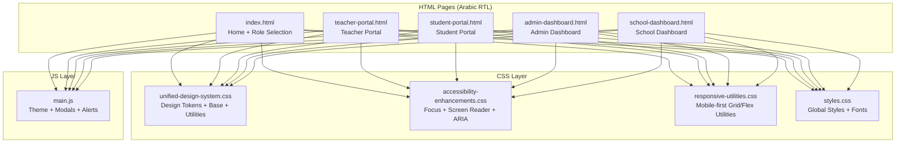
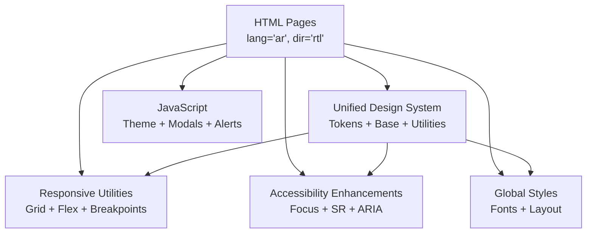
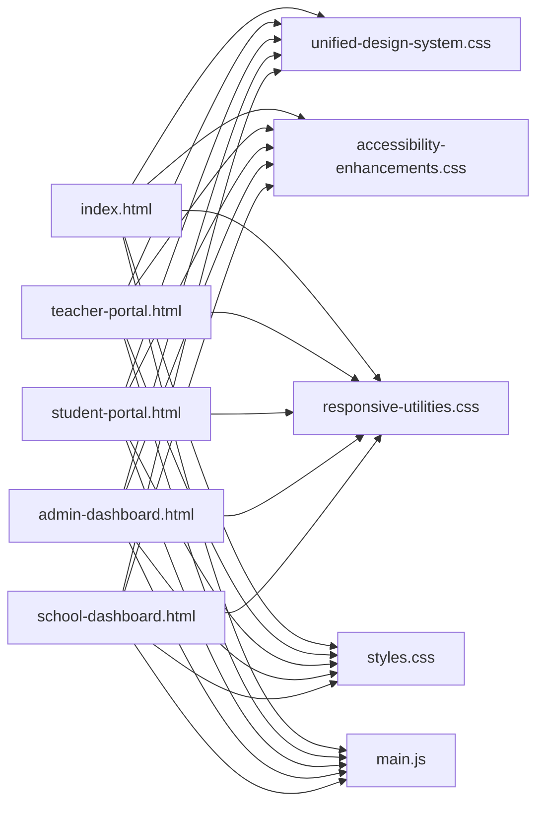

# Arabic RTL Interface

<cite>
**Referenced Files in This Document**
- [index.html](file://public/index.html)
- [teacher-portal.html](file://public/teacher-portal.html)
- [student-portal.html](file://public/student-portal.html)
- [admin-dashboard.html](file://public/admin-dashboard.html)
- [school-dashboard.html](file://public/school-dashboard.html)
- [unified-design-system.css](file://public/assets/css/unified-design-system.css)
- [accessibility-enhancements.css](file://public/assets/css/accessibility-enhancements.css)
- [responsive-utilities.css](file://public/assets/css/responsive-utilities.css)
- [styles.css](file://public/assets/css/styles.css)
- [main.js](file://public/assets/js/main.js)
</cite>

## Table of Contents
1. [Introduction](#introduction)
2. [Project Structure](#project-structure)
3. [Core Components](#core-components)
4. [Architecture Overview](#architecture-overview)
5. [Detailed Component Analysis](#detailed-component-analysis)
6. [Dependency Analysis](#dependency-analysis)
7. [Performance Considerations](#performance-considerations)
8. [Troubleshooting Guide](#troubleshooting-guide)
9. [Conclusion](#conclusion)

## Introduction
This document explains the Arabic Right-to-Left (RTL) interface implementation in EduFlow. It covers language support with proper RTL layout direction, Cairo font family usage for Arabic typography, bidirectional text handling, RTL CSS architecture using flexbox and grid, icon and form alignment, accessibility features for Arabic users, responsive design across Arabic RTL contexts, and cross-browser compatibility. Practical examples demonstrate Arabic text rendering, RTL component positioning, and culturally localized elements for Arabic educational environments.

## Project Structure
EduFlow’s Arabic RTL implementation spans HTML pages with explicit language and direction attributes, a unified design system, accessibility enhancements, responsive utilities, and shared JavaScript for interactive behaviors.

**Diagram sources**
- [index.html](file://public/index.html#L1-L345)
- [teacher-portal.html](file://public/teacher-portal.html#L1-L631)
- [student-portal.html](file://public/student-portal.html#L1-L800)
- [admin-dashboard.html](file://public/admin-dashboard.html#L1-L174)
- [school-dashboard.html](file://public/school-dashboard.html#L1-L800)
- [unified-design-system.css](file://public/assets/css/unified-design-system.css#L1-L983)
- [accessibility-enhancements.css](file://public/assets/css/accessibility-enhancements.css#L1-L627)
- [responsive-utilities.css](file://public/assets/css/responsive-utilities.css#L1-L662)
- [styles.css](file://public/assets/css/styles.css#L1-L800)
- [main.js](file://public/assets/js/main.js#L1-L153)

**Section sources**
- [index.html](file://public/index.html#L1-L345)
- [teacher-portal.html](file://public/teacher-portal.html#L1-L631)
- [student-portal.html](file://public/student-portal.html#L1-L800)
- [admin-dashboard.html](file://public/admin-dashboard.html#L1-L174)
- [school-dashboard.html](file://public/school-dashboard.html#L1-L800)
- [unified-design-system.css](file://public/assets/css/unified-design-system.css#L1-L983)
- [accessibility-enhancements.css](file://public/assets/css/accessibility-enhancements.css#L1-L627)
- [responsive-utilities.css](file://public/assets/css/responsive-utilities.css#L1-L662)
- [styles.css](file://public/assets/css/styles.css#L1-L800)
- [main.js](file://public/assets/js/main.js#L1-L153)

## Core Components
- Language and Direction: All pages declare Arabic language and RTL direction via the html lang="ar" and dir="rtl" attributes.
- Typography: Cairo font family is applied globally for Arabic readability and modern aesthetics.
- Unified Design System: CSS custom properties define consistent colors, typography, spacing, shadows, transitions, and breakpoints.
- Accessibility: Focus rings, skip links, screen-reader utilities, ARIA attributes, and reduced motion support.
- Responsive Utilities: Mobile-first grid and flex utilities with breakpoint-specific overrides.
- Interactive JS: Theme toggle, modal management, form validation, loading states, and notifications.

**Section sources**
- [index.html](file://public/index.html#L1-L345)
- [unified-design-system.css](file://public/assets/css/unified-design-system.css#L105-L108)
- [accessibility-enhancements.css](file://public/assets/css/accessibility-enhancements.css#L11-L36)
- [responsive-utilities.css](file://public/assets/css/responsive-utilities.css#L1-L662)
- [main.js](file://public/assets/js/main.js#L1-L153)

## Architecture Overview
The Arabic RTL architecture integrates HTML language/direction attributes with CSS design tokens and utilities, ensuring consistent layout, typography, and accessibility across portals.

**Diagram sources**
- [index.html](file://public/index.html#L1-L345)
- [unified-design-system.css](file://public/assets/css/unified-design-system.css#L1-L983)
- [accessibility-enhancements.css](file://public/assets/css/accessibility-enhancements.css#L1-L627)
- [responsive-utilities.css](file://public/assets/css/responsive-utilities.css#L1-L662)
- [styles.css](file://public/assets/css/styles.css#L1-L800)
- [main.js](file://public/assets/js/main.js#L1-L153)

## Detailed Component Analysis

### Arabic Language Support and RTL Direction
- Explicit language and direction: All HTML pages set lang="ar" and dir="rtl".
- Global font stack: Cairo is the primary font for Arabic text rendering and international compatibility.
- Bidirectional text handling: CSS utilities and layout patterns ensure proper text direction and alignment.

Practical example references:
- [index.html](file://public/index.html#L2-L2)
- [teacher-portal.html](file://public/teacher-portal.html#L2-L2)
- [student-portal.html](file://public/student-portal.html#L2-L2)
- [admin-dashboard.html](file://public/admin-dashboard.html#L2-L2)
- [school-dashboard.html](file://public/school-dashboard.html#L2-L2)
- [styles.css](file://public/assets/css/styles.css#L104-L113)

**Section sources**
- [index.html](file://public/index.html#L1-L345)
- [teacher-portal.html](file://public/teacher-portal.html#L1-L631)
- [student-portal.html](file://public/student-portal.html#L1-L800)
- [admin-dashboard.html](file://public/admin-dashboard.html#L1-L174)
- [school-dashboard.html](file://public/school-dashboard.html#L1-L800)
- [styles.css](file://public/assets/css/styles.css#L104-L113)

### Cairo Font Family and Typography
- Design tokens define Cairo as the base and heading font families.
- Typography scales, weights, line heights, and letter spacing are standardized for readability in Arabic.
- Global body font inherits Cairo for consistent Arabic typography.

Practical example references:
- [unified-design-system.css](file://public/assets/css/unified-design-system.css#L105-L108)
- [unified-design-system.css](file://public/assets/css/unified-design-system.css#L288-L297)

**Section sources**
- [unified-design-system.css](file://public/assets/css/unified-design-system.css#L105-L108)
- [unified-design-system.css](file://public/assets/css/unified-design-system.css#L288-L297)

### RTL CSS Architecture: Flexbox and Grid
- Flex utilities: flex-direction, align-items, justify-content, and responsive variants adapt to RTL.
- Grid utilities: grid-template-columns, gaps, and responsive overrides maintain proper alignment in RTL.
- Layout containers: role cards, dashboards, and tables use flex/grid to preserve RTL semantics.

Practical example references:
- [unified-design-system.css](file://public/assets/css/unified-design-system.css#L415-L421)
- [responsive-utilities.css](file://public/assets/css/responsive-utilities.css#L329-L377)
- [responsive-utilities.css](file://public/assets/css/responsive-utilities.css#L382-L419)
- [teacher-portal.html](file://public/teacher-portal.html#L203-L209)
- [school-dashboard.html](file://public/school-dashboard.html#L35-L62)

**Section sources**
- [unified-design-system.css](file://public/assets/css/unified-design-system.css#L415-L421)
- [responsive-utilities.css](file://public/assets/css/responsive-utilities.css#L329-L377)
- [responsive-utilities.css](file://public/assets/css/responsive-utilities.css#L382-L419)
- [teacher-portal.html](file://public/teacher-portal.html#L203-L209)
- [school-dashboard.html](file://public/school-dashboard.html#L35-L62)

### Icon Positioning and Form Element Alignment in RTL
- Icons inside buttons and headers are positioned consistently using flex utilities.
- Form labels and inputs align properly in RTL by leveraging text-align and direction-aware utilities.
- Tables and modals maintain proper alignment for Arabic content.

Practical example references:
- [index.html](file://public/index.html#L53-L63)
- [teacher-portal.html](file://public/teacher-portal.html#L101-L102)
- [school-dashboard.html](file://public/school-dashboard.html#L213-L229)

**Section sources**
- [index.html](file://public/index.html#L53-L63)
- [teacher-portal.html](file://public/teacher-portal.html#L101-L102)
- [school-dashboard.html](file://public/school-dashboard.html#L213-L229)

### Accessibility Features for Arabic Users
- Focus management: Custom focus rings and focus-visible polyfills ensure keyboard navigation clarity.
- Screen reader utilities: sr-only and aria-live regions provide meaningful announcements.
- ARIA attributes: aria-label, aria-describedby, aria-modal, and aria-required enhance semantic structure.
- Contrast and motion: High/low contrast modes and reduced motion support improve inclusivity.

Practical example references:
- [accessibility-enhancements.css](file://public/assets/css/accessibility-enhancements.css#L11-L36)
- [accessibility-enhancements.css](file://public/assets/css/accessibility-enhancements.css#L109-L132)
- [index.html](file://public/index.html#L106-L123)
- [student-portal.html](file://public/student-portal.html#L127-L153)

**Section sources**
- [accessibility-enhancements.css](file://public/assets/css/accessibility-enhancements.css#L11-L36)
- [accessibility-enhancements.css](file://public/assets/css/accessibility-enhancements.css#L109-L132)
- [index.html](file://public/index.html#L106-L123)
- [student-portal.html](file://public/student-portal.html#L127-L153)

### Responsive Design System for Arabic RTL
- Mobile-first approach: Breakpoints adjust spacing, typography, and layout for phones, tablets, and desktops.
- Grid and flex responsiveness: Utilities adapt to smaller screens while preserving RTL semantics.
- Portal-specific responsive tweaks: Dashboards and modals include targeted media queries for optimal RTL viewing.

Practical example references:
- [responsive-utilities.css](file://public/assets/css/responsive-utilities.css#L11-L144)
- [responsive-utilities.css](file://public/assets/css/responsive-utilities.css#L312-L376)
- [school-dashboard.html](file://public/school-dashboard.html#L99-L211)

**Section sources**
- [responsive-utilities.css](file://public/assets/css/responsive-utilities.css#L11-L144)
- [responsive-utilities.css](file://public/assets/css/responsive-utilities.css#L312-L376)
- [school-dashboard.html](file://public/school-dashboard.html#L99-L211)

### Cross-Browser Compatibility for RTL Interfaces
- CSS custom properties and modern layout APIs are used consistently across supported browsers.
- JavaScript fallbacks: focus-visible polyfill and reduced motion media queries ensure broader compatibility.
- Font loading: Google Fonts integration ensures Cairo availability across browsers.

Practical example references:
- [unified-design-system.css](file://public/assets/css/unified-design-system.css#L1-L271)
- [accessibility-enhancements.css](file://public/assets/css/accessibility-enhancements.css#L32-L36)
- [index.html](file://public/index.html#L7-L8)

**Section sources**
- [unified-design-system.css](file://public/assets/css/unified-design-system.css#L1-L271)
- [accessibility-enhancements.css](file://public/assets/css/accessibility-enhancements.css#L32-L36)
- [index.html](file://public/index.html#L7-L8)

### Practical Examples: Rendering Arabic Text and RTL Positioning
- Arabic text rendering: Cairo font applied globally; Arabic labels and placeholders in all portals.
- RTL component positioning: Role cards, dashboards, and modals use flex/grid utilities to align content right-to-left.
- Cultural localization: Arabic date pickers, number formats, and labels reflect local conventions.

Practical example references:
- [index.html](file://public/index.html#L45-L102)
- [teacher-portal.html](file://public/teacher-portal.html#L414-L461)
- [student-portal.html](file://public/student-portal.html#L34-L43)
- [school-dashboard.html](file://public/school-dashboard.html#L288-L309)

**Section sources**
- [index.html](file://public/index.html#L45-L102)
- [teacher-portal.html](file://public/teacher-portal.html#L414-L461)
- [student-portal.html](file://public/student-portal.html#L34-L43)
- [school-dashboard.html](file://public/school-dashboard.html#L288-L309)

## Dependency Analysis
The Arabic RTL implementation relies on a layered dependency model: HTML pages depend on CSS design systems and utilities, which in turn rely on shared design tokens and accessibility patterns. JavaScript enhances interactivity while respecting RTL semantics.

**Diagram sources**
- [index.html](file://public/index.html#L1-L345)
- [teacher-portal.html](file://public/teacher-portal.html#L1-L631)
- [student-portal.html](file://public/student-portal.html#L1-L800)
- [admin-dashboard.html](file://public/admin-dashboard.html#L1-L174)
- [school-dashboard.html](file://public/school-dashboard.html#L1-L800)
- [unified-design-system.css](file://public/assets/css/unified-design-system.css#L1-L983)
- [accessibility-enhancements.css](file://public/assets/css/accessibility-enhancements.css#L1-L627)
- [responsive-utilities.css](file://public/assets/css/responsive-utilities.css#L1-L662)
- [styles.css](file://public/assets/css/styles.css#L1-L800)
- [main.js](file://public/assets/js/main.js#L1-L153)

**Section sources**
- [index.html](file://public/index.html#L1-L345)
- [teacher-portal.html](file://public/teacher-portal.html#L1-L631)
- [student-portal.html](file://public/student-portal.html#L1-L800)
- [admin-dashboard.html](file://public/admin-dashboard.html#L1-L174)
- [school-dashboard.html](file://public/school-dashboard.html#L1-L800)
- [unified-design-system.css](file://public/assets/css/unified-design-system.css#L1-L983)
- [accessibility-enhancements.css](file://public/assets/css/accessibility-enhancements.css#L1-L627)
- [responsive-utilities.css](file://public/assets/css/responsive-utilities.css#L1-L662)
- [styles.css](file://public/assets/css/styles.css#L1-L800)
- [main.js](file://public/assets/js/main.js#L1-L153)

## Performance Considerations
- CSS custom properties enable efficient theming and reduce duplication.
- Utility-first classes minimize custom CSS and promote reuse.
- Media queries are scoped to breakpoints to avoid unnecessary recalculations.
- JavaScript interactions (modals, alerts) are lightweight and avoid heavy DOM manipulation.

[No sources needed since this section provides general guidance]

## Troubleshooting Guide
Common issues and resolutions for Arabic RTL interfaces:
- Text direction problems: Verify dir="rtl" and lang="ar" on html; ensure CSS utilities override defaults.
- Font rendering: Confirm Cairo font loads from CDN; fallback fonts remain usable.
- Focus visibility: Ensure custom focus rings are applied and focus-visible polyfill is active.
- Responsive layout shifts: Check breakpoint-specific utilities and media queries.
- Modal accessibility: Confirm aria-modal and focus trapping are present.

**Section sources**
- [index.html](file://public/index.html#L1-L345)
- [accessibility-enhancements.css](file://public/assets/css/accessibility-enhancements.css#L11-L36)
- [responsive-utilities.css](file://public/assets/css/responsive-utilities.css#L11-L144)
- [main.js](file://public/assets/js/main.js#L1-L153)

## Conclusion
EduFlow’s Arabic RTL interface combines explicit language and direction attributes with a robust unified design system, accessibility enhancements, and responsive utilities. The Cairo font family ensures excellent Arabic typography, while flexbox and grid utilities maintain proper RTL layout. Accessibility features and responsive design deliver inclusive, cross-browser experiences tailored for Arabic educational environments.