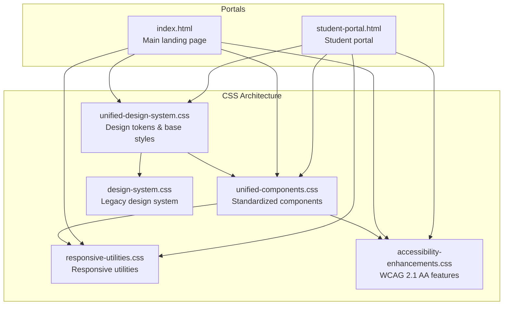
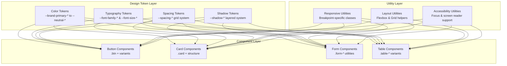
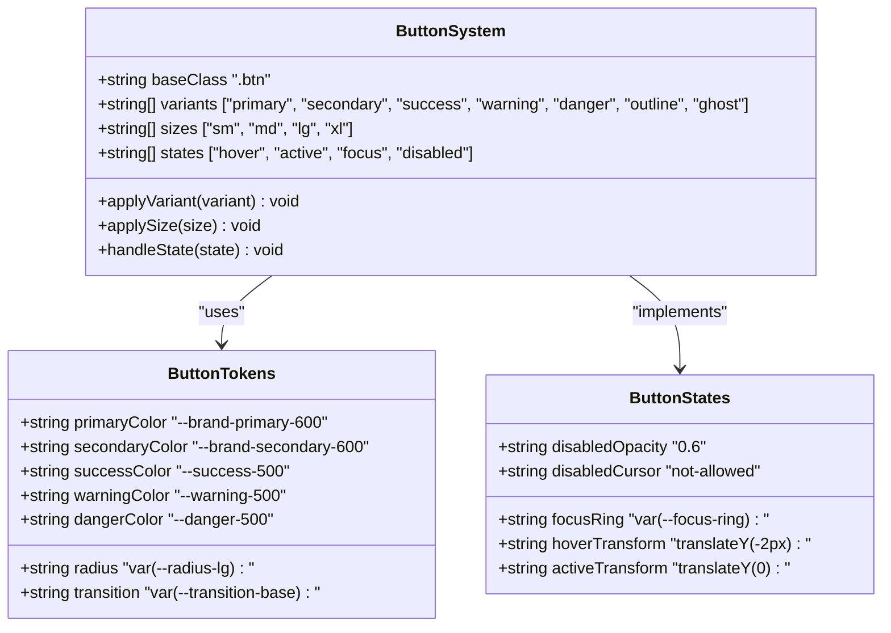
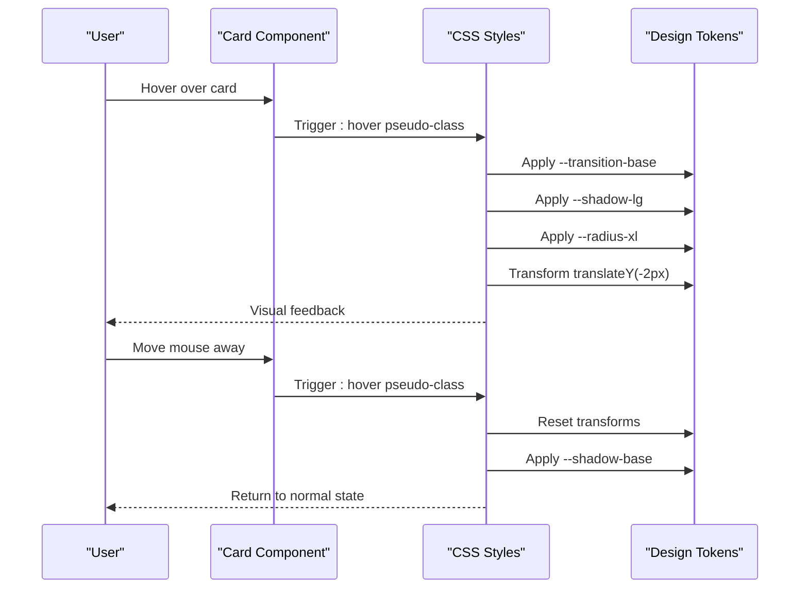
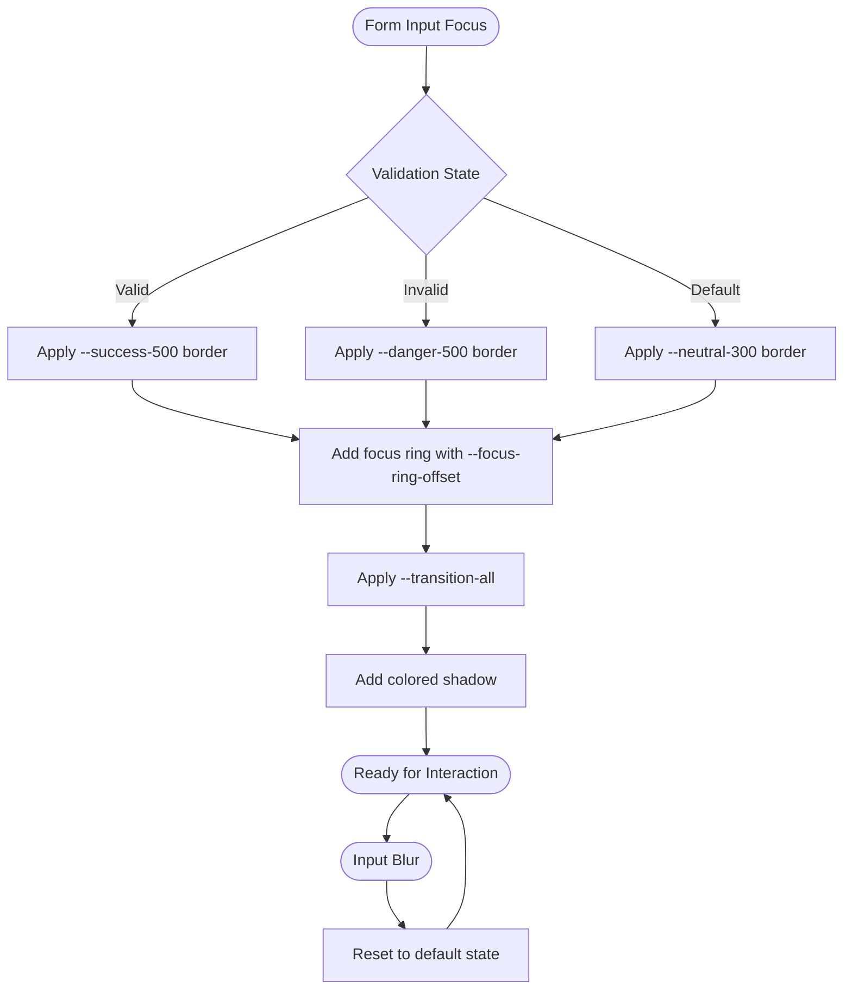
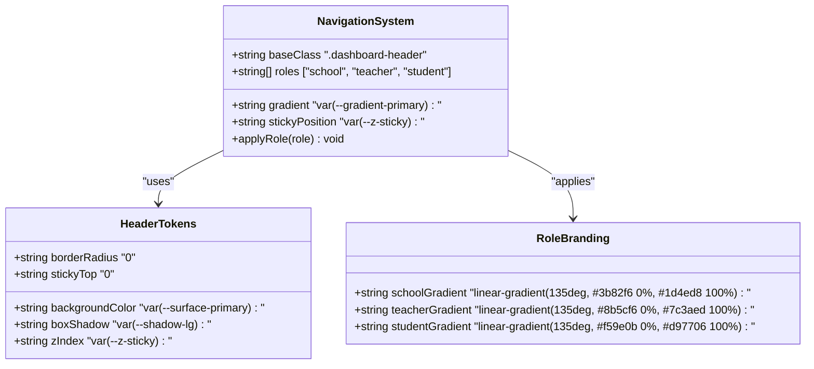
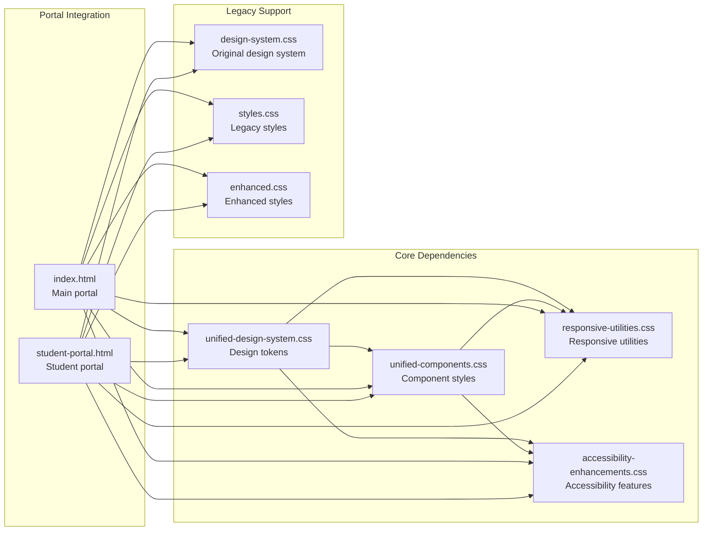

# Design System Implementation

<cite>
**Referenced Files in This Document**
- [UNIFIED_DESIGN_SYSTEM.md](file://UNIFIED_DESIGN_SYSTEM.md)
- [DESIGN_SYSTEM_IMPLEMENTATION_SUMMARY.md](file://DESIGN_SYSTEM_IMPLEMENTATION_SUMMARY.md)
- [unified-design-system.css](file://public/assets/css/unified-design-system.css)
- [unified-components.css](file://public/assets/css/unified-components.css)
- [responsive-utilities.css](file://public/assets/css/responsive-utilities.css)
- [accessibility-enhancements.css](file://public/assets/css/accessibility-enhancements.css)
- [design-system.css](file://public/assets/css/design-system.css)
- [index.html](file://public/index.html)
- [student-portal.html](file://public/student-portal.html)
</cite>

## Table of Contents
1. [Introduction](#introduction)
2. [Project Structure](#project-structure)
3. [Core Components](#core-components)
4. [Architecture Overview](#architecture-overview)
5. [Detailed Component Analysis](#detailed-component-analysis)
6. [Dependency Analysis](#dependency-analysis)
7. [Performance Considerations](#performance-considerations)
8. [Troubleshooting Guide](#troubleshooting-guide)
9. [Conclusion](#conclusion)
10. [Appendices](#appendices)

## Introduction
This document provides comprehensive documentation for the unified design system implementation in EduFlow. It covers design tokens (color palette, typography, spacing), component library (buttons, cards, forms, navigation, tables), CSS architecture (modular design system with CSS custom properties), responsive design and accessibility compliance, integration across portals, customization options, and maintenance guidelines. The design system ensures consistent, professional styling across all application portals while maintaining backward compatibility with legacy styles.

## Project Structure
The design system is implemented through a modular CSS architecture with dedicated files for design tokens, components, utilities, and accessibility features. The structure supports a mobile-first responsive approach and WCAG 2.1 AA compliance.



**Diagram sources**
- [unified-design-system.css](file://public/assets/css/unified-design-system.css#L1-L271)
- [unified-components.css](file://public/assets/css/unified-components.css#L1-L672)
- [responsive-utilities.css](file://public/assets/css/responsive-utilities.css#L1-L662)
- [accessibility-enhancements.css](file://public/assets/css/accessibility-enhancements.css#L1-L627)
- [design-system.css](file://public/assets/css/design-system.css#L1-L1079)
- [index.html](file://public/index.html#L1-L16)
- [student-portal.html](file://public/student-portal.html#L1-L16)

**Section sources**
- [UNIFIED_DESIGN_SYSTEM.md](file://UNIFIED_DESIGN_SYSTEM.md#L7-L19)
- [DESIGN_SYSTEM_IMPLEMENTATION_SUMMARY.md](file://DESIGN_SYSTEM_IMPLEMENTATION_SUMMARY.md#L66-L78)

## Core Components
The design system defines comprehensive design tokens and standardized components that ensure visual consistency and developer productivity.

### Design Tokens
The design system establishes a complete set of CSS custom properties for consistent theming:

- **Color System**: Professional palette with brand primary/secondary colors, success/warning/danger status colors, neutral grays, and text/background surfaces
- **Typography**: Cairo font family for Arabic text, comprehensive font size scale (12px-48px), and extensive font weight range (100-900)
- **Spacing**: 8-point grid system from 0 to 384px with consistent increments
- **Shadows**: Layered shadow system (xs to 2xl) with colored variants for interactive elements
- **Transitions**: Smooth animation timing with easing functions
- **Breakpoints**: Mobile-first responsive breakpoints (xs to 2xl)
- **Z-index Scale**: Hierarchical stacking context management

### Component Library
The unified component library provides standardized UI elements:

- **Buttons**: 7 variants (primary, secondary, success, warning, danger, outline, ghost) with consistent sizing and states
- **Cards**: Header/body/footer structure with hover effects and elevation
- **Forms**: Standardized inputs with validation states and focus management
- **Tables**: Portal-specific styling with hover effects and responsive behavior
- **Navigation**: Header components with role-based styling
- **Utilities**: Comprehensive spacing, display, flexbox, grid, and positioning utilities

**Section sources**
- [UNIFIED_DESIGN_SYSTEM.md](file://UNIFIED_DESIGN_SYSTEM.md#L21-L69)
- [UNIFIED_DESIGN_SYSTEM.md](file://UNIFIED_DESIGN_SYSTEM.md#L70-L131)
- [unified-design-system.css](file://public/assets/css/unified-design-system.css#L11-L271)

## Architecture Overview
The design system follows a modular architecture with clear separation of concerns:



**Diagram sources**
- [unified-design-system.css](file://public/assets/css/unified-design-system.css#L11-L271)
- [unified-components.css](file://public/assets/css/unified-components.css#L1-L672)
- [responsive-utilities.css](file://public/assets/css/responsive-utilities.css#L1-L662)
- [accessibility-enhancements.css](file://public/assets/css/accessibility-enhancements.css#L1-L627)

## Detailed Component Analysis

### Button Components
The button system provides comprehensive variant coverage with consistent styling and interaction patterns:



**Diagram sources**
- [unified-components.css](file://public/assets/css/unified-components.css#L426-L576)
- [unified-design-system.css](file://public/assets/css/unified-design-system.css#L462-L530)

Key button features include:
- **Consistent sizing**: Standard 44px minimum touch target with scalable variants
- **Visual feedback**: Hover, active, and focus states with elevation changes
- **Accessibility**: Proper focus management and ARIA support
- **Responsive behavior**: Adaptive layouts for mobile and desktop

**Section sources**
- [unified-components.css](file://public/assets/css/unified-components.css#L426-L576)
- [unified-design-system.css](file://public/assets/css/unified-design-system.css#L462-L530)

### Card Components
The card system provides flexible content containers with consistent styling and interaction patterns:



**Diagram sources**
- [unified-components.css](file://public/assets/css/unified-components.css#L653-L682)
- [unified-design-system.css](file://public/assets/css/unified-design-system.css#L659-L666)

Card features include:
- **Header/Footer structure**: Consistent layout with border separation
- **Elevation system**: Shadow transitions for depth perception
- **Interactive states**: Smooth transform animations and hover effects
- **Responsive padding**: Adaptive spacing for different screen sizes

**Section sources**
- [unified-components.css](file://public/assets/css/unified-components.css#L653-L682)
- [unified-design-system.css](file://public/assets/css/unified-design-system.css#L659-L666)

### Form Components
The form system ensures consistent input styling with comprehensive validation states:



**Diagram sources**
- [unified-components.css](file://public/assets/css/unified-components.css#L684-L752)
- [unified-design-system.css](file://public/assets/css/unified-design-system.css#L711-L736)

Form features include:
- **Validation states**: Visual indicators for success and error conditions
- **Focus management**: Consistent focus rings with proper offset
- **Placeholder styling**: Subtle text styling for hint text
- **Disabled states**: Proper opacity and cursor changes

**Section sources**
- [unified-components.css](file://public/assets/css/unified-components.css#L684-L752)
- [unified-design-system.css](file://public/assets/css/unified-design-system.css#L711-L736)

### Navigation Components
The navigation system provides role-based header styling with consistent branding:



**Diagram sources**
- [unified-components.css](file://public/assets/css/unified-components.css#L80-L115)
- [unified-design-system.css](file://public/assets/css/unified-design-system.css#L262-L271)

Navigation features include:
- **Role-based theming**: Distinct visual identity per user role
- **Sticky positioning**: Fixed header behavior for improved UX
- **Gradient branding**: Professional color transitions
- **Responsive layout**: Adaptive header structure for different screen sizes

**Section sources**
- [unified-components.css](file://public/assets/css/unified-components.css#L80-L115)
- [unified-design-system.css](file://public/assets/css/unified-design-system.css#L262-L271)

## Dependency Analysis
The design system maintains clear dependencies between modules to ensure consistency and maintainability.



**Diagram sources**
- [unified-design-system.css](file://public/assets/css/unified-design-system.css#L1-L271)
- [unified-components.css](file://public/assets/css/unified-components.css#L1-L672)
- [responsive-utilities.css](file://public/assets/css/responsive-utilities.css#L1-L662)
- [accessibility-enhancements.css](file://public/assets/css/accessibility-enhancements.css#L1-L627)
- [design-system.css](file://public/assets/css/design-system.css#L1-L1079)
- [index.html](file://public/index.html#L1-L16)
- [student-portal.html](file://public/student-portal.html#L1-L16)

The dependency chain ensures that:
- Design tokens are defined centrally and consumed by components
- Components build upon design tokens for consistency
- Utilities enhance components with responsive and accessibility features
- Portals integrate all layers in a specific order for optimal performance

**Section sources**
- [UNIFIED_DESIGN_SYSTEM.md](file://UNIFIED_DESIGN_SYSTEM.md#L214-L225)
- [DESIGN_SYSTEM_IMPLEMENTATION_SUMMARY.md](file://DESIGN_SYSTEM_IMPLEMENTATION_SUMMARY.md#L278-L298)

## Performance Considerations
The design system is optimized for performance through several key strategies:

### CSS Architecture Benefits
- **Variable-based theming**: Centralized design tokens reduce CSS duplication
- **Modular structure**: Independent modules enable selective loading
- **Efficient selectors**: Simple class-based selectors minimize specificity conflicts
- **Minimal overrides**: Clear hierarchy prevents cascade complexity

### Responsive Performance
- **Mobile-first approach**: Progressive enhancement reduces unnecessary styles
- **Media query optimization**: Strategic breakpoint application
- **Touch-friendly targets**: 44px minimum for better performance on mobile devices
- **Reduced motion support**: Performance-conscious animations for sensitive users

### Browser Compatibility
- **Modern CSS features**: Flexbox, Grid, and custom properties with fallbacks
- **Progressive enhancement**: Graceful degradation for older browsers
- **Performance budget**: Optimized animation timing and transitions

**Section sources**
- [UNIFIED_DESIGN_SYSTEM.md](file://UNIFIED_DESIGN_SYSTEM.md#L299-L313)
- [accessibility-enhancements.css](file://public/assets/css/accessibility-enhancements.css#L179-L204)

## Troubleshooting Guide
Common issues and solutions when working with the design system:

### Color Contrast Issues
**Problem**: Insufficient color contrast in custom implementations
**Solution**: Use design tokens from `unified-design-system.css` that meet WCAG 2.1 AA requirements
- Primary text: `var(--text-primary)` (#111827)
- Secondary text: `var(--text-secondary)` (#374151)
- Success states: `var(--success-500)` (#22c55e)
- Error states: `var(--danger-500)` (#ef4444)

### Responsive Layout Problems
**Problem**: Components not adapting properly to different screen sizes
**Solution**: Implement responsive utilities from `responsive-utilities.css`
- Use breakpoint prefixes: `.sm:`, `.md:`, `.lg:`
- Leverage grid utilities: `.grid-container`, `.grid-auto-fit`
- Apply flex utilities: `.d-flex`, `.flex-col`, `.items-center`

### Accessibility Concerns
**Problem**: Focus management and screen reader compatibility issues
**Solution**: Utilize accessibility features from `accessibility-enhancements.css`
- Implement skip links for keyboard navigation
- Use `.sr-only` class for screen reader content
- Ensure proper ARIA attributes on interactive elements
- Test with focus-visible polyfills for older browsers

### Component Styling Conflicts
**Problem**: Custom component styles overriding design system defaults
**Solution**: Follow the established component hierarchy
- Use base classes first: `.btn`, `.card`, `.form-control`
- Apply variant classes: `.btn-primary`, `.card-header`
- Avoid inline styles that bypass the token system

**Section sources**
- [accessibility-enhancements.css](file://public/assets/css/accessibility-enhancements.css#L11-L67)
- [responsive-utilities.css](file://public/assets/css/responsive-utilities.css#L312-L376)
- [unified-components.css](file://public/assets/css/unified-components.css#L426-L576)

## Conclusion
The EduFlow unified design system provides a comprehensive, maintainable foundation for consistent user experience across all application portals. Through carefully crafted design tokens, standardized components, and robust accessibility features, the system ensures professional appearance while supporting educational institution customization needs. The modular architecture enables easy maintenance and extension, while the mobile-first responsive approach guarantees optimal user experience across devices.

Key achievements include:
- **Visual consistency**: Unified color palette and typography across all portals
- **Professional appearance**: Modern component design with appropriate visual hierarchy
- **Developer productivity**: Reusable components and comprehensive utility system
- **Accessibility compliance**: WCAG 2.1 AA compliant implementation
- **Performance optimization**: Efficient CSS architecture with minimal overhead

The design system successfully balances consistency with flexibility, providing a solid foundation for future enhancements while maintaining backward compatibility with existing functionality.

## Appendices

### Design System Usage Examples
The design system provides practical examples for common implementation scenarios:

#### Basic Card Implementation
```html
<div class="card">
  <div class="card-header">
    <h3 class="section-title"><i class="fas fa-user"></i> User Profile</h3>
  </div>
  <div class="card-body">
    <p>User information content...</p>
  </div>
</div>
```

#### Button Variant Usage
```html
<button class="btn btn-primary">Primary Action</button>
<button class="btn btn-secondary">Secondary Action</button>
<button class="btn btn-success">Success Action</button>
<button class="btn btn-outline">Outline Button</button>
```

#### Responsive Grid Layout
```html
<div class="grid-container grid-auto-fit">
  <div class="card">Content 1</div>
  <div class="card">Content 2</div>
  <div class="card">Content 3</div>
</div>
```

### Customization Guidelines
For educational institution customization:

1. **Brand Color Integration**: Modify `--brand-primary-*` and `--brand-secondary-*` tokens
2. **Typography Customization**: Update `--font-family-base` for institution-specific fonts
3. **Component Variants**: Extend button and card variants through additional CSS classes
4. **Portal Theming**: Customize role-based headers using existing variant classes
5. **Accessibility Extensions**: Add institutional accessibility requirements to existing enhancement framework

### Maintenance Guidelines
- **Token Updates**: Modify design tokens in `unified-design-system.css` for global changes
- **Component Extensions**: Add new components to `unified-components.css` following established patterns
- **Utility Updates**: Extend responsive utilities in `responsive-utilities.css` for new breakpoints
- **Accessibility Enhancements**: Update `accessibility-enhancements.css` for new compliance requirements
- **Documentation**: Maintain `UNIFIED_DESIGN_SYSTEM.md` with usage examples and migration guides

**Section sources**
- [UNIFIED_DESIGN_SYSTEM.md](file://UNIFIED_DESIGN_SYSTEM.md#L90-L119)
- [UNIFIED_DESIGN_SYSTEM.md](file://UNIFIED_DESIGN_SYSTEM.md#L167-L185)
- [UNIFIED_DESIGN_SYSTEM.md](file://UNIFIED_DESIGN_SYSTEM.md#L314-L329)