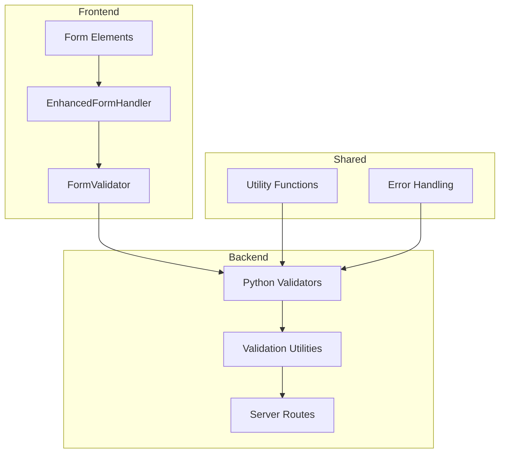
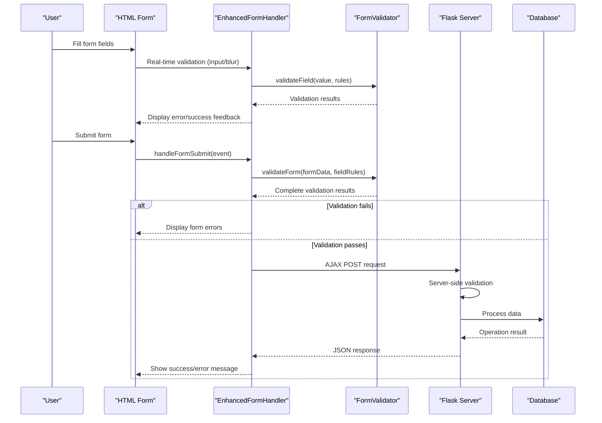
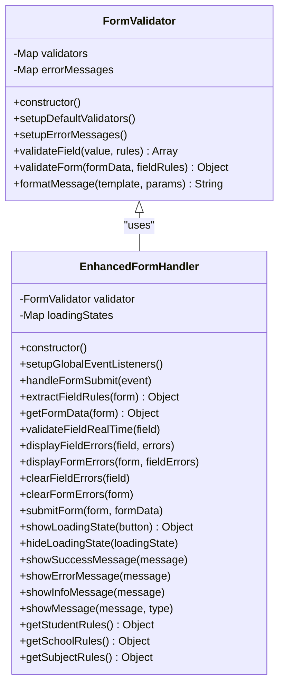
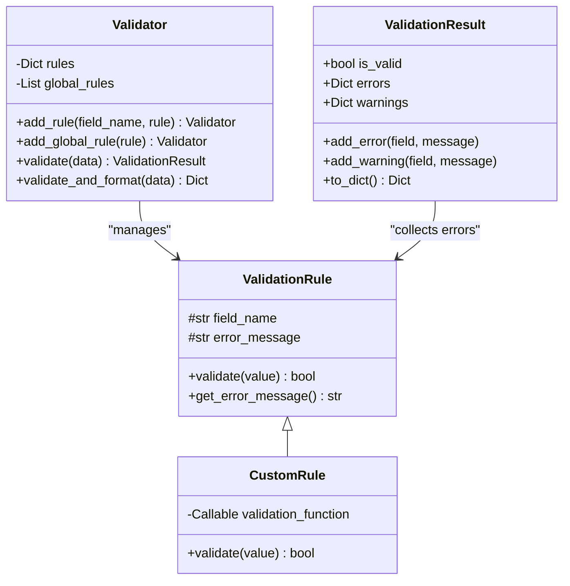
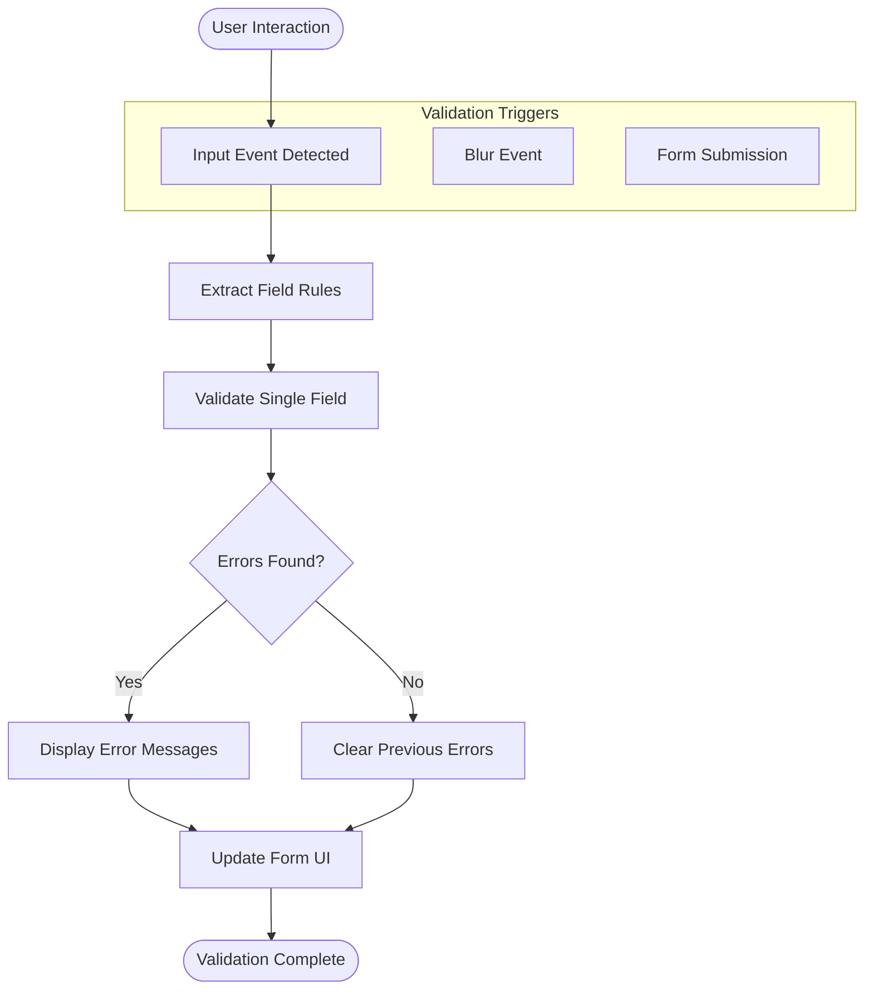
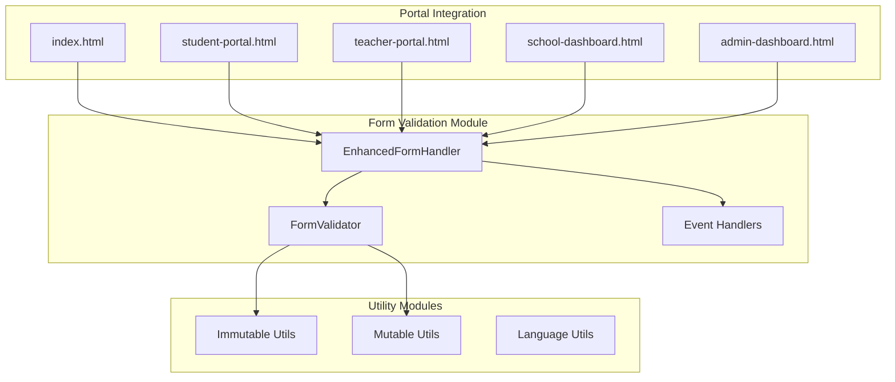
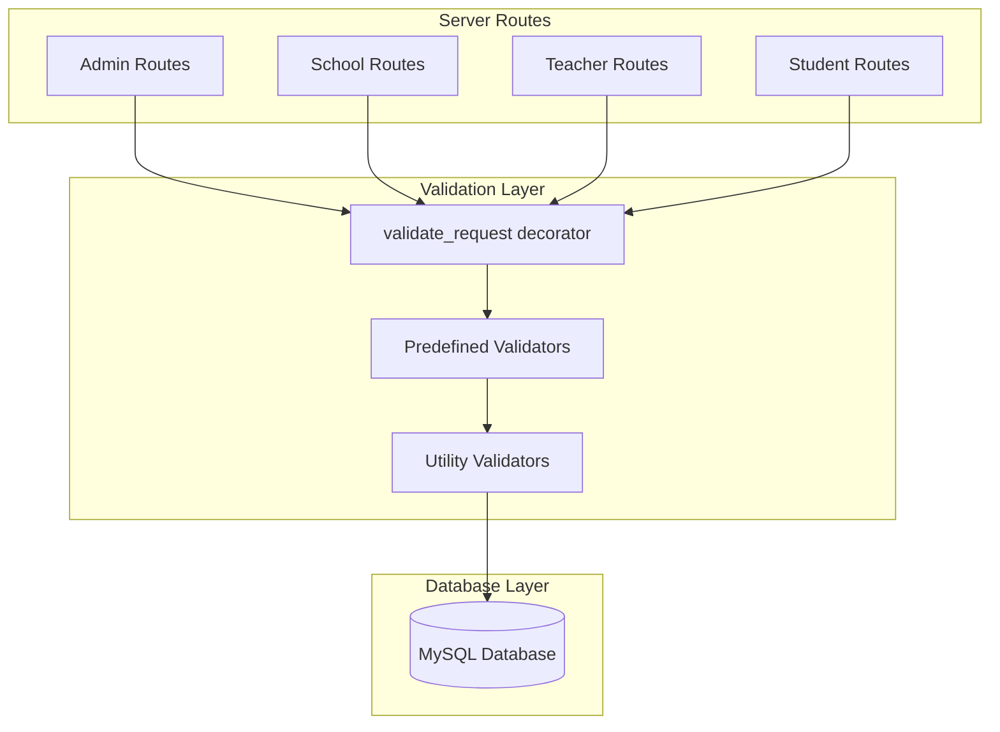

# Form Validation System

<cite>
**Referenced Files in This Document**
- [form-validation.js](file://public/assets/js/form-validation.js)
- [validation.py](file://validation.py)
- [validation_helpers.py](file://validation_helpers.py)
- [utils.py](file://utils.py)
- [index.html](file://public/index.html)
- [student-portal.html](file://public/student-portal.html)
- [teacher-portal.html](file://public/teacher-portal.html)
- [school-dashboard.html](file://public/school-dashboard.html)
- [admin-dashboard.html](file://public/admin-dashboard.html)
- [server.py](file://server.py)
- [immutable.js](file://public/assets/js/immutable.js)
- [mutable.js](file://public/assets/js/mutable.js)
</cite>

## Table of Contents
1. [Introduction](#introduction)
2. [Project Structure](#project-structure)
3. [Core Components](#core-components)
4. [Architecture Overview](#architecture-overview)
5. [Detailed Component Analysis](#detailed-component-analysis)
6. [Dependency Analysis](#dependency-analysis)
7. [Performance Considerations](#performance-considerations)
8. [Troubleshooting Guide](#troubleshooting-guide)
9. [Conclusion](#conclusion)

## Introduction
This document provides comprehensive documentation for the form validation system implementation in EduFlow. The system combines client-side validation with real-time feedback and robust server-side validation to ensure data integrity across multiple portals (admin, school, teacher, student). It features multilingual error messaging, dynamic validation updates, and integration with backend APIs for secure and reliable form processing.

## Project Structure
The validation system spans both frontend and backend components:
- Frontend: Client-side validation engine with real-time feedback
- Backend: Python-based validation framework with Flask integration
- Shared utilities: Common validation helpers and error handling

**Diagram sources**
- [form-validation.js](file://public/assets/js/form-validation.js#L6-L217)
- [validation.py](file://validation.py#L10-L240)
- [utils.py](file://utils.py#L19-L405)

**Section sources**
- [form-validation.js](file://public/assets/js/form-validation.js#L1-L561)
- [validation.py](file://validation.py#L1-L376)
- [utils.py](file://utils.py#L1-L405)

## Core Components
The validation system consists of three primary components working in tandem:

### Client-Side Validation Engine
The FormValidator class provides comprehensive validation capabilities with:
- Built-in validators for common patterns (required, email, phone, numeric ranges)
- Custom validators for domain-specific requirements (blood type, grade format)
- Real-time validation with immediate feedback
- Multilingual error message support (English/Arabic)

### Enhanced Form Handler
The EnhancedFormHandler manages the complete form lifecycle:
- Automatic event listener setup for form submissions
- Real-time validation on input and blur events
- Dynamic error display and removal
- AJAX form submission with loading states
- Success/error message handling

### Server-Side Validation Framework
The Python-based validation system offers:
- Type-safe validation rules with detailed error reporting
- Custom validation logic for complex business rules
- Integration with Flask request validation decorators
- Comprehensive error handling and response formatting

**Section sources**
- [form-validation.js](file://public/assets/js/form-validation.js#L6-L217)
- [validation.py](file://validation.py#L10-L240)
- [utils.py](file://utils.py#L27-L186)

## Architecture Overview
The validation system follows a dual-layer architecture ensuring both user experience and data integrity:

**Diagram sources**
- [form-validation.js](file://public/assets/js/form-validation.js#L226-L430)
- [server.py](file://server.py#L142-L200)

## Detailed Component Analysis

### FormValidator Class
The FormValidator provides a flexible validation framework with extensible rule sets:

**Diagram sources**
- [form-validation.js](file://public/assets/js/form-validation.js#L6-L217)
- [form-validation.js](file://public/assets/js/form-validation.js#L219-L551)

#### Validation Rules Implementation
The system implements comprehensive validation rules for different input types:

**Text Validation Rules:**
- Required field validation with support for strings, arrays, and objects
- Length validation (minLength, maxLength) for text inputs
- Arabic text validation supporting Unicode characters and RTL formatting

**Numeric Validation Rules:**
- Range validation (min, max) with configurable bounds
- Integer validation ensuring whole numbers only
- Grade-specific validation for educational contexts

**Specialized Validation Rules:**
- Blood type validation (O+, O-, A+, A-, B+, B-, AB+, AB-)
- Educational level validation (ابتدائي, متوسطة, ثانوية, إعدادية)
- Study type validation (صباحي, مسائي)
- Gender type validation (بنين, بنات, مختلطة)

**Section sources**
- [form-validation.js](file://public/assets/js/form-validation.js#L14-L97)

### Server-Side Validation Integration
The Python validation system provides robust backend validation:

**Diagram sources**
- [validation.py](file://validation.py#L10-L240)
- [validation.py](file://validation.py#L174-L240)

#### Predefined Entity Validators
The system includes specialized validators for EduFlow entities:

**Student Validator:**
- Full name validation with length constraints
- Grade format validation ensuring proper educational level formatting
- Room assignment validation
- Blood type and contact information validation

**School Validator:**
- Name validation with minimum length requirements
- Study type validation (صباحي/مسائي)
- Educational level validation
- Gender type validation (بنين/بنات/مختلطة)

**Subject Validator:**
- Subject name validation with length constraints
- Grade level specification validation

**Section sources**
- [validation.py](file://validation.py#L263-L331)

### Real-Time Validation Implementation
The EnhancedFormHandler provides sophisticated real-time validation:

**Diagram sources**
- [form-validation.js](file://public/assets/js/form-validation.js#L235-L329)

#### Event-Driven Validation Flow
The system responds to multiple user interaction patterns:
- **Real-time validation:** Triggered on input events for immediate feedback
- **Blur validation:** Validates fields when users leave input areas
- **Form submission:** Comprehensive validation before data processing
- **Dynamic rule updates:** Support for changing validation rules based on form state

**Section sources**
- [form-validation.js](file://public/assets/js/form-validation.js#L226-L329)

### Multilingual Error Handling
The validation system supports both English and Arabic error messages:

**Error Message Architecture:**
- Centralized error message templates
- Language detection based on document element attributes
- Parameterized message formatting for dynamic values
- Seamless switching between English and Arabic locales

**Implementation Details:**
- Error messages stored in structured format with language keys
- Automatic language detection using `document.documentElement.lang`
- Support for parameter substitution in validation messages
- Consistent error presentation across all form types

**Section sources**
- [form-validation.js](file://public/assets/js/form-validation.js#L99-L164)

## Dependency Analysis

### Frontend Dependencies
The client-side validation system maintains loose coupling through modular design:

**Diagram sources**
- [form-validation.js](file://public/assets/js/form-validation.js#L553-L561)
- [immutable.js](file://public/assets/js/immutable.js#L1-L20)
- [mutable.js](file://public/assets/js/mutable.js#L1-L18)

### Backend Integration Points
The server-side validation integrates with the Flask application:

**Diagram sources**
- [server.py](file://server.py#L142-L200)
- [validation.py](file://validation.py#L332-L367)

**Section sources**
- [form-validation.js](file://public/assets/js/form-validation.js#L553-L561)
- [validation.py](file://validation.py#L332-L367)
- [server.py](file://server.py#L142-L200)

## Performance Considerations
The validation system incorporates several performance optimization strategies:

### Client-Side Optimizations
- **Debounced validation:** Prevents excessive validation calls during rapid input
- **Selective validation:** Only validates changed fields rather than entire forms
- **Efficient DOM manipulation:** Minimizes DOM operations during error display
- **Memory management:** Proper cleanup of event listeners and validation state

### Server-Side Optimizations
- **Early validation exit:** Stops validation process upon first failure
- **Batch validation:** Processes multiple fields efficiently
- **Connection pooling:** Optimizes database connections for validation queries
- **Response caching:** Caches frequently accessed validation data

### Scalability Features
- **Modular architecture:** Allows independent scaling of validation components
- **Asynchronous processing:** Supports non-blocking validation operations
- **Resource pooling:** Manages shared resources efficiently across requests

## Troubleshooting Guide

### Common Validation Issues
**Client-Side Validation Failures:**
- Verify that form elements have proper `data-rules` attributes
- Check that validation rules match expected data types
- Ensure proper event listener initialization
- Confirm language settings are correctly configured

**Server-Side Validation Failures:**
- Review validation decorator usage on API endpoints
- Verify database connection and query execution
- Check error response formatting and localization
- Monitor validation rule configuration

### Debugging Strategies
**Frontend Debugging:**
- Use browser developer tools to inspect validation events
- Monitor network requests for validation API calls
- Check console for validation error messages
- Verify CSS class application for error states

**Backend Debugging:**
- Enable detailed logging for validation operations
- Test individual validation rules in isolation
- Verify database schema matches validation expectations
- Monitor response times for validation operations

**Section sources**
- [form-validation.js](file://public/assets/js/form-validation.js#L275-L291)
- [validation.py](file://validation.py#L344-L367)

## Conclusion
The EduFlow form validation system provides a comprehensive, multilingual validation framework that ensures data integrity while delivering excellent user experience. The dual-layer architecture combining client-side real-time validation with robust server-side processing creates a resilient system capable of handling complex educational data validation requirements across multiple user roles and portals.

The system's modular design, extensive customization options, and performance optimizations make it suitable for enterprise-scale educational applications while maintaining accessibility and internationalization standards.