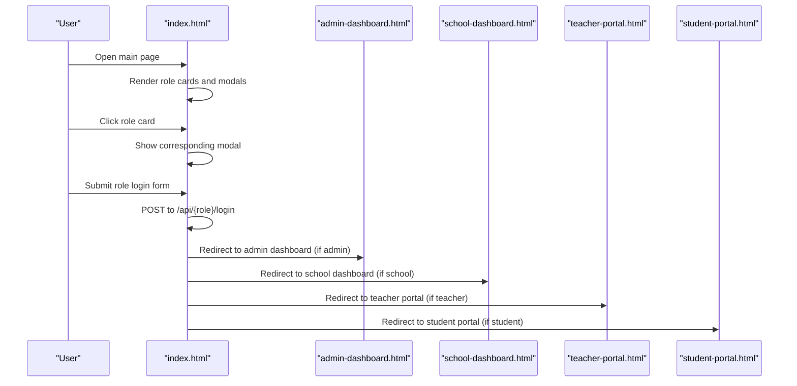
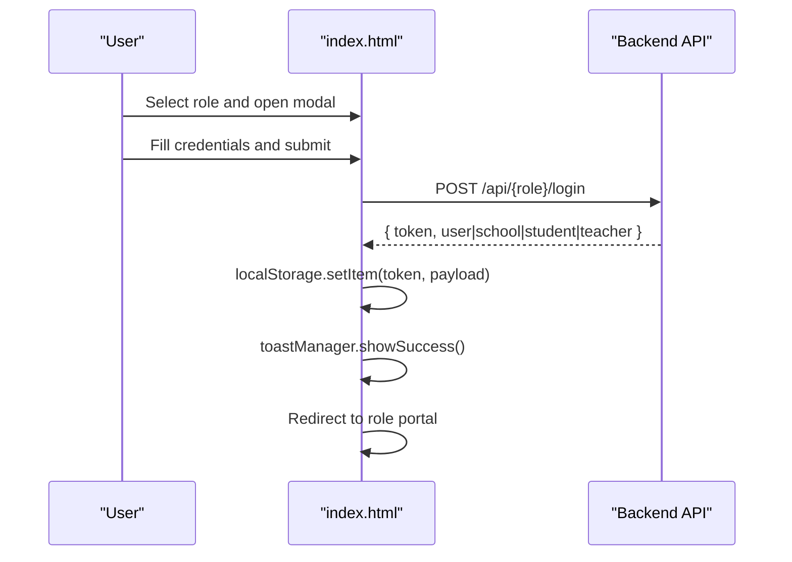
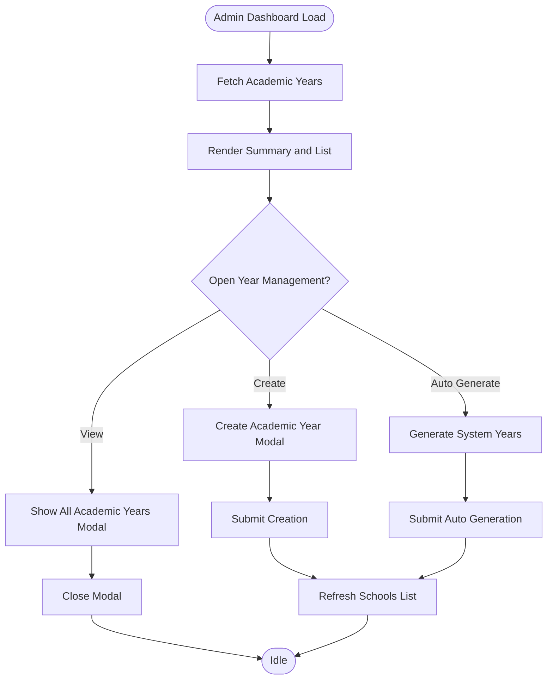
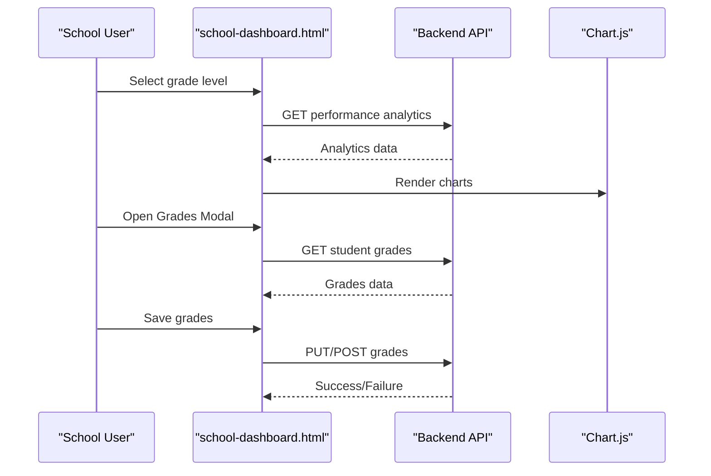
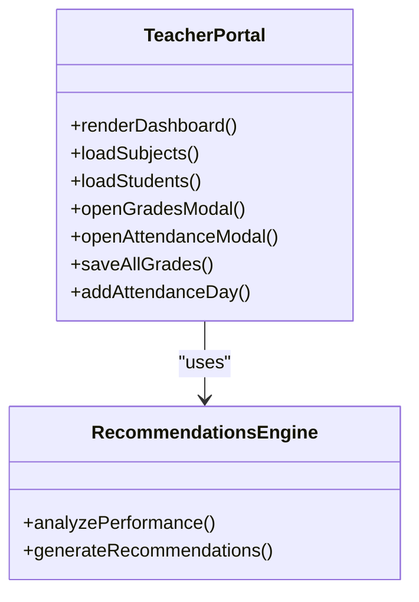
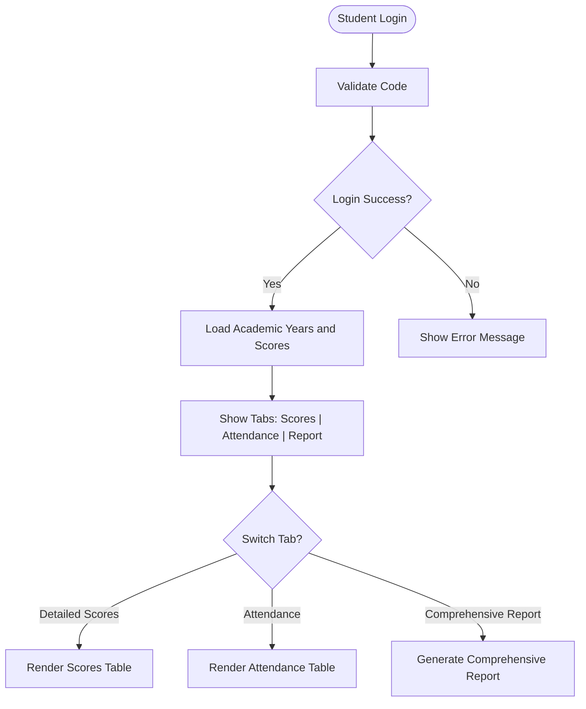
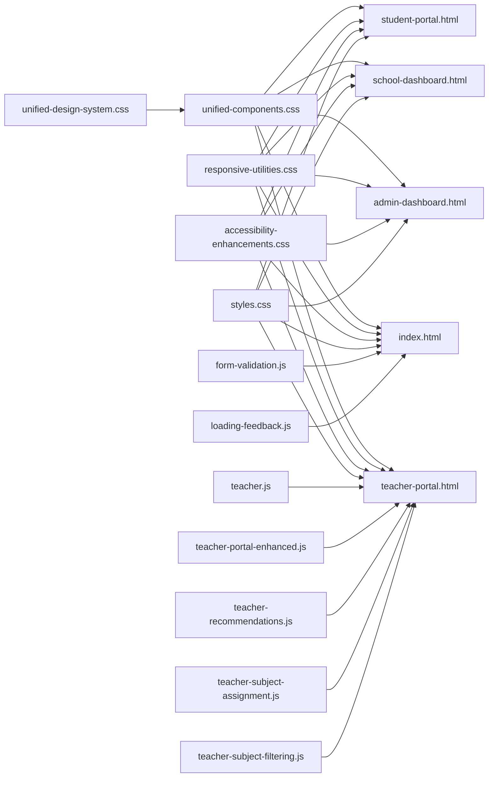

# Frontend Implementation

<cite>
**Referenced Files in This Document**
- [index.html](file://public/index.html)
- [admin-dashboard.html](file://public/admin-dashboard.html)
- [school-dashboard.html](file://public/school-dashboard.html)
- [teacher-portal.html](file://public/teacher-portal.html)
- [student-portal.html](file://public/student-portal.html)
- [unified-design-system.css](file://public/assets/css/unified-design-system.css)
- [unified-components.css](file://public/assets/css/unified-components.css)
- [responsive-utilities.css](file://public/assets/css/responsive-utilities.css)
- [accessibility-enhancements.css](file://public/assets/css/accessibility-enhancements.css)
- [styles.css](file://public/assets/css/styles.css)
- [admin.js](file://public/assets/js/admin.js)
- [school.js](file://public/assets/js/school.js)
- [teacher.js](file://public/assets/js/teacher.js)
- [student.js](file://public/assets/js/student.js)
- [form-validation.js](file://public/assets/js/form-validation.js)
- [loading-feedback.js](file://public/assets/js/loading-feedback.js)
- [teacher-portal-enhanced.js](file://public/assets/js/teacher-portal-enhanced.js)
- [teacher-recommendations.js](file://public/assets/js/teacher-recommendations.js)
- [teacher-subject-assignment.js](file://public/assets/js/teacher-subject-assignment.js)
- [teacher-subject-filtering.js](file://public/assets/js/teacher-subject-filtering.js)
</cite>

## Table of Contents
1. [Introduction](#introduction)
2. [Project Structure](#project-structure)
3. [Core Components](#core-components)
4. [Architecture Overview](#architecture-overview)
5. [Detailed Component Analysis](#detailed-component-analysis)
6. [Dependency Analysis](#dependency-analysis)
7. [Performance Considerations](#performance-considerations)
8. [Troubleshooting Guide](#troubleshooting-guide)
9. [Conclusion](#conclusion)

## Introduction
This document describes the frontend implementation of the EduFlow Arabic RTL interface system. It covers the role-based portal architecture (admin, school, teacher, student) and the main login page, with a focus on Arabic language support, right-to-left layout, responsive design, accessibility, unified design system, form validation, JavaScript components, and the integration between frontend HTML pages and backend API endpoints.

## Project Structure
The frontend is organized around role-specific portals and shared design assets:
- Entry point: public/index.html serves as the main login page with role selection and modals
- Portals: separate HTML pages for each role (admin-dashboard.html, school-dashboard.html, teacher-portal.html, student-portal.html)
- Shared design system: CSS files under public/assets/css implementing a unified design system, responsive utilities, and accessibility enhancements
- JavaScript components: modular scripts per role and shared utilities for validation and feedback

```mermaid
graph TB
subgraph "Entry Point"
IDX["index.html"]
end
subgraph "Portals"
ADMIN["admin-dashboard.html"]
SCHOOL["school-dashboard.html"]
TEACHER["teacher-portal.html"]
STUDENT["student-portal.html"]
end
subgraph "Shared Assets"
UDS["unified-design-system.css"]
UC["unified-components.css"]
RU["responsive-utilities.css"]
AE["accessibility-enhancements.css"]
S["styles.css"]
end
subgraph "JavaScript"
AJAX["admin.js"]
SJAX["school.js"]
TJAX["teacher.js"]
STJAX["student.js"]
FV["form-validation.js"]
LF["loading-feedback.js"]
TPE["teacher-portal-enhanced.js"]
TR["teacher-recommendations.js"]
TSA["teacher-subject-assignment.js"]
TSF["teacher-subject-filtering.js"]
end
IDX --> ADMIN
IDX --> SCHOOL
IDX --> TEACHER
IDX --> STUDENT
ADMIN --- UDS
SCHOOL --- UDS
TEACHER --- UDS
STUDENT --- UDS
ADMIN --- UC
SCHOOL --- UC
TEACHER --- UC
STUDENT --- UC
ADMIN --- RU
SCHOOL --- RU
TEACHER --- RU
STUDENT --- RU
ADMIN --- AE
SCHOOL --- AE
TEACHER --- AE
STUDENT --- AE
ADMIN --- S
SCHOOL --- S
TEACHER --- S
STUDENT --- S
ADMIN -.-> AJAX
SCHOOL -.-> SJAX
TEACHER -.-> TJAX
STUDENT -.-> STJAX
IDX -.-> FV
IDX -.-> LF
TEACHER -.-> TPE
TEACHER -.-> TR
TEACHER -.-> TSA
TEACHER -.-> TSF
```

**Diagram sources**
- [index.html](file://public/index.html#L1-L345)
- [admin-dashboard.html](file://public/admin-dashboard.html#L1-L174)
- [school-dashboard.html](file://public/school-dashboard.html#L1-L800)
- [teacher-portal.html](file://public/teacher-portal.html#L1-L631)
- [student-portal.html](file://public/student-portal.html#L1-L800)
- [unified-design-system.css](file://public/assets/css/unified-design-system.css#L1-L983)
- [unified-components.css](file://public/assets/css/unified-components.css#L1-L672)
- [responsive-utilities.css](file://public/assets/css/responsive-utilities.css#L1-L662)
- [accessibility-enhancements.css](file://public/assets/css/accessibility-enhancements.css#L1-L627)
- [styles.css](file://public/assets/css/styles.css#L1-L2619)
- [admin.js](file://public/assets/js/admin.js)
- [school.js](file://public/assets/js/school.js)
- [teacher.js](file://public/assets/js/teacher.js)
- [student.js](file://public/assets/js/student.js)
- [form-validation.js](file://public/assets/js/form-validation.js)
- [loading-feedback.js](file://public/assets/js/loading-feedback.js)
- [teacher-portal-enhanced.js](file://public/assets/js/teacher-portal-enhanced.js)
- [teacher-recommendations.js](file://public/assets/js/teacher-recommendations.js)
- [teacher-subject-assignment.js](file://public/assets/js/teacher-subject-assignment.js)
- [teacher-subject-filtering.js](file://public/assets/js/teacher-subject-filtering.js)

**Section sources**
- [index.html](file://public/index.html#L1-L345)
- [admin-dashboard.html](file://public/admin-dashboard.html#L1-L174)
- [school-dashboard.html](file://public/school-dashboard.html#L1-L800)
- [teacher-portal.html](file://public/teacher-portal.html#L1-L631)
- [student-portal.html](file://public/student-portal.html#L1-L800)

## Core Components
- Unified Design System: CSS custom properties define brand colors, typography, spacing, shadows, transitions, breakpoints, z-index, and gradients. Components include buttons, cards, forms, tables, tabs, alerts, badges, and loading states.
- Responsive Utilities: Breakpoints and spacing scales adapt layouts from phones to extra-large screens, with grid and flex utilities.
- Accessibility Enhancements: Focus management, skip links, screen-reader utilities, high/low contrast modes, reduced motion support, form validation states, and modal accessibility.
- Role-Based Portals: Each portal leverages the unified system with role-specific styling and JavaScript logic.
- Form Validation and Feedback: Shared validation utilities and loading feedback enhance user experience across portals.

**Section sources**
- [unified-design-system.css](file://public/assets/css/unified-design-system.css#L1-L983)
- [unified-components.css](file://public/assets/css/unified-components.css#L1-L672)
- [responsive-utilities.css](file://public/assets/css/responsive-utilities.css#L1-L662)
- [accessibility-enhancements.css](file://public/assets/css/accessibility-enhancements.css#L1-L627)
- [styles.css](file://public/assets/css/styles.css#L1-L2619)

## Architecture Overview
The frontend follows a role-based routing pattern:
- The main login page presents role cards and modals for admin, school, teacher, and student logins.
- Each portal page loads role-specific CSS and JavaScript to manage dashboards, forms, charts, and data binding.
- Shared CSS ensures consistent design tokens, responsive behavior, and accessibility across all portals.

**Diagram sources**
- [index.html](file://public/index.html#L105-L342)
- [admin-dashboard.html](file://public/admin-dashboard.html#L1-L174)
- [school-dashboard.html](file://public/school-dashboard.html#L1-L800)
- [teacher-portal.html](file://public/teacher-portal.html#L1-L631)
- [student-portal.html](file://public/student-portal.html#L1-L800)

## Detailed Component Analysis

### Main Login Page (Arabic RTL)
- RTL support: The HTML element sets lang="ar" and dir="rtl", ensuring correct text directionality.
- Role selection: A grid of role cards triggers modals for admin, school, teacher, and student logins.
- Modals: Each modal encapsulates a login form bound to a specific backend endpoint via fetch.
- Data binding: Form submissions serialize credentials and store tokens/user info in localStorage upon success.
- Accessibility: Skip link, aria labels, and focus management are integrated.

**Diagram sources**
- [index.html](file://public/index.html#L170-L342)

**Section sources**
- [index.html](file://public/index.html#L1-L345)

### Admin Dashboard
- Unified header and section cards leverage the design system for consistent branding and spacing.
- Academic year management: Modals for viewing and creating academic years integrate with backend APIs.
- Schools listing: Table with export functionality using SheetJS CDN.
- JavaScript integration: admin.js manages CRUD operations and modal interactions.

**Diagram sources**
- [admin-dashboard.html](file://public/admin-dashboard.html#L80-L170)
- [admin.js](file://public/assets/js/admin.js)

**Section sources**
- [admin-dashboard.html](file://public/admin-dashboard.html#L1-L174)
- [admin.js](file://public/assets/js/admin.js)

### School Dashboard
- Responsive design: Extensive media queries ensure readable layouts across device sizes.
- Performance analytics: Tabs for performance insights, charts, and AI predictions.
- Grade management: Modals for managing student grades, daily attendance, and student information.
- Subject management: Modal for adding subjects, filtering, and listing with dynamic population.
- Teacher management: Modal for adding teachers with auto-generated codes and subject assignments.
- JavaScript integration: school.js orchestrates data loading, chart rendering, and modal operations.

**Diagram sources**
- [school-dashboard.html](file://public/school-dashboard.html#L311-L394)
- [school.js](file://public/assets/js/school.js)

**Section sources**
- [school-dashboard.html](file://public/school-dashboard.html#L1-L800)
- [school.js](file://public/assets/js/school.js)

### Teacher Portal
- Login: Dedicated login screen with code format information and validation.
- Dashboard: Overview cards for subjects, student counts, and statistics.
- Recommendations: AI-powered recommendations rendered via teacher-recommendations.js.
- Modals: Grades and attendance management with date selection and batch operations.
- JavaScript integration: teacher.js handles authentication, data fetching, and UI updates; teacher-portal-enhanced.js enhances interactivity.

**Diagram sources**
- [teacher-portal.html](file://public/teacher-portal.html#L463-L558)
- [teacher.js](file://public/assets/js/teacher.js)
- [teacher-recommendations.js](file://public/assets/js/teacher-recommendations.js)
- [teacher-portal-enhanced.js](file://public/assets/js/teacher-portal-enhanced.js)

**Section sources**
- [teacher-portal.html](file://public/teacher-portal.html#L1-L631)
- [teacher.js](file://public/assets/js/teacher.js)
- [teacher-recommendations.js](file://public/assets/js/teacher-recommendations.js)
- [teacher-portal-enhanced.js](file://public/assets/js/teacher-portal-enhanced.js)

### Student Portal
- Login: Simple student code-based login with immediate redirect to portal.
- Tabs: Detailed scores, attendance, and comprehensive report sections.
- AI-driven insights: Academic advisor engine computes performance trends, risk levels, and study recommendations.
- JavaScript integration: student.js manages authentication, tab switching, and report generation.

**Diagram sources**
- [student-portal.html](file://public/student-portal.html#L717-L739)
- [student.js](file://public/assets/js/student.js)

**Section sources**
- [student-portal.html](file://public/student-portal.html#L1-L800)
- [student.js](file://public/assets/js/student.js)

### Arabic Language Interface and RTL Layout
- Directionality: All HTML pages set lang="ar" and dir="rtl".
- Typography: Cairo font imported for Arabic readability.
- Layout: Right-to-left margins, paddings, and alignments are applied consistently.
- Icons: Font Awesome icons adapt to RTL without manual mirroring.

**Section sources**
- [index.html](file://public/index.html#L2-L8)
- [admin-dashboard.html](file://public/admin-dashboard.html#L2-L16)
- [school-dashboard.html](file://public/school-dashboard.html#L2-L267)
- [teacher-portal.html](file://public/teacher-portal.html#L2-L16)
- [student-portal.html](file://public/student-portal.html#L2-L16)

### Responsive Design Patterns
- Mobile-first approach: Base styles optimized for small screens, progressively enhanced for larger devices.
- Breakpoints: Defined in responsive-utilities.css with tailored spacing and grid configurations.
- Grid and Flex utilities: Consistent responsive grid and flexbox helpers across portals.
- Media queries: Extensive use in school-dashboard.html for charts, tables, and modal layouts.

**Section sources**
- [responsive-utilities.css](file://public/assets/css/responsive-utilities.css#L1-L662)
- [school-dashboard.html](file://public/school-dashboard.html#L18-L266)

### Accessibility Features
- Focus management: Custom focus rings and :focus-visible polyfill.
- Skip links: Direct navigation to main content.
- Screen reader utilities: sr-only and aria-live regions.
- Contrast and motion: High/low contrast modes and reduced motion support.
- Form validation: ARIA attributes and visual feedback for valid/invalid states.
- Modal accessibility: Proper roles, focus trapping, and close controls.

**Section sources**
- [accessibility-enhancements.css](file://public/assets/css/accessibility-enhancements.css#L1-L627)

### Form Validation System
- Shared validation: form-validation.js provides reusable validation logic.
- Real-time feedback: Loading feedback via loading-feedback.js improves perceived performance.
- Role-specific forms: Each portal implements form submission handlers with error handling and success notifications.

**Section sources**
- [form-validation.js](file://public/assets/js/form-validation.js)
- [loading-feedback.js](file://public/assets/js/loading-feedback.js)

### JavaScript Components for Interactive Elements
- Role-specific scripts: admin.js, school.js, teacher.js, student.js handle data fetching, UI updates, and modal interactions.
- Enhanced teacher features: teacher-portal-enhanced.js, teacher-recommendations.js, teacher-subject-assignment.js, teacher-subject-filtering.js provide advanced functionality.
- Event handling: Click, submit, and keyboard events are managed with accessibility in mind.

**Section sources**
- [admin.js](file://public/assets/js/admin.js)
- [school.js](file://public/assets/js/school.js)
- [teacher.js](file://public/assets/js/teacher.js)
- [student.js](file://public/assets/js/student.js)
- [teacher-portal-enhanced.js](file://public/assets/js/teacher-portal-enhanced.js)
- [teacher-recommendations.js](file://public/assets/js/teacher-recommendations.js)
- [teacher-subject-assignment.js](file://public/assets/js/teacher-subject-assignment.js)
- [teacher-subject-filtering.js](file://public/assets/js/teacher-subject-filtering.js)

### CSS Design System Implementation
- Tokens: Centralized CSS custom properties for colors, typography, spacing, shadows, transitions, breakpoints, and gradients.
- Components: Reusable button variants, card styles, form controls, tables, tabs, badges, and alerts.
- Inheritance: Role-specific pages inherit from unified design system while maintaining role branding.

**Section sources**
- [unified-design-system.css](file://public/assets/css/unified-design-system.css#L1-L983)
- [unified-components.css](file://public/assets/css/unified-components.css#L1-L672)
- [styles.css](file://public/assets/css/styles.css#L1-L2619)

### Relationship Between Frontend and Backend API Endpoints
- Authentication: POST /api/admin/login, /api/school/login, /api/student/login, /api/teacher/login
- Data operations: GET/POST/PUT requests for academic years, schools, subjects, students, grades, and attendance
- Storage: Tokens and user data stored in localStorage for session persistence

**Section sources**
- [index.html](file://public/index.html#L203-L341)
- [admin-dashboard.html](file://public/admin-dashboard.html#L142-L170)
- [school-dashboard.html](file://public/school-dashboard.html#L396-L703)
- [teacher-portal.html](file://public/teacher-portal.html#L571-L624)
- [student-portal.html](file://public/student-portal.html#L717-L739)

## Dependency Analysis
The frontend relies on:
- Shared CSS: unified-design-system.css and unified-components.css provide design tokens and component styles
- Responsive and accessibility: responsive-utilities.css and accessibility-enhancements.css
- Role-specific pages: Each portal imports its own JS and leverages shared CSS
- Third-party libraries: Chart.js for analytics, SheetJS for exports

**Diagram sources**
- [unified-design-system.css](file://public/assets/css/unified-design-system.css#L1-L983)
- [unified-components.css](file://public/assets/css/unified-components.css#L1-L672)
- [responsive-utilities.css](file://public/assets/css/responsive-utilities.css#L1-L662)
- [accessibility-enhancements.css](file://public/assets/css/accessibility-enhancements.css#L1-L627)
- [styles.css](file://public/assets/css/styles.css#L1-L2619)
- [index.html](file://public/index.html#L1-L345)
- [admin-dashboard.html](file://public/admin-dashboard.html#L1-L174)
- [school-dashboard.html](file://public/school-dashboard.html#L1-L800)
- [teacher-portal.html](file://public/teacher-portal.html#L1-L631)
- [student-portal.html](file://public/student-portal.html#L1-L800)
- [form-validation.js](file://public/assets/js/form-validation.js)
- [loading-feedback.js](file://public/assets/js/loading-feedback.js)
- [teacher.js](file://public/assets/js/teacher.js)
- [teacher-portal-enhanced.js](file://public/assets/js/teacher-portal-enhanced.js)
- [teacher-recommendations.js](file://public/assets/js/teacher-recommendations.js)
- [teacher-subject-assignment.js](file://public/assets/js/teacher-subject-assignment.js)
- [teacher-subject-filtering.js](file://public/assets/js/teacher-subject-filtering.js)

**Section sources**
- [unified-design-system.css](file://public/assets/css/unified-design-system.css#L1-L983)
- [unified-components.css](file://public/assets/css/unified-components.css#L1-L672)
- [responsive-utilities.css](file://public/assets/css/responsive-utilities.css#L1-L662)
- [accessibility-enhancements.css](file://public/assets/css/accessibility-enhancements.css#L1-L627)
- [styles.css](file://public/assets/css/styles.css#L1-L2619)
- [index.html](file://public/index.html#L1-L345)
- [admin-dashboard.html](file://public/admin-dashboard.html#L1-L174)
- [school-dashboard.html](file://public/school-dashboard.html#L1-L800)
- [teacher-portal.html](file://public/teacher-portal.html#L1-L631)
- [student-portal.html](file://public/student-portal.html#L1-L800)

## Performance Considerations
- CSS architecture: Shared design system reduces duplication and improves caching.
- Responsive utilities: Mobile-first approach minimizes repaints and reflows on smaller screens.
- Lazy loading: Chart.js and SheetJS are loaded only where needed.
- Local storage: Session persistence avoids repeated authentication requests.
- Minimized DOM manipulation: Batched updates and efficient event handling in role-specific scripts.

## Troubleshooting Guide
- Login failures: Verify API endpoints and token storage; check toastManager error messages.
- Modal issues: Ensure aria attributes and focus management are intact; confirm click-outside handlers.
- Responsive problems: Validate breakpoint usage and grid/flex utilities; test on multiple viewport sizes.
- Accessibility concerns: Confirm focus rings, skip links, and ARIA states; test with assistive technologies.
- Form validation errors: Review form-validation.js integration and invalid/valid state styling.

**Section sources**
- [index.html](file://public/index.html#L203-L341)
- [accessibility-enhancements.css](file://public/assets/css/accessibility-enhancements.css#L1-L627)
- [responsive-utilities.css](file://public/assets/css/responsive-utilities.css#L1-L662)
- [form-validation.js](file://public/assets/js/form-validation.js)
- [loading-feedback.js](file://public/assets/js/loading-feedback.js)

## Conclusion
The EduFlow frontend implements a cohesive, RTL-compliant, accessible, and responsive interface across role-based portals. The unified design system ensures consistent branding and user experience, while modular JavaScript components deliver interactive functionality. The architecture cleanly separates shared concerns from role-specific logic, enabling maintainability and scalability.