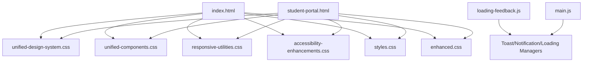
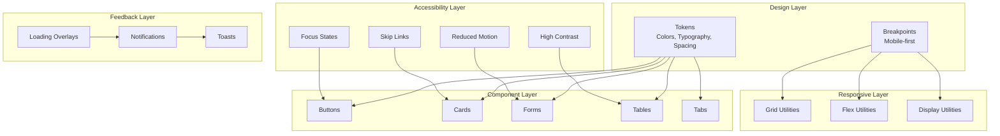
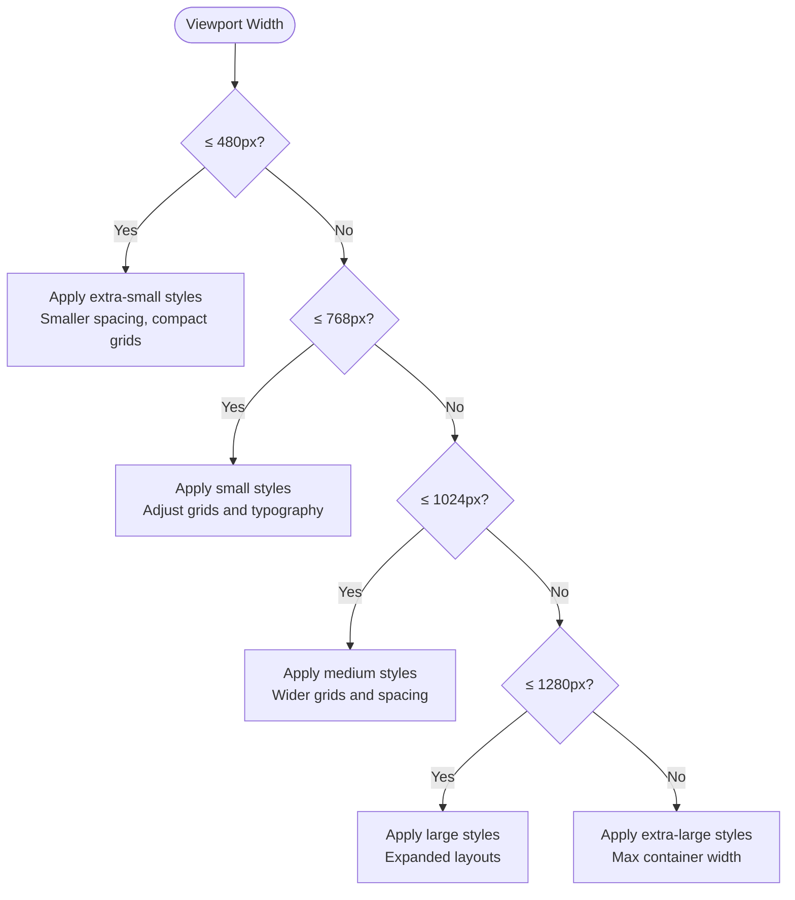
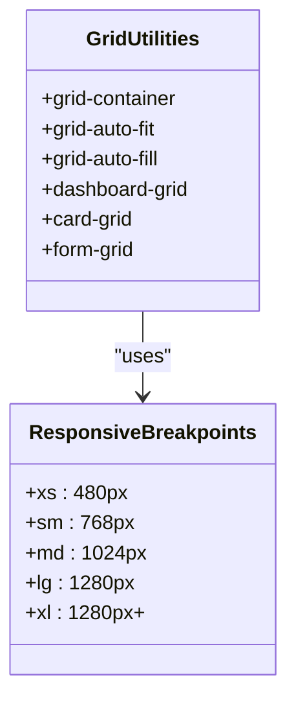
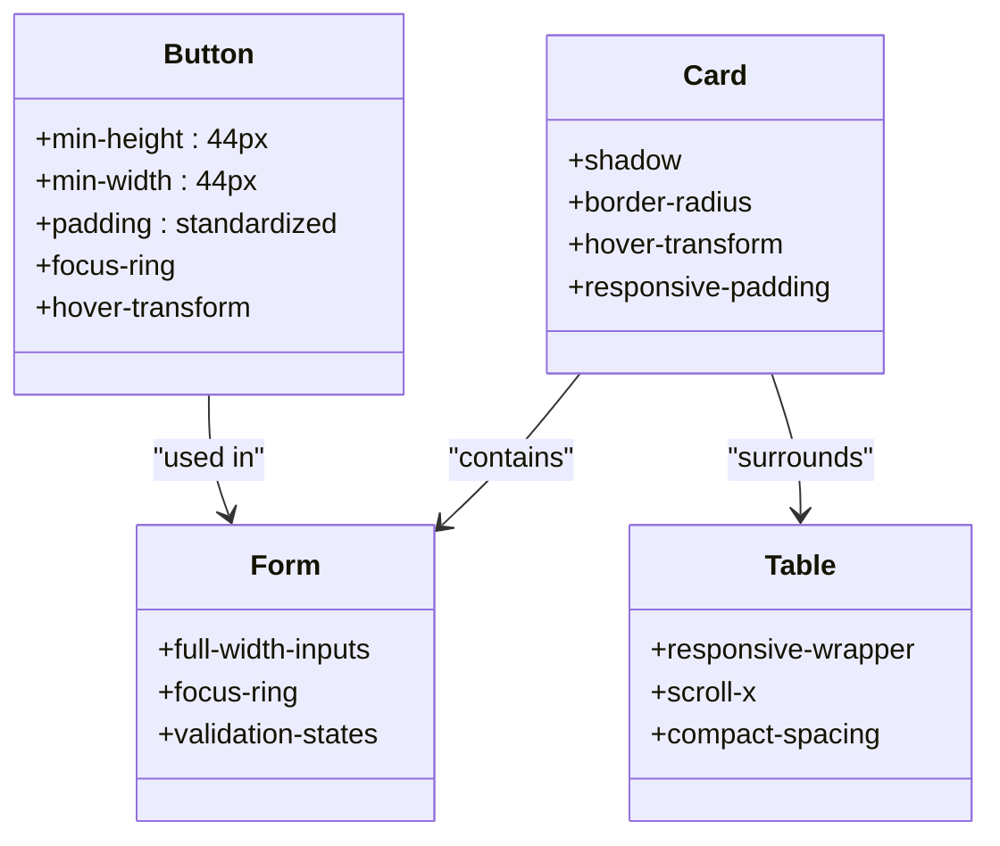
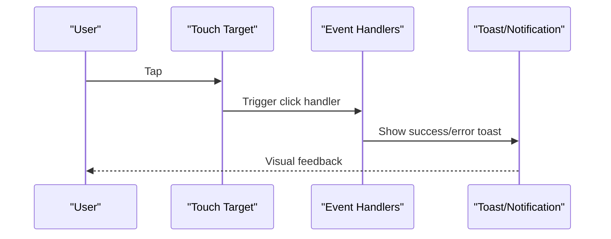
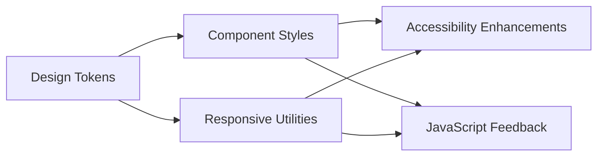

# Responsive & Mobile Optimization

<cite>
**Referenced Files in This Document**
- [index.html](file://public/index.html)
- [student-portal.html](file://public/student-portal.html)
- [styles.css](file://public/assets/css/styles.css)
- [unified-design-system.css](file://public/assets/css/unified-design-system.css)
- [unified-components.css](file://public/assets/css/unified-components.css)
- [responsive-utilities.css](file://public/assets/css/responsive-utilities.css)
- [accessibility-enhancements.css](file://public/assets/css/accessibility-enhancements.css)
- [design-system.css](file://public/assets/css/design-system.css)
- [enhanced.css](file://public/assets/css/enhanced.css)
- [loading-feedback.js](file://public/assets/js/loading-feedback.js)
- [main.js](file://public/assets/js/main.js)
</cite>

## Table of Contents
1. [Introduction](#introduction)
2. [Project Structure](#project-structure)
3. [Core Components](#core-components)
4. [Architecture Overview](#architecture-overview)
5. [Detailed Component Analysis](#detailed-component-analysis)
6. [Dependency Analysis](#dependency-analysis)
7. [Performance Considerations](#performance-considerations)
8. [Troubleshooting Guide](#troubleshooting-guide)
9. [Conclusion](#conclusion)

## Introduction
This document provides comprehensive guidance for responsive design and mobile optimization in EduFlow, focusing on a mobile-first architecture, adaptive layouts, touch-friendly interfaces, and cross-platform compatibility for Arabic-speaking regions. It synthesizes the existing CSS design system, responsive utilities, accessibility enhancements, and JavaScript feedback mechanisms to deliver a consistent, performant, and inclusive user experience across tablets and smartphones.

## Project Structure
EduFlow organizes its responsive design through layered CSS files and modular JavaScript utilities:
- Unified design system defines tokens, typography, spacing, and base components.
- Responsive utilities and design system CSS provide breakpoint-driven adaptations.
- Accessibility enhancements ensure WCAG 2.1 AA compliance and reduced motion support.
- JavaScript modules manage loading states, notifications, and toast feedback.

**Diagram sources**
- [index.html](file://public/index.html#L1-L16)
- [student-portal.html](file://public/student-portal.html#L1-L16)
- [unified-design-system.css](file://public/assets/css/unified-design-system.css#L1-L271)
- [unified-components.css](file://public/assets/css/unified-components.css#L1-L672)
- [responsive-utilities.css](file://public/assets/css/responsive-utilities.css#L1-L662)
- [accessibility-enhancements.css](file://public/assets/css/accessibility-enhancements.css#L1-L627)
- [enhanced.css](file://public/assets/css/enhanced.css#L1-L800)
- [loading-feedback.js](file://public/assets/js/loading-feedback.js#L1-L629)
- [main.js](file://public/assets/js/main.js#L1-L153)

**Section sources**
- [index.html](file://public/index.html#L1-L16)
- [student-portal.html](file://public/student-portal.html#L1-L16)

## Core Components
- Mobile-first design system with CSS custom properties for colors, typography, spacing, shadows, transitions, and z-index.
- Responsive grid utilities and breakpoint-driven adaptations via media queries.
- Touch-friendly interactive elements with minimum 44px touch targets and accessible focus states.
- Unified component library for buttons, cards, forms, tabs, and tables.
- Accessibility features including skip links, screen-reader utilities, high/low contrast modes, and reduced motion support.
- JavaScript feedback system for loading overlays, notifications, and toasts.

**Section sources**
- [unified-design-system.css](file://public/assets/css/unified-design-system.css#L11-L271)
- [responsive-utilities.css](file://public/assets/css/responsive-utilities.css#L11-L144)
- [accessibility-enhancements.css](file://public/assets/css/accessibility-enhancements.css#L11-L627)
- [unified-components.css](file://public/assets/css/unified-components.css#L1-L672)
- [loading-feedback.js](file://public/assets/js/loading-feedback.js#L6-L589)

## Architecture Overview
The responsive architecture follows a layered approach:
- Design tokens define consistent visual language across breakpoints.
- Component styles encapsulate layout and interaction behaviors.
- Responsive utilities adapt spacing, grid, flexbox, and display properties per viewport.
- Accessibility utilities ensure inclusive navigation and interaction.
- JavaScript manages user feedback and dynamic loading states.

**Diagram sources**
- [unified-design-system.css](file://public/assets/css/unified-design-system.css#L11-L271)
- [responsive-utilities.css](file://public/assets/css/responsive-utilities.css#L1-L662)
- [accessibility-enhancements.css](file://public/assets/css/accessibility-enhancements.css#L1-L627)
- [loading-feedback.js](file://public/assets/js/loading-feedback.js#L1-L629)

## Detailed Component Analysis

### Mobile-First Breakpoint Strategy
- Breakpoints are defined in the unified design system and responsive utilities:
  - Extra small: up to 480px
  - Small: 481px to 768px
  - Medium: 769px to 1024px
  - Large: 1025px to 1280px
  - Extra large: above 1280px
- Media queries adjust container padding, grid column counts, form rows, and typography scales progressively.

**Diagram sources**
- [responsive-utilities.css](file://public/assets/css/responsive-utilities.css#L11-L144)
- [unified-design-system.css](file://public/assets/css/unified-design-system.css#L226-L233)

**Section sources**
- [responsive-utilities.css](file://public/assets/css/responsive-utilities.css#L11-L144)
- [unified-design-system.css](file://public/assets/css/unified-design-system.css#L226-L233)

### Flexible Grid Systems
- Auto-fit and auto-fill grid utilities enable flexible layouts that adapt to available space.
- Dashboard and card grids adjust column counts and gaps across breakpoints.
- Form grids and responsive tables ensure readability on small screens.

**Diagram sources**
- [design-system.css](file://public/assets/css/design-system.css#L477-L535)
- [unified-components.css](file://public/assets/css/unified-components.css#L181-L245)

**Section sources**
- [design-system.css](file://public/assets/css/design-system.css#L477-L535)
- [unified-components.css](file://public/assets/css/unified-components.css#L181-L245)

### Adaptive Component Layouts
- Buttons maintain minimum 44px touch targets and include hover, focus, and active states.
- Cards elevate content with shadows and hover transforms, adapting spacing on smaller screens.
- Forms use full-width inputs with accessible focus rings and validation states.
- Tables are wrapped in responsive containers to enable horizontal scrolling on small screens.

**Diagram sources**
- [unified-design-system.css](file://public/assets/css/unified-design-system.css#L426-L575)
- [unified-components.css](file://public/assets/css/unified-components.css#L653-L457)
- [accessibility-enhancements.css](file://public/assets/css/accessibility-enhancements.css#L554-L590)

**Section sources**
- [unified-design-system.css](file://public/assets/css/unified-design-system.css#L426-L575)
- [unified-components.css](file://public/assets/css/unified-components.css#L653-L457)
- [accessibility-enhancements.css](file://public/assets/css/accessibility-enhancements.css#L554-L590)

### Touch-Friendly Interface Design
- Minimum 44px touch targets for buttons, inputs, and navigation links.
- Gestural feedback through hover and active states; reduced motion support for sensitive users.
- Accessible focus management with visible outlines and skip-to-main-content link.

**Diagram sources**
- [accessibility-enhancements.css](file://public/assets/css/accessibility-enhancements.css#L554-L590)
- [loading-feedback.js](file://public/assets/js/loading-feedback.js#L464-L584)

**Section sources**
- [accessibility-enhancements.css](file://public/assets/css/accessibility-enhancements.css#L554-L590)
- [loading-feedback.js](file://public/assets/js/loading-feedback.js#L464-L584)

### Viewport Configuration and Meta Tags
- The HTML documents include the viewport meta tag with width=device-width and initial-scale=1.0.
- Arabic language and RTL direction are configured for regional compatibility.

**Section sources**
- [index.html](file://public/index.html#L4-L5)
- [student-portal.html](file://public/student-portal.html#L4-L5)

### Responsive Typography System
- Typography tokens define font families, sizes, weights, and line heights.
- Headings and body text scale appropriately across breakpoints.
- Accessibility ensures readable line heights and contrast.

**Section sources**
- [unified-design-system.css](file://public/assets/css/unified-design-system.css#L103-L180)
- [accessibility-enhancements.css](file://public/assets/css/accessibility-enhancements.css#L138-L173)

### Image Optimization Techniques
- Placeholder SVG backgrounds are embedded for lightweight hero sections.
- Vector icons via Font Awesome reduce asset weight compared to raster images.
- Consider lazy-loading for larger images and modern formats (AVIF/WebP) for future enhancements.

**Section sources**
- [styles.css](file://public/assets/css/styles.css#L195-L204)

### Mobile-Specific Form Layouts
- Full-width form controls with accessible focus states and validation messaging.
- Compact spacing and responsive grids for multi-column form layouts on tablets.
- Reduced motion and high contrast modes improve usability for diverse needs.

**Section sources**
- [unified-design-system.css](file://public/assets/css/unified-design-system.css#L684-L752)
- [unified-components.css](file://public/assets/css/unified-components.css#L181-L245)
- [accessibility-enhancements.css](file://public/assets/css/accessibility-enhancements.css#L166-L204)

### Examples of Responsive Behavior
- Role selection cards adapt from multi-column grid on desktop to single-column on phones.
- Dashboard tabs stack vertically on small screens for easier thumb interaction.
- Modal content adjusts width and padding for optimal readability on small screens.

**Section sources**
- [unified-components.css](file://public/assets/css/unified-components.css#L616-L672)
- [responsive-utilities.css](file://public/assets/css/responsive-utilities.css#L312-L376)

## Dependency Analysis
The responsive system relies on coordinated layers:
- Design tokens underpin all components and utilities.
- Component styles depend on unified design tokens and responsive utilities.
- Accessibility utilities integrate across components and JavaScript feedback.

**Diagram sources**
- [unified-design-system.css](file://public/assets/css/unified-design-system.css#L11-L271)
- [responsive-utilities.css](file://public/assets/css/responsive-utilities.css#L1-L662)
- [accessibility-enhancements.css](file://public/assets/css/accessibility-enhancements.css#L1-L627)
- [loading-feedback.js](file://public/assets/js/loading-feedback.js#L1-L629)

**Section sources**
- [unified-design-system.css](file://public/assets/css/unified-design-system.css#L11-L271)
- [responsive-utilities.css](file://public/assets/css/responsive-utilities.css#L1-L662)
- [accessibility-enhancements.css](file://public/assets/css/accessibility-enhancements.css#L1-L627)
- [loading-feedback.js](file://public/assets/js/loading-feedback.js#L1-L629)

## Performance Considerations
- Minimize layout thrashing by batching DOM updates and using CSS transforms for animations.
- Prefer hardware-accelerated properties (transform, opacity) for smoother interactions.
- Use efficient grid layouts and avoid excessive nested selectors.
- Lazy-load non-critical resources and leverage browser caching for fonts and icons.
- Monitor paint and composite costs; simplify shadows and gradients on lower-end devices.

## Troubleshooting Guide
- Touch target issues: Verify minimum 44px dimensions and adequate spacing around interactive elements.
- Focus visibility: Ensure focus rings are visible and keyboard navigable across components.
- Reduced motion: Confirm animations and transitions are disabled or minimized when requested.
- High contrast: Validate sufficient color contrast and border visibility in high-contrast mode.
- Loading states: Use the feedback manager to prevent user confusion during asynchronous operations.

**Section sources**
- [accessibility-enhancements.css](file://public/assets/css/accessibility-enhancements.css#L138-L204)
- [loading-feedback.js](file://public/assets/js/loading-feedback.js#L6-L589)

## Conclusion
EduFlow’s responsive design leverages a robust mobile-first architecture grounded in unified design tokens, adaptive grid systems, and accessibility-first principles. By combining standardized components, breakpoint-driven utilities, and thoughtful JavaScript feedback, the platform delivers a consistent, inclusive, and performant experience across tablets and smartphones in Arabic-speaking regions.