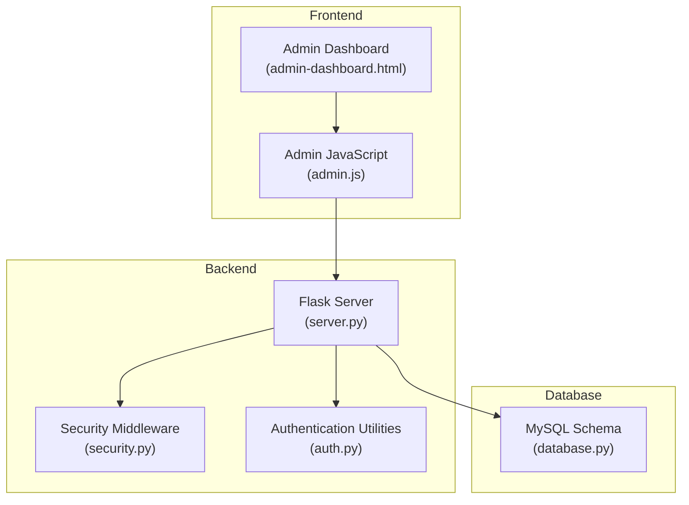
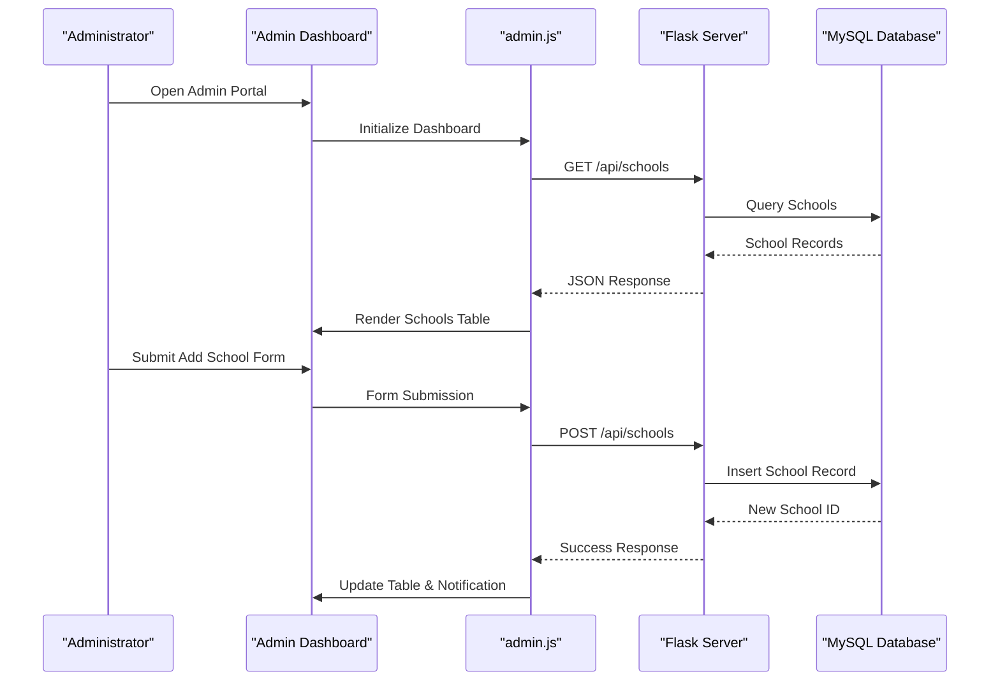
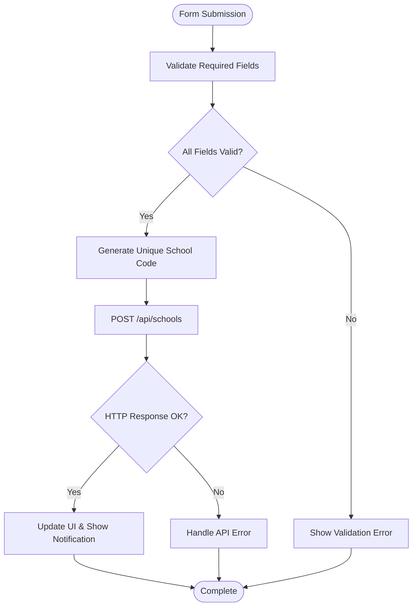
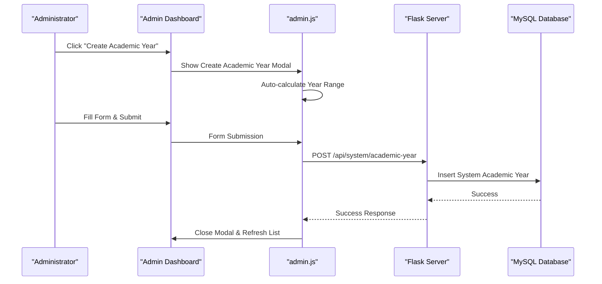
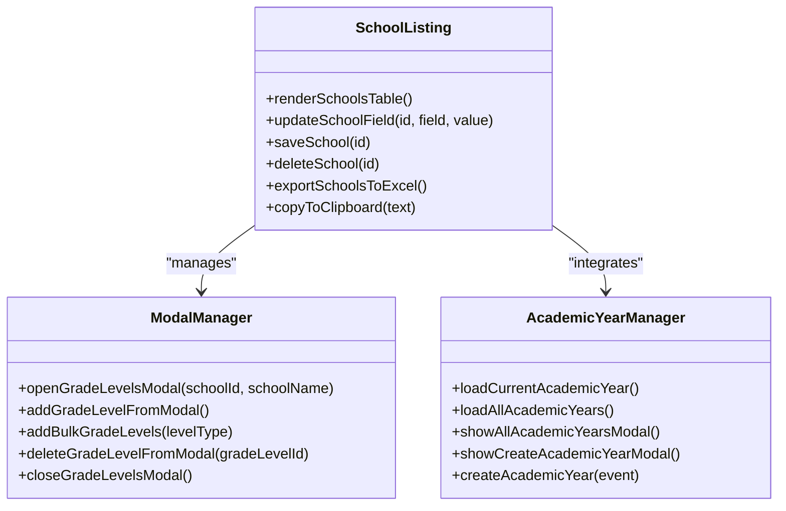
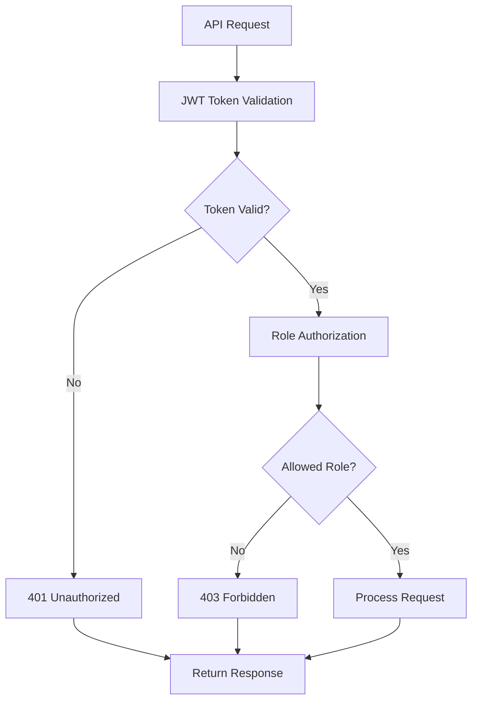
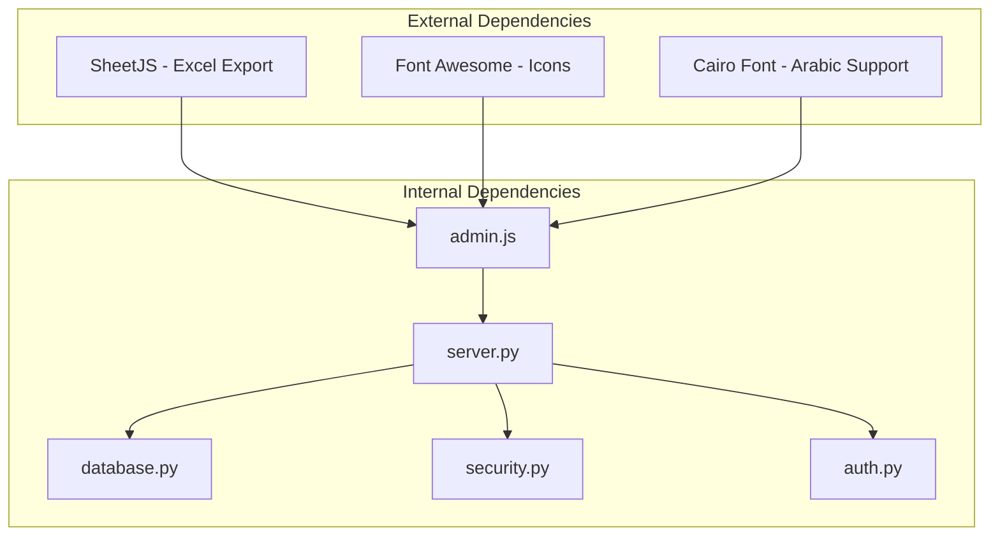

# Administrator Portal

<cite>
**Referenced Files in This Document**
- [admin-dashboard.html](file://public/admin-dashboard.html)
- [admin.js](file://public/assets/js/admin.js)
- [server.py](file://server.py)
- [database.py](file://database.py)
- [security.py](file://security.py)
- [auth.py](file://auth.py)
</cite>

## Table of Contents
1. [Introduction](#introduction)
2. [Project Structure](#project-structure)
3. [Core Components](#core-components)
4. [Architecture Overview](#architecture-overview)
5. [Detailed Component Analysis](#detailed-component-analysis)
6. [Dependency Analysis](#dependency-analysis)
7. [Performance Considerations](#performance-considerations)
8. [Troubleshooting Guide](#troubleshooting-guide)
9. [Conclusion](#conclusion)

## Introduction
The Administrator Portal in EduFlow is a comprehensive administrative interface designed for system-wide management of schools, academic years, and related configurations. It enables administrators to create and manage schools with automatic code generation, configure academic year systems with centralized control, maintain grade levels per school, and export administrative data. The portal integrates with backend administrative APIs secured through JWT-based authentication and role-based access control.

## Project Structure
The Administrator Portal consists of:
- Frontend: HTML/CSS/JavaScript for the administrative dashboard and modals
- Backend: Python Flask server exposing RESTful APIs for administrative operations
- Database: MySQL schema supporting schools, academic years, subjects, teachers, and student records
- Security: JWT authentication and input sanitization middleware

**Diagram sources**
- [admin-dashboard.html](file://public/admin-dashboard.html#L1-L174)
- [admin.js](file://public/assets/js/admin.js#L1-L988)
- [server.py](file://server.py#L1-L2920)
- [database.py](file://database.py#L156-L302)
- [security.py](file://security.py#L476-L617)
- [auth.py](file://auth.py#L356-L376)

**Section sources**
- [admin-dashboard.html](file://public/admin-dashboard.html#L1-L174)
- [admin.js](file://public/assets/js/admin.js#L1-L988)
- [server.py](file://server.py#L1-L2920)
- [database.py](file://database.py#L156-L302)
- [security.py](file://security.py#L476-L617)
- [auth.py](file://auth.py#L356-L376)

## Core Components
- School Management Form: Adds new schools with automatic code generation and manages study types, educational stages, and gender classifications.
- Academic Year Administration: Centralized academic year management with manual creation, automatic generation, and current year designation.
- School Listing and Filtering: Displays schools with editable fields, action buttons, and export functionality.
- Modal Dialogs: Handles grade level management, academic year viewing, and creation workflows.
- Data Export: Excel export for school lists and teacher/student data.

Key implementation patterns:
- Form validation and submission handling
- Modal lifecycle management
- Data export using SheetJS library
- Role-based API access control

**Section sources**
- [admin-dashboard.html](file://public/admin-dashboard.html#L34-L119)
- [admin.js](file://public/assets/js/admin.js#L176-L358)
- [admin.js](file://public/assets/js/admin.js#L391-L567)
- [admin.js](file://public/assets/js/admin.js#L317-L349)

## Architecture Overview
The Administrator Portal follows a client-server architecture with centralized administrative controls:

**Diagram sources**
- [admin-dashboard.html](file://public/admin-dashboard.html#L34-L119)
- [admin.js](file://public/assets/js/admin.js#L64-L102)
- [admin.js](file://public/assets/js/admin.js#L176-L217)
- [server.py](file://server.py#L306-L374)
- [database.py](file://database.py#L156-L177)

## Detailed Component Analysis

### School Creation and Management
The school management workflow includes automatic code generation, validation, and CRUD operations:

**Diagram sources**
- [admin.js](file://public/assets/js/admin.js#L176-L217)
- [server.py](file://server.py#L330-L374)

Administrative actions:
- Adding new schools with study type, educational stage, and gender classification
- Automatic code generation using database constraints
- Real-time table updates with inline editing capabilities
- Bulk grade level management per school

**Section sources**
- [admin-dashboard.html](file://public/admin-dashboard.html#L40-L77)
- [admin.js](file://public/assets/js/admin.js#L176-L217)
- [server.py](file://server.py#L330-L374)
- [database.py](file://database.py#L156-L177)

### Academic Year Management System
The academic year system operates on a centralized model with automatic calculation and admin-only creation:

**Diagram sources**
- [admin.js](file://public/assets/js/admin.js#L793-L800)
- [admin.js](file://public/assets/js/admin.js#L703-L791)
- [server.py](file://server.py#L1956-L1966)
- [database.py](file://database.py#L261-L273)

Administrative workflow:
- Centralized academic year management across all schools
- Automatic year calculation based on current date (September to August cycle)
- Admin-only creation with validation for year ranges
- Current year designation handled automatically

**Section sources**
- [admin-dashboard.html](file://public/admin-dashboard.html#L80-L97)
- [admin.js](file://public/assets/js/admin.js#L573-L614)
- [admin.js](file://public/assets/js/admin.js#L703-L791)
- [server.py](file://server.py#L1867-L1954)
- [database.py](file://database.py#L261-L273)

### School Listing and Export Functionality
The school listing component provides comprehensive management capabilities:

**Diagram sources**
- [admin.js](file://public/assets/js/admin.js#L104-L174)
- [admin.js](file://public/assets/js/admin.js#L391-L567)
- [admin.js](file://public/assets/js/admin.js#L573-L791)

Key features:
- Inline editing for school attributes (name, study type, stage, gender)
- Action buttons for save and delete operations
- Grade levels management modal with quick-add templates
- Comprehensive export functionality to Excel format

**Section sources**
- [admin-dashboard.html](file://public/admin-dashboard.html#L99-L119)
- [admin.js](file://public/assets/js/admin.js#L104-L174)
- [admin.js](file://public/assets/js/admin.js#L317-L349)

### Form Validation Patterns
The portal implements robust form validation at both client and server levels:

Client-side validation patterns:
- Required field validation for essential form elements
- Input sanitization and type checking
- Real-time feedback through notifications
- Modal-based form submissions with validation

Server-side validation patterns:
- Input sanitization decorators
- Field presence and format validation
- Business rule enforcement (e.g., academic year range validation)
- Error handling with localized error messages

**Section sources**
- [admin.js](file://public/assets/js/admin.js#L176-L217)
- [server.py](file://server.py#L330-L374)
- [server.py](file://server.py#L1956-L1966)

### Security Model and Role-Based Permissions
The portal implements a comprehensive security model:

Authentication:
- JWT-based authentication for administrative access
- Token storage in browser local storage
- Automatic token inclusion in API requests

Authorization:
- Role-based access control (admin, school, teacher, student)
- Route-level authorization decorators
- Input sanitization and rate limiting

**Diagram sources**
- [server.py](file://server.py#L91-L108)
- [server.py](file://server.py#L142-L199)
- [auth.py](file://auth.py#L356-L376)
- [security.py](file://security.py#L476-L617)

Security features:
- Input sanitization for all JSON requests
- Rate limiting with configurable exemptions
- Audit logging for administrative actions
- Two-factor authentication support

**Section sources**
- [server.py](file://server.py#L91-L108)
- [server.py](file://server.py#L142-L199)
- [auth.py](file://auth.py#L356-L376)
- [security.py](file://security.py#L476-L617)

## Dependency Analysis
The Administrator Portal has the following key dependencies:

**Diagram sources**
- [admin-dashboard.html](file://public/admin-dashboard.html#L16-L16)
- [admin.js](file://public/assets/js/admin.js#L1-L15)
- [server.py](file://server.py#L1-L16)
- [database.py](file://database.py#L156-L302)
- [security.py](file://security.py#L476-L617)
- [auth.py](file://auth.py#L356-L376)

Dependency relationships:
- Frontend depends on SheetJS for Excel export functionality
- Backend depends on MySQL for persistent data storage
- Security middleware provides cross-cutting concerns for all API endpoints
- Authentication utilities handle token management and validation

**Section sources**
- [admin-dashboard.html](file://public/admin-dashboard.html#L16-L16)
- [admin.js](file://public/assets/js/admin.js#L1-L15)
- [server.py](file://server.py#L1-L16)
- [database.py](file://database.py#L156-L302)
- [security.py](file://security.py#L476-L617)
- [auth.py](file://auth.py#L356-L376)

## Performance Considerations
- API optimization with field selection and pagination decorators
- Database connection pooling for efficient resource utilization
- Client-side caching of frequently accessed data (schools, academic years)
- Efficient modal rendering to minimize DOM manipulation overhead
- Excel export batching for large datasets

## Troubleshooting Guide
Common issues and resolutions:

Authentication Issues:
- Verify JWT token presence in local storage
- Check token expiration and renewal mechanisms
- Ensure proper Authorization header format

API Connectivity:
- Monitor network tab for failed requests
- Validate API endpoint URLs and HTTP methods
- Check server logs for error responses

Data Validation:
- Review form validation messages for missing required fields
- Verify input sanitization for special characters
- Confirm academic year range validation rules

Export Problems:
- Ensure SheetJS library loads correctly
- Check browser compatibility for Excel export
- Verify sufficient memory for large exports

**Section sources**
- [admin.js](file://public/assets/js/admin.js#L8-L15)
- [admin.js](file://public/assets/js/admin.js#L288-L315)
- [server.py](file://server.py#L2231-L2234)

## Conclusion
The Administrator Portal provides a comprehensive, secure, and efficient administrative interface for managing schools and academic systems in EduFlow. Its centralized academic year management, automated code generation, and robust security model enable administrators to efficiently oversee educational institutions. The modular architecture supports future enhancements while maintaining system reliability and user experience.