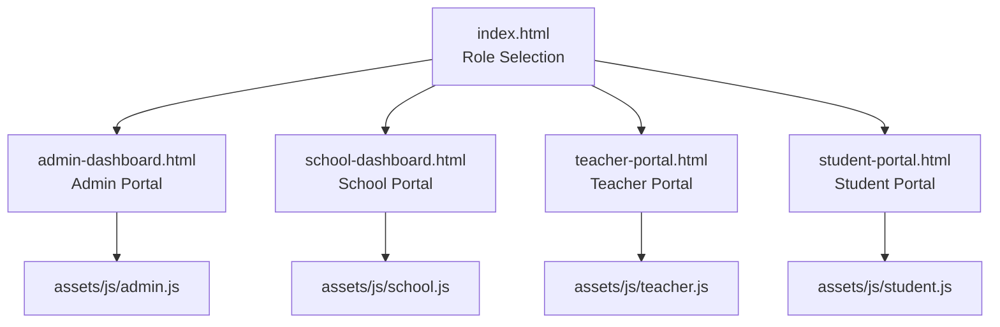
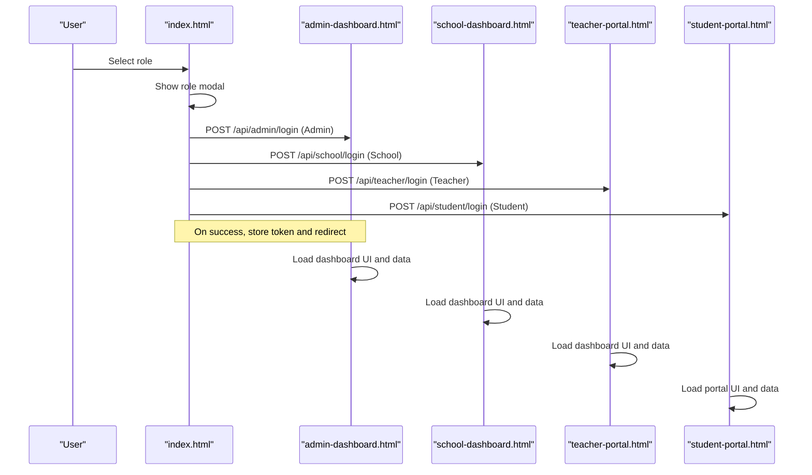
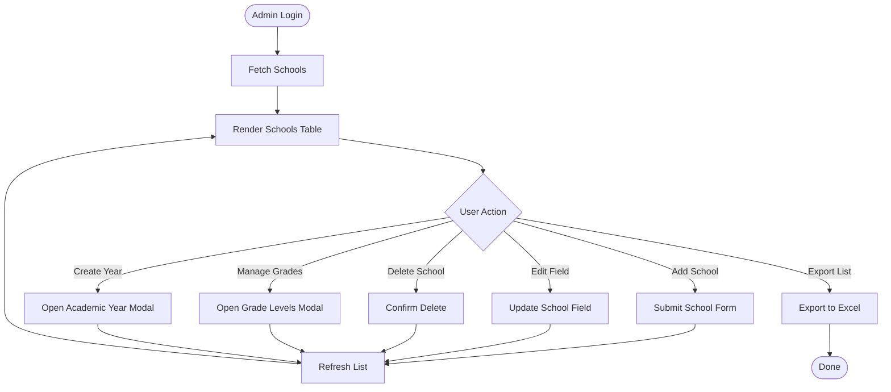
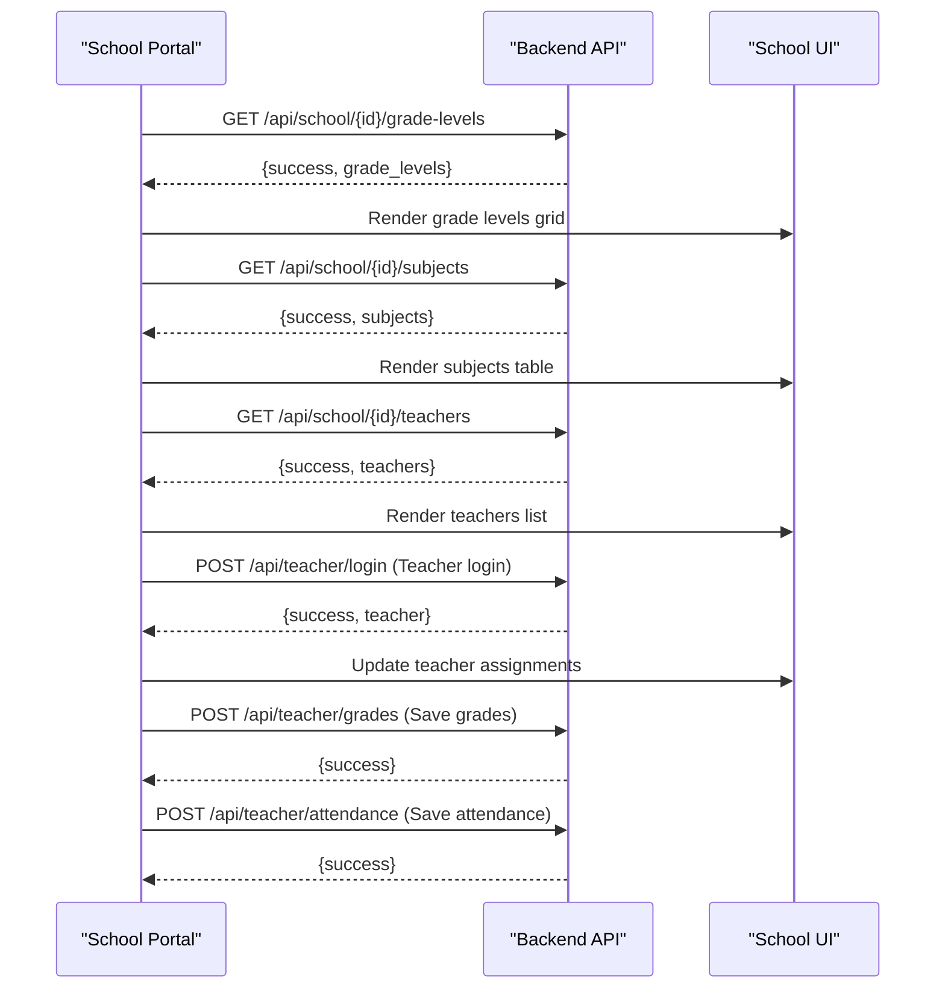
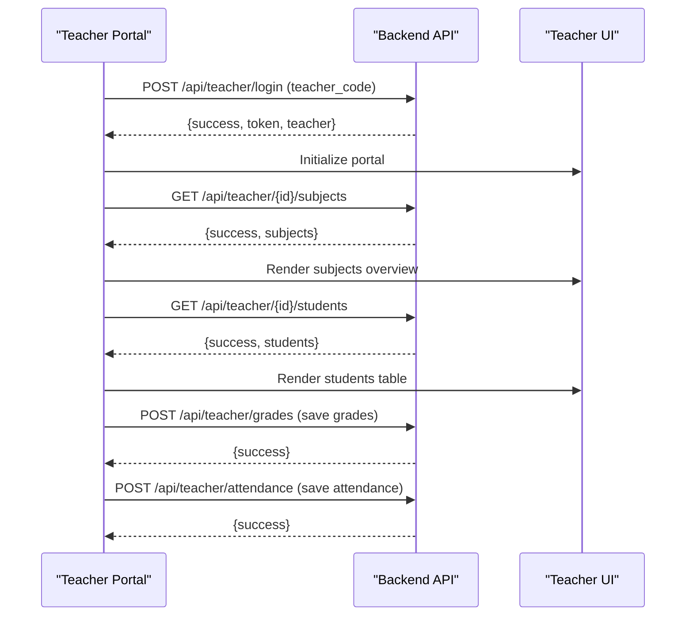
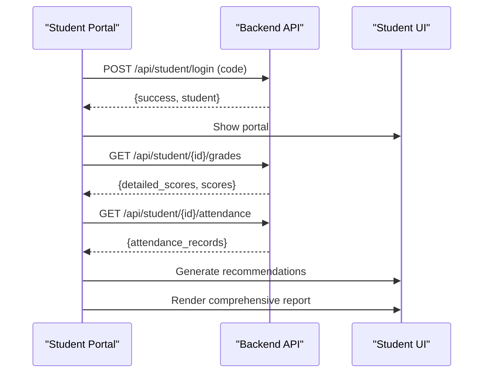
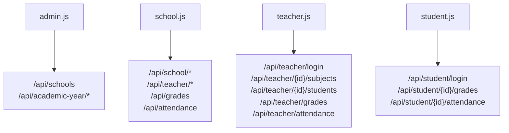

# Role-Specific Portals

<cite>
**Referenced Files in This Document**
- [index.html](file://public/index.html)
- [admin-dashboard.html](file://public/admin-dashboard.html)
- [school-dashboard.html](file://public/school-dashboard.html)
- [teacher-portal.html](file://public/teacher-portal.html)
- [student-portal.html](file://public/student-portal.html)
- [admin.js](file://public/assets/js/admin.js)
- [school.js](file://public/assets/js/school.js)
- [teacher.js](file://public/assets/js/teacher.js)
- [student.js](file://public/assets/js/student.js)
</cite>

## Table of Contents
1. [Introduction](#introduction)
2. [Project Structure](#project-structure)
3. [Core Components](#core-components)
4. [Architecture Overview](#architecture-overview)
5. [Detailed Component Analysis](#detailed-component-analysis)
6. [Dependency Analysis](#dependency-analysis)
7. [Performance Considerations](#performance-considerations)
8. [Troubleshooting Guide](#troubleshooting-guide)
9. [Conclusion](#conclusion)

## Introduction
This document describes the role-specific portal architecture in EduFlow, detailing four distinct user portals: admin dashboard, school dashboard, teacher portal, and student portal. It explains navigation patterns, role-based content filtering, permission-driven feature access, portal-specific UI components, data visualization elements, interactive features, routing mechanisms, session management, data isolation, security considerations, role switching, and user experience optimizations.

## Project Structure
EduFlow organizes the front-end into:
- A central landing page with role selection modals
- Four dedicated portal pages (admin, school, teacher, student)
- Shared design system and unified CSS/JS assets
- Role-specific JavaScript modules handling authentication, data loading, and UI updates

**Diagram sources**
- [index.html](file://public/index.html#L45-L102)
- [admin-dashboard.html](file://public/admin-dashboard.html#L1-L50)
- [school-dashboard.html](file://public/school-dashboard.html#L1-L50)
- [teacher-portal.html](file://public/teacher-portal.html#L1-L50)
- [student-portal.html](file://public/student-portal.html#L1-L50)
- [admin.js](file://public/assets/js/admin.js#L1-L50)
- [school.js](file://public/assets/js/school.js#L1-L50)
- [teacher.js](file://public/assets/js/teacher.js#L1-L50)
- [student.js](file://public/assets/js/student.js#L1-L50)

**Section sources**
- [index.html](file://public/index.html#L45-L102)
- [admin-dashboard.html](file://public/admin-dashboard.html#L1-L50)
- [school-dashboard.html](file://public/school-dashboard.html#L1-L50)
- [teacher-portal.html](file://public/teacher-portal.html#L1-L50)
- [student-portal.html](file://public/student-portal.html#L1-L50)

## Core Components
- Role selection and routing: Centralized role cards and modals route users to respective portals.
- Authentication and session management: Local storage tokens per role; logout clears role-specific storage.
- Data isolation: Each portal loads and displays only role-appropriate data via backend endpoints.
- UI components: Unified design system with role-specific enhancements and responsive layouts.
- Interactive features: Modals, tabs, forms, charts, and recommendation engines.

**Section sources**
- [index.html](file://public/index.html#L170-L342)
- [admin.js](file://public/assets/js/admin.js#L8-L15)
- [school.js](file://public/assets/js/school.js#L16-L23)
- [teacher.js](file://public/assets/js/teacher.js#L10-L17)
- [student.js](file://public/assets/js/student.js#L1-L10)

## Architecture Overview
The portal architecture follows a client-side routing pattern with role-based modals and dedicated dashboards. Each portal integrates with backend APIs for data retrieval and persistence, using role-specific tokens stored locally.

**Diagram sources**
- [index.html](file://public/index.html#L202-L342)
- [admin-dashboard.html](file://public/admin-dashboard.html#L1-L50)
- [school-dashboard.html](file://public/school-dashboard.html#L1-L50)
- [teacher-portal.html](file://public/teacher-portal.html#L1-L50)
- [student-portal.html](file://public/student-portal.html#L1-L50)

## Detailed Component Analysis

### Admin Dashboard
- Purpose: System-wide management including school creation, academic year management, and administrative exports.
- Navigation: Header controls, academic year display, and action buttons.
- Role-based filtering: Operates on system-wide data; manages schools and academic years centrally.
- Permission-driven features: CRUD operations on schools and academic years require admin token.
- UI components: Forms, tables, modals for creating academic years, exporting lists, and managing grade levels.
- Data visualization: None in the provided HTML; JavaScript handles data loading and rendering.
- Interactive features: Add school, edit fields, delete school, export to Excel, manage grade levels, create academic years.

**Diagram sources**
- [admin-dashboard.html](file://public/admin-dashboard.html#L33-L120)
- [admin.js](file://public/assets/js/admin.js#L64-L102)
- [admin.js](file://public/assets/js/admin.js#L177-L217)
- [admin.js](file://public/assets/js/admin.js#L240-L262)
- [admin.js](file://public/assets/js/admin.js#L318-L349)
- [admin.js](file://public/assets/js/admin.js#L392-L567)
- [admin.js](file://public/assets/js/admin.js#L574-L614)

**Section sources**
- [admin-dashboard.html](file://public/admin-dashboard.html#L19-L120)
- [admin.js](file://public/assets/js/admin.js#L64-L102)
- [admin.js](file://public/assets/js/admin.js#L177-L217)
- [admin.js](file://public/assets/js/admin.js#L240-L262)
- [admin.js](file://public/assets/js/admin.js#L318-L349)
- [admin.js](file://public/assets/js/admin.js#L392-L567)
- [admin.js](file://public/assets/js/admin.js#L574-L614)

### School Dashboard
- Purpose: Institutional operations including grade-level management, subject administration, teacher assignment, grading, and attendance.
- Navigation: Tabs for grade-level content, performance analytics, and teacher/student management.
- Role-based filtering: Displays data scoped to the authenticated school and academic year.
- Permission-driven features: Manage subjects, assign teachers, record grades and attendance.
- UI components: Cards, tables, modals for grades, attendance, subject management, and teacher registration.
- Data visualization: Charts for performance indicators and AI predictions.
- Interactive features: Dynamic grade-level selection, performance analytics filters, tabs switching, and modals for detailed views.

**Diagram sources**
- [school-dashboard.html](file://public/school-dashboard.html#L288-L394)
- [school.js](file://public/assets/js/school.js#L1-L50)
- [school.js](file://public/assets/js/school.js#L783-L795)

**Section sources**
- [school-dashboard.html](file://public/school-dashboard.html#L288-L394)
- [school.js](file://public/assets/js/school.js#L1-L50)
- [school.js](file://public/assets/js/school.js#L783-L795)

### Teacher Portal
- Purpose: Classroom management including viewing assigned subjects, managing student grades, and recording daily attendance.
- Navigation: Login screen and dashboard with subject overview, recommendations, and student lists.
- Role-based filtering: Displays only subjects and students assigned to the authenticated teacher.
- Permission-driven features: Read/write access to grades and attendance for assigned subjects.
- UI components: Subject cards, student tables, modals for grades and attendance, and recommendation sections.
- Data visualization: None in the provided HTML; JavaScript handles data loading and rendering.
- Interactive features: Login with code validation, subject selection, grade input, attendance status selection, and save actions.

**Diagram sources**
- [teacher-portal.html](file://public/teacher-portal.html#L414-L461)
- [teacher.js](file://public/assets/js/teacher.js#L60-L104)
- [teacher.js](file://public/assets/js/teacher.js#L304-L334)
- [teacher.js](file://public/assets/js/teacher.js#L337-L372)
- [teacher.js](file://public/assets/js/teacher.js#L572-L604)
- [teacher.js](file://public/assets/js/teacher.js#L702-L738)

**Section sources**
- [teacher-portal.html](file://public/teacher-portal.html#L414-L461)
- [teacher.js](file://public/assets/js/teacher.js#L60-L104)
- [teacher.js](file://public/assets/js/teacher.js#L304-L334)
- [teacher.js](file://public/assets/js/teacher.js#L337-L372)
- [teacher.js](file://public/assets/js/teacher.js#L572-L604)
- [teacher.js](file://public/assets/js/teacher.js#L702-L738)

### Student Portal
- Purpose: Academic tracking including detailed scores, daily attendance, and personalized recommendations.
- Navigation: Login screen and portal with tabs for detailed scores, attendance, and comprehensive report.
- Role-based filtering: Displays data for the authenticated student and selected academic year.
- Permission-driven features: Read-only access to personal academic data and recommendations.
- UI components: Tabbed interface, performance insights, recommendation engine, and comprehensive report container.
- Data visualization: None in the provided HTML; JavaScript handles data loading and rendering.
- Interactive features: Login with code, academic year selector, tab switching, and recommendation generation.

**Diagram sources**
- [student-portal.html](file://public/student-portal.html#L34-L125)
- [student.js](file://public/assets/js/student.js#L540-L565)
- [student.js](file://public/assets/js/student.js#L629-L684)
- [student.js](file://public/assets/js/student.js#L764-L781)

**Section sources**
- [student-portal.html](file://public/student-portal.html#L34-L125)
- [student.js](file://public/assets/js/student.js#L540-L565)
- [student.js](file://public/assets/js/student.js#L629-L684)
- [student.js](file://public/assets/js/student.js#L764-L781)

## Dependency Analysis
- Front-end dependencies:
  - Unified design system and CSS classes shared across portals
  - Role-specific JS modules handling authentication, data loading, and UI updates
  - Backend API endpoints for each role (admin, school, teacher, student)
- Back-end dependencies:
  - Token-based authentication per role
  - Data isolation per role (admin system-wide, school/school-scoped, teacher/subject-scoped, student/personal)
- Coupling and cohesion:
  - Each portal module is cohesive around its role and interacts with a small set of API endpoints
  - Cohesion improves maintainability; coupling is minimized through role-specific tokens and endpoints

**Diagram sources**
- [admin.js](file://public/assets/js/admin.js#L64-L102)
- [school.js](file://public/assets/js/school.js#L783-L795)
- [teacher.js](file://public/assets/js/teacher.js#L304-L334)
- [student.js](file://public/assets/js/student.js#L540-L565)

**Section sources**
- [admin.js](file://public/assets/js/admin.js#L64-L102)
- [school.js](file://public/assets/js/school.js#L783-L795)
- [teacher.js](file://public/assets/js/teacher.js#L304-L334)
- [student.js](file://public/assets/js/student.js#L540-L565)

## Performance Considerations
- Local storage usage: Tokens and cached data reduce repeated network requests.
- Lazy loading: Portals load data on demand (e.g., grade levels, subjects, students).
- Responsive design: Grids and tables adapt to device sizes, reducing layout thrashing.
- Recommendation engines: Computationally intensive analysis runs client-side; consider debouncing and caching results.
- Chart rendering: Initialize charts only when sections are visible to avoid unnecessary computations.

## Troubleshooting Guide
- Authentication failures:
  - Verify role-specific login endpoints and token storage keys.
  - Check for CORS and network errors in browser dev tools.
- Data loading issues:
  - Confirm API responses include success flags and expected fields.
  - Validate JSON parsing and error handling in each portal module.
- UI rendering problems:
  - Ensure DOM elements exist before manipulating them.
  - Use defensive checks for missing data and provide fallback UI states.
- Session management:
  - Clear role-specific storage on logout.
  - Re-check stored data on page load and handle parsing errors gracefully.

**Section sources**
- [index.html](file://public/index.html#L202-L342)
- [admin.js](file://public/assets/js/admin.js#L64-L102)
- [school.js](file://public/assets/js/school.js#L783-L795)
- [teacher.js](file://public/assets/js/teacher.js#L741-L763)
- [student.js](file://public/assets/js/student.js#L530-L537)

## Conclusion
EduFlow’s role-specific portal architecture provides a cohesive, secure, and user-focused system. Each portal leverages a unified design system while offering role-specific features, data isolation, and interactive experiences. The modular JavaScript architecture supports maintainability and scalability, with clear separation of concerns and robust session management per role.