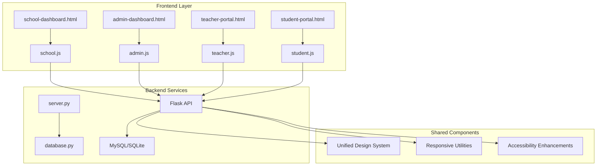
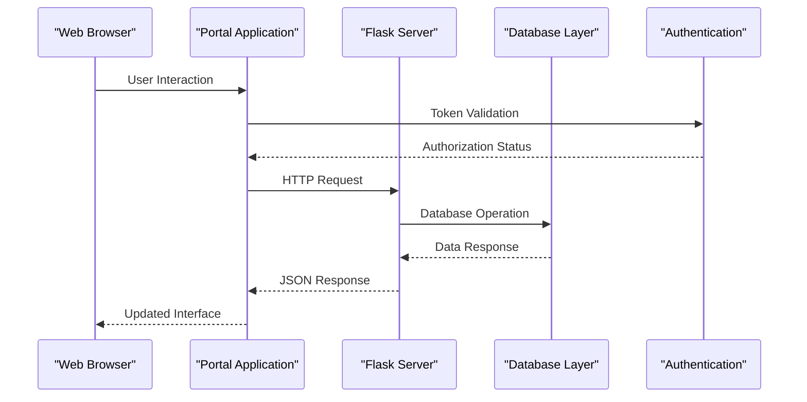
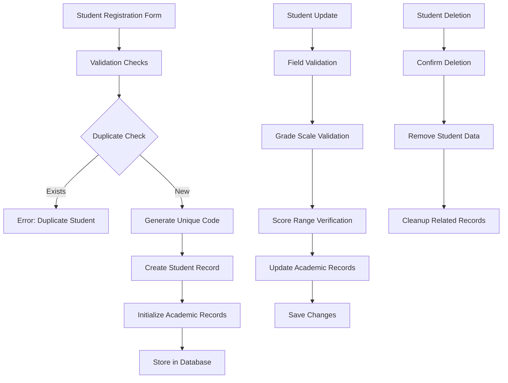
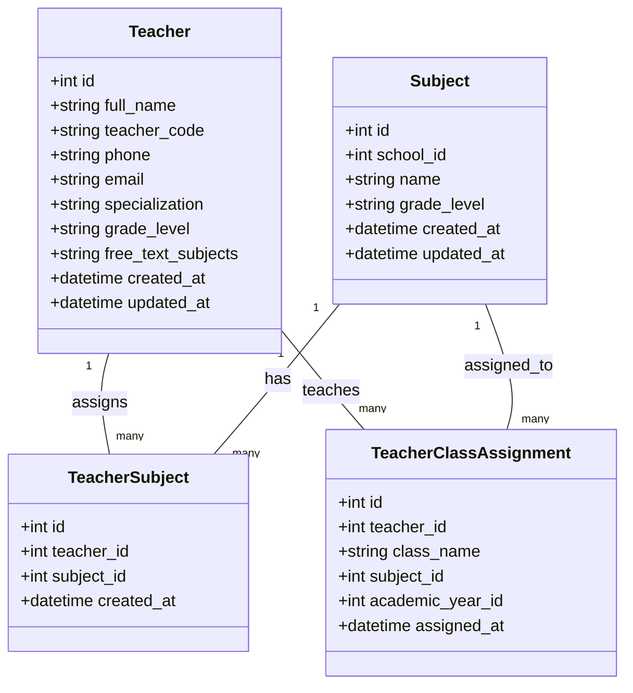
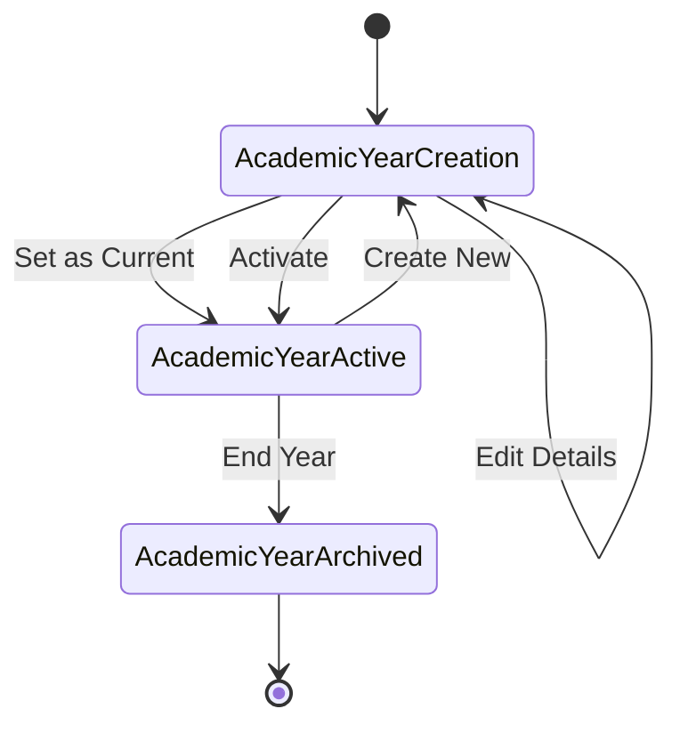
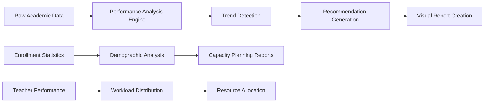
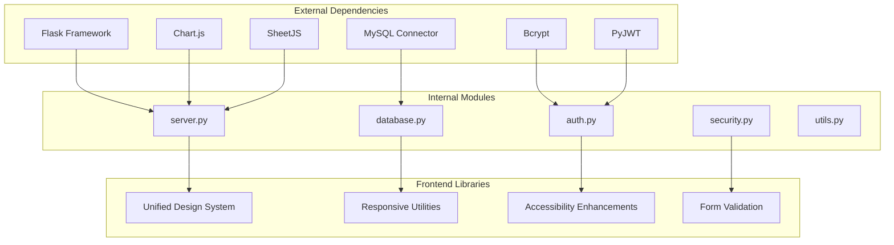

# School Dashboard Portal

<cite>
**Referenced Files in This Document**
- [school-dashboard.html](file://public/school-dashboard.html)
- [admin-dashboard.html](file://public/admin-dashboard.html)
- [teacher-portal.html](file://public/teacher-portal.html)
- [student-portal.html](file://public/student-portal.html)
- [server.py](file://server.py)
- [database.py](file://database.py)
- [school.js](file://public/assets/js/school.js)
- [admin.js](file://public/assets/js/admin.js)
- [teacher.js](file://public/assets/js/teacher.js)
- [student.js](file://public/assets/js/student.js)
</cite>

## Table of Contents
1. [Introduction](#introduction)
2. [Project Structure](#project-structure)
3. [Core Components](#core-components)
4. [Architecture Overview](#architecture-overview)
5. [Detailed Component Analysis](#detailed-component-analysis)
6. [Dependency Analysis](#dependency-analysis)
7. [Performance Considerations](#performance-considerations)
8. [Troubleshooting Guide](#troubleshooting-guide)
9. [Conclusion](#conclusion)

## Introduction
The School Dashboard Portal is a comprehensive educational management system designed to streamline administrative operations across multiple school levels. Built with a modern web architecture, it provides integrated solutions for student enrollment, teacher assignment coordination, academic year tracking, and institutional reporting. The system operates through four primary portals: the School Dashboard for administrators, the Teacher Portal for instructional staff, the Student Portal for learners, and the Admin Dashboard for system oversight.

The platform emphasizes unified design systems, responsive layouts, and intelligent academic analytics. It supports multiple educational stages including elementary, middle, secondary, and preparatory levels, with specialized features for each tier. The system integrates advanced data visualization, automated recommendation engines, and comprehensive reporting capabilities to enhance educational outcomes.

## Project Structure
The School Dashboard Portal follows a modular architecture with clear separation between frontend presentation layers and backend service components. The project utilizes a hybrid database approach supporting both MySQL and SQLite for development and production environments.

**Diagram sources**
- [school-dashboard.html](file://public/school-dashboard.html#L1-L800)
- [admin-dashboard.html](file://public/admin-dashboard.html#L1-L174)
- [teacher-portal.html](file://public/teacher-portal.html#L1-L631)
- [student-portal.html](file://public/student-portal.html#L1-L800)
- [server.py](file://server.py#L1-L800)
- [database.py](file://database.py#L1-L729)

**Section sources**
- [school-dashboard.html](file://public/school-dashboard.html#L1-L800)
- [admin-dashboard.html](file://public/admin-dashboard.html#L1-L174)
- [teacher-portal.html](file://public/teacher-portal.html#L1-L631)
- [student-portal.html](file://public/student-portal.html#L1-L800)
- [server.py](file://server.py#L1-L800)
- [database.py](file://database.py#L1-L729)

## Core Components

### Administrative Dashboard
The School Dashboard serves as the central operational interface for school administrators, featuring comprehensive management capabilities across all educational levels. The interface displays academic year information prominently, presents institutional information panels, and provides operational controls for administrative tasks.

Key administrative features include:
- **Grade Level Management**: Dynamic display and management of educational levels with responsive grid layouts
- **Performance Analytics**: Real-time dashboards with interactive charts and predictive modeling
- **Export Capabilities**: Excel export functionality for teachers and students data
- **Responsive Design**: Mobile-first approach with adaptive layouts for various screen sizes

### Academic Year Tracking System
The portal implements a centralized academic year management system that coordinates educational activities across all school levels. The system maintains synchronized academic calendars, tracks enrollment periods, and manages grade progression workflows.

### Institutional Reporting Engine
Advanced reporting capabilities provide administrators with comprehensive insights into institutional performance, including:
- Aggregate performance metrics across grade levels
- Comparative analysis between educational stages
- Predictive analytics for student outcomes
- Resource utilization reports

**Section sources**
- [school-dashboard.html](file://public/school-dashboard.html#L269-L394)
- [server.py](file://server.py#L269-L304)
- [database.py](file://database.py#L261-L320)

## Architecture Overview

The School Dashboard Portal employs a client-server architecture with a Flask-based backend serving multiple frontend applications through a unified API layer.

**Diagram sources**
- [server.py](file://server.py#L1-L800)
- [school.js](file://public/assets/js/school.js#L16-L23)
- [admin.js](file://public/assets/js/admin.js#L8-L15)

The architecture supports four distinct user roles with role-based access control:
- **Administrator**: Full system management with school-level oversight
- **School Administrator**: Institutional management within assigned schools
- **Teacher**: Subject-specific student management and grading
- **Student**: Personal academic progress tracking and recommendations

**Section sources**
- [server.py](file://server.py#L91-L108)
- [school.js](file://public/assets/js/school.js#L1-L10)
- [teacher.js](file://public/assets/js/teacher.js#L1-L10)

## Detailed Component Analysis

### Student Enrollment Management System

The student enrollment management component provides comprehensive functionality for student registration, academic record tracking, and personal information management.

**Diagram sources**
- [server.py](file://server.py#L469-L559)
- [server.py](file://server.py#L564-L681)

Key enrollment features include:
- **Multi-grade Level Support**: Automatic grade scale detection (10-point for elementary grades 1-4, 100-point for higher levels)
- **Unique Student Codes**: Automated code generation with collision avoidance
- **Medical Information Tracking**: Blood type, chronic conditions, and emergency contact management
- **Academic Progression**: Detailed score tracking across six assessment periods

**Section sources**
- [server.py](file://server.py#L469-L559)
- [server.py](file://server.py#L564-L681)
- [school.js](file://public/assets/js/school.js#L37-L216)

### Teacher Assignment Coordination System

The teacher management component handles staff allocation, subject assignments, and workload distribution across educational levels.

**Diagram sources**
- [database.py](file://database.py#L219-L245)
- [database.py](file://database.py#L247-L259)

The system provides:
- **Flexible Subject Assignment**: Both predefined subjects and free-text subject management
- **Class Assignment Tracking**: Multi-year academic year support for teacher workload distribution
- **Real-time Student Lists**: Dynamic retrieval of students based on teacher subject assignments
- **Performance Analytics**: Teacher workload metrics and student performance correlation

**Section sources**
- [database.py](file://database.py#L219-L259)
- [teacher.js](file://public/assets/js/teacher.js#L303-L372)

### Academic Year Tracking and Management

The academic year management system implements a centralized approach to educational calendar coordination across all institutional levels.

**Diagram sources**
- [database.py](file://database.py#L261-L289)
- [admin.js](file://public/assets/js/admin.js#L573-L589)

The system features:
- **Centralized Management**: Single academic year configuration applicable to all schools
- **Automatic Calculation**: Intelligent year boundary determination based on current date
- **Multi-year Support**: Historical tracking and reporting across academic cycles
- **Integration Points**: Seamless coordination with student enrollment and teacher assignments

**Section sources**
- [database.py](file://database.py#L261-L289)
- [admin.js](file://public/assets/js/admin.js#L573-L589)

### Institutional Reporting and Analytics

The reporting system provides comprehensive analytical capabilities for educational performance monitoring and strategic decision-making.

**Diagram sources**
- [school.js](file://public/assets/js/school.js#L226-L579)
- [student.js](file://public/assets/js/student.js#L132-L516)

Advanced analytical features include:
- **AI-Powered Predictions**: Machine learning models for student performance forecasting
- **Multi-dimensional Analysis**: Cross-correlation between grades, attendance, and demographic factors
- **Automated Recommendations**: Personalized study plans and intervention strategies
- **Real-time Dashboards**: Interactive visualizations with drill-down capabilities

**Section sources**
- [school.js](file://public/assets/js/school.js#L226-L579)
- [student.js](file://public/assets/js/student.js#L132-L516)

## Dependency Analysis

The School Dashboard Portal exhibits well-structured dependencies with clear separation of concerns and minimal coupling between components.

**Diagram sources**
- [server.py](file://server.py#L1-L16)
- [database.py](file://database.py#L1-L18)

The dependency structure ensures:
- **Database Abstraction**: Transparent switching between MySQL and SQLite backends
- **Security Layering**: Multi-tier authentication and authorization mechanisms
- **Frontend Consistency**: Unified design system across all portal applications
- **API Cohesion**: Well-defined interfaces between frontend and backend components

**Section sources**
- [server.py](file://server.py#L1-L16)
- [database.py](file://database.py#L1-L18)

## Performance Considerations

The School Dashboard Portal implements several performance optimization strategies to ensure responsive operation under varying loads.

### Database Optimization
- **Connection Pooling**: MySQL connection pooling reduces overhead for concurrent operations
- **Query Optimization**: Parameterized queries prevent SQL injection and improve execution plans
- **Index Strategy**: Strategic indexing on frequently queried fields (student codes, teacher assignments)
- **Caching Layers**: Redis integration for frequently accessed configuration data

### Frontend Performance
- **Lazy Loading**: Dynamic module loading reduces initial bundle size
- **Responsive Images**: Adaptive image loading based on device capabilities
- **Efficient DOM Manipulation**: Virtual scrolling for large datasets
- **Asset Optimization**: Minification and compression of static resources

### Scalability Features
- **Horizontal Scaling**: Stateless API design enables easy load balancing
- **Database Sharding**: Potential for future sharding based on geographic regions
- **CDN Integration**: Static asset delivery through content delivery networks
- **Microservice Ready**: Modular architecture supports future microservice decomposition

## Troubleshooting Guide

### Common Issues and Solutions

**Authentication Problems**
- **Issue**: Login failures despite correct credentials
- **Solution**: Verify JWT secret configuration and token expiration settings
- **Prevention**: Regular security audits and token rotation policies

**Database Connection Errors**
- **Issue**: MySQL connectivity failures in production
- **Solution**: Verify connection pool configuration and network security groups
- **Prevention**: Implement connection retry logic and health check endpoints

**Performance Degradation**
- **Issue**: Slow response times with increasing user load
- **Solution**: Analyze query execution plans and implement appropriate indexing
- **Prevention**: Monitor query performance and optimize slow-running operations

**Data Synchronization Issues**
- **Issue**: Inconsistent data between frontend and backend
- **Solution**: Implement optimistic locking and conflict resolution strategies
- **Prevention**: Establish comprehensive data validation and sanitization

### Debugging Tools and Techniques

The system provides comprehensive logging and monitoring capabilities:
- **Server-side Logging**: Structured logs with correlation IDs for request tracing
- **Frontend Error Tracking**: Client-side error reporting with user context
- **Performance Metrics**: Real-time monitoring of response times and resource utilization
- **Health Checks**: Automated system health verification with alerting integration

**Section sources**
- [server.py](file://server.py#L110-L139)
- [database.py](file://database.py#L88-L118)

## Conclusion

The School Dashboard Portal represents a comprehensive solution for modern educational administration, combining robust backend services with intuitive frontend interfaces. The system's modular architecture, unified design principles, and advanced analytical capabilities position it as a scalable foundation for educational institutions seeking digital transformation.

Key strengths include:
- **Unified Multi-Level Support**: Seamless operation across elementary, middle, secondary, and preparatory education
- **Intelligent Analytics**: AI-powered recommendations and predictive modeling for enhanced educational outcomes
- **Flexible Deployment**: Support for both cloud-native and traditional deployment scenarios
- **Comprehensive Security**: Multi-layered security approach protecting sensitive educational data

The platform's extensible architecture enables continued enhancement and adaptation to evolving educational needs, making it a valuable investment for institutions committed to leveraging technology for improved educational delivery and administrative efficiency.