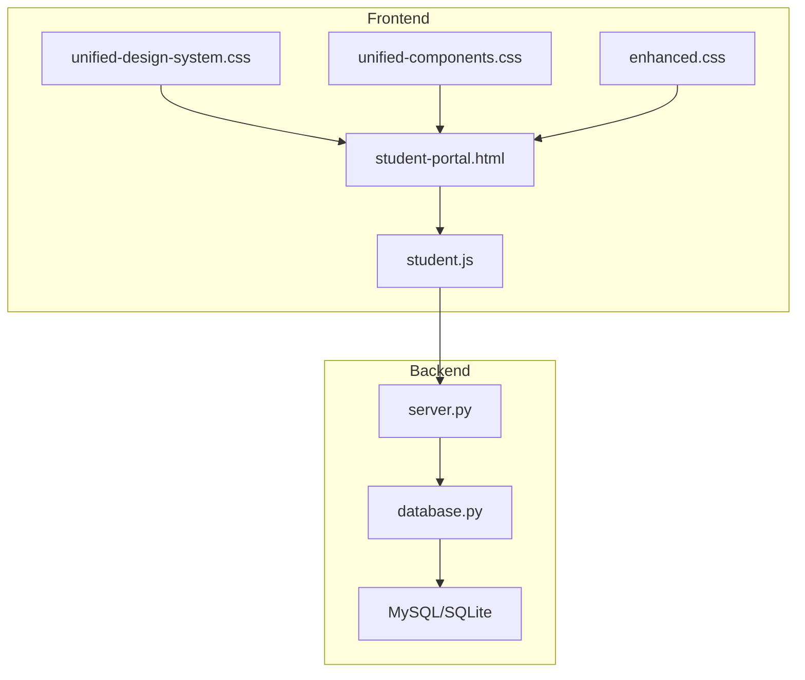
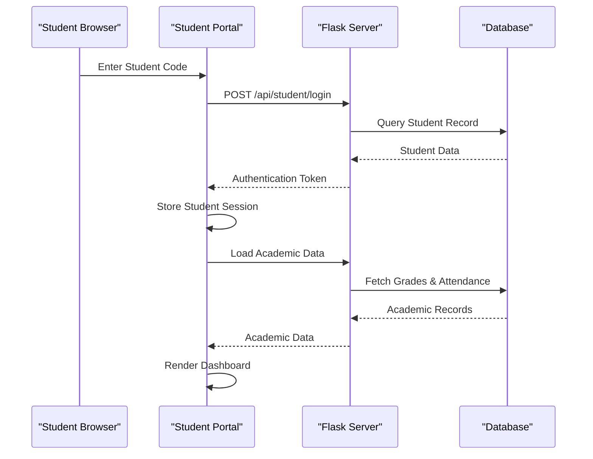
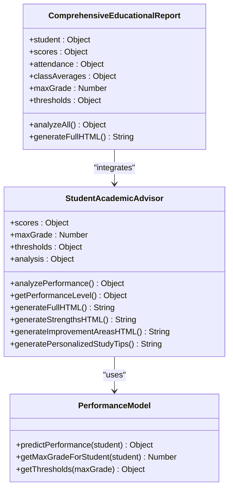
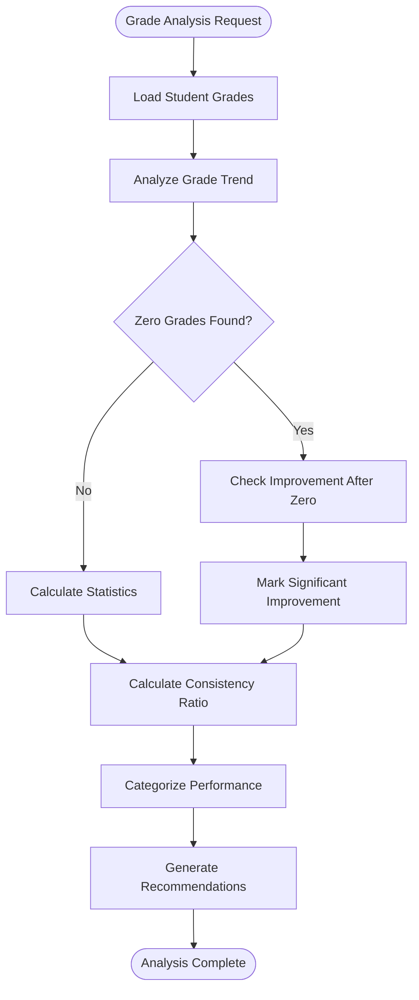
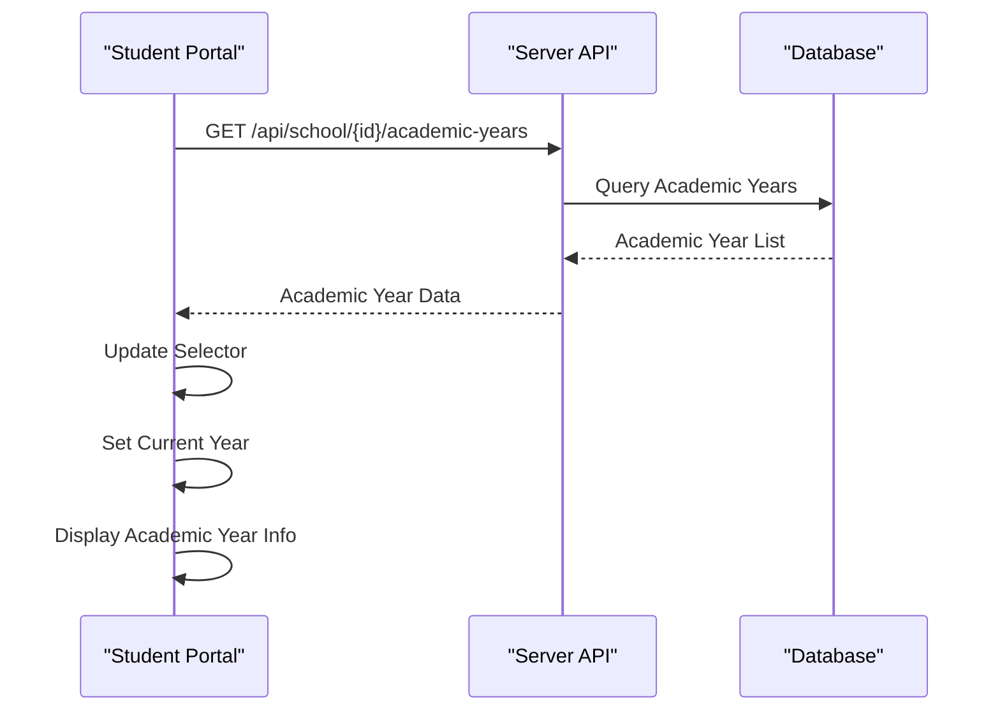
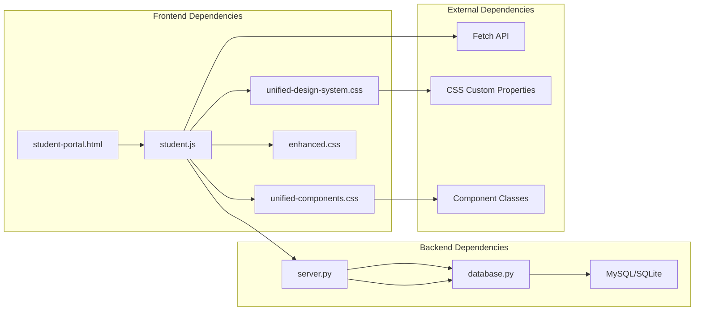

# Student Portal

<cite>
**Referenced Files in This Document**
- [student-portal.html](file://public/student-portal.html)
- [student.js](file://public/assets/js/student.js)
- [server.py](file://server.py)
- [database.py](file://database.py)
- [unified-design-system.css](file://public/assets/css/unified-design-system.css)
- [unified-components.css](file://public/assets/css/unified-components.css)
- [enhanced.css](file://public/assets/css/enhanced.css)
- [index.html](file://public/index.html)
- [README.md](file://README.md)
</cite>

## Table of Contents
1. [Introduction](#introduction)
2. [Project Structure](#project-structure)
3. [Core Components](#core-components)
4. [Architecture Overview](#architecture-overview)
5. [Detailed Component Analysis](#detailed-component-analysis)
6. [Dependency Analysis](#dependency-analysis)
7. [Performance Considerations](#performance-considerations)
8. [Troubleshooting Guide](#troubleshooting-guide)
9. [Conclusion](#conclusion)

## Introduction
The Student Portal is the academic tracking interface for learners and their families within the EduFlow school management system. It enables students to monitor academic progress, view grades, track attendance, and access comprehensive performance reports. The portal features an Arabic RTL interface with academic year displays, subject listings, and grade visualization components. It integrates with student records, teacher communications, and academic calendar systems to support student learning and enable family involvement in education tracking.

## Project Structure
The Student Portal is built as a client-side web application with a Python/Flask backend serving REST APIs. The frontend consists of HTML templates, CSS design systems, and JavaScript modules that handle user interactions and data visualization.

**Diagram sources**
- [student-portal.html](file://public/student-portal.html#L1-L125)
- [student.js](file://public/assets/js/student.js#L1-L80)
- [server.py](file://server.py#L1-L50)
- [database.py](file://database.py#L1-L50)

**Section sources**
- [README.md](file://README.md#L1-L23)
- [index.html](file://public/index.html#L1-L100)

## Core Components
The Student Portal comprises several key components that work together to provide a comprehensive academic tracking experience:

### Authentication System
The portal implements a secure authentication mechanism allowing students to access their academic information through a simple login process using student codes.

### Academic Progress Monitoring
Real-time grade tracking with trend analysis, performance prediction, and personalized recommendations based on individual academic performance patterns.

### Attendance Tracking
Comprehensive attendance monitoring with daily log entries, status indicators, and historical tracking capabilities.

### Performance Reporting
Advanced reporting system generating detailed academic insights, comparative analysis, and actionable recommendations for improvement.

### User Interface Components
Arabic RTL interface with responsive design, academic year selectors, subject organization, and grade visualization components.

**Section sources**
- [student-portal.html](file://public/student-portal.html#L34-L125)
- [student.js](file://public/assets/js/student.js#L518-L581)
- [server.py](file://server.py#L258-L304)

## Architecture Overview
The Student Portal follows a client-server architecture pattern with clear separation of concerns between frontend presentation logic and backend data management.

**Diagram sources**
- [student-portal.html](file://public/student-portal.html#L127-L153)
- [student.js](file://public/assets/js/student.js#L539-L581)
- [server.py](file://server.py#L258-L304)

## Detailed Component Analysis

### Academic Advisor Engine
The portal features a sophisticated academic advisor system that analyzes student performance patterns and generates personalized recommendations.

**Diagram sources**
- [student.js](file://public/assets/js/student.js#L132-L516)
- [student.js](file://public/assets/js/student.js#L787-L950)

The advisor engine performs comprehensive analysis including:
- Trend analysis across assessment periods
- Performance categorization (excellent, good, satisfactory, at-risk, critical)
- Strength identification and improvement area detection
- Personalized study recommendations
- Comparative analysis with class averages

### Grade Trend Analysis System
The portal implements advanced algorithms for analyzing grade progression patterns and identifying performance trends.

**Diagram sources**
- [student.js](file://public/assets/js/student.js#L39-L127)
- [student.js](file://public/assets/js/student.js#L280-L374)

### Academic Year Management
The portal supports dynamic academic year switching with automatic current year detection based on the present date.

**Diagram sources**
- [student.js](file://public/assets/js/student.js#L1591-L1624)
- [server.py](file://server.py#L441-L467)

### Comprehensive Report Generation
The portal generates detailed educational reports combining academic performance, attendance patterns, and comparative analysis.

**Section sources**
- [student.js](file://public/assets/js/student.js#L787-L950)
- [student.js](file://public/assets/js/student.js#L1439-L1491)

## Dependency Analysis
The Student Portal has well-defined dependencies between frontend components and backend services.

**Diagram sources**
- [student-portal.html](file://public/student-portal.html#L1-L16)
- [student.js](file://public/assets/js/student.js#L1-L20)
- [server.py](file://server.py#L1-L20)

**Section sources**
- [student-portal.html](file://public/student-portal.html#L1-L16)
- [student.js](file://public/assets/js/student.js#L1-L20)
- [server.py](file://server.py#L1-L20)

## Performance Considerations
The Student Portal is optimized for performance through several mechanisms:

### Data Loading Strategies
- Lazy loading of comprehensive reports to reduce initial page load time
- Efficient JSON parsing and caching of academic data
- Conditional loading of academic year selectors based on availability

### Memory Management
- Proper cleanup of event listeners and DOM references
- Efficient rendering of large datasets using virtual scrolling techniques
- Optimized CSS animations and transitions

### Network Optimization
- Minimal API calls through batched requests
- Local storage utilization for session persistence
- Caching strategies for frequently accessed data

## Troubleshooting Guide
Common issues and their solutions:

### Login Issues
- **Problem**: Students cannot log in with valid codes
- **Solution**: Verify student codes exist in the database and check server logs for authentication errors

### Data Loading Problems
- **Problem**: Academic data not displaying properly
- **Solution**: Check network connectivity, verify API endpoints are reachable, and inspect browser console for JavaScript errors

### Performance Issues
- **Problem**: Slow page loading or rendering delays
- **Solution**: Clear browser cache, disable browser extensions, and check server response times

### Display Issues
- **Problem**: Arabic RTL layout problems or font rendering issues
- **Solution**: Ensure Cairo font is loading correctly and verify CSS media queries are functioning

**Section sources**
- [student.js](file://public/assets/js/student.js#L539-L581)
- [server.py](file://server.py#L258-L304)

## Conclusion
The Student Portal provides a comprehensive academic tracking solution that effectively bridges the gap between students, families, and educational institutions. Its Arabic RTL interface, sophisticated performance analysis capabilities, and seamless integration with academic record systems make it an invaluable tool for supporting student learning and enabling meaningful family involvement in education tracking. The modular architecture ensures maintainability and scalability, while the performance optimizations guarantee reliable operation across diverse computing environments.