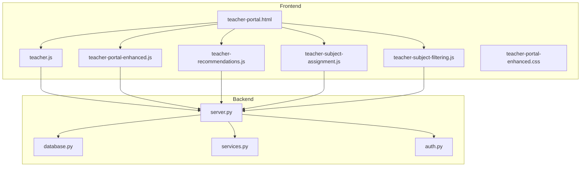
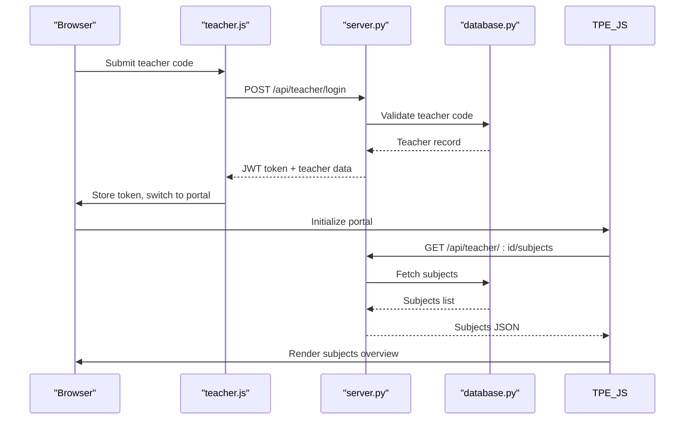
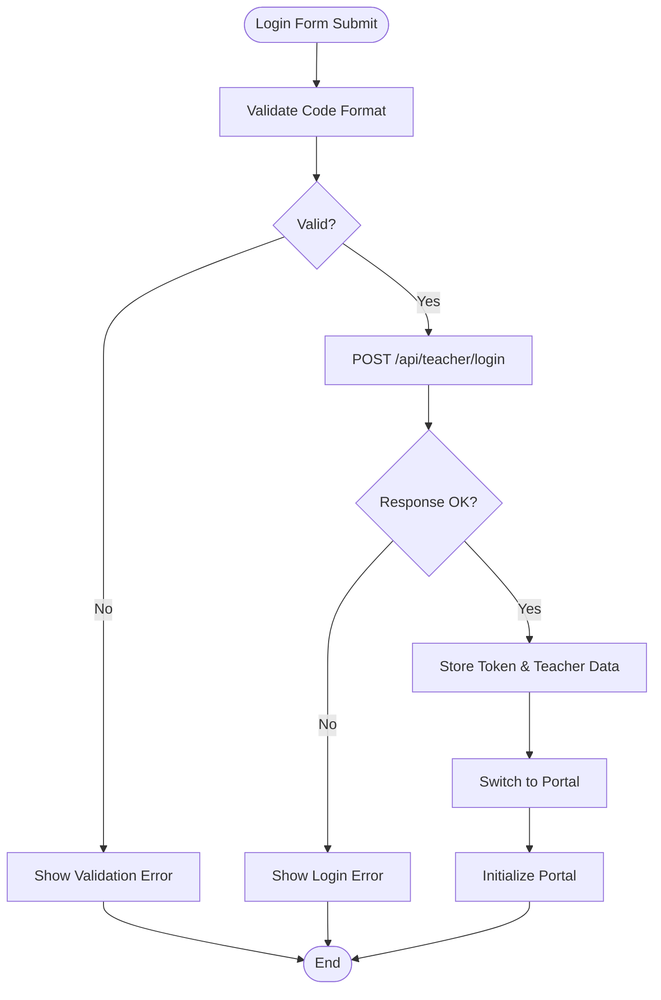
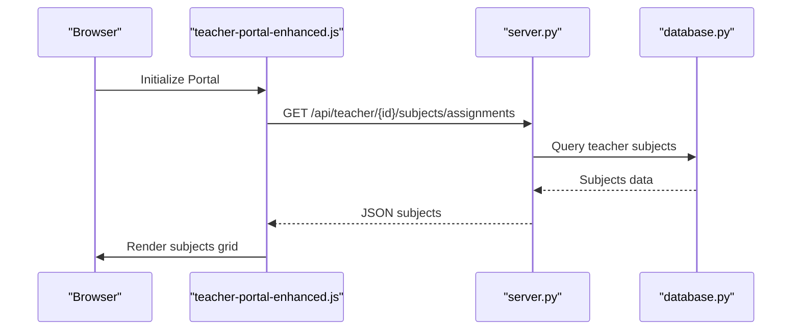
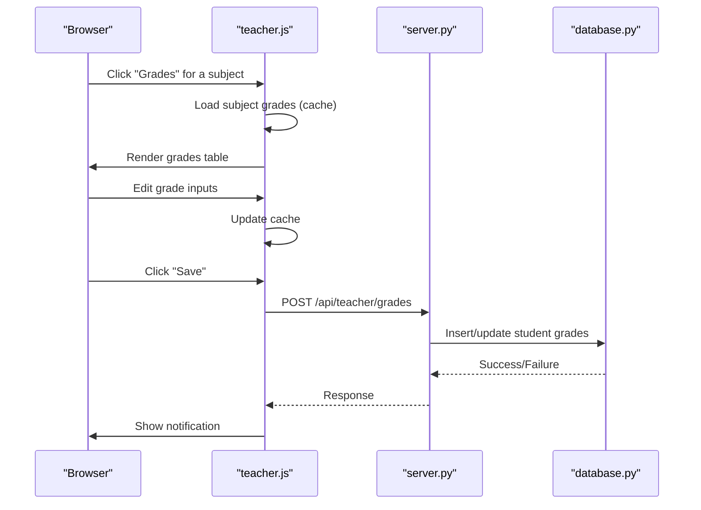
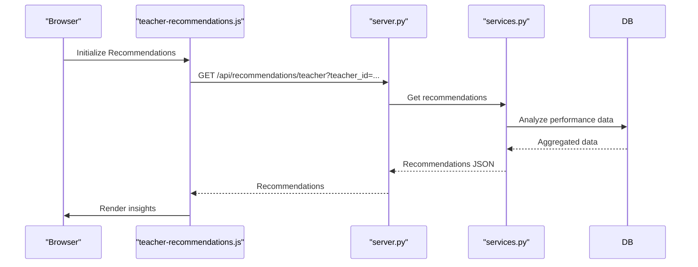
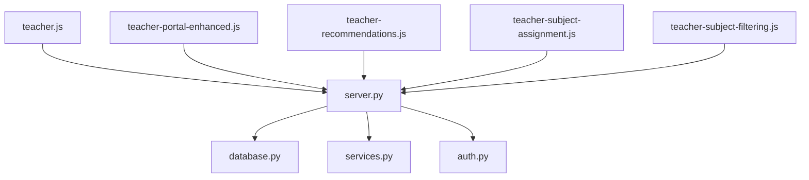

# Teacher Portal

<cite>
**Referenced Files in This Document**
- [teacher-portal.html](file://public/teacher-portal.html)
- [teacher.js](file://public/assets/js/teacher.js)
- [teacher-portal-enhanced.js](file://public/assets/js/teacher-portal-enhanced.js)
- [teacher-recommendations.js](file://public/assets/js/teacher-recommendations.js)
- [teacher-subject-assignment.js](file://public/assets/js/teacher-subject-assignment.js)
- [teacher-subject-filtering.js](file://public/assets/js/teacher-subject-filtering.js)
- [teacher-portal-enhanced.css](file://public/assets/css/teacher-portal-enhanced.css)
- [server.py](file://server.py)
- [database.py](file://database.py)
- [services.py](file://services.py)
- [auth.py](file://auth.py)
</cite>

## Table of Contents
1. [Introduction](#introduction)
2. [Project Structure](#project-structure)
3. [Core Components](#core-components)
4. [Architecture Overview](#architecture-overview)
5. [Detailed Component Analysis](#detailed-component-analysis)
6. [Dependency Analysis](#dependency-analysis)
7. [Performance Considerations](#performance-considerations)
8. [Troubleshooting Guide](#troubleshooting-guide)
9. [Conclusion](#conclusion)

## Introduction
The Teacher Portal is a specialized web interface designed for classroom instruction and student assessment. It enables teachers to manage their assigned subjects, track student attendance, enter and monitor academic grades, and receive recommendation-driven insights to improve teaching effectiveness. The portal integrates with the backend system to provide real-time access to student records, grade databases, and academic year tracking, ensuring seamless operation across daily instructional tasks.

## Project Structure
The Teacher Portal consists of:
- Frontend: HTML/CSS/JavaScript for the teacher interface, including login, dashboard, subject management, grade entry, and attendance tracking.
- Backend: Flask server providing APIs for teacher authentication, subject and student data retrieval, grade and attendance updates, and recommendation generation.
- Database: Schema supporting teachers, subjects, students, academic years, grades, and attendance with centralized academic year management.

**Diagram sources**
- [teacher-portal.html](file://public/teacher-portal.html#L1-L631)
- [teacher.js](file://public/assets/js/teacher.js#L1-L784)
- [teacher-portal-enhanced.js](file://public/assets/js/teacher-portal-enhanced.js#L1-L604)
- [teacher-recommendations.js](file://public/assets/js/teacher-recommendations.js#L1-L294)
- [teacher-subject-assignment.js](file://public/assets/js/teacher-subject-assignment.js#L1-L620)
- [teacher-subject-filtering.js](file://public/assets/js/teacher-subject-filtering.js#L1-L344)
- [teacher-portal-enhanced.css](file://public/assets/css/teacher-portal-enhanced.css#L1-L756)
- [server.py](file://server.py#L1-L800)
- [database.py](file://database.py#L1-L729)
- [services.py](file://services.py#L1-L913)
- [auth.py](file://auth.py#L1-L376)

**Section sources**
- [teacher-portal.html](file://public/teacher-portal.html#L1-L631)
- [teacher.js](file://public/assets/js/teacher.js#L1-L784)
- [server.py](file://server.py#L1-L800)
- [database.py](file://database.py#L1-L729)

## Core Components
- Teacher Login and Session Management: Secure login using teacher codes, token storage, and session persistence.
- Dashboard and Navigation: Header with teacher profile and logout, dashboard cards for subjects, student counts, and statistics.
- Subject Management: Display of assigned subjects grouped by grade level, with actions to view details and manage students.
- Student Management: Overview of students by grade level, with detailed views and filtering capabilities.
- Grade Entry Workflow: Modal-based interface for entering monthly and final grades per subject, with real-time validation and batch save options.
- Attendance Tracking: Modal-based interface for recording daily attendance with present/absent/late/excused statuses.
- Recommendation System: AI-driven insights for class performance, subject analysis, at-risk students, and educational strategies.
- Subject Assignment System: Administration of subject assignments with authorization filtering and free-text subject support.
- Academic Year Integration: Centralized academic year tracking with current year detection and per-year grade/attendance storage.

**Section sources**
- [teacher-portal.html](file://public/teacher-portal.html#L414-L631)
- [teacher.js](file://public/assets/js/teacher.js#L60-L784)
- [teacher-portal-enhanced.js](file://public/assets/js/teacher-portal-enhanced.js#L13-L598)
- [teacher-recommendations.js](file://public/assets/js/teacher-recommendations.js#L1-L294)
- [teacher-subject-assignment.js](file://public/assets/js/teacher-subject-assignment.js#L1-L620)
- [teacher-subject-filtering.js](file://public/assets/js/teacher-subject-filtering.js#L1-L344)

## Architecture Overview
The Teacher Portal follows a client-server architecture:
- Client-side: Single-page application built with HTML, CSS, and JavaScript, leveraging modular scripts for distinct functionalities.
- Server-side: Flask-based REST API providing endpoints for authentication, data retrieval, updates, and recommendations.
- Database: Centralized schema with normalized tables for teachers, subjects, students, academic years, grades, and attendance.

**Diagram sources**
- [teacher.js](file://public/assets/js/teacher.js#L60-L104)
- [server.py](file://server.py#L1-L800)
- [database.py](file://database.py#L1-L729)

## Detailed Component Analysis

### Teacher Login and Session Management
- Validates teacher code format (TCHR-XXXXX-XXXX).
- Sends login request to backend and stores JWT token and teacher data in localStorage.
- Initializes portal upon successful login and handles cached sessions.

**Diagram sources**
- [teacher.js](file://public/assets/js/teacher.js#L222-L287)

**Section sources**
- [teacher.js](file://public/assets/js/teacher.js#L60-L104)
- [teacher.js](file://public/assets/js/teacher.js#L222-L287)

### Dashboard and Navigation
- Displays teacher name in the header and provides logout functionality.
- Shows dashboard cards for subjects overview, student counts, and performance statistics.
- Integrates recommendation module for actionable insights.

**Section sources**
- [teacher-portal.html](file://public/teacher-portal.html#L463-L558)
- [teacher-portal.html](file://public/teacher-portal.html#L522-L533)

### Subject Management
- Loads teacher’s assigned subjects and renders them grouped by grade level.
- Provides actions to view subject details and manage students.
- Supports dynamic refresh every 5 minutes to keep data current.

**Diagram sources**
- [teacher-portal-enhanced.js](file://public/assets/js/teacher-portal-enhanced.js#L46-L68)
- [server.py](file://server.py#L1-L800)
- [database.py](file://database.py#L467-L507)

**Section sources**
- [teacher-portal-enhanced.js](file://public/assets/js/teacher-portal-enhanced.js#L13-L112)
- [teacher-portal-enhanced.js](file://public/assets/js/teacher-portal-enhanced.js#L129-L212)

### Student Management
- Loads teacher’s students and groups them by grade level.
- Renders student cards with essential details and actions to view details.
- Supports filtering and viewing all students for a specific grade.

**Section sources**
- [teacher-portal-enhanced.js](file://public/assets/js/teacher-portal-enhanced.js#L73-L95)
- [teacher-portal-enhanced.js](file://public/assets/js/teacher-portal-enhanced.js#L217-L304)

### Grade Entry Workflow
- Opens a modal with a table for each subject’s students.
- Allows entry of monthly and final grades with real-time input caching.
- Provides individual and batch save options with API integration.

**Diagram sources**
- [teacher.js](file://public/assets/js/teacher.js#L466-L618)
- [server.py](file://server.py#L1-L800)
- [database.py](file://database.py#L291-L320)

**Section sources**
- [teacher.js](file://public/assets/js/teacher.js#L466-L618)

### Attendance Tracking
- Opens a modal to record daily attendance with status selection.
- Supports adding attendance dates and saving per-student status with API integration.

**Section sources**
- [teacher.js](file://public/assets/js/teacher.js#L620-L738)

### Recommendation System
- Loads AI-driven recommendations including class insights, subject analysis, at-risk students, and educational strategies.
- Renders recommendations dynamically and handles loading states and errors.

**Diagram sources**
- [teacher-recommendations.js](file://public/assets/js/teacher-recommendations.js#L9-L76)
- [services.py](file://services.py#L367-L474)
- [server.py](file://server.py#L1-L800)
- [database.py](file://database.py#L1-L729)

**Section sources**
- [teacher-recommendations.js](file://public/assets/js/teacher-recommendations.js#L1-L294)
- [services.py](file://services.py#L367-L474)

### Subject Assignment System
- Enables administrators to assign subjects to teachers with authorization filtering.
- Supports free-text subjects and maintains predefined subject lists.
- Provides search, filtering, and validation to ensure authorized assignments.

**Section sources**
- [teacher-subject-assignment.js](file://public/assets/js/teacher-subject-assignment.js#L1-L620)
- [teacher-subject-filtering.js](file://public/assets/js/teacher-subject-filtering.js#L1-L344)

### Academic Year Integration
- Detects the current academic year and associates grades and attendance accordingly.
- Centralized academic year table ensures consistent tracking across the system.

**Section sources**
- [teacher.js](file://public/assets/js/teacher.js#L289-L301)
- [database.py](file://database.py#L261-L273)

## Dependency Analysis
The Teacher Portal relies on several interconnected modules:
- Frontend scripts depend on shared utilities (authentication headers, notifications).
- Backend services depend on database helpers and security middleware.
- Recommendation engine depends on performance analysis and data aggregation.

**Diagram sources**
- [teacher.js](file://public/assets/js/teacher.js#L1-L784)
- [teacher-portal-enhanced.js](file://public/assets/js/teacher-portal-enhanced.js#L1-L604)
- [teacher-recommendations.js](file://public/assets/js/teacher-recommendations.js#L1-L294)
- [teacher-subject-assignment.js](file://public/assets/js/teacher-subject-assignment.js#L1-L620)
- [teacher-subject-filtering.js](file://public/assets/js/teacher-subject-filtering.js#L1-L344)
- [server.py](file://server.py#L1-L800)
- [database.py](file://database.py#L1-L729)
- [services.py](file://services.py#L1-L913)
- [auth.py](file://auth.py#L1-L376)

**Section sources**
- [teacher.js](file://public/assets/js/teacher.js#L1-L784)
- [server.py](file://server.py#L1-L800)
- [database.py](file://database.py#L1-L729)
- [services.py](file://services.py#L1-L913)
- [auth.py](file://auth.py#L1-L376)

## Performance Considerations
- Caching: The portal caches teacher subjects and students to reduce redundant API calls. Enhanced caching is implemented in the subject filtering module to limit network requests.
- Periodic Refresh: Automatic refresh every 5 minutes keeps data current without manual intervention.
- Efficient Rendering: Grid layouts and lazy loading placeholders minimize rendering overhead.
- API Optimization: Pagination and field selection utilities are integrated to optimize backend queries.

[No sources needed since this section provides general guidance]

## Troubleshooting Guide
Common issues and resolutions:
- Login Failures: Ensure the teacher code matches the required format (TCHR-XXXXX-XXXX). Check server connectivity and token validity.
- Data Loading Errors: Verify that the teacher has subjects assigned and that the backend endpoints are reachable.
- Recommendation Failures: Confirm that sufficient student data exists for analysis; otherwise, recommendations will reflect empty states.
- Attendance/Grade Save Errors: Validate numeric inputs and ensure the academic year is correctly detected.

**Section sources**
- [teacher.js](file://public/assets/js/teacher.js#L60-L104)
- [teacher.js](file://public/assets/js/teacher.js#L571-L618)
- [teacher-recommendations.js](file://public/assets/js/teacher-recommendations.js#L69-L76)

## Conclusion
The Teacher Portal streamlines classroom instruction and assessment by providing an intuitive interface for subject management, student oversight, grade entry, and attendance tracking. Its integration with recommendation systems and centralized academic year tracking enhances instructional decision-making and maintains academic standards. The modular frontend and robust backend architecture ensure scalability, maintainability, and a smooth user experience for educators.