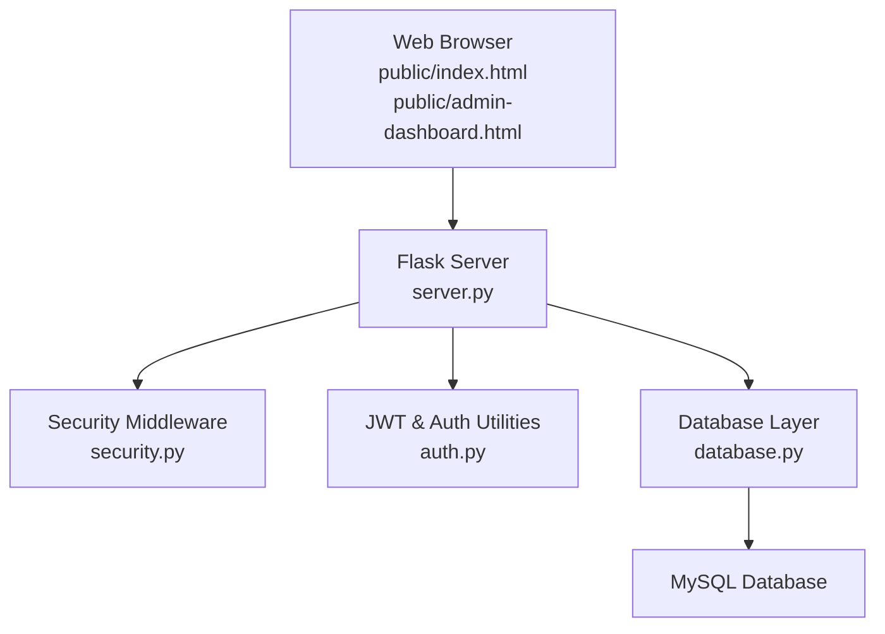

# Getting Started

<cite>
**Referenced Files in This Document**
- [README.md](file://README.md)
- [requirements.txt](file://requirements.txt)
- [.env.example](file://.env.example)
- [DATABASE_SETUP.md](file://DATABASE_SETUP.md)
- [DEPLOYMENT.md](file://DEPLOYMENT.md)
- [server.py](file://server.py)
- [database.py](file://database.py)
- [security.py](file://security.py)
- [auth.py](file://auth.py)
- [public/admin-dashboard.html](file://public/admin-dashboard.html)
- [public/index.html](file://public/index.html)
- [railway.json](file://railway.json)
- [render.yaml](file://render.yaml)
- [vercel.json](file://vercel.json)
</cite>

## Table of Contents
1. [Introduction](#introduction)
2. [Prerequisites](#prerequisites)
3. [System Requirements](#system-requirements)
4. [Supported Platforms](#supported-platforms)
5. [Installation](#installation)
6. [Initial Configuration](#initial-configuration)
7. [Database Setup and Initialization](#database-setup-and-initialization)
8. [Server Startup](#server-startup)
9. [Basic Workflow](#basic-workflow)
10. [Practical Examples](#practical-examples)
11. [Common Installation Issues and Solutions](#common-installation-issues-and-solutions)
12. [Architecture Overview](#architecture-overview)
13. [Troubleshooting Guide](#troubleshooting-guide)
14. [Conclusion](#conclusion)

## Introduction
EduFlow is a comprehensive school management system built with Python and Flask. It provides administrative dashboards, school portals, teacher and student portals, and robust data management capabilities backed by a MySQL database. This guide walks you through installing, configuring, and running the system locally, as well as deploying it to popular cloud platforms.

## Prerequisites
- Python 3.8 or higher installed on your machine
- Basic understanding of Flask and Python web development
- Familiarity with environment variables and .env configuration
- MySQL database access (local or remote)
- Command-line terminal or PowerShell for running commands

## System Requirements
- Operating systems: Windows, macOS, or Linux
- Python 3.8+
- At least 512 MB RAM for local development
- Network connectivity for downloading dependencies
- MySQL server (local or hosted) for persistent storage

## Supported Platforms
- Railway (recommended for beginners)
- Render (free tier available)
- Vercel (requires modifications for serverless)
- Manual deployment on Linux servers

## Installation
Follow these steps to install and prepare the application:

1. Clone the repository to your local machine.
2. Install Python dependencies:
   - Navigate to the project root directory.
   - Run: pip install -r requirements.txt
3. Prepare environment variables:
   - Copy .env.example to .env in the project root.
   - Edit .env to configure database and security settings.
4. Initialize the database:
   - Ensure MySQL is running and accessible.
   - The application will automatically create tables and a default admin user upon first run.
5. Start the server:
   - Run: python server.py
6. Access the application:
   - Open http://localhost:1111 in your browser.

**Section sources**
- [README.md](file://README.md#L14-L19)
- [requirements.txt](file://requirements.txt#L1-L14)
- [.env.example](file://.env.example#L1-L78)
- [DATABASE_SETUP.md](file://DATABASE_SETUP.md#L16-L32)

## Initial Configuration
Configure the application using environment variables stored in .env:

- Required production setting:
  - NODE_ENV must be set to production when deploying to hosting platforms.
- Server configuration:
  - PORT sets the listening port (default 1111).
- Security:
  - JWT_SECRET must be a strong random secret key for signing tokens.
- Database configuration:
  - MYSQL_HOST, MYSQL_USER, MYSQL_PASSWORD, MYSQL_DATABASE, MYSQL_PORT define MySQL connection details.
- Optional:
  - TZ sets the application timezone.
- Hosting platform detection:
  - RENDER, RAILWAY_ENVIRONMENT, and VERCEL are auto-detected by hosting platforms.

Notes:
- SQLite and PostgreSQL are no longer supported in this version.
- For hosting platforms, set DATABASE_URL and JWT_SECRET in the platform’s environment variables panel.

**Section sources**
- [.env.example](file://.env.example#L9-L28)
- [.env.example](file://.env.example#L45-L46)
- [.env.example](file://.env.example#L36-L39)
- [.env.example](file://.env.example#L52-L66)

## Database Setup and Initialization
EduFlow requires a MySQL database. Follow these steps:

1. Install MySQL on your machine or connect to a remote MySQL server.
2. Create a database named school_db (or another name of your choice).
3. Configure environment variables in .env with your MySQL credentials.
4. Run the application:
   - pip install -r requirements.txt
   - python server.py
5. The application will:
   - Connect to MySQL using the provided credentials.
   - Automatically create tables and seed a default admin user (admin/admin123).

Security recommendations:
- Generate a strong JWT_SECRET using a cryptographically secure random generator.
- Use strong MySQL passwords and restrict network access to the database server.

**Section sources**
- [DATABASE_SETUP.md](file://DATABASE_SETUP.md#L7-L32)
- [database.py](file://database.py#L120-L338)

## Server Startup
To start the EduFlow server locally:

- Ensure dependencies are installed (pip install -r requirements.txt).
- Confirm .env contains valid MySQL and JWT settings.
- Run: python server.py
- Access the home page at http://localhost:1111.

Health checks:
- Visit http://localhost:1111/health to verify the application status.
- For detailed diagnostics, append ?debug=true to the health URL.

**Section sources**
- [README.md](file://README.md#L14-L19)
- [server.py](file://server.py#L110-L139)

## Basic Workflow
From installation completion to accessing the admin dashboard:

1. Install dependencies and configure .env with MySQL credentials.
2. Start the server with python server.py.
3. Open http://localhost:1111 in your browser.
4. On the homepage, select “Admin” to open the admin login modal.
5. Log in with the default credentials:
   - Username: admin
   - Password: admin123
6. After logging in, you will land on the Admin Dashboard.
7. From here, you can manage schools, academic years, and other system features.

**Section sources**
- [public/index.html](file://public/index.html#L52-L100)
- [public/admin-dashboard.html](file://public/admin-dashboard.html#L1-L174)
- [server.py](file://server.py#L142-L199)

## Practical Examples
Below are practical examples of environment variable configuration and first-time initialization:

- Example: Environment variables in .env
  - Set NODE_ENV to production for hosting platforms.
  - Configure MYSQL_HOST, MYSQL_USER, MYSQL_PASSWORD, MYSQL_DATABASE, MYSQL_PORT.
  - Generate JWT_SECRET using a secure random generator.
  - Optionally set TZ to your preferred timezone.

- Example: Database connection setup
  - Ensure MySQL is reachable from the application host.
  - Confirm the database exists and the user has appropriate privileges.
  - On first run, the application creates tables and seeds a default admin user.

- Example: First-time system initialization
  - Start the server; the application connects to MySQL and initializes schema.
  - Access the admin dashboard using the default credentials.
  - Create your first school and configure academic years.

**Section sources**
- [.env.example](file://.env.example#L9-L28)
- [DATABASE_SETUP.md](file://DATABASE_SETUP.md#L16-L32)
- [server.py](file://server.py#L110-L139)

## Common Installation Issues and Solutions
- MySQL connection fails:
  - Verify MYSQL_HOST, MYSQL_USER, MYSQL_PASSWORD, MYSQL_DATABASE, and MYSQL_PORT in .env.
  - Ensure the MySQL service is running and accessible from your machine.
  - Confirm the database exists and the user has permission to connect.
- Missing or invalid JWT_SECRET:
  - Generate a strong random secret and set JWT_SECRET in .env.
  - For production, set JWT_SECRET in the hosting platform’s environment variables.
- Port conflicts:
  - Change PORT in .env if port 1111 is already in use.
- Health check warnings:
  - Ensure NODE_ENV is set to production when deployed to hosting platforms.
  - Confirm MYSQL_HOST is configured in production environments.
- CORS errors (after deployment):
  - Update CORS origins in server.py to match your deployed domain.
- Build failures on hosting platforms:
  - Ensure Python version compatibility (3.8+).
  - Confirm the build command installs requirements and starts the server.

**Section sources**
- [DEPLOYMENT.md](file://DEPLOYMENT.md#L99-L104)
- [server.py](file://server.py#L110-L139)

## Architecture Overview
The system follows a layered architecture with clear separation of concerns:

- Frontend:
  - Static HTML/CSS/JS served from the public directory.
  - Admin dashboard and role-based portals.
- Backend:
  - Flask server handles routing, authentication, and API endpoints.
  - Security middleware provides rate limiting, input sanitization, and audit logging.
  - Database module manages MySQL connections and schema initialization.
- Configuration:
  - Environment variables control runtime behavior (database, security, hosting).
  - Platform-specific configuration files enable deployment automation.

**Diagram sources**
- [server.py](file://server.py#L1-L50)
- [security.py](file://security.py#L476-L578)
- [auth.py](file://auth.py#L14-L327)
- [database.py](file://database.py#L88-L118)

## Troubleshooting Guide
- Health endpoint:
  - Use http://localhost:1111/health to check application status.
  - Append ?debug=true for detailed diagnostics.
- Default credentials:
  - Admin: username admin, password admin123.
  - Change the default admin password immediately after deployment.
- Logging and audit trails:
  - Audit logs are written to the console and can be persisted to the database.
  - Review logs for errors and security events.
- Performance monitoring:
  - Enable performance monitoring and review registered endpoints for metrics.

**Section sources**
- [server.py](file://server.py#L110-L139)
- [security.py](file://security.py#L177-L423)

## Conclusion
You are now ready to install, configure, and run EduFlow locally. Use the provided environment variables to connect to your MySQL database, start the server, and access the admin dashboard. For production deployments, follow the platform-specific guidance and ensure proper security configurations, including strong secrets and CORS settings.