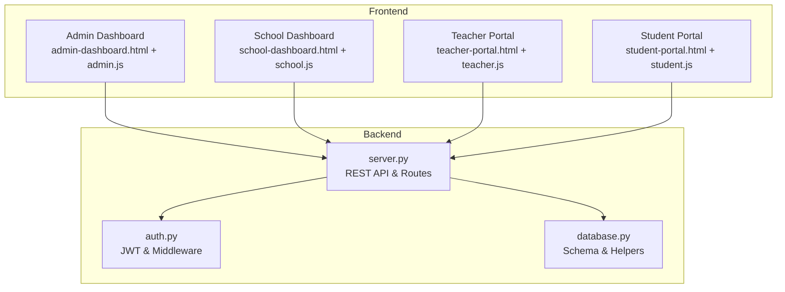
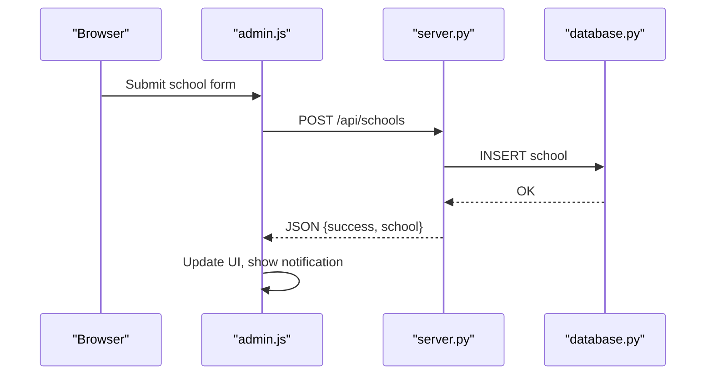
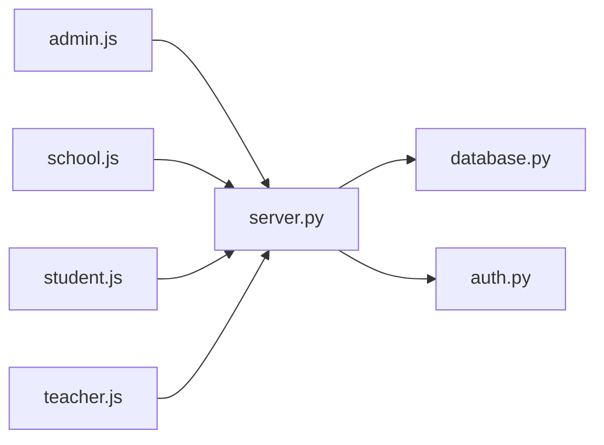

# Key Features

<cite>
**Referenced Files in This Document**
- [README.md](file://README.md)
- [server.py](file://server.py)
- [auth.py](file://auth.py)
- [database.py](file://database.py)
- [public/admin-dashboard.html](file://public/admin-dashboard.html)
- [public/school-dashboard.html](file://public/school-dashboard.html)
- [public/student-portal.html](file://public/student-portal.html)
- [public/teacher-portal.html](file://public/teacher-portal.html)
- [public/assets/js/admin.js](file://public/assets/js/admin.js)
- [public/assets/js/school.js](file://public/assets/js/school.js)
- [public/assets/js/student.js](file://public/assets/js/student.js)
- [public/assets/js/teacher.js](file://public/assets/js/teacher.js)
</cite>

## Table of Contents
1. [Introduction](#introduction)
2. [Project Structure](#project-structure)
3. [Core Components](#core-components)
4. [Architecture Overview](#architecture-overview)
5. [Detailed Component Analysis](#detailed-component-analysis)
6. [Dependency Analysis](#dependency-analysis)
7. [Performance Considerations](#performance-considerations)
8. [Troubleshooting Guide](#troubleshooting-guide)
9. [Conclusion](#conclusion)

## Introduction
This document presents the key features of the EduFlow educational management system, focusing on how the platform delivers student management, grade level tracking, academic year management, admin and school dashboards, and the multi-role portal system. It explains each feature’s functionality, user benefits, implementation approach, and how they integrate as a cohesive system. It also covers the Arabic RTL interface and responsive design, real-time-like data flows via AJAX, reporting capabilities, and integration patterns.

## Project Structure
EduFlow is a Python/Flask backend with a frontend built using HTML/CSS/JavaScript and hosted under the public/ directory. The system organizes features by role and domain:
- Backend: server.py defines REST endpoints, authentication, and business logic.
- Database: database.py manages schema creation, migrations, and helpers for CRUD operations.
- Frontend: role-specific dashboards and JS modules implement UI, forms, and client-side analytics.

**Diagram sources**
- [server.py](file://server.py#L1-L120)
- [auth.py](file://auth.py#L1-L120)
- [database.py](file://database.py#L120-L340)
- [public/admin-dashboard.html](file://public/admin-dashboard.html#L1-L174)
- [public/school-dashboard.html](file://public/school-dashboard.html#L1-L120)
- [public/teacher-portal.html](file://public/teacher-portal.html#L1-L120)
- [public/student-portal.html](file://public/student-portal.html#L1-L120)

**Section sources**
- [README.md](file://README.md#L1-L23)
- [server.py](file://server.py#L1-L120)
- [database.py](file://database.py#L120-L340)

## Core Components
- Student Management: Create, update, delete, and track student profiles, grades, and attendance.
- Grade Level Tracking: Manage grade levels per school and enforce grade scales (10 or 100).
- Academic Year Management: Centralized academic year administration for all schools.
- Admin Dashboard: Add/edit schools, manage grade levels, and export data.
- School Dashboard: Manage subjects, assign teachers, record grades and attendance, and generate reports.
- Multi-role Portals: Admin, school admin, teacher, and student dashboards with role-aware access.
- Arabic RTL + Responsive Design: RTL layout, fonts, and responsive grids for mobile/tablet.
- Real-time-like Data Flows: AJAX-driven interactions for login, CRUD, and analytics.
- Reporting & Recommendations: AI-powered insights and recommendations for students and schools.

**Section sources**
- [README.md](file://README.md#L5-L13)
- [server.py](file://server.py#L441-L767)
- [database.py](file://database.py#L147-L321)
- [public/admin-dashboard.html](file://public/admin-dashboard.html#L1-L174)
- [public/school-dashboard.html](file://public/school-dashboard.html#L1-L120)
- [public/student-portal.html](file://public/student-portal.html#L1-L120)
- [public/teacher-portal.html](file://public/teacher-portal.html#L1-L120)

## Architecture Overview
EduFlow follows a layered architecture:
- Presentation Layer: Role-specific HTML dashboards and JS modules.
- Application Layer: Flask routes handle authentication, authorization, and business logic.
- Data Access Layer: MySQL/SQLite abstraction with helper functions for CRUD and analytics.
- Security: JWT-based authentication with middleware and optional auth support.

**Diagram sources**
- [public/assets/js/admin.js](file://public/assets/js/admin.js#L176-L217)
- [server.py](file://server.py#L330-L375)
- [database.py](file://database.py#L147-L177)

**Section sources**
- [server.py](file://server.py#L141-L200)
- [auth.py](file://auth.py#L216-L290)
- [database.py](file://database.py#L88-L120)

## Detailed Component Analysis

### Student Management
- Purpose: Maintain student records, enrollments, and academic progress.
- Implementation:
  - Create student: POST /api/school/{school_id}/student with validation and duplicate checks.
  - Update student: PUT /api/student/{id} with detailed scores and attendance normalization.
  - Delete student: DELETE /api/student/{id}.
  - Retrieve students: GET /api/school/{school_id}/students with JSON field handling.
- Data model: students table with JSON fields for detailed_scores and daily_attendance.
- Scale enforcement: is_elementary_grades_1_to_4 enforces 10-point scale for early grades and 100-point scale otherwise.

Benefits:
- Streamlined enrollment and updates.
- Flexible scoring and attendance storage.
- Accurate grade scaling per educational stage.

Usage scenario:
- A school admin adds a new student, assigns grade and room, then updates scores and attendance over time. The system validates score ranges and persists structured data.

**Section sources**
- [server.py](file://server.py#L441-L560)
- [server.py](file://server.py#L564-L682)
- [server.py](file://server.py#L52-L90)
- [database.py](file://database.py#L159-L177)

### Grade Level Tracking
- Purpose: Define and manage grade levels per school with default templates.
- Implementation:
  - Centralized mapping: stageToLevelMapping normalizes stage names to levels.
  - Bulk grade levels: defaultGradeLevels templates for ibtida2i, mutasaddi, i3lami, thanawi.
  - Dynamic grade levels modal in admin dashboard for per-school customization.
- Benefits:
  - Consistent grade labeling across institutions.
  - Rapid setup via templates.
  - Per-school flexibility.

Usage scenario:
- Admin selects a school and opens the grade levels modal. They can add individual levels or apply templates for the entire stage.

**Section sources**
- [server.py](file://server.py#L323-L328)
- [public/assets/js/admin.js](file://public/assets/js/admin.js#L368-L386)
- [public/assets/js/admin.js](file://public/assets/js/admin.js#L391-L567)

### Academic Year Management
- Purpose: Centralized academic year administration for all schools.
- Implementation:
  - Central table: system_academic_years for year definitions and current year detection.
  - APIs: create, list, and current year retrieval.
  - UI: Admin dashboard displays centralized years; school dashboard shows current year and selectors.
- Benefits:
  - Consistent academic calendar across institutions.
  - Simplified year transitions and reporting alignment.

Usage scenario:
- Admin creates a new academic year (e.g., 2025–2026). The system auto-calculates end year and marks as current. Schools inherit this year for reporting.

**Section sources**
- [database.py](file://database.py#L261-L273)
- [server.py](file://server.py#L573-L589)
- [public/assets/js/admin.js](file://public/assets/js/admin.js#L591-L614)
- [public/assets/js/school.js](file://public/assets/js/school.js#L1-L40)

### Admin Dashboard
- Features:
  - Add/Edit/Delete schools.
  - Manage grade levels per school.
  - Export schools to Excel.
  - Centralized academic year management.
- Implementation:
  - Uses admin.js for AJAX calls, notifications, and modals.
  - Responsive RTL layout with unified design system.
- Benefits:
  - Single pane of glass for system-wide administration.
  - Efficient onboarding and maintenance.

Usage scenario:
- Admin logs in, adds a new school, assigns stage and gender type, and exports the updated list.

**Section sources**
- [public/admin-dashboard.html](file://public/admin-dashboard.html#L1-L174)
- [public/assets/js/admin.js](file://public/assets/js/admin.js#L64-L102)
- [public/assets/js/admin.js](file://public/assets/js/admin.js#L176-L217)

### School Dashboard
- Features:
  - Grade levels overview and management.
  - Performance analytics (averages, pass rates, attendance).
  - Subject and teacher management.
  - Student grade and attendance entry.
  - Export to Excel for teachers and students.
- Implementation:
  - school.js orchestrates grade trend analysis, recommendation engine, and chart rendering.
  - Responsive grid layouts and RTL support.
- Benefits:
  - Holistic view of class performance.
  - Automated insights and actionable recommendations.
  - Efficient grading and attendance workflows.

Usage scenario:
- School admin loads grade levels, selects a subject, and enters monthly grades and daily attendance. The system computes averages and generates recommendations.

**Section sources**
- [public/school-dashboard.html](file://public/school-dashboard.html#L1-L120)
- [public/assets/js/school.js](file://public/assets/js/school.js#L36-L216)
- [public/assets/js/school.js](file://public/assets/js/school.js#L226-L584)

### Student Portal
- Features:
  - Personalized performance insights and recommendations.
  - Detailed scores and attendance views.
  - Academic report generation.
- Implementation:
  - student.js performs trend analysis, thresholds, and recommendation generation.
  - Tabbed interface for scores, attendance, and comprehensive report.
- Benefits:
  - Transparent academic progress.
  - Motivational and actionable guidance.

Usage scenario:
- Student logs in via code, views detailed scores per subject, sees trend-based recommendations, and accesses a comprehensive report.

**Section sources**
- [public/student-portal.html](file://public/student-portal.html#L1-L120)
- [public/assets/js/student.js](file://public/assets/js/student.js#L39-L127)
- [public/assets/js/student.js](file://public/assets/js/student.js#L132-L516)

### Teacher Portal
- Features:
  - Subject overview and student lists.
  - Grade entry per period and attendance logging.
  - Notifications and quick actions.
- Implementation:
  - teacher.js handles login, subject/students loading, and modal interactions.
  - Integrates with backend endpoints for saving grades and attendance.
- Benefits:
  - Streamlined classroom management.
  - Immediate feedback and data persistence.

Usage scenario:
- Teacher logs in with code, selects a subject, and enters grades and attendance for students.

**Section sources**
- [public/teacher-portal.html](file://public/teacher-portal.html#L1-L120)
- [public/assets/js/teacher.js](file://public/assets/js/teacher.js#L60-L104)
- [public/assets/js/teacher.js](file://public/assets/js/teacher.js#L303-L372)

### Multi-role Portal System
- Roles: admin, school admin, teacher, student.
- Authentication: JWT-based with bearer tokens stored locally.
- Access control: decorators in server.py demonstrate role-aware routing (currently permissive in this deployment).
- UX: Unified design system, RTL layout, and responsive grids across all portals.

Benefits:
- Role-appropriate workflows.
- Consistent branding and usability.
- Scalable extension to additional roles.

**Section sources**
- [server.py](file://server.py#L91-L108)
- [auth.py](file://auth.py#L216-L290)
- [public/admin-dashboard.html](file://public/admin-dashboard.html#L1-L174)
- [public/school-dashboard.html](file://public/school-dashboard.html#L1-L120)
- [public/teacher-portal.html](file://public/teacher-portal.html#L1-L120)
- [public/student-portal.html](file://public/student-portal.html#L1-L120)

### Arabic RTL Interface and Responsive Design
- RTL: HTML lang="ar" dir="rtl", Font Cairo, and right-aligned layouts.
- Responsive: CSS grids, media queries, and viewport meta tag for mobile/tablet.
- Unified design system: shared CSS assets for consistent components and typography.

Benefits:
- Native language and directionality for Arabic-speaking users.
- Device-optimized experience across screen sizes.

**Section sources**
- [public/admin-dashboard.html](file://public/admin-dashboard.html#L1-L174)
- [public/school-dashboard.html](file://public/school-dashboard.html#L1-L120)
- [public/teacher-portal.html](file://public/teacher-portal.html#L1-L120)
- [public/student-portal.html](file://public/student-portal.html#L1-L120)

### Real-time Data Synchronization and Reporting
- Real-time-like behavior: AJAX calls for login, CRUD, and analytics without full page reloads.
- Reporting:
  - Trend analysis and thresholds per grade scale.
  - Professional recommendations engine for students and schools.
  - Export to Excel for administrators and teachers.
- Data persistence: JSON fields for flexible score and attendance storage.

Benefits:
- Immediate feedback and reduced latency.
- Data-driven insights and compliance-ready exports.

**Section sources**
- [public/assets/js/admin.js](file://public/assets/js/admin.js#L64-L102)
- [public/assets/js/school.js](file://public/assets/js/school.js#L36-L216)
- [public/assets/js/student.js](file://public/assets/js/student.js#L39-L127)
- [public/assets/js/teacher.js](file://public/assets/js/teacher.js#L60-L104)

### Integration Patterns
- RESTful endpoints: Consistent HTTP verbs and JSON payloads.
- JWT authentication: Stateless tokens with bearer headers.
- Database abstraction: MySQL/SQLite with unified interface and migrations.
- Modular JS: Role-specific scripts keep UI logic decoupled.

Benefits:
- Predictable integrations for future extensions.
- Easy testing and debugging via clear separation of concerns.

**Section sources**
- [server.py](file://server.py#L141-L200)
- [auth.py](file://auth.py#L295-L327)
- [database.py](file://database.py#L88-L120)

## Dependency Analysis
EduFlow’s components depend on:
- server.py: central route handlers and business logic.
- auth.py: JWT token management and middleware.
- database.py: schema, helpers, and connection pooling.
- Frontend JS modules: role-specific dashboards and analytics.

**Diagram sources**
- [public/assets/js/admin.js](file://public/assets/js/admin.js#L1-L60)
- [public/assets/js/school.js](file://public/assets/js/school.js#L1-L40)
- [public/assets/js/student.js](file://public/assets/js/student.js#L1-L40)
- [public/assets/js/teacher.js](file://public/assets/js/teacher.js#L1-L40)
- [server.py](file://server.py#L1-L120)
- [auth.py](file://auth.py#L1-L120)
- [database.py](file://database.py#L1-L120)

**Section sources**
- [server.py](file://server.py#L1-L120)
- [auth.py](file://auth.py#L1-L120)
- [database.py](file://database.py#L1-L120)

## Performance Considerations
- Caching: Server initializes a cache manager; leverage for repeated analytics queries.
- Pagination and field selection: API optimization utilities available for large datasets.
- Database pooling: MySQL connection pooling reduces overhead.
- Client-side rendering: Charts and recommendations computed in-browser; precompute where feasible.

[No sources needed since this section provides general guidance]

## Troubleshooting Guide
Common issues and resolutions:
- Authentication failures: Verify JWT token presence and validity; check bearer header format.
- Database connectivity: Confirm MySQL host/user/password; fallback to SQLite when unavailable.
- JSON parsing errors: Ensure backend returns valid JSON; frontend parses responses carefully.
- Grade validation: Elementary grades must be within 0–10; others within 0–100.

**Section sources**
- [auth.py](file://auth.py#L216-L290)
- [database.py](file://database.py#L88-L120)
- [server.py](file://server.py#L52-L90)
- [public/assets/js/admin.js](file://public/assets/js/admin.js#L78-L102)

## Conclusion
EduFlow delivers a modular, role-aware educational management system with robust student and academic data handling, centralized academic year administration, and intelligent reporting. Its Arabic RTL interface and responsive design ensure accessibility across devices, while the RESTful architecture and JWT-based authentication provide a scalable foundation for future enhancements.