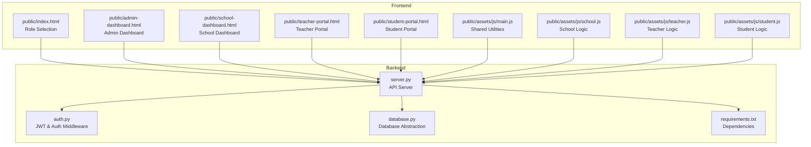
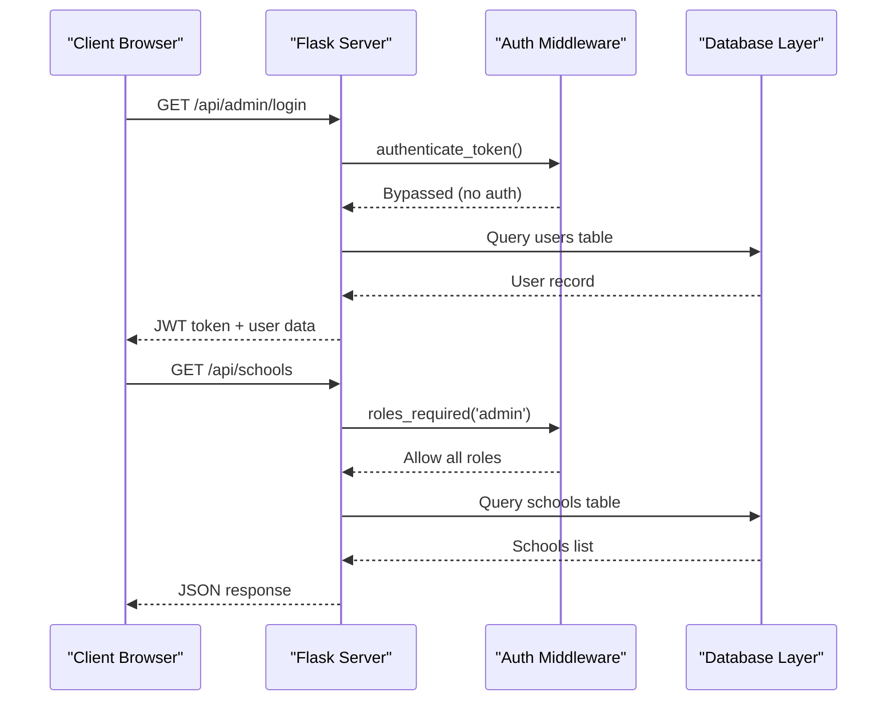
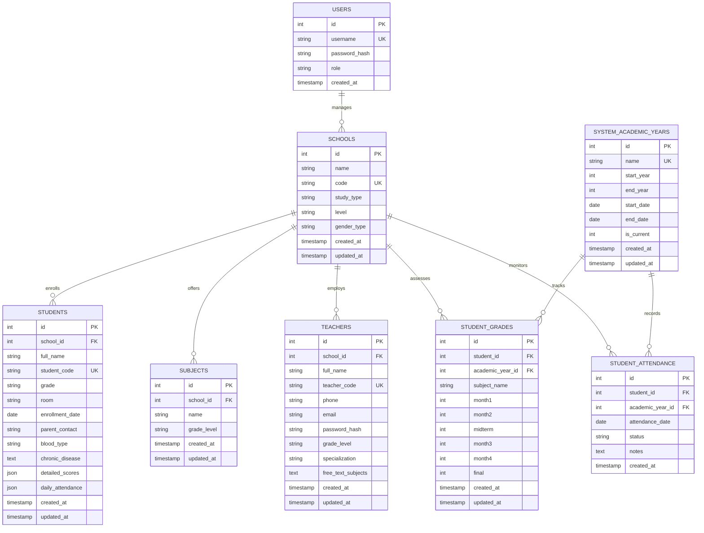
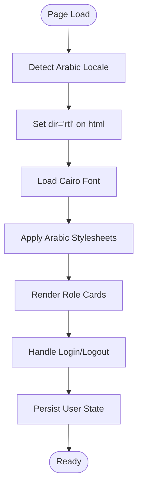
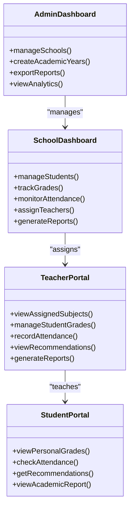
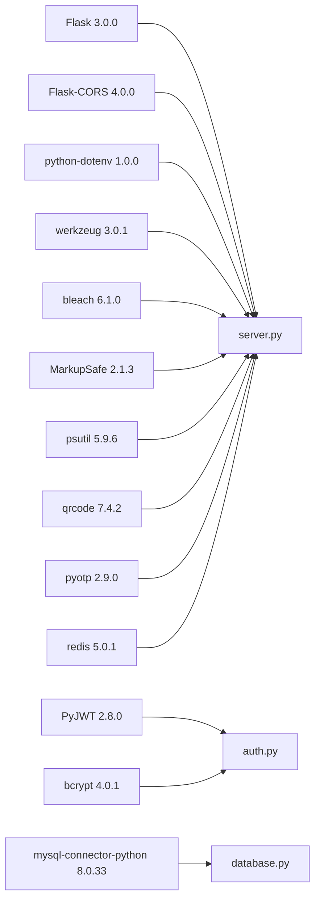

# Project Overview

<cite>
**Referenced Files in This Document**
- [README.md](file://README.md)
- [requirements.txt](file://requirements.txt)
- [server.py](file://server.py)
- [auth.py](file://auth.py)
- [database.py](file://database.py)
- [public/index.html](file://public/index.html)
- [public/admin-dashboard.html](file://public/admin-dashboard.html)
- [public/school-dashboard.html](file://public/school-dashboard.html)
- [public/teacher-portal.html](file://public/teacher-portal.html)
- [public/student-portal.html](file://public/student-portal.html)
- [public/assets/js/main.js](file://public/assets/js/main.js)
- [public/assets/js/school.js](file://public/assets/js/school.js)
- [public/assets/js/teacher.js](file://public/assets/js/teacher.js)
- [public/assets/js/student.js](file://public/assets/js/student.js)
</cite>

## Table of Contents
1. [Introduction](#introduction)
2. [Project Structure](#project-structure)
3. [Core Components](#core-components)
4. [Architecture Overview](#architecture-overview)
5. [Detailed Component Analysis](#detailed-component-analysis)
6. [Dependency Analysis](#dependency-analysis)
7. [Performance Considerations](#performance-considerations)
8. [Troubleshooting Guide](#troubleshooting-guide)
9. [Conclusion](#conclusion)

## Introduction
EduFlow is a comprehensive Arabic-language school management system built with Python and Flask. It serves Arabic-speaking educational institutions by providing integrated solutions for student administration, grade tracking, academic year management, and multi-role dashboards. The platform supports four primary user roles—school admin, school portal, teacher portal, and student portal—each with dedicated workflows optimized for Arabic education systems.

The system emphasizes multi-school support, centralized academic year management, and an Arabic RTL (right-to-left) interface designed for native Arabic users. It leverages modern web technologies to deliver responsive, accessible, and secure educational workflows across administrative, teaching, and learning contexts.

## Project Structure
The project follows a clear separation of concerns with a backend API server, a frontend with role-specific portals, and shared utilities for authentication, database abstraction, and performance monitoring.

**Diagram sources**
- [server.py](file://server.py#L1-L800)
- [auth.py](file://auth.py#L1-L376)
- [database.py](file://database.py#L1-L726)
- [requirements.txt](file://requirements.txt#L1-L14)
- [public/index.html](file://public/index.html#L1-L345)
- [public/admin-dashboard.html](file://public/admin-dashboard.html#L1-L174)
- [public/school-dashboard.html](file://public/school-dashboard.html#L1-L800)
- [public/teacher-portal.html](file://public/teacher-portal.html#L1-L631)
- [public/student-portal.html](file://public/student-portal.html#L1-L800)
- [public/assets/js/main.js](file://public/assets/js/main.js#L1-L153)
- [public/assets/js/school.js](file://public/assets/js/school.js#L1-L800)
- [public/assets/js/teacher.js](file://public/assets/js/teacher.js#L1-L784)
- [public/assets/js/student.js](file://public/assets/js/student.js#L1-L800)

**Section sources**
- [README.md](file://README.md#L1-L23)
- [requirements.txt](file://requirements.txt#L1-L14)
- [server.py](file://server.py#L1-L800)

## Core Components
- **Multi-School Architecture**: Centralized academic year management with school-scoped entities (students, subjects, teachers) enabling independent operations across multiple institutions.
- **Arabic RTL Interface**: Fully localized Arabic UI with right-to-left layout, Arabic labels, and culturally appropriate educational workflows.
- **Multi-Role Dashboards**: Dedicated interfaces for administrators, school managers, teachers, and students with role-based access controls.
- **Grade Management**: Support for both 10-point scale (elementary grades 1-4) and 100-point scale (middle, secondary, preparatory), with intelligent threshold detection.
- **Academic Year Management**: Centralized academic year tracking with current year designation and historical data management.
- **Teacher Assignment System**: Subject-based teacher assignments with grade-level filtering and class management.
- **Student Records**: Comprehensive student profiles with detailed scores, daily attendance, and medical information.

**Section sources**
- [server.py](file://server.py#L52-L89)
- [database.py](file://database.py#L261-L320)
- [public/index.html](file://public/index.html#L2-L345)
- [public/admin-dashboard.html](file://public/admin-dashboard.html#L1-L174)
- [public/school-dashboard.html](file://public/school-dashboard.html#L1-L800)
- [public/teacher-portal.html](file://public/teacher-portal.html#L1-L631)
- [public/student-portal.html](file://public/student-portal.html#L1-L800)

## Architecture Overview
EduFlow employs a client-server architecture with a Flask-based API serving role-specific single-page applications. The system integrates JWT-based authentication, database abstraction supporting both MySQL and SQLite, and responsive frontend components optimized for Arabic education workflows.

**Diagram sources**
- [server.py](file://server.py#L142-L200)
- [auth.py](file://auth.py#L91-L108)
- [database.py](file://database.py#L138-L157)

**Section sources**
- [server.py](file://server.py#L1-L800)
- [auth.py](file://auth.py#L1-L376)
- [database.py](file://database.py#L1-L726)

## Detailed Component Analysis

### Multi-School Support Architecture
EduFlow implements a hierarchical database schema supporting multiple schools with independent academic calendars and administrative boundaries.

**Diagram sources**
- [database.py](file://database.py#L138-L320)

**Section sources**
- [database.py](file://database.py#L120-L320)
- [server.py](file://server.py#L306-L374)

### Arabic RTL Interface Implementation
The frontend implements a comprehensive Arabic localization with right-to-left layout, Arabic typography, and culturally appropriate educational workflows.

**Diagram sources**
- [public/index.html](file://public/index.html#L2-L345)
- [public/assets/js/main.js](file://public/assets/js/main.js#L1-L153)

**Section sources**
- [public/index.html](file://public/index.html#L1-L345)
- [public/assets/js/main.js](file://public/assets/js/main.js#L1-L153)

### Multi-Role Dashboard System
EduFlow provides distinct dashboards optimized for each stakeholder role within Arabic educational institutions.

**Diagram sources**
- [public/admin-dashboard.html](file://public/admin-dashboard.html#L1-L174)
- [public/school-dashboard.html](file://public/school-dashboard.html#L1-L800)
- [public/teacher-portal.html](file://public/teacher-portal.html#L1-L631)
- [public/student-portal.html](file://public/student-portal.html#L1-L800)

**Section sources**
- [public/admin-dashboard.html](file://public/admin-dashboard.html#L1-L174)
- [public/school-dashboard.html](file://public/school-dashboard.html#L1-L800)
- [public/teacher-portal.html](file://public/teacher-portal.html#L1-L631)
- [public/student-portal.html](file://public/student-portal.html#L1-L800)

## Dependency Analysis
EduFlow leverages a modern Python stack with Flask as the web framework, supporting both MySQL and SQLite databases with automatic fallback capabilities.

**Diagram sources**
- [requirements.txt](file://requirements.txt#L1-L14)

**Section sources**
- [requirements.txt](file://requirements.txt#L1-L14)
- [server.py](file://server.py#L1-L800)
- [auth.py](file://auth.py#L1-L376)
- [database.py](file://database.py#L1-L726)

## Performance Considerations
- **Database Abstraction**: Automatic MySQL/SQLite fallback with connection pooling for optimal performance
- **Caching Layer**: Redis integration planned for session management and frequently accessed data
- **API Optimization**: Field selection and pagination support for large datasets
- **Static Asset Management**: CDN-ready CSS/JS assets with RTL optimization
- **Responsive Design**: Mobile-first approach ensuring performance across devices

## Troubleshooting Guide
Common issues and resolutions for EduFlow deployment and operation:

### Authentication Issues
- **Problem**: JWT token validation failures
- **Solution**: Verify JWT_SECRET environment variable and token expiration settings
- **Debug**: Check `/api/admin/login` endpoint response and token structure

### Database Connection Problems
- **Problem**: MySQL connection failures
- **Solution**: Automatic fallback to SQLite with school.db creation
- **Debug**: Monitor database initialization logs and connection pool status

### Academic Year Management
- **Problem**: Incorrect grade scale application
- **Solution**: Verify grade string format follows "Educational Level - Grade Level" pattern
- **Debug**: Use `is_elementary_grades_1_to_4()` helper function for validation

### Multi-School Operations
- **Problem**: Cross-school data leakage
- **Solution**: Ensure proper school_id scoping in all queries
- **Debug**: Validate role-based access controls and school boundary enforcement

**Section sources**
- [server.py](file://server.py#L110-L139)
- [database.py](file://database.py#L120-L127)
- [auth.py](file://auth.py#L339-L376)

## Conclusion
EduFlow represents a comprehensive solution for Arabic-speaking educational institutions, combining robust backend architecture with intuitive Arabic RTL interfaces. The system's multi-school support, centralized academic year management, and role-specific dashboards address the complex needs of modern educational administration while maintaining cultural and linguistic appropriateness.

Key strengths include:
- Seamless multi-school operations with independent academic calendars
- Intelligent grade scale detection supporting both 10-point and 100-point systems
- Comprehensive Arabic localization with RTL interface design
- Scalable architecture supporting both MySQL and SQLite deployments
- Professional-grade academic analytics and recommendation systems

The platform provides a solid foundation for educational institutions seeking digital transformation while preserving cultural and linguistic identity essential to effective Arabic education systems.