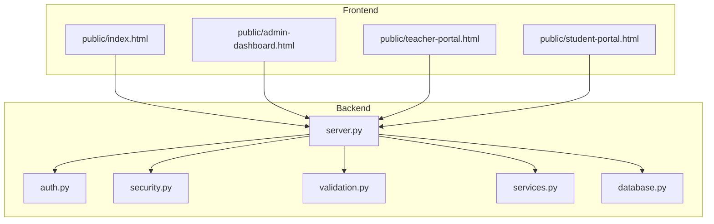
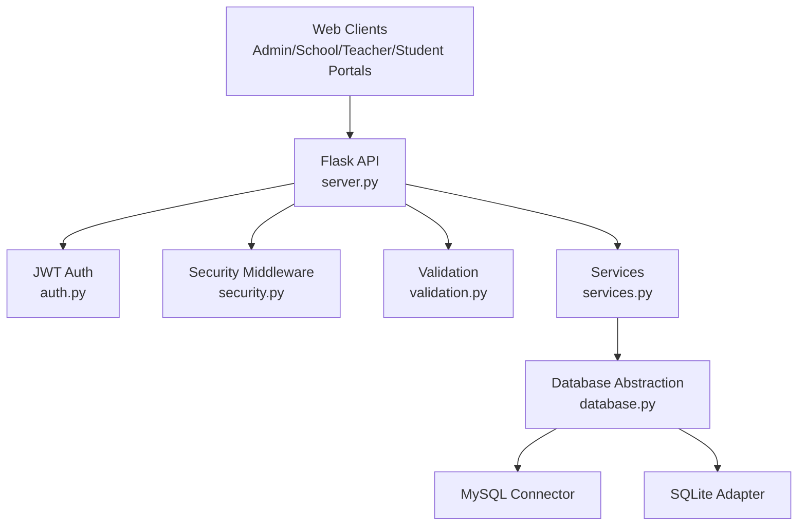
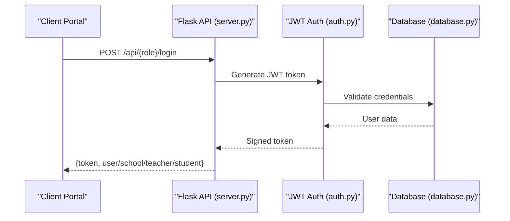
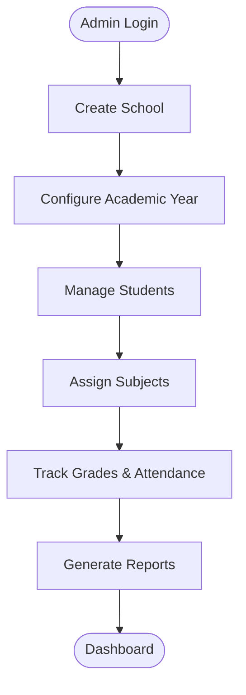
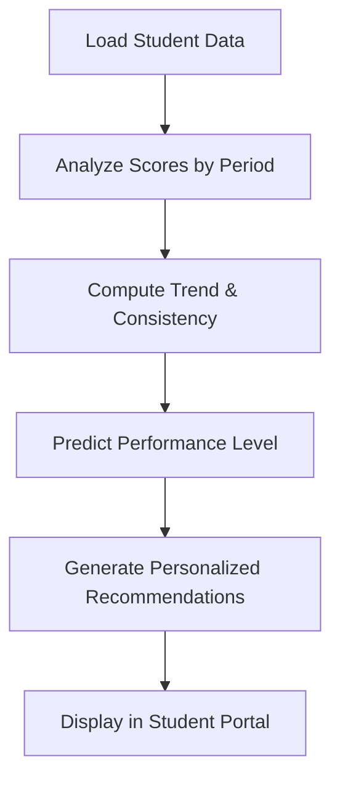
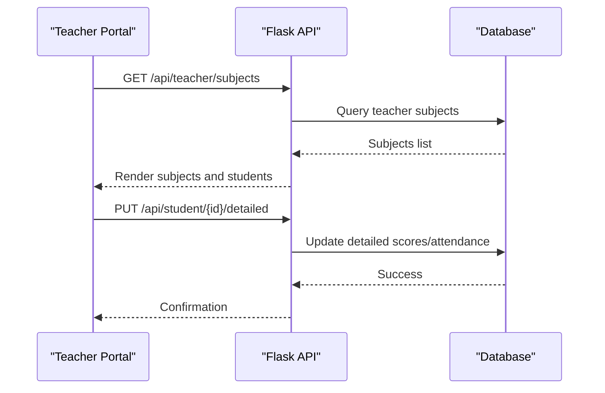
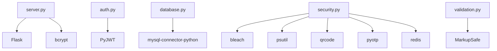

# System Introduction

<cite>
**Referenced Files in This Document**
- [README.md](file://README.md)
- [server.py](file://server.py)
- [auth.py](file://auth.py)
- [database.py](file://database.py)
- [security.py](file://security.py)
- [validation.py](file://validation.py)
- [services.py](file://services.py)
- [public/index.html](file://public/index.html)
- [public/admin-dashboard.html](file://public/admin-dashboard.html)
- [public/teacher-portal.html](file://public/teacher-portal.html)
- [public/student-portal.html](file://public/student-portal.html)
- [requirements.txt](file://requirements.txt)
</cite>

## Table of Contents
1. [Introduction](#introduction)
2. [Project Structure](#project-structure)
3. [Core Components](#core-components)
4. [Architecture Overview](#architecture-overview)
5. [Detailed Component Analysis](#detailed-component-analysis)
6. [Dependency Analysis](#dependency-analysis)
7. [Performance Considerations](#performance-considerations)
8. [Troubleshooting Guide](#troubleshooting-guide)
9. [Conclusion](#conclusion)

## Introduction
EduFlow is a comprehensive Arabic-language school management platform designed specifically for Arabic-speaking educational institutions. Built with Python and Flask, the system centralizes administrative operations, academic tracking, and multi-role access control to streamline daily workflows across schools, educational administrators, teachers, and students.

The platform’s mission is to accelerate digital transformation for Arabic education by offering:
- Streamlined administrative tasks: school registration, academic year management, and user role-based dashboards
- Academic tracking: detailed grade management, attendance records, and performance insights
- Multi-role access control: secure, role-aware navigation for administrators, schools, teachers, and students

Target audience:
- Schools and educational institutions seeking centralized management
- Educational administrators overseeing multiple campuses
- Teachers managing student performance and classroom logistics
- Students accessing personal academic reports and progress insights

Value proposition:
- Arabic-first localization with RTL UI and Arabic error messages
- Role-based dashboards enabling efficient day-to-day operations
- Secure authentication and audit logging for compliance and safety
- Scalable backend supporting MySQL or SQLite with automatic fallback

Contextual benefits:
- Addresses common educational challenges such as manual record-keeping, inconsistent grading scales, and lack of centralized reporting
- Improves operational efficiency by automating repetitive tasks and providing real-time insights
- Supports both 10-point and 100-point grading scales aligned with regional standards

Practical daily workflows enabled by EduFlow:
- Administrators: create schools, manage academic years, and oversee system-wide configurations
- School administrators: enroll students, assign subjects, track attendance, and maintain grade records
- Teachers: input grades, monitor attendance, and receive performance recommendations
- Students: view detailed scores, attendance history, and personalized academic insights

**Section sources**
- [README.md](file://README.md#L1-L23)
- [server.py](file://server.py#L1-L120)
- [public/index.html](file://public/index.html#L1-L120)

## Project Structure
The project follows a layered architecture with a Python/Flask backend and a modular frontend:
- Backend: Flask server exposing RESTful APIs, JWT-based authentication, and security middleware
- Database: MySQL or SQLite with automatic fallback; includes tables for schools, students, teachers, subjects, and academic years
- Frontend: Role-based HTML dashboards with localized Arabic UI and interactive JavaScript
- Services: Business logic layer abstracted from API routes for maintainability

**Diagram sources**
- [server.py](file://server.py#L1-L120)
- [auth.py](file://auth.py#L1-L120)
- [security.py](file://security.py#L1-L120)
- [validation.py](file://validation.py#L1-L120)
- [services.py](file://services.py#L1-L120)
- [database.py](file://database.py#L1-L120)
- [public/index.html](file://public/index.html#L1-L120)
- [public/admin-dashboard.html](file://public/admin-dashboard.html#L1-L120)
- [public/teacher-portal.html](file://public/teacher-portal.html#L1-L120)
- [public/student-portal.html](file://public/student-portal.html#L1-L120)

**Section sources**
- [requirements.txt](file://requirements.txt#L1-L14)
- [server.py](file://server.py#L1-L120)
- [database.py](file://database.py#L120-L220)
- [public/index.html](file://public/index.html#L1-L120)

## Core Components
- Authentication and Authorization: JWT-based login for admin, school, teacher, and student roles; middleware for optional or role-required access
- Database Abstraction: MySQL connector with fallback to SQLite; utilities for unique code generation and teacher/student assignment queries
- Security Middleware: Rate limiting, input sanitization, audit logging, and optional 2FA support
- Validation Framework: Comprehensive validation rules for student, school, subject, grade, and user data
- Service Layer: Business logic for CRUD operations, recommendations, and academic analytics
- Frontend Portals: Role-specific dashboards with Arabic UI and integrated workflows

Key capabilities:
- Multi-stage educational levels (elementary, middle, secondary, preparatory) with appropriate grading scales
- Academic year management with centralized control and per-school overrides
- Detailed grade tracking with monthly periods and final exams
- Attendance logging with daily records and trend analysis
- Performance recommendations for teachers and personalized insights for students

**Section sources**
- [auth.py](file://auth.py#L1-L120)
- [database.py](file://database.py#L340-L466)
- [security.py](file://security.py#L20-L120)
- [validation.py](file://validation.py#L203-L376)
- [services.py](file://services.py#L12-L120)
- [server.py](file://server.py#L52-L120)

## Architecture Overview
EduFlow employs a layered architecture separating presentation, business logic, and data access:

**Diagram sources**
- [server.py](file://server.py#L1-L120)
- [auth.py](file://auth.py#L1-L120)
- [security.py](file://security.py#L476-L578)
- [validation.py](file://validation.py#L332-L367)
- [services.py](file://services.py#L12-L43)
- [database.py](file://database.py#L88-L118)

**Section sources**
- [server.py](file://server.py#L1-L120)
- [auth.py](file://auth.py#L1-L120)
- [security.py](file://security.py#L476-L578)
- [validation.py](file://validation.py#L332-L367)
- [services.py](file://services.py#L12-L43)
- [database.py](file://database.py#L88-L118)

## Detailed Component Analysis

### Authentication and Role-Based Access Control
EduFlow implements role-based access control with JWT tokens and optional middleware enforcement. The system supports four primary roles:
- Admin: full system administration
- School: manages students, subjects, grades, and attendance
- Teacher: views assigned subjects and students, updates grades and attendance
- Student: accesses personal academic records and insights

**Diagram sources**
- [server.py](file://server.py#L142-L304)
- [auth.py](file://auth.py#L14-L68)
- [database.py](file://database.py#L138-L177)

**Section sources**
- [server.py](file://server.py#L142-L304)
- [auth.py](file://auth.py#L14-L68)
- [database.py](file://database.py#L138-L177)

### Academic Year and School Management
Administrators can create and manage academic years centrally and configure schools with stage, study type, and gender type. The system supports both centralized academic year management and legacy per-school tables.

**Diagram sources**
- [server.py](file://server.py#L330-L440)
- [database.py](file://database.py#L261-L320)

**Section sources**
- [server.py](file://server.py#L330-L440)
- [database.py](file://database.py#L261-L320)

### Student Performance and Recommendations
The student portal provides detailed score tracking, attendance logs, and AI-driven academic recommendations. The system adapts grading scales based on educational stage and grade level, offering personalized insights and improvement suggestions.

**Diagram sources**
- [public/student-portal.html](file://public/student-portal.html#L556-L713)
- [database.py](file://database.py#L467-L550)

**Section sources**
- [public/student-portal.html](file://public/student-portal.html#L556-L713)
- [database.py](file://database.py#L467-L550)

### Teacher Subject and Class Assignment
Teachers can view assigned subjects and students, update grades across monthly periods, and manage attendance. The system integrates teacher-subject assignments with class-level tracking.

**Diagram sources**
- [server.py](file://server.py#L768-L786)
- [database.py](file://database.py#L467-L550)
- [public/teacher-portal.html](file://public/teacher-portal.html#L570-L624)

**Section sources**
- [server.py](file://server.py#L768-L786)
- [database.py](file://database.py#L467-L550)
- [public/teacher-portal.html](file://public/teacher-portal.html#L570-L624)

## Dependency Analysis
External dependencies include Flask, PyJWT, bcrypt, mysql-connector-python, and security libraries for sanitization and audit logging.

**Diagram sources**
- [requirements.txt](file://requirements.txt#L1-L14)
- [server.py](file://server.py#L1-L20)
- [auth.py](file://auth.py#L1-L20)
- [security.py](file://security.py#L1-L20)
- [validation.py](file://validation.py#L1-L10)
- [database.py](file://database.py#L1-L20)

**Section sources**
- [requirements.txt](file://requirements.txt#L1-L14)
- [server.py](file://server.py#L1-L20)
- [auth.py](file://auth.py#L1-L20)
- [security.py](file://security.py#L1-L20)
- [validation.py](file://validation.py#L1-L10)
- [database.py](file://database.py#L1-L20)

## Performance Considerations
- Database pooling: MySQL connection pooling with automatic SQLite fallback ensures resilience and scalability
- Caching and optimization: The server initializes caching and API optimization modules for improved throughput
- Security overhead: Rate limiting and input sanitization add minimal latency while enhancing security
- Frontend responsiveness: Role-specific dashboards reduce cognitive load and improve user efficiency

[No sources needed since this section provides general guidance]

## Troubleshooting Guide
Common issues and resolutions:
- Database connectivity failures: The system automatically falls back to SQLite if MySQL is unavailable; verify environment variables and connection parameters
- Authentication errors: Ensure correct role-based login credentials and that tokens are properly stored in local storage
- Rate limiting: If requests are throttled, wait for the reset window indicated by rate limit headers
- Input sanitization: Malformed or unsafe inputs are rejected; ensure data adheres to validation rules

**Section sources**
- [database.py](file://database.py#L88-L118)
- [security.py](file://security.py#L20-L76)
- [validation.py](file://validation.py#L203-L376)

## Conclusion
EduFlow delivers a robust, Arabic-focused educational management platform that modernizes school operations through streamlined administration, precise academic tracking, and secure multi-role access. By combining a scalable backend with intuitive role-based frontends, the system empowers administrators, teachers, and students to work efficiently within a unified ecosystem. Its adherence to regional grading standards, comprehensive validation, and security measures positions it as a reliable foundation for digital transformation in Arabic-speaking educational institutions.

[No sources needed since this section summarizes without analyzing specific files]