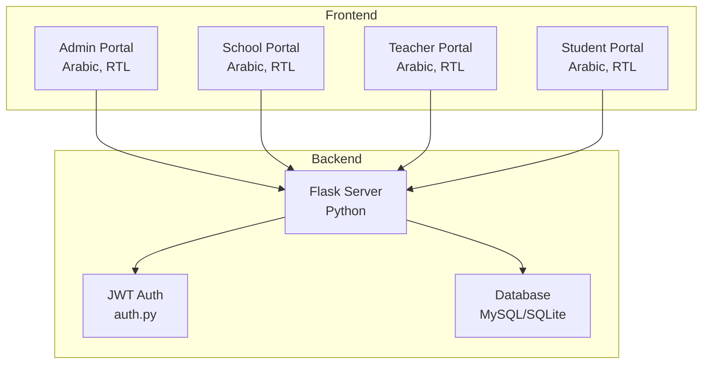
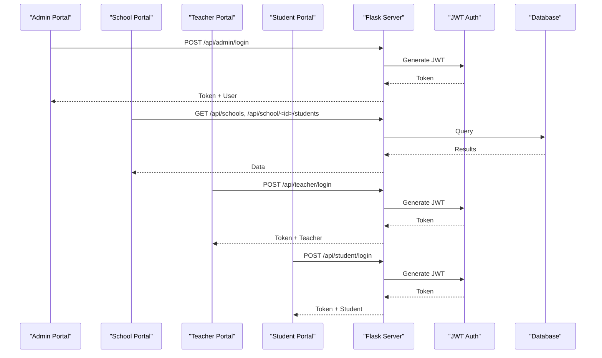
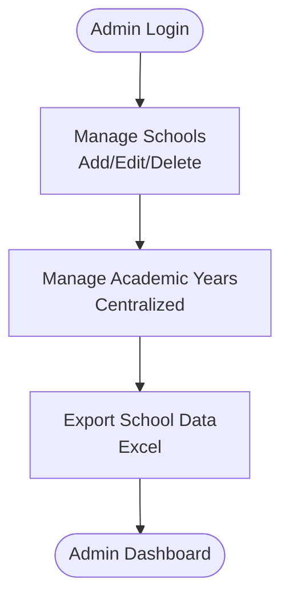
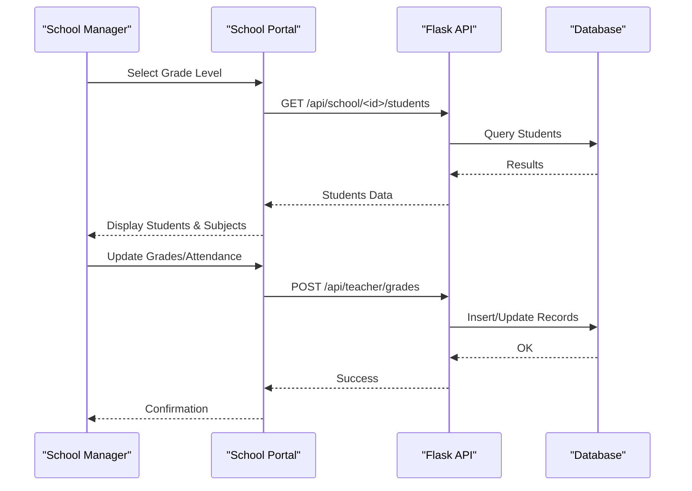
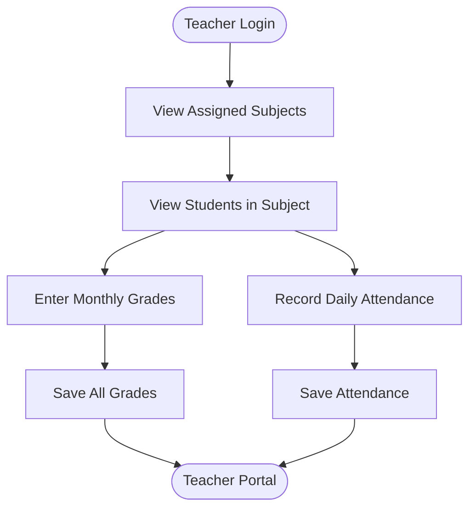
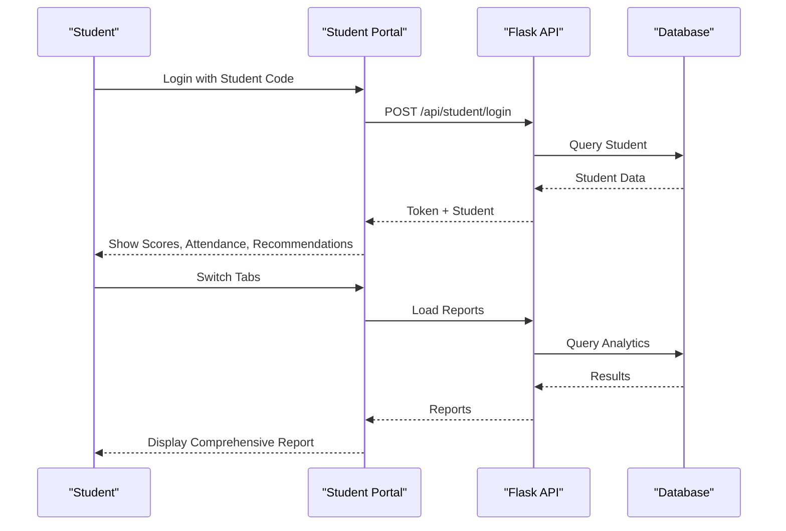
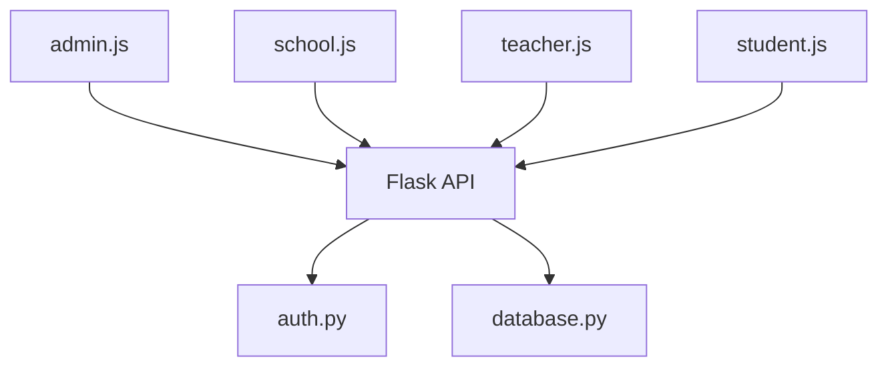

# Target Audience

<cite>
**Referenced Files in This Document**
- [README.md](file://README.md)
- [public/admin-dashboard.html](file://public/admin-dashboard.html)
- [public/school-dashboard.html](file://public/school-dashboard.html)
- [public/teacher-portal.html](file://public/teacher-portal.html)
- [public/student-portal.html](file://public/student-portal.html)
- [public/assets/js/admin.js](file://public/assets/js/admin.js)
- [public/assets/js/school.js](file://public/assets/js/school.js)
- [public/assets/js/teacher.js](file://public/assets/js/teacher.js)
- [public/assets/js/student.js](file://public/assets/js/student.js)
- [auth.py](file://auth.py)
- [server.py](file://server.py)
- [database.py](file://database.py)
</cite>

## Table of Contents
1. [Introduction](#introduction)
2. [Project Structure](#project-structure)
3. [Core Components](#core-components)
4. [Architecture Overview](#architecture-overview)
5. [Detailed Component Analysis](#detailed-component-analysis)
6. [Dependency Analysis](#dependency-analysis)
7. [Performance Considerations](#performance-considerations)
8. [Troubleshooting Guide](#troubleshooting-guide)
9. [Conclusion](#conclusion)
10. [Appendices](#appendices)

## Introduction
This document identifies and understands the users of the EduFlow educational management system. It describes the primary user groups—administrators, school principals, teachers, students, and system integrators—and explains their specific needs, workflows, and how the system addresses them. It also documents the geographical focus on Arabic-speaking regions, cultural considerations embedded in the system design, technical proficiency requirements, training implications, institutional context, scalability considerations, and guidance for user adoption and change management.

## Project Structure
EduFlow is a web-based educational management system with role-specific portals and centralized backend APIs. The frontend is implemented using HTML, CSS, and JavaScript with Arabic language and RTL layout support. The backend is a Python/Flask server with a MySQL/SQLite database and JWT-based authentication.

**Diagram sources**
- [public/admin-dashboard.html](file://public/admin-dashboard.html#L1-L174)
- [public/school-dashboard.html](file://public/school-dashboard.html#L1-L1363)
- [public/teacher-portal.html](file://public/teacher-portal.html#L1-L631)
- [public/student-portal.html](file://public/student-portal.html#L1-L2013)
- [server.py](file://server.py#L1-L2920)
- [auth.py](file://auth.py#L1-L376)
- [database.py](file://database.py#L1-L726)

**Section sources**
- [README.md](file://README.md#L1-L23)
- [public/admin-dashboard.html](file://public/admin-dashboard.html#L1-L174)
- [public/school-dashboard.html](file://public/school-dashboard.html#L1-L1363)
- [public/teacher-portal.html](file://public/teacher-portal.html#L1-L631)
- [public/student-portal.html](file://public/student-portal.html#L1-L2013)
- [server.py](file://server.py#L1-L2920)
- [auth.py](file://auth.py#L1-L376)
- [database.py](file://database.py#L1-L726)

## Core Components
- Administrative Portal: Manages schools, academic years, grade levels, and exports data. Supports Arabic language and RTL layout.
- School Portal: Enables school-level management of students, subjects, teachers, grades, and attendance; includes analytics and AI predictions.
- Teacher Portal: Allows teachers to manage subjects, view assigned students, enter grades, and record attendance.
- Student Portal: Provides students with access to grades, attendance, performance insights, and academic recommendations.
- Authentication and Authorization: JWT-based token management with optional authentication and role checks.
- Database: Centralized schema supporting schools, students, teachers, subjects, academic years, and related analytics.

**Section sources**
- [public/admin-dashboard.html](file://public/admin-dashboard.html#L1-L174)
- [public/school-dashboard.html](file://public/school-dashboard.html#L1-L1363)
- [public/teacher-portal.html](file://public/teacher-portal.html#L1-L631)
- [public/student-portal.html](file://public/student-portal.html#L1-L2013)
- [auth.py](file://auth.py#L1-L376)
- [server.py](file://server.py#L1-L2920)
- [database.py](file://database.py#L1-L726)

## Architecture Overview
The system follows a client-server architecture with role-based access control and centralized academic year management. The frontend portals communicate with the Flask backend via RESTful endpoints. Authentication uses JWT tokens with refresh capabilities. The database schema supports multi-school, multi-grade, and multi-academic-year scenarios.

**Diagram sources**
- [server.py](file://server.py#L142-L304)
- [auth.py](file://auth.py#L14-L190)
- [public/assets/js/admin.js](file://public/assets/js/admin.js#L1-L988)
- [public/assets/js/school.js](file://public/assets/js/school.js#L1-L6138)
- [public/assets/js/teacher.js](file://public/assets/js/teacher.js#L1-L784)
- [public/assets/js/student.js](file://public/assets/js/student.js#L1-L1848)

**Section sources**
- [server.py](file://server.py#L142-L304)
- [auth.py](file://auth.py#L14-L190)
- [public/assets/js/admin.js](file://public/assets/js/admin.js#L1-L988)
- [public/assets/js/school.js](file://public/assets/js/school.js#L1-L6138)
- [public/assets/js/teacher.js](file://public/assets/js/teacher.js#L1-L784)
- [public/assets/js/student.js](file://public/assets/js/student.js#L1-L1848)

## Detailed Component Analysis

### Educational Administrators
- Needs:
  - Manage multiple schools, academic years, and grade levels.
  - Export school lists and manage centralized academic year policies.
  - Oversee system-wide configurations and data exports.
- Workflows:
  - Add/update/delete schools with stage/level/gender filters.
  - Create centralized academic years and manage system-wide settings.
  - Export school data to Excel.
- System Support:
  - Arabic-language UI with RTL layout.
  - Centralized academic year management.
  - Export functionality integrated in the admin portal.

**Diagram sources**
- [public/admin-dashboard.html](file://public/admin-dashboard.html#L1-L174)
- [public/assets/js/admin.js](file://public/assets/js/admin.js#L1-L988)

**Section sources**
- [public/admin-dashboard.html](file://public/admin-dashboard.html#L1-L174)
- [public/assets/js/admin.js](file://public/assets/js/admin.js#L1-L988)

### School Principals/Managers
- Needs:
  - Oversee student and teacher management within a single school.
  - Monitor academic performance and attendance analytics.
  - Assign subjects and manage teacher-class allocations.
- Workflows:
  - View grade-level lists, manage subjects, and assign teachers.
  - Enter and update student grades and attendance.
  - Generate performance analytics and AI predictions.
- System Support:
  - Arabic-language UI with RTL layout.
  - Performance analytics dashboards and AI predictions.
  - Teacher-class assignment and subject management.

**Diagram sources**
- [public/school-dashboard.html](file://public/school-dashboard.html#L1-L1363)
- [public/assets/js/school.js](file://public/assets/js/school.js#L1-L6138)
- [server.py](file://server.py#L768-L800)

**Section sources**
- [public/school-dashboard.html](file://public/school-dashboard.html#L1-L1363)
- [public/assets/js/school.js](file://public/assets/js/school.js#L1-L6138)
- [server.py](file://server.py#L768-L800)

### Teachers
- Needs:
  - Access assigned subjects and students.
  - Enter grades and record daily attendance.
  - Receive recommendations for student performance.
- Workflows:
  - Login with teacher code, view assigned subjects and students.
  - Open grade and attendance modals to update records.
  - Save grades and attendance per academic year.
- System Support:
  - Arabic-language UI with RTL layout.
  - Subject-based student lists and grade/attendance inputs.
  - Academic year-aware updates.

**Diagram sources**
- [public/teacher-portal.html](file://public/teacher-portal.html#L1-L631)
- [public/assets/js/teacher.js](file://public/assets/js/teacher.js#L1-L784)

**Section sources**
- [public/teacher-portal.html](file://public/teacher-portal.html#L1-L631)
- [public/assets/js/teacher.js](file://public/assets/js/teacher.js#L1-L784)

### Students
- Needs:
  - View personal grades, attendance, and performance insights.
  - Receive academic recommendations and motivation.
- Workflows:
  - Login with student code, view detailed scores and attendance.
  - See performance insights and AI-generated recommendations.
  - Switch between tabs for detailed scores, attendance, and comprehensive reports.
- System Support:
  - Arabic-language UI with RTL layout.
  - Personalized academic advisor with trend analysis and recommendations.
  - Automatic grade scale detection (10 vs 100) based on grade level.

**Diagram sources**
- [public/student-portal.html](file://public/student-portal.html#L1-L2013)
- [public/assets/js/student.js](file://public/assets/js/student.js#L1-L1848)
- [server.py](file://server.py#L258-L304)

**Section sources**
- [public/student-portal.html](file://public/student-portal.html#L1-L2013)
- [public/assets/js/student.js](file://public/assets/js/student.js#L1-L1848)
- [server.py](file://server.py#L258-L304)

### System Integrators
- Needs:
  - Understand API endpoints, authentication, and data models.
  - Integrate external systems or migrate data.
- Workflows:
  - Review authentication flow and token lifecycle.
  - Use REST endpoints for CRUD operations on schools, students, teachers, subjects, grades, and attendance.
  - Configure academic year management and grade scale logic.
- System Support:
  - JWT-based authentication with refresh tokens.
  - Centralized academic year management.
  - Grade scale logic based on educational stage and grade level.

**Section sources**
- [auth.py](file://auth.py#L14-L190)
- [server.py](file://server.py#L142-L304)
- [database.py](file://database.py#L120-L338)

## Dependency Analysis
- Frontend-to-Backend:
  - Portals communicate with Flask endpoints for authentication, data retrieval, and updates.
- Authentication:
  - JWT tokens are used across all portals; refresh token mechanism is available.
- Database:
  - Centralized schema supports multi-school, multi-grade, and multi-academic-year contexts.
- Academic Year Management:
  - Centralized academic years apply system-wide; teacher and student updates are academic year-aware.

**Diagram sources**
- [public/assets/js/admin.js](file://public/assets/js/admin.js#L1-L988)
- [public/assets/js/school.js](file://public/assets/js/school.js#L1-L6138)
- [public/assets/js/teacher.js](file://public/assets/js/teacher.js#L1-L784)
- [public/assets/js/student.js](file://public/assets/js/student.js#L1-L1848)
- [server.py](file://server.py#L1-L2920)
- [auth.py](file://auth.py#L1-L376)
- [database.py](file://database.py#L1-L726)

**Section sources**
- [public/assets/js/admin.js](file://public/assets/js/admin.js#L1-L988)
- [public/assets/js/school.js](file://public/assets/js/school.js#L1-L6138)
- [public/assets/js/teacher.js](file://public/assets/js/teacher.js#L1-L784)
- [public/assets/js/student.js](file://public/assets/js/student.js#L1-L1848)
- [server.py](file://server.py#L1-L2920)
- [auth.py](file://auth.py#L1-L376)
- [database.py](file://database.py#L1-L726)

## Performance Considerations
- Database Abstraction:
  - The system supports both MySQL and SQLite with a unified interface, enabling development and production deployments.
- Caching and Optimization:
  - The server includes caching and API optimization hooks ready for deployment.
- Scalability:
  - Multi-school architecture with centralized academic year management scales across institutions.
  - Grade scale logic adapts to different educational stages (elementary 1–4 vs. others).

[No sources needed since this section provides general guidance]

## Troubleshooting Guide
- Authentication Issues:
  - Verify JWT secret configuration and token validity.
  - Check token expiration and refresh mechanisms.
- Database Connectivity:
  - Confirm MySQL availability or fallback to SQLite.
  - Validate table creation and migrations.
- Portal Access:
  - Ensure correct role-based access and token presence in local storage.
  - Confirm academic year selection and data loading.

**Section sources**
- [auth.py](file://auth.py#L191-L376)
- [database.py](file://database.py#L88-L118)
- [server.py](file://server.py#L110-L139)

## Conclusion
EduFlow’s target audience spans administrators, school managers, teachers, and students, all served by role-specific portals with Arabic language and RTL support. The system’s centralized academic year management, grade scale logic, and AI-driven recommendations address diverse needs across educational institutions. Its architecture supports scalability and integration, while cultural and linguistic design choices enhance usability in Arabic-speaking regions.

[No sources needed since this section summarizes without analyzing specific files]

## Appendices

### Cultural and Regional Considerations
- Language and Layout:
  - All portals use Arabic language with RTL directionality.
  - Academic year display and labels reflect Arabic terminology.
- Academic Structure:
  - Educational stages mapped to Arabic terms (elementary, intermediate, secondary, preparatory).
  - Grade levels organized per stage with default templates for quick setup.

**Section sources**
- [public/admin-dashboard.html](file://public/admin-dashboard.html#L1-L174)
- [public/school-dashboard.html](file://public/school-dashboard.html#L1-L1363)
- [public/teacher-portal.html](file://public/teacher-portal.html#L1-L631)
- [public/student-portal.html](file://public/student-portal.html#L1-L2013)

### Technical Proficiency and Training Implications
- Administrators:
  - Moderate technical proficiency required for managing schools and academic years.
  - Training should cover centralized academic year management and export workflows.
- School Managers:
  - Basic computer literacy for student/teacher management and analytics.
  - Training on performance dashboards, AI predictions, and teacher-class assignments.
- Teachers:
  - Minimal technical skills for entering grades and attendance.
  - Training on subject/student navigation and saving updates.
- Students:
  - Basic digital literacy for accessing grades and reports.
  - Guidance on interpreting recommendations and performance insights.

[No sources needed since this section provides general guidance]

### Institutional Context and Implementation Considerations
- School Sizes:
  - Multi-school architecture supports small and large institutions.
- Regional Variations:
  - Arabic language and RTL layout accommodate regional preferences.
- Implementation:
  - Centralized academic year management simplifies cross-school coordination.
  - Grade scale logic adapts to local grading systems (10 vs 100).

**Section sources**
- [server.py](file://server.py#L52-L89)
- [public/assets/js/admin.js](file://public/assets/js/admin.js#L368-L386)

### Scalability Aspects
- Multi-School:
  - Centralized academic year management applies across all schools.
- Grade Scale Adaptation:
  - Elementary grades 1–4 use 10-point scale; others use 100-point scale.
- Data Models:
  - Robust schema supports growth in students, teachers, subjects, and analytics.

**Section sources**
- [database.py](file://database.py#L120-L338)
- [server.py](file://server.py#L52-L89)

### User Adoption Strategies and Change Management
- Communication:
  - Announce Arabic-labeled academic year changes and portal updates.
- Training:
  - Conduct role-specific workshops for administrators, school managers, teachers, and students.
- Support:
  - Provide help sections and tooltips within portals.
- Feedback:
  - Collect user feedback to refine workflows and UI.

[No sources needed since this section provides general guidance]