# Technology Stack

<cite>
**Referenced Files in This Document**
- [requirements.txt](file://requirements.txt)
- [server.py](file://server.py)
- [auth.py](file://auth.py)
- [security.py](file://security.py)
- [cache.py](file://cache.py)
- [database.py](file://database.py)
- [render.yaml](file://render.yaml)
- [vercel.json](file://vercel.json)
- [railway.json](file://railway.json)
- [README.md](file://README.md)
- [public/index.html](file://public/index.html)
- [public/assets/css/styles.css](file://public/assets/css/styles.css)
- [public/assets/js/main.js](file://public/assets/js/main.js)
- [validation.py](file://validation.py)
- [validation_helpers.py](file://validation_helpers.py)
- [test_server.py](file://test_server.py)
- [run_test.bat](file://run_test.bat)
</cite>

## Table of Contents
1. [Introduction](#introduction)
2. [Project Structure](#project-structure)
3. [Core Technologies](#core-technologies)
4. [Architecture Overview](#architecture-overview)
5. [Detailed Component Analysis](#detailed-component-analysis)
6. [Dependency Analysis](#dependency-analysis)
7. [Performance Considerations](#performance-considerations)
8. [Troubleshooting Guide](#troubleshooting-guide)
9. [Conclusion](#conclusion)
10. [Appendices](#appendices)

## Introduction
This document describes the EduFlow technology stack that powers the educational management system. It explains the backend and frontend technologies, security mechanisms, caching and database layers, hosting and deployment configurations, and development/testing practices. The focus is on how these technologies work together to support a multilingual, secure, and scalable school management platform.

## Project Structure
The project follows a clear separation of concerns:
- Backend: Python Flask server with modular components for security, caching, database abstraction, and API orchestration
- Frontend: Static HTML/CSS/JavaScript with RTL support and unified design systems
- Hosting: Multi-platform deployment via Render, Railway, and Vercel
- Testing and QA: Lightweight import-time tests and validation frameworks

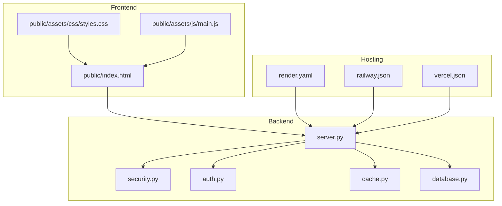

**Diagram sources**
- [server.py](file://server.py#L1-L120)
- [security.py](file://security.py#L476-L563)
- [auth.py](file://auth.py#L14-L327)
- [cache.py](file://cache.py#L14-L299)
- [database.py](file://database.py#L88-L121)
- [render.yaml](file://render.yaml#L1-L34)
- [railway.json](file://railway.json#L1-L30)
- [vercel.json](file://vercel.json#L1-L54)
- [public/index.html](file://public/index.html#L1-L345)
- [public/assets/css/styles.css](file://public/assets/css/styles.css#L1-L120)
- [public/assets/js/main.js](file://public/assets/js/main.js#L1-L153)

**Section sources**
- [README.md](file://README.md#L1-L23)
- [server.py](file://server.py#L1-L120)

## Core Technologies
- Python 3.x runtime with Flask web framework for building REST APIs and serving static assets
- MySQL database for persistent storage with a fallback to SQLite for local development
- Redis caching layer for performance optimization and session-like data
- JWT-based authentication with bcrypt for password hashing
- Input sanitization and rate limiting for security
- Frontend with HTML5, CSS3, and JavaScript supporting Arabic RTL layout
- Hosting platforms: Render, Railway, and Vercel for deployment

**Section sources**
- [requirements.txt](file://requirements.txt#L1-L14)
- [server.py](file://server.py#L1-L120)
- [database.py](file://database.py#L88-L121)
- [cache.py](file://cache.py#L14-L49)
- [security.py](file://security.py#L476-L563)
- [auth.py](file://auth.py#L14-L327)
- [public/index.html](file://public/index.html#L1-L345)

## Architecture Overview
The system architecture centers around a Flask server that exposes REST endpoints, integrates security middleware, caches frequently accessed data, and persists to a database. The frontend serves static pages and interacts with the backend via AJAX.

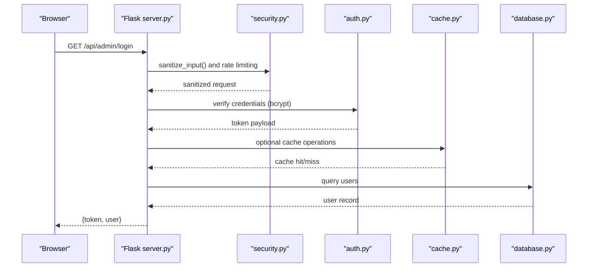

**Diagram sources**
- [server.py](file://server.py#L142-L200)
- [security.py](file://security.py#L547-L562)
- [auth.py](file://auth.py#L14-L327)
- [cache.py](file://cache.py#L14-L49)
- [database.py](file://database.py#L138-L146)

## Detailed Component Analysis

### Backend Core Services
- Flask server initialization, CORS, environment variables, and health checks
- Centralized authentication and authorization decorators
- Security middleware for rate limiting, input sanitization, and audit logging
- Redis-backed caching with graceful fallback to in-memory cache
- Database abstraction supporting MySQL and SQLite with schema migration helpers

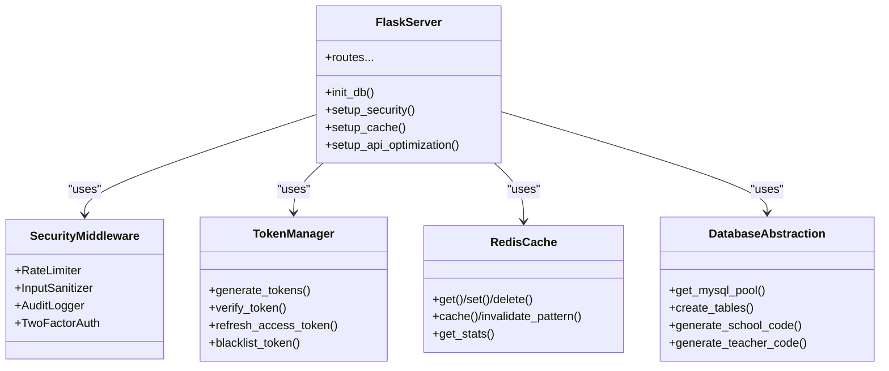

**Diagram sources**
- [server.py](file://server.py#L1-L120)
- [security.py](file://security.py#L476-L563)
- [auth.py](file://auth.py#L14-L327)
- [cache.py](file://cache.py#L14-L299)
- [database.py](file://database.py#L88-L121)

**Section sources**
- [server.py](file://server.py#L1-L120)
- [security.py](file://security.py#L476-L563)
- [auth.py](file://auth.py#L14-L327)
- [cache.py](file://cache.py#L14-L299)
- [database.py](file://database.py#L88-L121)

### Authentication and Authorization
- JWT-based authentication with HS256 signing and configurable expiry
- bcrypt for password hashing and verification
- Decorators for enforcing authentication and role-based access
- Token refresh and blacklist mechanisms

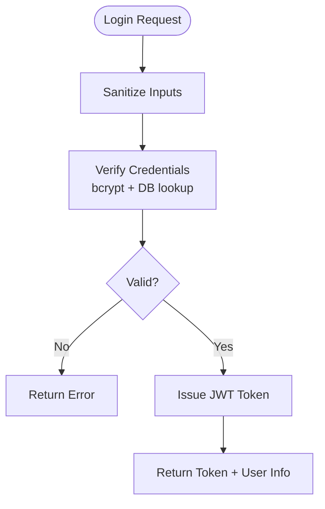

**Diagram sources**
- [server.py](file://server.py#L142-L200)
- [auth.py](file://auth.py#L14-L327)
- [database.py](file://database.py#L138-L146)

**Section sources**
- [server.py](file://server.py#L142-L200)
- [auth.py](file://auth.py#L14-L327)
- [database.py](file://database.py#L138-L146)

### Security and Input Sanitization
- Rate limiting per endpoint category (auth, API, default)
- Input sanitization using bleach and MarkupSafe
- Audit logging with database persistence and batching
- Optional 2FA support with TOTP and QR code generation

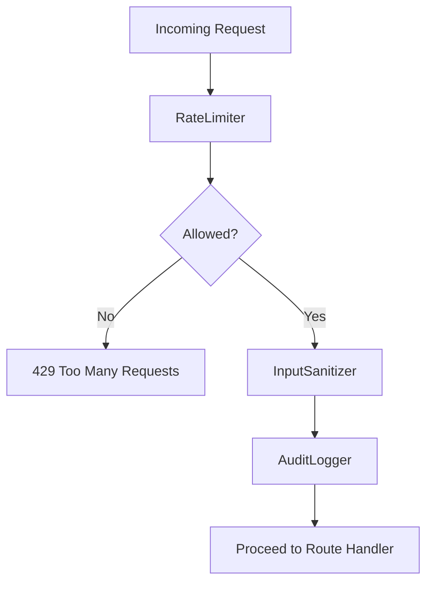

**Diagram sources**
- [security.py](file://security.py#L20-L76)
- [security.py](file://security.py#L476-L563)
- [security.py](file://security.py#L177-L423)

**Section sources**
- [security.py](file://security.py#L20-L76)
- [security.py](file://security.py#L476-L563)
- [security.py](file://security.py#L177-L423)

### Caching Strategy
- Redis cache with in-memory fallback
- TTL-based caching and pattern-based invalidation
- Decorators for transparent caching and cache-busting

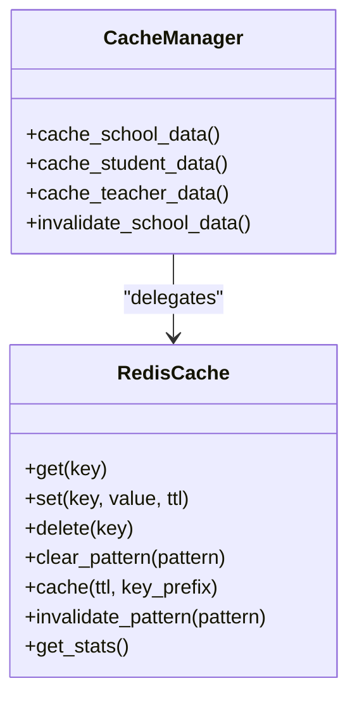

**Diagram sources**
- [cache.py](file://cache.py#L14-L299)

**Section sources**
- [cache.py](file://cache.py#L14-L299)

### Database Abstraction and Schema
- MySQL connection pool with SQLite fallback for development
- Dynamic schema creation and migrations
- Utility functions for generating unique codes and managing relationships

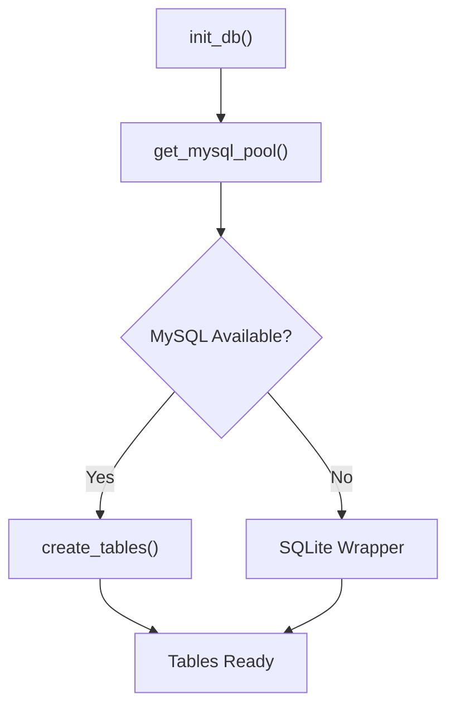

**Diagram sources**
- [database.py](file://database.py#L88-L121)
- [database.py](file://database.py#L123-L338)

**Section sources**
- [database.py](file://database.py#L88-L121)
- [database.py](file://database.py#L123-L338)

### Frontend Technologies and RTL Support
- HTML5 with Arabic language and RTL direction
- CSS3 with a unified design system and responsive utilities
- JavaScript for theme toggling, modals, forms, and basic UX enhancements
- Font and icon resources for internationalized content

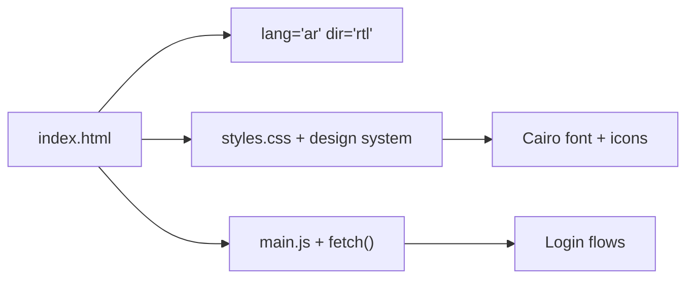

**Diagram sources**
- [public/index.html](file://public/index.html#L1-L345)
- [public/assets/css/styles.css](file://public/assets/css/styles.css#L1-L120)
- [public/assets/js/main.js](file://public/assets/js/main.js#L1-L153)

**Section sources**
- [public/index.html](file://public/index.html#L1-L345)
- [public/assets/css/styles.css](file://public/assets/css/styles.css#L1-L120)
- [public/assets/js/main.js](file://public/assets/js/main.js#L1-L153)

### Hosting and Deployment Configurations
- Render: Python environment, health checks, environment variables, and disk mounting
- Railway: Nixpacks builder, PostgreSQL plugin, health checks, restart policy
- Vercel: Python runtime, static asset routing, headers, and regions

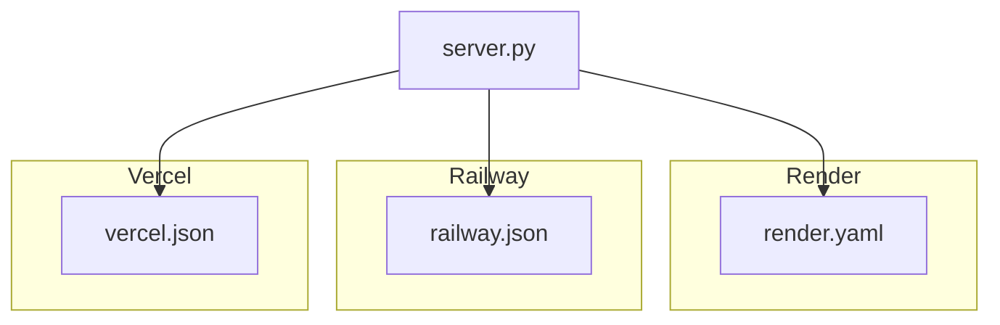

**Diagram sources**
- [render.yaml](file://render.yaml#L1-L34)
- [railway.json](file://railway.json#L1-L30)
- [vercel.json](file://vercel.json#L1-L54)

**Section sources**
- [render.yaml](file://render.yaml#L1-L34)
- [railway.json](file://railway.json#L1-L30)
- [vercel.json](file://vercel.json#L1-L54)

### Development Tools, Testing, and Quality Assurance
- Import-time tests to validate module imports and basic instantiation
- Validation framework for request data with reusable validators
- Validation helpers for domain-specific workflows (e.g., teacher-subject assignment)

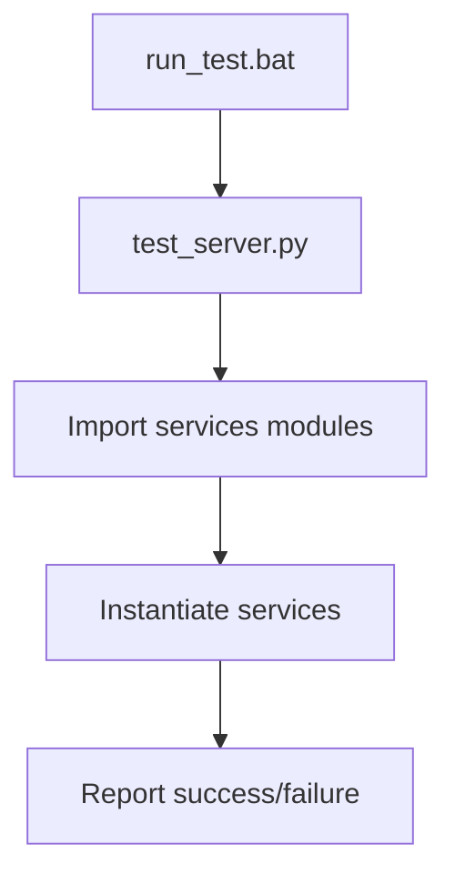

**Diagram sources**
- [run_test.bat](file://run_test.bat#L1-L5)
- [test_server.py](file://test_server.py#L1-L17)

**Section sources**
- [run_test.bat](file://run_test.bat#L1-L5)
- [test_server.py](file://test_server.py#L1-L17)
- [validation.py](file://validation.py#L203-L240)
- [validation_helpers.py](file://validation_helpers.py#L12-L146)

## Dependency Analysis
The backend modules depend on each other in a layered fashion: server orchestrates security, auth, cache, and database; security depends on bleach and pyotp; auth depends on bcrypt and jwt; cache depends on redis; database depends on mysql-connector-python or sqlite3.

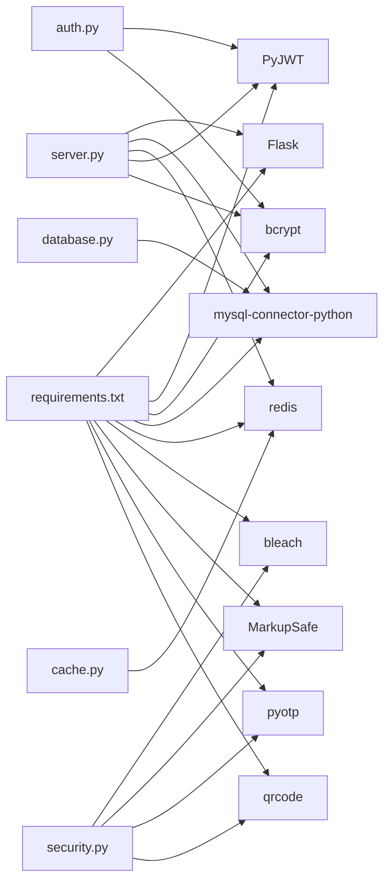

**Diagram sources**
- [requirements.txt](file://requirements.txt#L1-L14)
- [server.py](file://server.py#L1-L16)
- [security.py](file://security.py#L1-L20)
- [auth.py](file://auth.py#L1-L13)
- [cache.py](file://cache.py#L1-L13)
- [database.py](file://database.py#L1-L10)

**Section sources**
- [requirements.txt](file://requirements.txt#L1-L14)
- [server.py](file://server.py#L1-L16)
- [security.py](file://security.py#L1-L20)
- [auth.py](file://auth.py#L1-L13)
- [cache.py](file://cache.py#L1-L13)
- [database.py](file://database.py#L1-L10)

## Performance Considerations
- Use Redis caching for hot data and reduce database load
- Apply rate limiting to protect endpoints from abuse
- Prefer JSON fields for flexible data structures where appropriate
- Keep uploads directory configurable for production environments
- Monitor cache statistics and tune TTLs based on usage patterns

[No sources needed since this section provides general guidance]

## Troubleshooting Guide
Common issues and remedies:
- Health check failures: verify environment variables and platform detection
- Database connectivity: confirm MySQL host/port/user/password and fallback to SQLite
- Redis connectivity: ensure REDIS_URL is configured or accept in-memory fallback
- CORS errors: verify Flask-CORS configuration and allowed origins
- Authentication failures: check JWT_SECRET and bcrypt password hashes

**Section sources**
- [server.py](file://server.py#L110-L139)
- [database.py](file://database.py#L88-L118)
- [cache.py](file://cache.py#L25-L48)
- [security.py](file://security.py#L495-L517)

## Conclusion
EduFlow’s technology stack balances simplicity and scalability. Python and Flask provide a robust backend foundation, while Redis and MySQL deliver performance and persistence. Security is layered with JWT, bcrypt, input sanitization, and audit logging. The frontend embraces Arabic RTL and a unified design system. Multi-platform hosting enables flexible deployments, and lightweight tests help maintain quality during development.

[No sources needed since this section summarizes without analyzing specific files]

## Appendices

### Version Compatibility and Upgrade Paths
- Python: 3.x series supported by Flask 3.x
- Flask: 3.0.x series with Werkzeug 3.x
- MySQL Connector: 8.0.x series
- Redis: 5.x series
- PyJWT: 2.8.x series
- bcrypt: 4.x series
- bleach: 6.x series
- pyotp: 2.9.x series
- qrcode: 7.4.x series

Upgrade recommendations:
- Pin major versions in requirements.txt
- Test Redis and MySQL connectivity after upgrades
- Validate JWT secret rotation and token compatibility
- Re-test input sanitization and audit logging after bleach/pyotp updates

**Section sources**
- [requirements.txt](file://requirements.txt#L1-L14)
- [server.py](file://server.py#L1-L16)