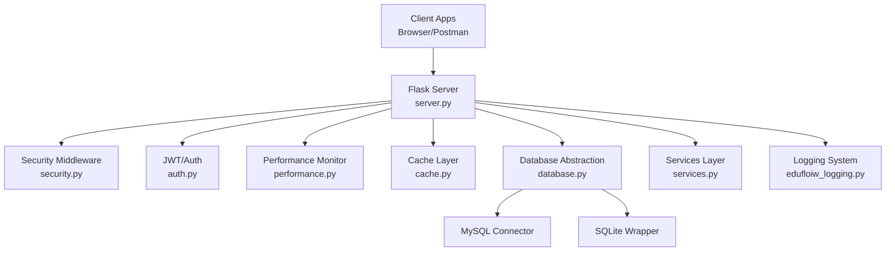
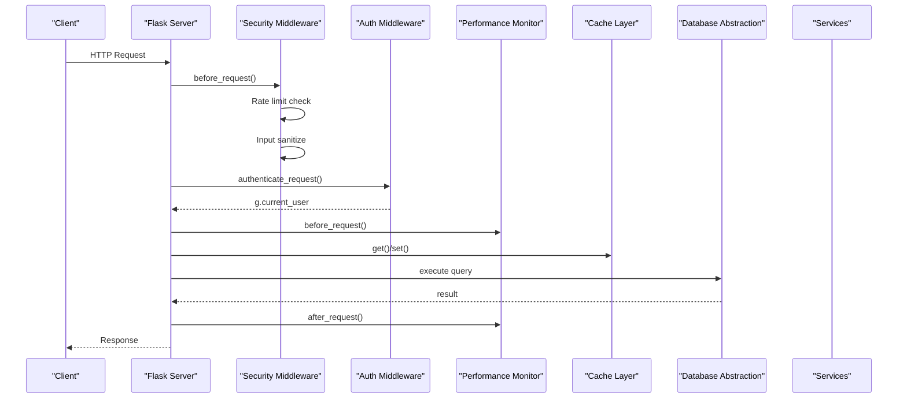
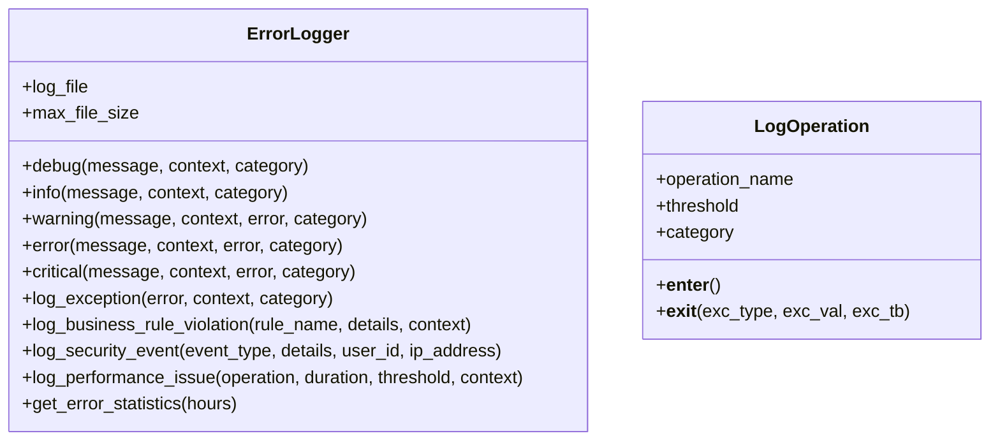
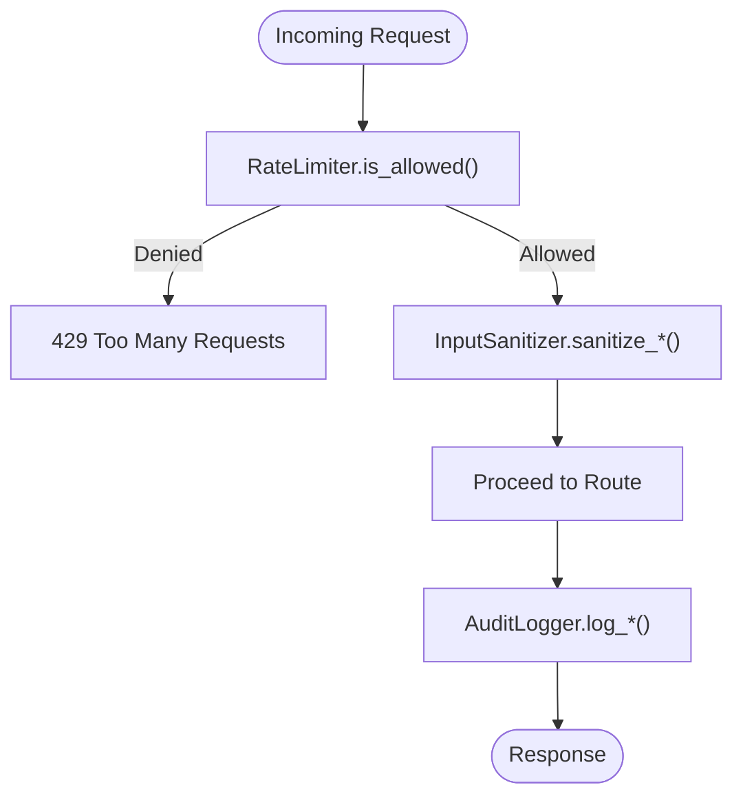
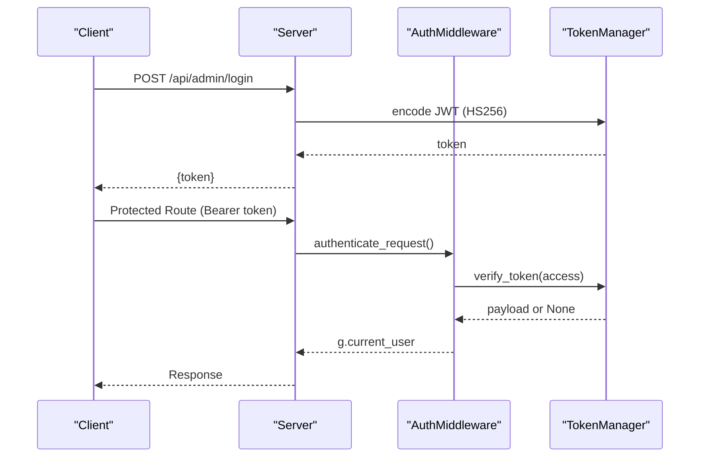
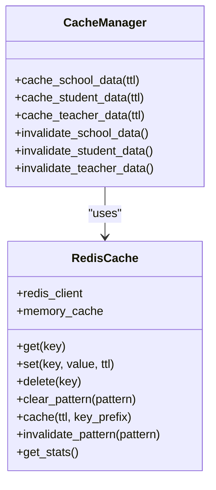
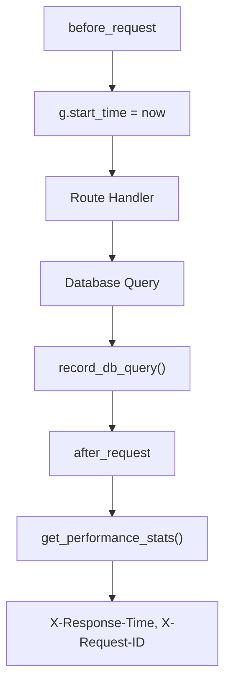
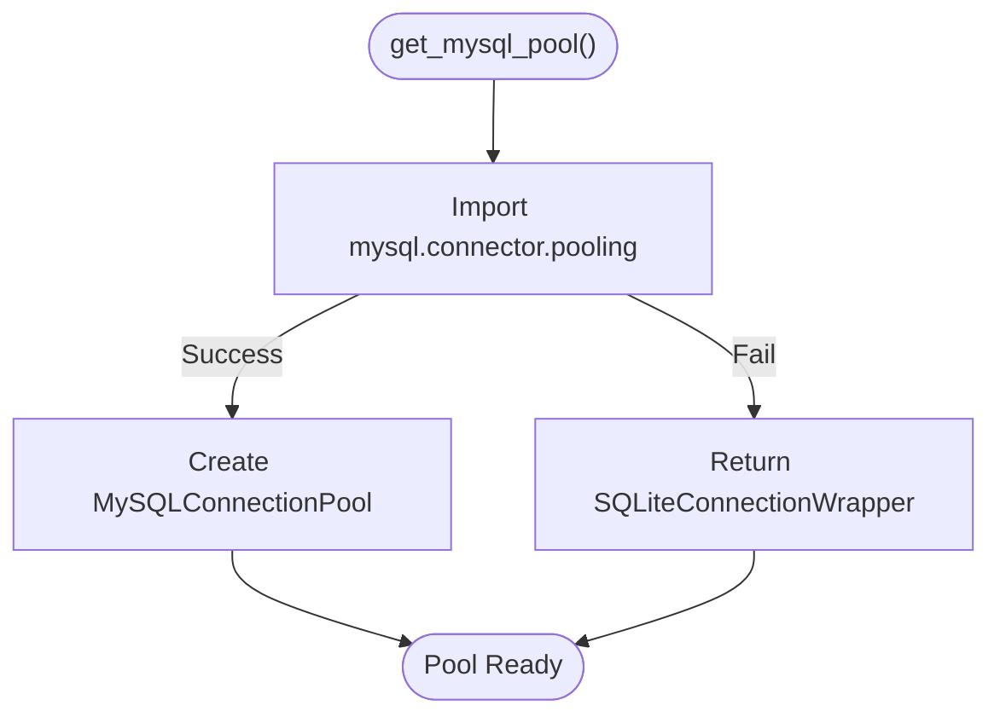
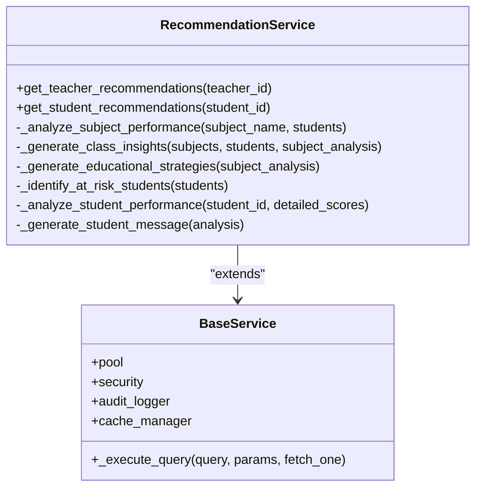
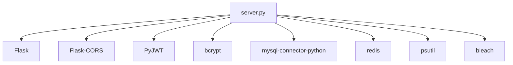

# Troubleshooting & Maintenance

<cite>
**Referenced Files in This Document**
- [README.md](file://README.md)
- [requirements.txt](file://requirements.txt)
- [server.py](file://server.py)
- [database.py](file://database.py)
- [auth.py](file://auth.py)
- [security.py](file://security.py)
- [cache.py](file://cache.py)
- [performance.py](file://performance.py)
- [edufloiw_logging.py](file://edufloiw_logging.py)
- [check_services.py](file://check_services.py)
- [debug_subjects.py](file://debug_subjects.py)
- [services.py](file://services.py)
</cite>

## Table of Contents
1. [Introduction](#introduction)
2. [Project Structure](#project-structure)
3. [Core Components](#core-components)
4. [Architecture Overview](#architecture-overview)
5. [Detailed Component Analysis](#detailed-component-analysis)
6. [Dependency Analysis](#dependency-analysis)
7. [Performance Considerations](#performance-considerations)
8. [Troubleshooting Guide](#troubleshooting-guide)
9. [Maintenance Procedures](#maintenance-procedures)
10. [Recovery & Disaster Planning](#recovery--disaster-planning)
11. [Conclusion](#conclusion)

## Introduction
This document provides comprehensive troubleshooting and maintenance guidance for the EduFlow system. It focuses on diagnosing and resolving common operational issues, leveraging the built-in logging, performance monitoring, caching, authentication, and security subsystems. It also outlines maintenance tasks such as database cleanup, cache management, log rotation, and system health checks, along with recovery and disaster planning recommendations.

## Project Structure
The system is a Flask-based backend with modular components:
- Web server and routing: [server.py](file://server.py)
- Database abstraction and fallback: [database.py](file://database.py)
- Authentication and JWT: [auth.py](file://auth.py)
- Security middleware (rate limiting, sanitization, audit): [security.py](file://security.py)
- Caching layer (Redis with in-memory fallback): [cache.py](file://cache.py)
- Performance monitoring and metrics: [performance.py](file://performance.py)
- Logging and diagnostics: [edufloiw_logging.py](file://edufloiw_logging.py)
- Utilities for diagnostics: [check_services.py](file://check_services.py), [debug_subjects.py](file://debug_subjects.py)
- Business services: [services.py](file://services.py)

**Diagram sources**
- [server.py](file://server.py#L1-L120)
- [security.py](file://security.py#L476-L563)
- [auth.py](file://auth.py#L14-L376)
- [performance.py](file://performance.py#L15-L241)
- [cache.py](file://cache.py#L14-L305)
- [database.py](file://database.py#L88-L119)
- [services.py](file://services.py#L12-L43)
- [edufloiw_logging.py](file://edufloiw_logging.py#L21-L161)

**Section sources**
- [README.md](file://README.md#L1-L23)
- [requirements.txt](file://requirements.txt#L1-L14)

## Core Components
- Logging and diagnostics: Centralized structured logging with categories, rotation, and performance markers.
- Security and rate limiting: Input sanitization, rate limiting, audit logging, and optional 2FA.
- Authentication: JWT-based with refresh tokens and middleware.
- Caching: Redis-backed with in-memory fallback and cache invalidation patterns.
- Performance monitoring: Request timing, endpoint statistics, and system metrics.
- Database abstraction: MySQL connector pool with automatic SQLite fallback.

**Section sources**
- [edufloiw_logging.py](file://edufloiw_logging.py#L21-L161)
- [security.py](file://security.py#L20-L77)
- [auth.py](file://auth.py#L14-L190)
- [cache.py](file://cache.py#L14-L169)
- [performance.py](file://performance.py#L15-L144)
- [database.py](file://database.py#L88-L119)

## Architecture Overview
The server initializes security, performance, caching, and API optimization, then exposes routes for admin, school, and student authentication and CRUD operations. Services encapsulate business logic and leverage caching and audit logging.

**Diagram sources**
- [server.py](file://server.py#L1-L120)
- [security.py](file://security.py#L495-L540)
- [auth.py](file://auth.py#L216-L267)
- [performance.py](file://performance.py#L41-L77)
- [cache.py](file://cache.py#L102-L128)
- [database.py](file://database.py#L120-L145)

## Detailed Component Analysis

### Logging System (edufloiw_logging.py)
- Provides structured JSON logs with severity, timestamp, message, and optional context/error/traces.
- Supports categories (AUTHENTICATION, DATABASE, VALIDATION, BUSINESS_LOGIC, SYSTEM, SECURITY, PERFORMANCE, EXTERNAL_API).
- Automatic log rotation when file size exceeds configured limit.
- Utility methods:
  - log_exception(error, context, category)
  - log_business_rule_violation(rule_name, details, context)
  - log_security_event(event_type, details, user_id, ip_address)
  - log_performance_issue(operation, duration, threshold, context)
  - get_error_statistics(hours) (placeholder)
- Decorators and context managers:
  - @log_errors(category, log_args, log_result)
  - with LogOperation(operation_name, threshold, category)

**Diagram sources**
- [edufloiw_logging.py](file://edufloiw_logging.py#L21-L161)
- [edufloiw_logging.py](file://edufloiw_logging.py#L355-L407)

**Section sources**
- [edufloiw_logging.py](file://edufloiw_logging.py#L21-L161)
- [edufloiw_logging.py](file://edufloiw_logging.py#L300-L407)

### Security and Rate Limiting (security.py)
- RateLimiter: sliding-window per-client per-endpoint with configurable limits.
- InputSanitizer: HTML cleaning and escaping; supports limited HTML tags for rich text.
- AuditLogger: buffered audit trail with database persistence, security events, and cleanup.
- TwoFactorAuth: TOTP secret generation, QR provisioning, and token verification.
- SecurityMiddleware: integrates rate limiting, input sanitization, and audit flushing.

**Diagram sources**
- [security.py](file://security.py#L20-L77)
- [security.py](file://security.py#L495-L540)
- [security.py](file://security.py#L177-L423)

**Section sources**
- [security.py](file://security.py#L20-L77)
- [security.py](file://security.py#L78-L176)
- [security.py](file://security.py#L177-L423)
- [security.py](file://security.py#L476-L563)

### Authentication (auth.py)
- TokenManager: generates access/refresh JWT pairs, verifies tokens, refreshes access tokens, blacklist management.
- AuthMiddleware: route decorators for mandatory and optional authentication, role enforcement.
- Global helpers: setup_auth, authenticate, optional_authentication.

**Diagram sources**
- [auth.py](file://auth.py#L14-L190)
- [auth.py](file://auth.py#L216-L267)

**Section sources**
- [auth.py](file://auth.py#L14-L190)
- [auth.py](file://auth.py#L216-L267)

### Caching (cache.py)
- RedisCache: connects to Redis with ping test, fallback to in-memory cache, TTL-aware storage, pattern-based deletion.
- CacheManager: convenience decorators and invalidation patterns for school/student/teacher data.
- Global setup: setup_cache(redis_url) and get_cache_manager().

**Diagram sources**
- [cache.py](file://cache.py#L14-L169)
- [cache.py](file://cache.py#L234-L275)

**Section sources**
- [cache.py](file://cache.py#L14-L169)
- [cache.py](file://cache.py#L234-L275)

### Performance Monitoring (performance.py)
- PerformanceMonitor: tracks request durations, endpoint statistics, active requests, system metrics.
- DatabasePerformanceTracker: context manager to record query durations.
- API endpoints: /api/performance/stats, /api/performance/endpoint/<endpoint>, /api/performance/system.

**Diagram sources**
- [performance.py](file://performance.py#L41-L77)
- [performance.py](file://performance.py#L84-L91)
- [performance.py](file://performance.py#L110-L144)
- [performance.py](file://performance.py#L215-L235)

**Section sources**
- [performance.py](file://performance.py#L15-L144)
- [performance.py](file://performance.py#L167-L184)
- [performance.py](file://performance.py#L215-L235)

### Database Connectivity (database.py)
- get_mysql_pool(): tries MySQL connector pool; falls back to SQLite wrapper if unavailable.
- SQLite adapter mimics MySQL interface for placeholders, JSON types, and syntax differences.
- Table creation and migrations, unique code generators, teacher/students/assignments queries.

**Diagram sources**
- [database.py](file://database.py#L88-L119)

**Section sources**
- [database.py](file://database.py#L88-L119)
- [database.py](file://database.py#L120-L339)

### Services Layer (services.py)
- BaseService: shared DB pool, security, audit logger, cache manager.
- RecommendationService: generates recommendations for teachers and students, class insights, strategies, at-risk students.
- Other services: SchoolService, AcademicYearService, StudentService, TeacherService.

**Diagram sources**
- [services.py](file://services.py#L12-L43)
- [services.py](file://services.py#L367-L474)

**Section sources**
- [services.py](file://services.py#L12-L43)
- [services.py](file://services.py#L367-L474)

## Dependency Analysis
Key runtime dependencies include Flask, MySQL connector, bcrypt, JWT, Redis, psutil, bleach, and others.

**Diagram sources**
- [requirements.txt](file://requirements.txt#L1-L14)
- [server.py](file://server.py#L1-L20)

**Section sources**
- [requirements.txt](file://requirements.txt#L1-L14)

## Performance Considerations
- Use PerformanceMonitor to track slow endpoints and system metrics.
- Apply caching with CacheManager decorators to reduce DB load.
- Prefer batched audit log flushes and avoid excessive logging in hot paths.
- Monitor database query times via DatabasePerformanceTracker.

[No sources needed since this section provides general guidance]

## Troubleshooting Guide

### Database Connectivity Problems
Symptoms:
- “Database connection failed” responses from routes.
- SQLite fallback prints indicating fallback to local file.

Common causes and fixes:
- Missing or incorrect MySQL environment variables (MYSQL_HOST, MYSQL_USER, MYSQL_PASSWORD, MYSQL_DATABASE, MYSQL_PORT).
  - Verify .env and ensure values match your deployment.
- MySQL unavailable or network issues.
  - Confirm service availability and firewall rules.
- SQLite path issues.
  - Ensure SQLITE_PATH exists and is writable.

Diagnostics:
- Use the database debug utility to inspect tables and relationships.
  - Run [debug_subjects.py](file://debug_subjects.py#L7-L43) to check schools, subjects, and teacher-subject relationships.

Operational steps:
1. Confirm environment variables and connectivity.
2. Check server logs for “Using MySQL database” vs “Falling back to SQLite”.
3. Validate table creation and default admin creation via [database.py](file://database.py#L120-L339).
4. Use [debug_subjects.py](file://debug_subjects.py#L7-L43) to verify schema and data.

**Section sources**
- [database.py](file://database.py#L120-L339)
- [debug_subjects.py](file://debug_subjects.py#L7-L43)

### Authentication Failures
Symptoms:
- 401 Unauthorized on protected routes.
- “Invalid credentials” or “Invalid or expired token”.

Common causes and fixes:
- Incorrect JWT secret or expired/expired tokens.
  - Regenerate JWT_SECRET and ensure clients re-authenticate.
- Missing or malformed Authorization header.
  - Ensure Bearer token is present.
- Role mismatch for protected endpoints.
  - Verify user role aligns with route requirements.

Diagnostics:
- Review audit logs for login attempts and unauthorized access events.
  - See [security.py](file://security.py#L177-L258).
- Inspect logs for AUTHENTICATION category entries.
  - See [edufloiw_logging.py](file://edufloiw_logging.py#L37-L46).

Operational steps:
1. Re-issue tokens after verifying credentials.
2. Check token validity and expiration.
3. Confirm role-based access controls.

**Section sources**
- [auth.py](file://auth.py#L216-L267)
- [security.py](file://security.py#L177-L258)
- [edufloiw_logging.py](file://edufloiw_logging.py#L37-L46)

### API Endpoint Errors
Symptoms:
- 4xx/5xx responses with validation or internal errors.
- Rate limit exceeded responses.

Common causes and fixes:
- Input validation failures.
  - Use sanitize_input and validate_request decorators.
- Rate limiting thresholds exceeded.
  - Adjust limits or reduce request frequency.
- Database errors or missing connections.
  - Check DB pool and fallback behavior.

Diagnostics:
- Use performance endpoints to identify slow endpoints and error rates.
  - See [performance.py](file://performance.py#L215-L235).
- Inspect logs for SYSTEM and VALIDATION categories.
  - See [edufloiw_logging.py](file://edufloiw_logging.py#L37-L46).

Operational steps:
1. Validate request payloads with decorators.
2. Reduce request volume or adjust rate limits.
3. Retry failed DB operations and monitor logs.

**Section sources**
- [security.py](file://security.py#L581-L610)
- [performance.py](file://performance.py#L215-L235)
- [edufloiw_logging.py](file://edufloiw_logging.py#L37-L46)

### Performance Bottlenecks
Symptoms:
- Slow response times, high error rates, slow endpoints.

Common causes and fixes:
- Unoptimized queries or missing indexes.
- Lack of caching for repeated reads.
- High CPU/memory usage.

Diagnostics:
- Use performance endpoints:
  - GET /api/performance/stats
  - GET /api/performance/endpoint/<endpoint>
  - GET /api/performance/system
  - See [performance.py](file://performance.py#L215-L235).
- Monitor system metrics via get_system_metrics().
  - See [performance.py](file://performance.py#L92-L108).

Operational steps:
1. Identify top slow endpoints and optimize queries.
2. Add caching with CacheManager decorators.
3. Scale Redis or tune pool sizes.

**Section sources**
- [performance.py](file://performance.py#L92-L144)
- [performance.py](file://performance.py#L215-L235)

### Logging and Diagnostics
- Configure log file path and rotation size in [edufloiw_logging.py](file://edufloiw_logging.py#L24-L34).
- Use structured logs with categories for targeted filtering.
- Leverage LogOperation and @log_errors for automatic timing and error capture.

**Section sources**
- [edufloiw_logging.py](file://edufloiw_logging.py#L24-L34)
- [edufloiw_logging.py](file://edufloiw_logging.py#L300-L352)
- [edufloiw_logging.py](file://edufloiw_logging.py#L355-L407)

### Debugging Strategies
- Use [check_services.py](file://check_services.py#L8-L35) to verify services module imports and RecommendationService availability.
- Use [debug_subjects.py](file://debug_subjects.py#L7-L43) to inspect schools, subjects, and teacher-subject relationships.

**Section sources**
- [check_services.py](file://check_services.py#L8-L35)
- [debug_subjects.py](file://debug_subjects.py#L7-L43)

## Maintenance Procedures

### Database Cleanup
- Audit logs retention:
  - Use AuditLogger.cleanup_old_logs(days_to_keep) to prune old entries.
  - See [security.py](file://security.py#L403-L422).
- Manual SQL cleanup:
  - Drop old audit logs or archive them periodically.

**Section sources**
- [security.py](file://security.py#L403-L422)

### Cache Management
- Clear specific patterns:
  - cache_manager.invalidate_school_data(), invalidate_student_data(), invalidate_teacher_data().
  - See [cache.py](file://cache.py#L264-L274).
- Inspect cache stats:
  - get_stats() for Redis and memory usage.
  - See [cache.py](file://cache.py#L213-L232).

**Section sources**
- [cache.py](file://cache.py#L213-L232)
- [cache.py](file://cache.py#L264-L274)

### Log Rotation
- Automatic rotation occurs when log file exceeds configured size.
  - See [edufloiw_logging.py](file://edufloiw_logging.py#L82-L91).

**Section sources**
- [edufloiw_logging.py](file://edufloiw_logging.py#L82-L91)

### System Health Checks
- Use /health endpoint to verify platform detection, configuration, and warnings.
  - See [server.py](file://server.py#L110-L139).

**Section sources**
- [server.py](file://server.py#L110-L139)

## Recovery & Disaster Planning

### Backup Strategies
- Database backups:
  - MySQL: Use mysqldump or logical backups.
  - SQLite: Copy the school.db file when idle.
- Audit logs:
  - Archive audit_logs table periodically to external storage.

[No sources needed since this section provides general guidance]

### System Recovery
- Restore database from backup and re-run table creation/migrations if needed.
  - See [database.py](file://database.py#L120-L339).
- Reinitialize caches:
  - Restart Redis or clear stale keys if needed.
  - See [cache.py](file://cache.py#L148-L168).
- Re-deploy application and re-verify:
  - Confirm environment variables and service health.

**Section sources**
- [database.py](file://database.py#L120-L339)
- [cache.py](file://cache.py#L148-L168)

## Conclusion
By leveraging the built-in logging, security, caching, performance monitoring, and database abstraction layers, EduFlow can be effectively maintained and troubleshooted. Regular audits, cache invalidation, log rotation, and health checks help sustain reliability. For persistent issues, use the diagnostics utilities and performance endpoints to pinpoint root causes and apply targeted fixes.